import ReactMarkdown from "react-markdown";
import versions from '@site/docs/assets/json/Ayon_addons_version.json'

<ReactMarkdown>
{versions.SyncSketch_Badge}
</ReactMarkdown>

import Tabs from '@theme/Tabs';
import TabItem from '@theme/TabItem';

### Introduction

The Beta version of the SyncSketch integration works tightly with the Ftrack project management system. Its key function enables you to sync review annotations from SyncSketch straight to Ftrack. The Ayon server service handles synchronization by tracking changes on SyncSketch items and updating the corresponding version in Ftrack.

In the future, embedding Ftrack into SyncSketch will become a separate process. SyncSketch will release events into a processing pool, which a dedicated Ftrack service will then pick up and process into the correct asset version comment.

As of now, synchronization is initiated based on two triggers. The first one is labeled as **Review session ends**. This trigger activates approximately 2 minutes after all participants have exited from the review session and the SyncSketch application deemed it as completed. However, this may sometimes be a complex process especially when some participants forget to exit the session.

To counteract this potential issue, a second trigger is in place and is likely the more efficient option. This trigger is called **Review item status had changed**. It allows immediate activation of the synchronization process and updates all review items in the currently active Review Session. This ensures that all data remains updated irrespective of user's active participation in the session.

### Configuring Ayon

#### Getting SyncSketch Secrets

At first secrets of SyncSketch workspace needs to be defined in Ayon Studio settings Secret tab. It is necessary to set three main informations: *api key*, *user name* and *account ID*. Those can be found within logged user account menu under workspace section. Click at admin user (1) and then copy user id from url (2). This will be used as Account ID.

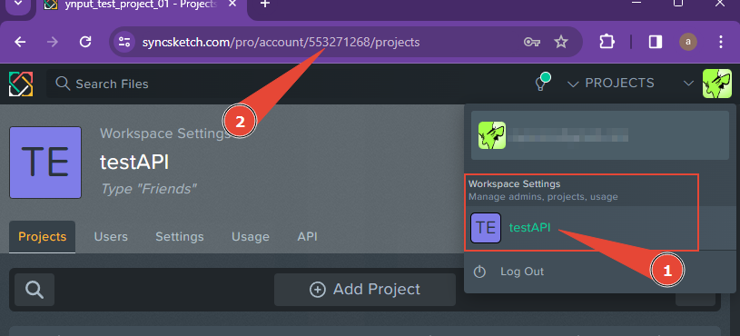

Then we need to configure Script user at SyncSketch which will be used as **Api key** and **User name**. Go to API tab (1) at your admin user workspace settings. Then click at **Create new Script User** button (2).

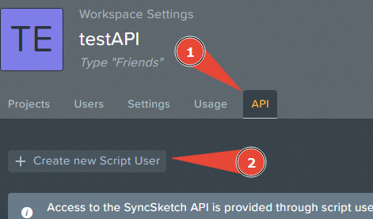

Then use popuped form to add Username (1), Description and Access Permissions (2) and confirm creation (3).

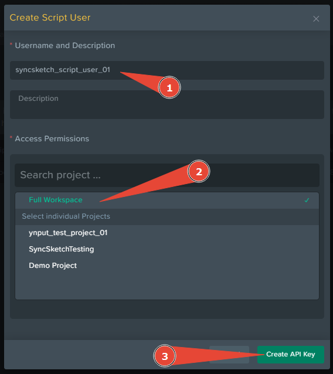

Then use Copy button (1) to capture api key into clipboard and save it somewhere safe for future reference.

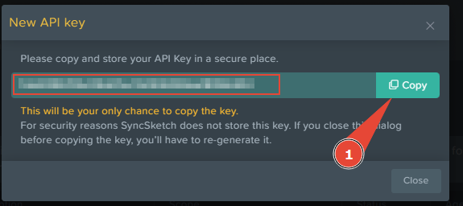

#### Setting Ayon Secrets

Now you can go to Ayon Secrets Tab at Studio Settings and add those secrets following way (pink). Do similar with your service user at Ftrack (red).

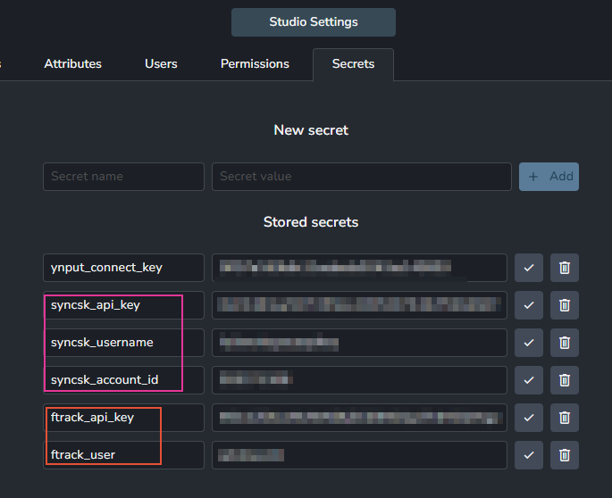

#### SyncSketch addon Studio settings configuration

Once Secrets are configured then SyncSketch addon can be set. First Server config section should be set to relative secrets which will be available in enumerator options. And server url can stay as it is in default settings.

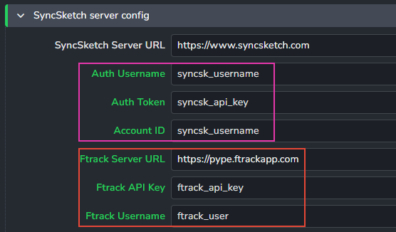

Do the same on Ftrack settings and also change your studio Ftrack url.

#### Configure SyncSketch to Ftrack status mapping

Statuses are mapped to default Ftrack statuses. Those can be changed in case default Ftrack statuses are altered.

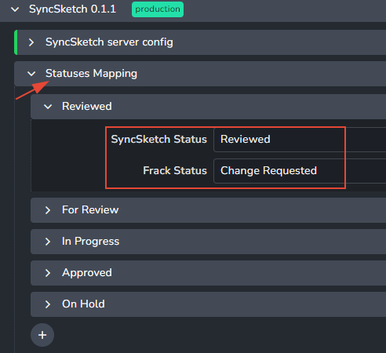

### Starting Ayon SyncSketch addon service

For SyncSketch addon to be able to synchronize review item annotations and statuses Ayon service needs to be started. This requires to ASH to be working so the service can be attached to it. In main menu select Services.

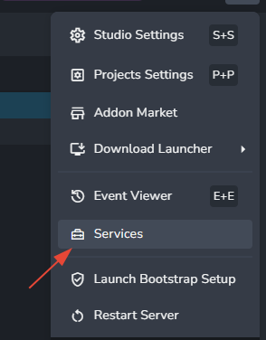

Use **New service** button.

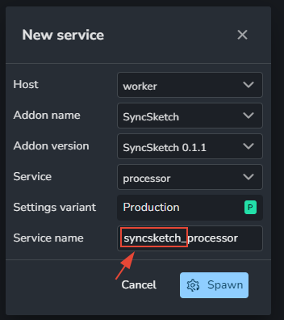

Once ASH is working then worker options should be offering any available workers. Find SyncSketch addon name and the same version which is used in your bundle. Make sure that bandle states are alligned. To make sure you understand in future what is the service related to, just prepand `syncsketch_`. Hit **Spawn** and wait for status of service to be set to green *Running*.

### Creating project and linking them together

To utilize the embedded Ftrack in this version of the addon, you are required to first establish a project within Ftrack. Upon successfully creating the project, proceed to synchronize it with Ayon. This process ensures seamless integration and functionality between the two platforms.

1.  create project on Ftrack.
2.  use project action AYON Admin - Prepare project. For this step you have to have activated Ftrack addon and with running services (processor and leecher).

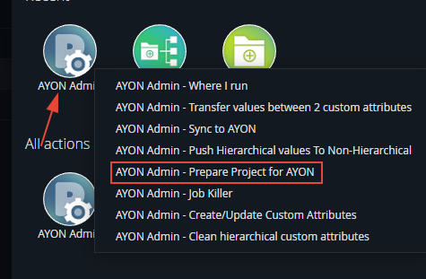

3.  create project on SyncSketch (ideally with the same name).
4.  Then copy project ID from url

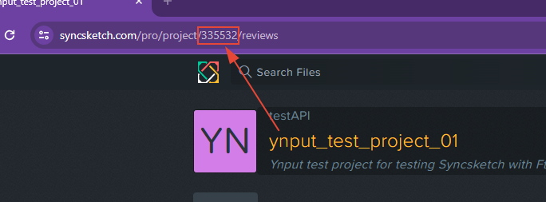

5.  Go to Ayon **Dashbord** page, select **Overview** tab and select the project.

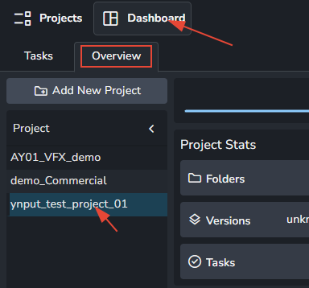

6.  Click at **Edit** button on right panel with project attributes.

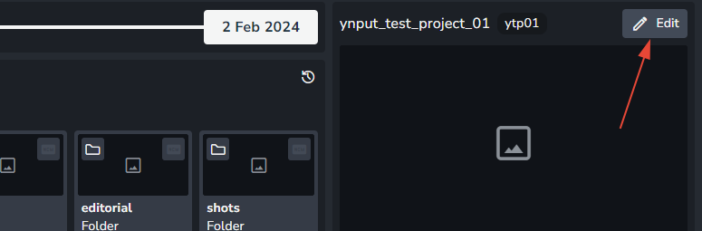

7.  Paste ID value from 4. step into **SyncSketch ID** attribute field.

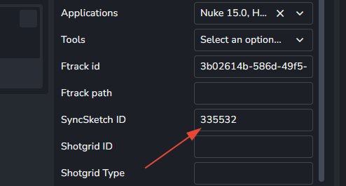

8.  Confirm by **Save** button on top of the panel.

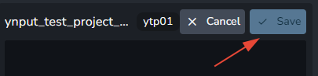

### Configuring plugin settings

#### Integrate reviewables presets

:::info Default list
By default configuration there is only one preset which is targeting all review items into single review list **Uploads from Ayon**
:::

The presets located within `ayon+settings://syncsketch/publish/IntegrateReviewables/review_item_profiles` are designed to enhance and secure the granularity of reviewable items names. These names will be labelled on SyncSketch post-upload during the publishing process.

One of the key benefits of these presets revolves around the adaptability when it comes to uploading the appropriate review list. The ability to configure these presets allows for a more detailed and tailored review process. Items can be filtered using different criteria - such as *product types*, the *host* application, specific *task types* and even individual *task names*. This contributes to a more personalised and detailed review process.

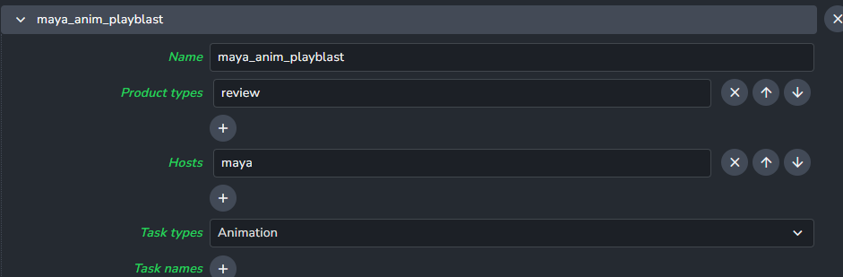

Profiles have the ability to apply Anatomy templates by utilizing context-related tokens. This allows for prime customization to suit the specific needs of each individual folder (whether it be a shot name or asset name).

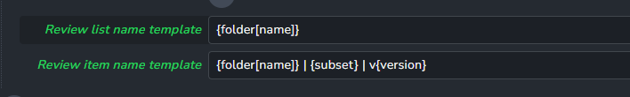

#### Targeting reviewables to Syncsketch

You can effortlessly ensure that all reviewables will be uploaded to SyncSketch. For this purpose, you simply need to attach a specific tag to Extract Review output presets. You can achieve this by following these steps:

1. Navigate either to your Studio Settings or any Project settings.
2. Find and add the **syncsketchreview** tag to any of the selected preset's output.
   You can do this at the following path `ayon+settings://core/publish/ExtractReview/profiles/0/outputs`.

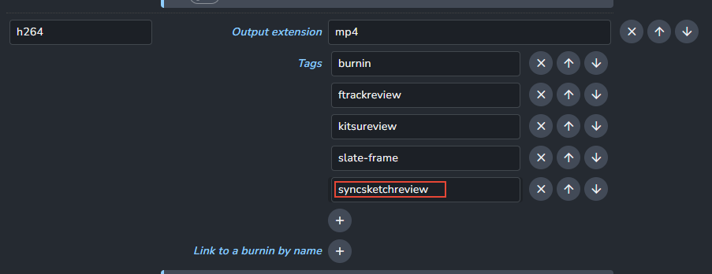
