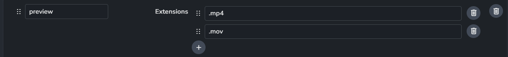
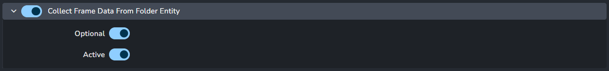

import ReactMarkdown from "react-markdown";
import versions from '@site/docs/assets/json/Ayon_addons_version.json'

<ReactMarkdown>
{versions.TrayPublisher_Badge}
</ReactMarkdown>

import Tabs from '@theme/Tabs';
import TabItem from '@theme/TabItem';

## Introduction

Tray publisher is a standalone [publisher](artist_tools_publisher.md) tool where you can just publish any files to AYON.
It also capable of creating assets and shots in your projects.
The tray publisher is minimal and doesn't have many validators allowing further flexibility.

It has different create plugins. it also provide a dynamic creator definitions that you can extend it on your side on studio or project wise.

:::tip
Creator plugins are used to create products. 
e.g. to publish a `pointcache` product, you'd need a `pointcache` product type creator, `pointcache` creator, for short.

You can extend tray publisher product type creators via [Simple Create Plugins](#simple-create-plugins) setting.

To learn more about using the tray publisher please check [Tray Publisher User Docs](addon_traypublisher_artist.md)
:::

## Addon Settings

### Color Management (ImageIO)
> Setting Location: `ayon+settings://traypublisher/imageio`

Color configuration and enable to override the global color management settings, check [Host specific overrides](admin_colorspace.md#host-specific-overrides).

- **Enable Color Management**: Enables color management for Tray publisher.

- **File Rules**
  - **Activate Host Rules**: Enable to override global color rules.
  - **Rules**
    - **+**: Add more rules
    - Each rule consists of
    
      - **Rule name**
      - **Regex pattern**
      - **Colorspace name**
      - **File extension**
  
### Simple Create Plugins
> Setting Location: `ayon+settings://traypublisher/simple_creators`

This setting allows adding different create plugins from `simple create plugin` preset.

- **+**: Add a simple create plugin

#### Simple Create Plugin Preset

Dynamic creator plugins definitions, *Items with \* are required.*

- **Product type \*** : This name will be used in the pipeline. After publishing, it'll be in the product type column in the loader.
- **Label** : Creator label, it'll be used in the publisher UI. if blank, the `identifier` will be used.
- **Identifier** : Creator identifier, it's used in the pipeline, if blank the product type will be used (prefixed by `settings_`).
- **Icon** : Creator's icon, supported icons are `qtawesome`.
- **Default Variants**
- **Description**
- **Detailed Description**
- **Allow Sequences**
- **Allow multiple items**
- **Allow version control**
- **Extensions \***

:::info Default Dynamic Plugins

Tray publisher addon comes with predefined default dynamic plugins:

- Workfile
- Model
- Pointcache
- Plate
- Render
- Camera

- Image
- VDB Volumes
- Matchmove
- Rig
- Simple UE texture
- Audio
  

:::

### Editorial Simple Creator
> Setting Location: `ayon+settings://traypublisher/editorial_creators/editorial_simple`

[Editorial Simple](addon_traypublisher_artist.md#editorial-simple) creator configuration.

- Default Variants
- Clip Name Tokenizer
  
  - Each item consists of
    - Token name
    - Token regex
  - **+**: Add more tokens 
- Shot Rename
  
  - Shot name template
- Shot Hierarchy
  
  - Parent path template  
  - Token to parent convertor
    - Each item consists of
      - parent type
      - parent token name
      - parent token value
    - **+**: Add more parent tokens
- Add tasks to shot:
  
  - Each item consists of
    - Key
    - Task Type
  - **+**: Add more shot tokens
- Product Type Presets
  
  - Each item consists of
    - Product type
    - variant
    - review
    - OutputFile Type
  - **+**: Add more presets

### Batch Movie Creator
> Setting Location: `ayon+settings://traypublisher/create/BatchMovieCreator`

:::note
Currently, This creator doesn't work as expected.
It should be fixed soon.
:::

- Default variants
- Default tasks
- Extensions

### Ingest CSV
> Settings Location: `ayon+settings://traypublisher/create/IngestCSV`

[CSV Ingest](addon_traypublisher_artist.md#csv-ingest) creator configuration.

The settings are divided into three sections.

#### Columns config

:::caution

Currently, The default `columns` are expected by the CSV Ingest creator.
It's not advisable to add/remove/modify any columns.

You may mark the **unrequired** columns as `required` to ensure the existence of some values in your published products. 
**But, any other changes can break the creator's logic!**

:::

  - **CSV delimiter**: CSV separator. by default, it's a comma `,`
  - **Columns**
    - Each column consists of:
    
      - **Name**: Column Name
      - **Type**: Column item data type. Supported values (`number`, `decimal`, `bool`, `text`)
      - **Default**: Default value. this value will be used if the column is missing or it has empty value.
      - **Required Column**: Specify if the column is required.
      - **Validation Regex Pattern**: This pattern will be applied to provided values.
    - **+**: Add a column

#### Representation config

Representation column can have multiple values separated by the Tags delimiter.

  - **Tags delimiter**: Representations separator. by default, it's a semicolon `;`
  - **Default tags**: These tags will be added if the `Representation Tags` column is empty.
  - **Representations**: Supported representations.
    - Each representation includes:
    
      - **Name**: Representation name
      - **Extensions**: Accepted extensions for this representation.
      - **+**: Add an extension.
    - **+**: Add more representations
  
:::info Default representation

Default Representations are for publishing renders and reviews.
Default Representations:
- **Preview**: `.mp4` or `.mov`
- **exr**: `.exr`
- **edit**: `.mov`
- **review**: `.mov`
- **nuke**: `.nk` Nuke scripts.

You are free to add more extensions to the default representations or to add more representations.

:::

#### Folder creation config

When this setting is enabled, the CSV Ingest creator will automatically generate any missing folder hierarchy.

- **Default Folder Type**: This type will be used for creating new folders.
- **Folder Type Regexes**: A list of regex and type pairs. If the `folder path` matches a folder regex, the corresponding folder type will be used instead of the default.
- **Default Task Type**: This type will be used for creating new tasks.
- **Task Type Regexes**: A list of regex and type pairs. If the `task name` matches a task regex, the corresponding task type will be used instead of the default.

### Publish Plugins
#### Collect Frame Data From Folder Entity

- **Enable**
- **Optional**
- **Active**
  
#### Collect Original Sequence Frame Data

- **Enable**
- **Optional**
- **Active**
  

#### Validate Frame Range

- **Enable**
- **Optional**
- **Active**
  
#### Validate Existing Version

- **Enable**
- **Optional**
- **Active**
- 
#### Extract Editorial Package Conversion

[Editorial Package](addon_traypublisher_artist.md#editorial-package) conversion configuration.

- **Conversion enabled**
- **Output extension**
- **FFmpeg arguments**
  - **Video filters**
  - **Audio filters**
  - **Input arguments**
  - **Output arguments**