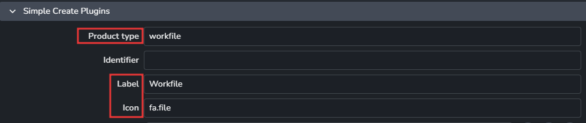
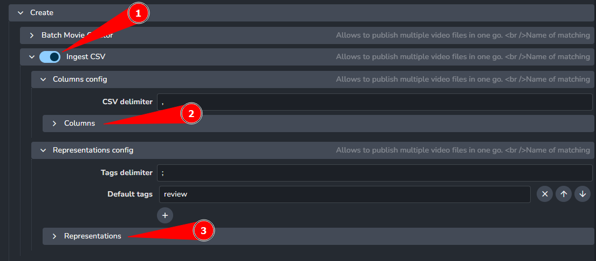

import ReactMarkdown from "react-markdown";
import versions from '@site/docs/assets/json/Ayon_addons_version.json'

<ReactMarkdown>
{versions.TrayPublisher_Badge}
</ReactMarkdown>

import Tabs from '@theme/Tabs';
import TabItem from '@theme/TabItem';

Project settings can have project specific values. Each new project is using studio values defined in **studio settings** but these values can be modified or overridden per project.

Refer to Settings related to [Working with settings](admin_settings) for more details.

## Creator Plugins

Contains list of implemented families to show in middle menu in Tray Publisher. Each plugin must contain:

- **Product type**
- **Label**
- **Icon**
- **Extensions**




# CSV publishing

You can use TrayPublisher to upload CSV data in two ways: interactive mode or headless mode (CLI). You can set up the CSV columns and what kind of data they should have. For each column, you can pick a data type and if it's needed or not. Plus, you can set a default value for when some data is missing.

:::info CSV publishing
Tray publisher pushes your products into an existing tasks in AYON.
Tray publisher doesn't support **creating missing entities if they don't exist** yet.
Currently, the CSV data must pass a preflight check, so we don't need to validate it.

Please ensure your shots and assets are created in your project. 
:::

## Feature settings

To use the feature, you must first turn it on and set it up in the Studio settings under the Traypublisher addon. There, you can decide what goes in the CSV columns and what they need.


1. Enable the feature in `ayon+settings://traypublisher/create/IngestCSV`
2. Define the columns and their requirements in `ayon+settings://traypublisher/create/IngestCSV/columns_config/columns`
3. Define Representation requirements in `ayon+settings://traypublisher/create/IngestCSV/representations_config/representations`
4. Save the settings and you are good for CSV ingestion

## CLI interface

- **--filepath**: The absolute path to csv file which is in root of package folder
- **--project**: The name of a project used for ingestion
- **--folder-path**: The folder path used for ingestion data (storing csv file iterations)
- **--task**: The name of task used for ingestion data iteration backup (case sensitive!)
- **--ignore-validators**: Flag argument for skipping validators

Example of CLI command for CSV ingestion:

```powershell
cd "C:\Program Files\Ynput\AYON 1.0.2"
.\ayon_console.exe addon traypublisher ingestcsv --filepath '[CSV FILE ABS PATH]' --project [PROJECT_NAME] --folder-path [/FOLDER/PATH] --task [TASK NAME] --ignore-validators
```


## Testing data and its use:

1. Download testing package [ay_240319_0001.zip](https://github.com/ynput/ayon-core/files/14651928/ay_240319_0001.zip)
2. Make sure to create shots in your testing project before running the command. This process only creates products, versions, and representations, not shot folders.
3. The image below shows what the testing project should look like and how the shot hierarchy is set up to reflect the testing data found in the zip file mentioned above.


1. Project: Moawiya
2. CLI context: `ayon+entity://Moawiya/editorial?task=edit`
3. CSV folder: `ayon+entity://Moawiya/shots/mw_110_01_0060?task=comp`
4. CSV folder: `ayon+entity://Moawiya/shots/mw_110_01_0080?task=comp`
5. Follow the CLI command above and ingest the data.