import ReactMarkdown from "react-markdown";
import versions from '@site/docs/assets/json/Ayon_addons_version.json'

<ReactMarkdown>
{versions.TrayPublisher_Badge}
</ReactMarkdown>

import Tabs from '@theme/Tabs';
import TabItem from '@theme/TabItem';

## Introduction

Tray Publisher is a standalone [publisher](artist_tools_publisher.md) tool that allows you to publish any files to AYON. It's also capable of creating assets and shots in your projects. The Tray Publisher is minimal and doesn't have many validators, offering greater flexibility.

It features various creation plugins and provides dynamic creator definitions that you can extend for studio or project-specific needs.

:::tip
Creator plugins are used to create products. For example, to publish a `pointcache` product, you'd need a `pointcache` product type creator, or simply, a `pointcache` creator.

You can extend Tray Publisher product type creators via the [Simple Create Plugins](#simple-create-plugins) setting.

To learn more about using the Tray Publisher, please check the [Tray Publisher User Docs](addon_traypublisher_artist.md).
:::

## Addon Settings

### Color Management (ImageIO)

> Setting Location: `ayon+settings://traypublisher/imageio`

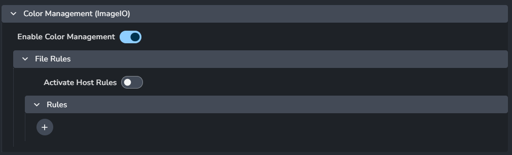

This section allows you to configure and override the global color management settings. For more details, check [Host specific overrides](admin_colorspace.md#host-specific-overrides).

- **Enable Color Management**: Turns on color management for Tray Publisher.
- **File Rules**
  - **Activate Host Rules**: Enable this to override global color rules.
  - **Rules**
    - **+** : Add more rules
    - Each rule consists of:
      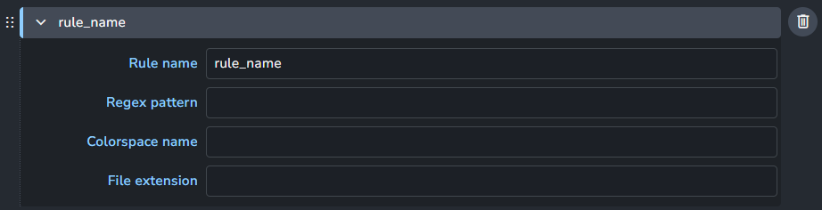
      - **Rule name**
      - **Regex pattern**
      - **Colorspace name**
      - **File extension**
  
### Simple Create Plugins

> Setting Location: `ayon+settings://traypublisher/simple_creators`

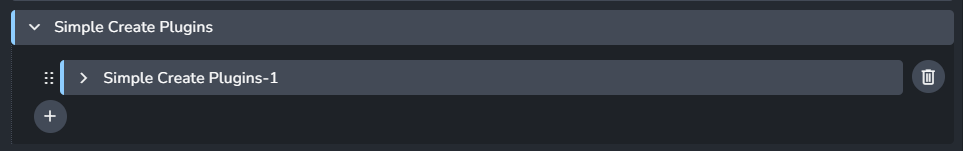

This setting lets you add various create plugins from the `simple create plugin` preset.

- **+** : Add a simple create plugin

#### Simple Create Plugin Preset

Dynamic creator plugin definitions. *Items with \* are required.*

- **Product type \***: This name will be used in the pipeline. After publishing, it will appear in the product type column in the loader.
- **Identifier**: Creator identifier used in the pipeline. If blank, the product type will be used (prefixed by `settings_`).
- **Label**: Creator label used in the publisher UI. If blank, the `identifier` will be used.
- **Icon**: Creator's icon, supports `qtawesome` icons.
- **Default Variants**
- **Description**
- **Detailed Description**
- **Allow Sequences**
- **Allow multiple items**
- **Allow version control**
- **Extensions \***

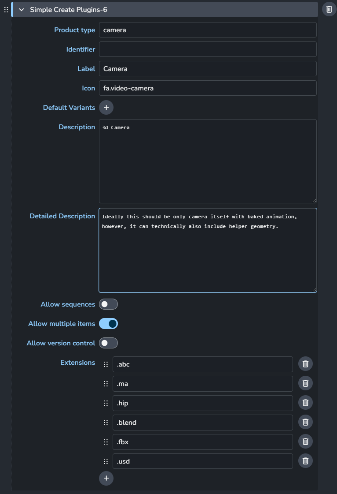

:::info Default Dynamic Plugins

The Tray Publisher addon includes predefined default dynamic plugins. For more information about each creator, check [Default Simple Creators](addon_traypublisher_artist.md#default-simple-creators).

- Workfile
- Model
- Pointcache
- Plate
- Render
- Camera

- Image
- VDB Volumes
- Matchmove
- Rig
- Simple UE texture
- Audio
  

:::

### Editorial Simple Creator
> Setting Location: `ayon+settings://traypublisher/editorial_creators/editorial_simple`

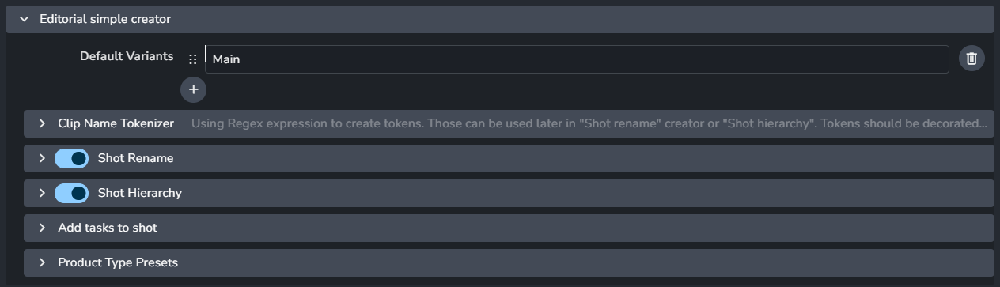

[Editorial Simple](addon_traypublisher_artist.md#editorial-simple) creator configuration.
This configuration is not exposed to artists in the publisher UI.

#### Default Variants
Default list of variants.

#### Clip Name Tokenizer
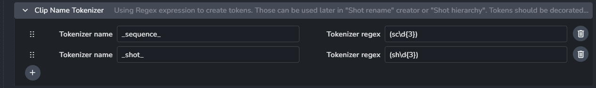

Use regex expressions to create tokens. These tokens will be used later in the `Shot rename` creator or `Shot hierarchy`. Each token must be enclosed by underscores (`_`).

- Each item consists of
  - **Token name**
  - **Token regex**
- **+** : Add a token

#### Shot Rename

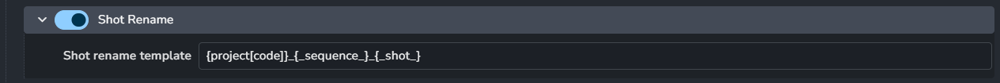

When enabled, any discovered shots will be renamed based on the `shot rename template`.

The template supports both the available [template keys](admin_settings_project_anatomy.md#available-template-keys) and tokens defined in the [Clip Name Tokenizer](clip-name-tokenizer).

- **Enable**
- **Shot name template**
 
#### Shot Hierarchy
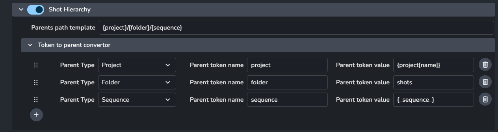

Shot Hierarchy defines the folder path where each shot will be added.
It uses the `Folder path template` to compute each path. 
The `Folder path template` supports tokens defined in the `folder path template tokens` setting.

Each token in the `Folder path template` represents a folder in the hierarchy.  
Each token's value supports both the available [template keys](admin_settings_project_anatomy.md#available-template-keys) and tokens defined in the [Clip Name Tokenizer](clip-name-tokenizer).

- **Enable**
- **Parent path template** 
- **Token to parent convertor**
  - Each item consists of
    - **parent type**
    - **parent token name**
    - **parent token value**
  - **+** : Add a folder token.

#### Add tasks to shot
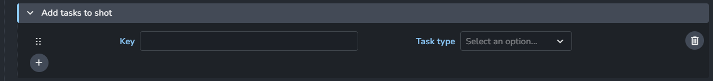

This list of tasks will be added to each created shot.

- Each item consists of
  - **Key**
  - **Task Type**
- **+** : Add more shot tokens

#### Product Type Presets
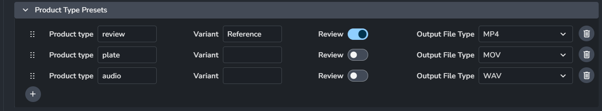

This section allows you to define presets for products to be published within each discovered shot in the Decision list file.

- Each item consists of
  - **Product type**
  - **variant**: Specify the variant to be used with this product. Leave blank to use the user-selected variant.
  - **review**: Mark the product as reviewable.
  - **OutputFile Type**: List of available output file extensions. Each discovered shot will be converted to the specified output file.
- **+** : Add a product type preset.

### Batch Movie Creator
> Setting Location: `ayon+settings://traypublisher/create/BatchMovieCreator`

:::note
Currently, this creator doesn't work as expected. For more information, see [Batch publish creator does not work | Github](https://github.com/ynput/ayon-traypublisher/issues/3).
:::

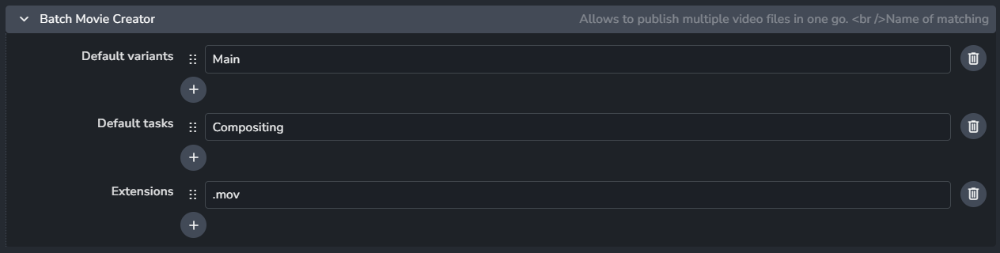

- **Default variants**
- **Default tasks**
- **Extensions**

### Ingest CSV
> Settings Location: `ayon+settings://traypublisher/create/IngestCSV`

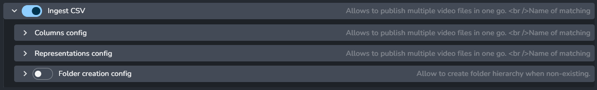

[CSV Ingest](addon_traypublisher_artist.md#csv-ingest) creator configuration.

The settings are divided into three sections:
- [Columns config](#columns-config)
- [Representation config](#representation-config)
- [Folder creation config](#folder-creation-config)

#### Columns config

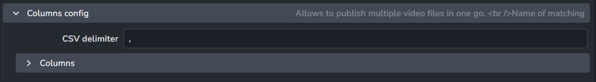

  - **CSV delimiter**: The default separator is a comma `,`.
  - **Columns**
    - Each column consists of:
    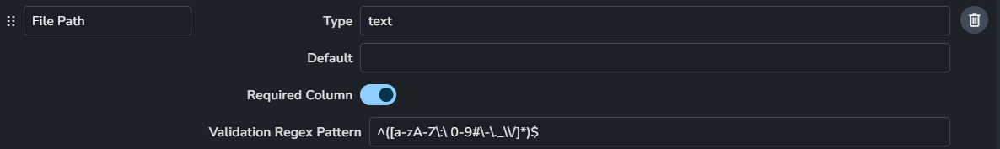
      - **Name**: The column name.
      - **Type**: The data type of the column item. Supported types are `number`, `decimal`, `bool` and `text`.
      - **Default**: The default value used if the column is missing or empty.
      - **Required Column**: Indicates if the column is mandatory.
      - **Validation Regex Pattern**: A pattern applied to validate provided values.
    - **+** : Add a new column.

:::caution
Although users can remove **unnecessary** items from CSV files, it's not advisable to remove them from the `columns` addon setting.

You can mark the **unnecessary** columns as `required` to ensure to ensure that certain values ​​are present in your published products.  
**However, any other changes may break the CSV ingestion logic!**
:::

#### Representation config
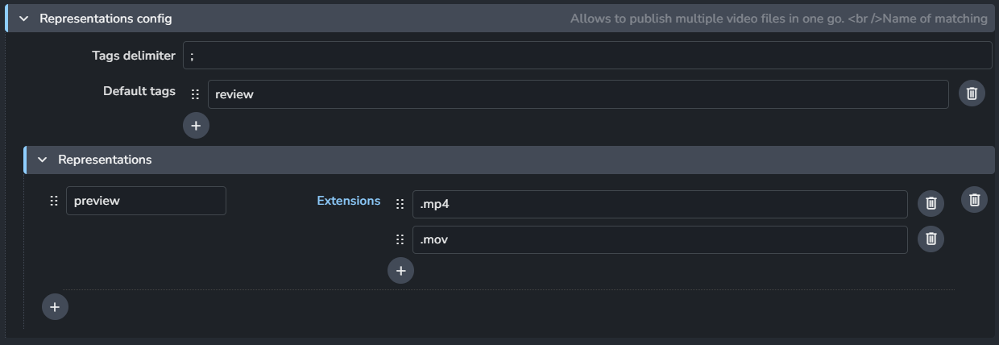

The representation column can have multiple values separated by the tags delimiter.

  - **Tags delimiter**: The default separator is a semicolon `;`.
  - **Default tags**: These tags are added if the `Representation Tags` column is empty.
  - **Representations**: Supported representations.
    - Each representation includes:
      - **Name**: The name of the representation.
      - **Extensions**: Accepted extensions for this representation.
      - **+** : Add an extension.
    - **+** : Add a representation.
  
:::info Default representation
Default representations are used for publishing renders and reviews. 
They include:
- **Preview**: `.mp4` or `.mov`
- **exr**: `.exr`
- **edit**: `.mov`
- **review**: `.mov`
- **nuke**: `.nk` Nuke scripts.

You can add more extensions to the available representations or create additional representations.
:::

#### Folder creation config

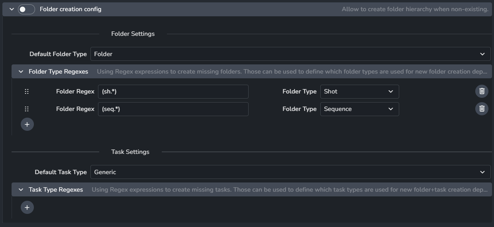

When enabled, the CSV Ingest creator will automatically generate any missing folder hierarchy.

- **Default Folder Type**: Used for creating new folders.
- **Folder Type Regexes**: A list of regex and type pairs. If the `folder path` matches a regex, the corresponding folder type will be used instead of the default.
- **Default Task Type**: Used for creating new tasks.
- **Task Type Regexes**: A list of regex and type pairs. If the `task name` matches a regex, the corresponding task type will be used instead of the default.

### Publish Plugins
  
#### Collect Original Sequence Frame Data

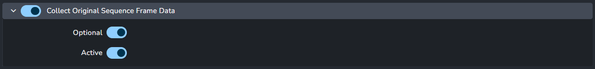

Disable this to enforce the frame range from AYON folder or task entities, including start and end handles.

- **Enable**: The default state of the plugin.
- **Optional**: Allows the user to toggle this setting in the publisher UI.
- **Active**: The default value of the toggle in the publisher UI.
  

#### Validate Frame Range

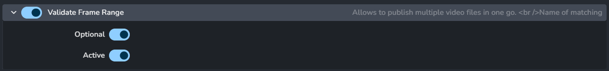

Validating the frame range of rendered files against the target publish folder or task in AYON.

- **Enable**: The default state of the plugin.
- **Optional**: Allows the user to toggle this setting in the publisher UI.
- **Active**: The default value of the toggle in the publisher UI.
  
#### Validate Existing Version

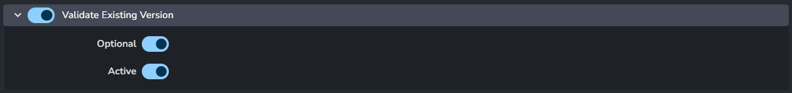

This validator checks if the specified version of the product being published already exists in the target publish folder or task in AYON.

This validation is enabled by default to prevent accidental overrides of existing versions.

- **Enable**: The default state of the plugin.
- **Optional**: Allows the user to toggle this setting in the publisher UI.
- **Active**: The default value of the toggle in the publisher UI.

#### Extract Editorial Package Conversion

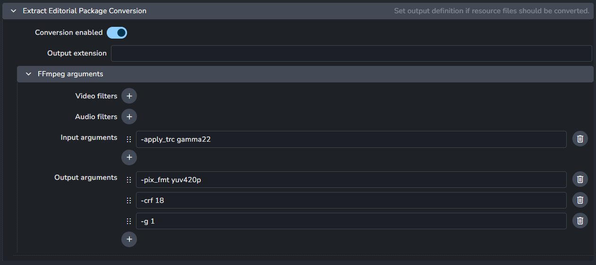

[Editorial Package](addon_traypublisher_artist.md#editorial-package) conversion configuration for the `.mov` file.

- **Conversion enabled**: Toggle to enable conversion.
- **Output extension**: Set the desired output extension. Leave blank to skip conversion, even if enabled.
- **FFmpeg arguments**: Configuration settings for FFmpeg.
  - **Video filters**
  - **Audio filters**
  - **Input arguments**
  - **Output arguments**