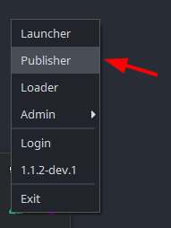
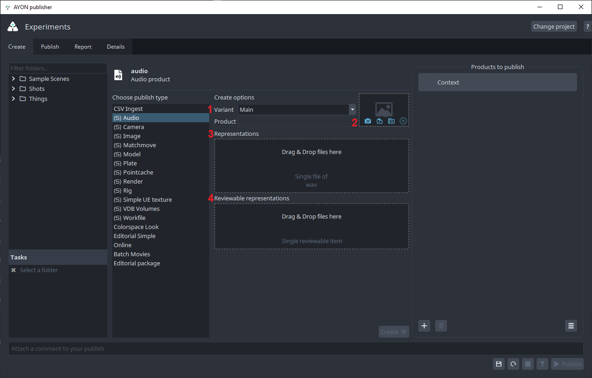
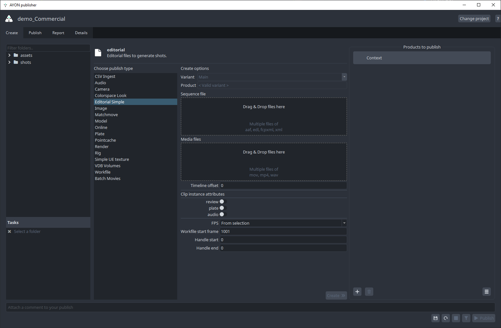
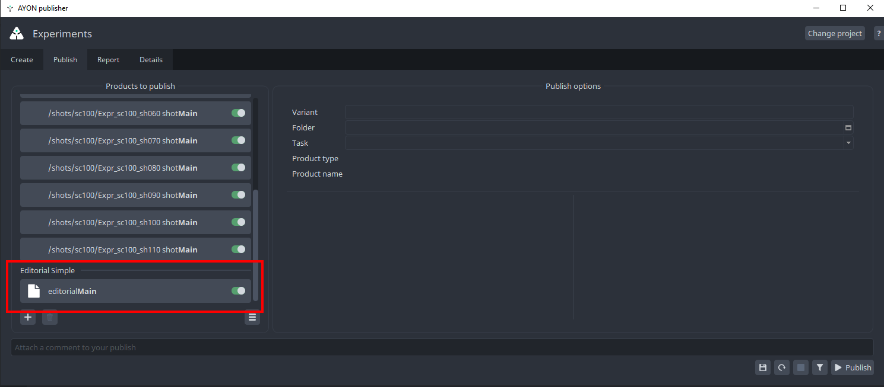
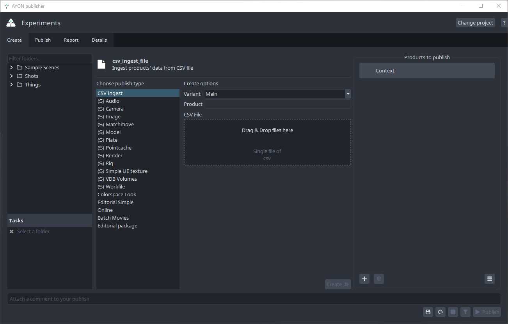
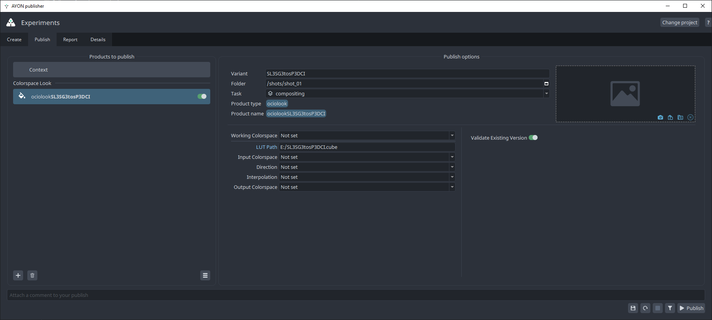
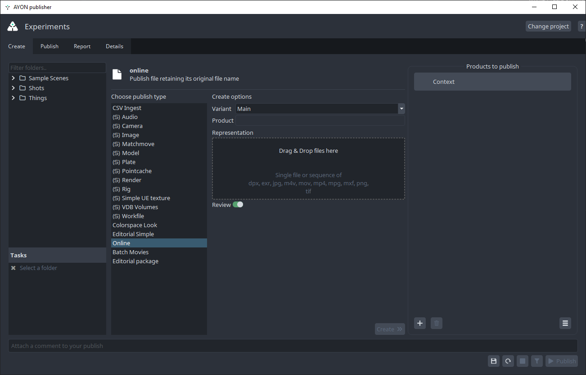
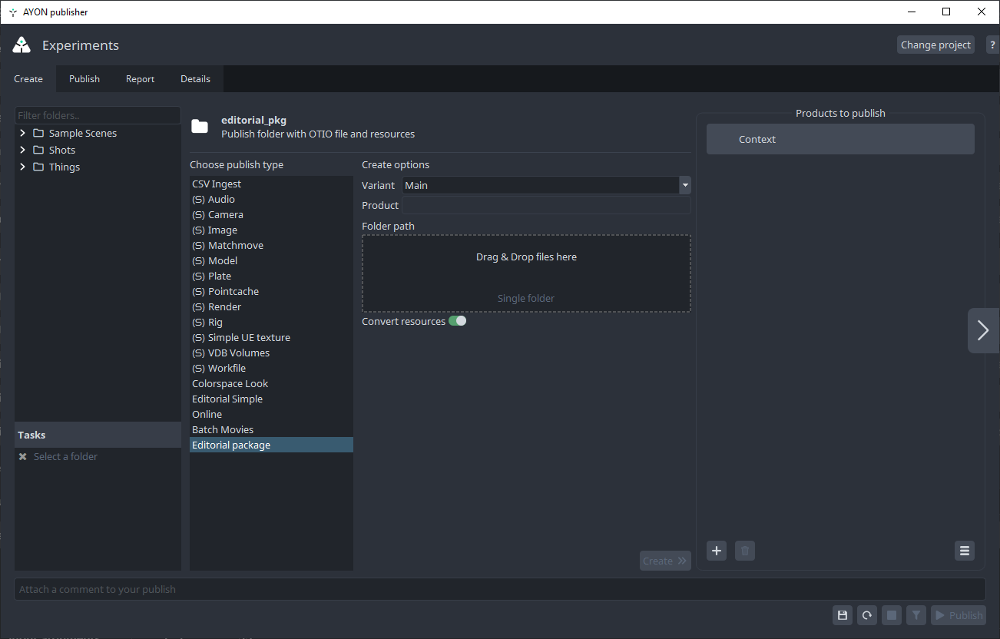
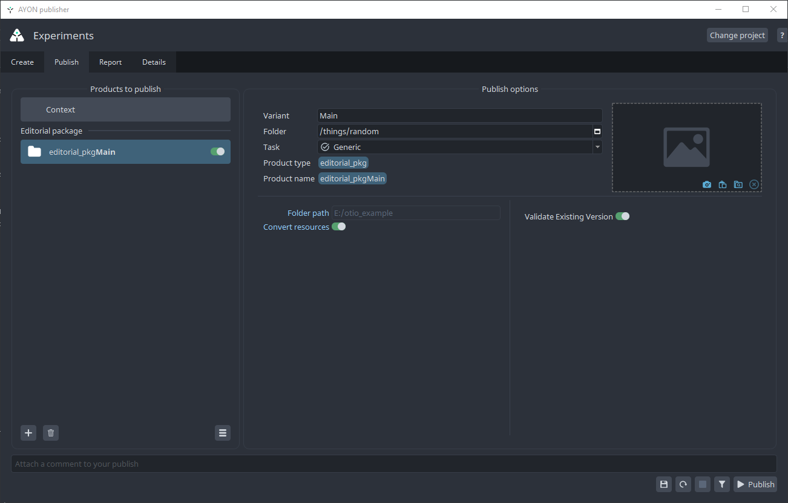
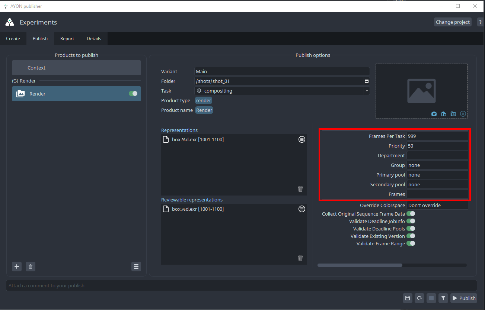

import ReactMarkdown from "react-markdown";
import versions from '@site/docs/assets/json/Ayon_addons_version.json'

<ReactMarkdown>
{versions.TrayPublisher_Badge}
</ReactMarkdown>

## About Tray Publisher

Tray Publisher is a standalone tool for publishing products into AYON pipeline.

It can be reached via Tray menu.

## How to use it?

**Just Drag and Drop**—that's all there is to it.

Tray Publisher works just like the regular [Publisher](artist_tools_publisher.md) tool.
However, instead of just collecting exported files from your work scene, it offers additional fields for dragging and dropping the files you want to publish.

import how_to_use_tray_publisher from './assets/traypublisher/how_to_use_tray_publisher.mp4'

<video controls style={{width: "100%" }}>
  <source src={how_to_use_tray_publisher}/>
</video>

## Supported Product Types

Tray Publisher supports publishing almost any type of data across the pipeline.
It also includes special creators for advanced publishing workflows.

### Simple Create Plugins

:::tip Simple Create Plugins
Simple Create Plugins are defined in the [Simple Create Plugins](addon_traypublisher_admin.md#simple-create-plugins) addon settings. Admins can change, remove, add, or modify them as needed.
:::

Every simple creator follows the same usage steps.

*In this example, I've prefixed the labels of simple creators with `(ട)` in the [settings](addon_traypublisher_admin.md#simple-create-plugin-preset) to make them easy to identify in the publisher UI.*

#### Usage
- Select a folder and task from the left side.
- Drag and drop representations and reviewable representations.
- Create.
- (Optional) Set publish options.
- Publish.

#### Key Create Options
1. **Variant**: The product's variant name.
2. **Thumbnail**: The product's thumbnail.
3. **Representations**: Files to include in your publish. This field can allow multiple items, each being a single file or file sequence. It provides hints about the configuration of the representations field.
4. **Reviewable Representation**: Supports a single reviewable item, which can be a single file or file sequence.

#### Default Simple Creators
- `workfiles`: Workfiles are full scenes from any application that are directly edited by artists. They represent a state of work on a task at a given point and are usually not directly referenced into other scenes.
- `model`: Models should only contain geometry data, without any extras like cameras, locators or bones. *Keep in mind that models published from tray publisher are not validated for correctness.* 
- `pointcache`: Alembic or bgeo cache of animated data
- `plate`: Any type of image seqeuence coming from outside of the studio. Usually camera footage, but could also be animatics used for reference.
- `render`: Sequence or single file renders.
- `camera`: Ideally this should be only camera itself with baked animation, however, it can technically also include helper geometry.
- `image`: Any image data can be published as image product type. References, textures, concept art, matte paints. This is a fallback 2d product type for everything that doesn't fit more specific product type.
- `vdb`: Hierarchical data structure for the efficient storage and manipulation of sparse volumetric data discretized on three-dimensional grids.
- `matchmove`: Script exported from matchmoving application to be later processed into a tracked camera with additional data.
- `rig`: CG rigged character or prop. Rig should be clean of any extra data and directly loadable into it's respective application.	
- `simpleUnrealTexture`: Texture files with Unreal Engine naming conventions.
- `audio`: Audio files for review or final delivery.

### Editorial Simple

The Tray Publisher Editorial workflow allows for the mass setup of shots from reference videos and EDLs (Edit Decision Lists)
This creator dissects the input video file(s) into clip chunks based on the provided edit list file and then converts each chunk to a format specified in the settings for each product preset.

Additionally, it creates any missing folders and shots during publishing.

#### Usage

- Select a folder and task from the left side. This folder will be used for publishing the `Decision List file`. If [Shot Hierarchy](addon_traypublisher_admin.md#shot-hierarchy) is disabled in the addon settings, this folder will be the parent folder for the created shots.
Enable any desired products (leave them disabled if you only want to create the shots in your project).
- Drag and drop the edit list file and media files.
- Set the variant.
- Create. An instance will be created for each discovered shot and for each product within each discovered shot.
- (Optional) Set publish options.
- Publish.

:::caution
`Editorial Simple` publish instances are used to publish the `Decision List file`. 
Do not disable them, as this may break the publishing process.

:::

#### Key Create Options

1. **Variant**: The product's variant name.
2. **Edit Decision List**: The source edit decision list file, supporting various file extensions.
3. **Media Files**: Media files to convert.
4. **Timeline Offset**: Adjustments for the timeline.
5. **Add Products for Each Discovered Shot**: This list is generated from [Product Type Presets](addon_traypublisher_admin.md#product-type-presets) in settings.
   - **Review**: Review product from the shot.
   - **Plate**: Shot plate.
   - **Audio**: Shot audio.
6. **FPS**: Frames per second.
7. **Workfile Start Frame**: The starting frame for the workfile.
8. **Handle Start**: The start handle.
9. **Handle End**: The end handle.
10. **Additional Attributes**: This section includes attributes populated by the entered edit list and clips.

:::info
The following videos were created for Openpype (AYON's predecessor).
The workflow remains the same but the settings have been moved to AYON Server instead.

- **Tray Publisher Editorial Workflow** 
<iframe width="560" height="315" src="https://www.youtube.com/embed/oSDskPRINHU?si=21H2ZOsrwgXoKKyU" title="YouTube video player" frameborder="0" allow="accelerometer; autoplay; clipboard-write; encrypted-media; gyroscope; picture-in-picture; web-share" referrerpolicy="strict-origin-when-cross-origin" allowfullscreen></iframe>
- **Introduction to Tray Publisher for editorial workflows** 
<iframe width="560" height="315" src="https://www.youtube.com/embed/yGfWAI44hGw?si=4LfZnNzbSh8pF8wZ" title="YouTube video player" frameborder="0" allow="accelerometer; autoplay; clipboard-write; encrypted-media; gyroscope; picture-in-picture; web-share" referrerpolicy="strict-origin-when-cross-origin" allowfullscreen></iframe>

:::

### Batch Movies

It's capable of publishing individual mov files to specific shots based on file name.
<!-- TODO: Add File name pattern once the creator is fixed. 
For context, the Batch mov creator doesn't work. -->

:::note
Currently, this creator doesn't work as expected.
:::

### CSV Ingest

This feature allows for mass publishing of arbitrary files using a CSV file.
Simply provide a CSV file and drag and drop it into the Tray Publisher.

:::info Missing Folders
CSV Ingest also supports creating missing hierarchy folders if they are not present.
:::

#### Usage
- Prepare your CSV file.
- Select a folder and task from the left side. *This folder will be used for publishing the `CSV file` itself.*
- Drag and drop your CSV file.
- Create. An instance will be created for each discovered product.
- (Optional) Set publish options.
- Publish.

#### Prepare your CSV File

The CSV columns should match those specified in your AYON tray publisher [CSV Ingest settings](addon_traypublisher_admin.md#ingest-csv). 
Find an example CSV file here: [ay_240319_0001.zip](https://github.com/ynput/ayon-core/files/14651928/ay_240319_0001.zip).

Here's a list of the default columns. *Items with \* are required (must exist in the CSV file).*

- **File Path ***: File path of the product, it can be relative to the CSV file location.
- **Folder Path ***: Relative folder path to the selected folder in he publisher UI. if left blank, it'll use the default folder type in [Folder creation config](addon_traypublisher_admin.md#folder-creation-config).
- **Task Name ***: if left blank, it'll use the default task type in [Folder creation config](addon_traypublisher_admin.md#folder-creation-config).
- **Product Type**: Product type to publish e.g. `render` or `model`. 
- **Variant**: Variant name to use.
- **Version**: Leave blank to set the version to the next version.
- **Version Comment**: Comment to use for the published version of the product.
- **Version thumbnail**: Thumbnail to use for the published version of the product. Check supported   
- **Frame Start ***: Start frame of the product/task.
- **Frame End ***: End frame of the product/task.
- **Handle Start ***: Start Handle of the of the product/task.
- **Handle End ***: End Handle of the of the product/task.
- **FPS ***: FPS of the of the product/task.
- **Slate Exists**: Indicates if the provided sequence includes a slate. Use Boolean values (literal `True` or `False`).
- **Representation**: The provided representation must exist in [representation config](addon_traypublisher_admin.md#representation-config).
- **Representation ColorSpace**: Color space name to associate to the provided sequence.
- **Representation Tags**: Tags to add to the provided representation. Find a list of available tags [here](addon_core_settings.md#tags)

:::tip Multiple representation per product

When using the same `File Path`, `Folder Path`, `Task Name`, `Product Type`, `Variant` and `Version` in multiple rows with different representations, the CSV Ingest will add these representations to the same version of the published product.

:::

### Colorspace Look

This creator is used to publish colorspace look files (`ociolook`), which are any LUT files.
This product is available for loading in the Nuke host.

#### Usage
- Select a folder and task from the left side.
- Drag and drop a single LUT file.
- Create.
- Set publish options.  
  
- Publish.

#### Supported Extensions 
- `.3dl`
- `.csp`
- `.cc`
- `.cube`
- `.lut`
- `.spi1d`
- `.spi3d`

### Online
Online files retain their original name and use it as the product name.
To avoid conflicts, this creator checks if a product with this name already exists under the selected folder in AYON.

#### Usage
- Select a folder and task from the left side.
- Drag and drop a single file or file sequence.
- Create.
- (Optional) Set publish options.
- Publish.
#### Supported Extensions

- `.dpx`
- `.exr`
- `.jpg`
- `.m4v`
- `.mov`
- `.mp4 `
- `.mpg`
- `.mxf`
- `.png`
- `.tif`

### Editorial Package

This creator is used to publish an entire folder containing `OTIO` files and `.mov` movie files.

The result is a single `editorial_pkg` product type, which may convert `.mov` files into different formats and copy them into the `publish` `resources` subfolder.

#### Usage
- Select a folder and task from the left side.
- Drag and drop the **folder** containing the `OTIO` file and `.mov` movie files.
- Create.
- (Optional) Set publish options.  
  
- Publish.

## Default Publish Options

### Optional Plugins

- **Override Colorspace**: A dropdown menu that allows selecting the colorspace for your render.
- **Collect Original Sequence Frame Data**: Disable to enforce the frame range from AYON folder or task entities, including start and end handles.
- **Validate Existing Version**: Checks if the specified version of the product being published doesn't exist in AYON. Disable to override the specified version.
- **Validate Existing Online Files**: Ensures that the product doesn't already exist.
- **Validate Frame Range**: Validates the frame range of rendered files against the state in AYON.
- **Validate Representation Colorspaces**: Validates colorspace look attributes and representation colorspaces.
- **Integrate Hero Version**
- **Validate Deadline Job Info**
- **Validate Deadline Pools**

### Deadline Options

Tray Publisher supports deadline submissions for certain product types, such as `render`.

Default deadline options can be modified by admins in the settings. See [Job Info Profiles](addon_deadline_admin.md#profiles).

- **Frames per Task**
- **Priority**
- **Department**
- **Group**
- **Primary pool**
- **Secondary pool**
- **Frames**