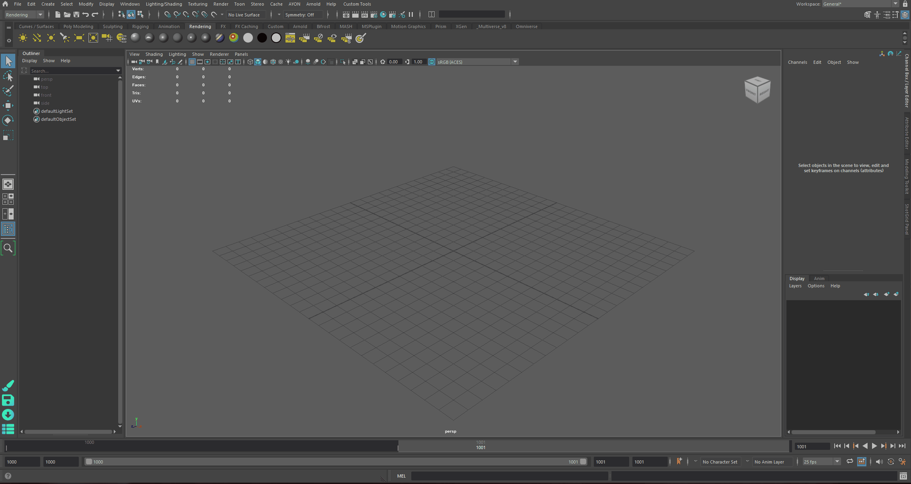

import ReactMarkdown from "react-markdown";
import versions from '@site/docs/assets/json/Ayon_addons_version.json'

<ReactMarkdown>
{versions.TrayPublisher_Badge}
</ReactMarkdown>

Tray Publisher is a standalone tool for publishing products into AYON pipeline.
It can be accessed via UI or command line.

## Tray Publisher
How to use it ? 
1. Access the tool via Tray menu.

2. Create and Publish 
   a. Select AYON Folder path
   b. Select a Task
   c. Select a product Type
   d. Drop your files
   e. Click create
   f. Finally, click publish.

3. Then you'll be able to access the published product via AYON Loader.

## Tray Publisher CLI Interface

:::info Tray CLI Interface
Tray Publisher provides a CLI Interface (Windows Only).
To know more about it: [Tray Publisher Admin Docs](https://ayon.ynput.io/docs/addon_traypublisher_admin#cli-interface).
:::

## Default Product Types
### Simple Create Plugins

:::tip Simple Create Plugins
Admins are able to change (remove/add/modify) simple create plugins via [Tray publisher addon settings](https://ayon.ynput.io/docs/addon_traypublisher_admin#creator-plugins).
:::

- `workfiles`: Workfiles are full scenes from any application that are directly edited by artists. They represent a state of work on a task at a given point and are usually not directly referenced into other scenes.
- `model`: Models should only contain geometry data, without any extras like cameras, locators or bones. *Keep in mind that models published from tray publisher are not validated for correctness.* 
- `pointcache`: Alembic or bgeo cache of animated data
- `plate`: Any type of image seqeuence coming from outside of the studio. Usually camera footage, but could also be animatics used for reference.
- `render`: Sequence or single file renders.
- `camera`: Ideally this should be only camera itself with baked animation, however, it can technically also include helper geometry.
- `image`: Any image data can be published as image product type. References, textures, concept art, matte paints. This is a fallback 2d product type for everything that doesn't fit more specific product type.
- `vdb`: Hierarchical data structure for the efficient storage and manipulation of sparse volumetric data discretized on three-dimensional grids.
- `matchmove`: Script exported from matchmoving application to be later processed into a tracked camera with additional data.
- `rig`: CG rigged character or prop. Rig should be clean of any extra data and directly loadable into it's respective application.	
- `simpleUnrealTexture`: Texture files with Unreal Engine naming conventions.
- `audio`: Audio files for review or final delivery.

### Editorial Simple

Tray Publisher Editorial workflow allows mass setup of shots from reference video and EDL (Edit Decision List).

:::info
The following video were created for Openpype (AYON's predecessor).
The workflow remains the same but the settings have been moved to AYON Server instead.
:::

<iframe width="560" height="315" src="https://www.youtube.com/embed/yGfWAI44hGw?si=4LfZnNzbSh8pF8wZ" title="YouTube video player" frameborder="0" allow="accelerometer; autoplay; clipboard-write; encrypted-media; gyroscope; picture-in-picture; web-share" referrerpolicy="strict-origin-when-cross-origin" allowfullscreen></iframe>

<iframe width="560" height="315" src="https://www.youtube.com/embed/oSDskPRINHU?si=21H2ZOsrwgXoKKyU" title="YouTube video player" frameborder="0" allow="accelerometer; autoplay; clipboard-write; encrypted-media; gyroscope; picture-in-picture; web-share" referrerpolicy="strict-origin-when-cross-origin" allowfullscreen></iframe>

### Batch Movies

It's capable of publishing individual mov files to specific shots based on file name.
<!-- TODO: Add File name pattern once the creator is fixed. 
For context, the Batch mov creator doesn't work. -->

:::note
Currently, This creator doesn't work as expected.
It should be fixed soon.
:::

### CSV Ingest 
This feature allows mass publishing arbitrary files through a CSV file.
It requires a CSV file and then drag and drop it inside the Tray Publisher.
The CSV columns should follow the columns specified in your AYON tray publisher settings.
- `ayon+settings://traypublisher/create/IngestCSV/columns_config/columns`

Find example CSV file here: [ay_240319_0001.zip](https://github.com/ynput/ayon-core/files/14651928/ay_240319_0001.zip)

:::info CSV Ingest
This is a working prototype and doesn't include all expected features.
e.g. it doesn't support creating missing hierarchy folders in case they are missing.
Therefore, please ensure that hierarchy folders exist before publishing.
:::

## Default Validators
Tray Publisher provides simple validators. 
e.g.
- ColorSpace: Validate colorspace look attributes and representation colorspaces.
- Filepaths: Validate existence of source filepaths .
- Frame Ranges: Validating frame range of rendered files against state in AYON.