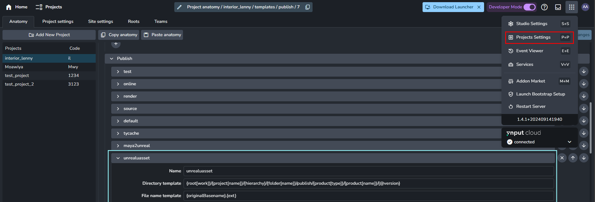
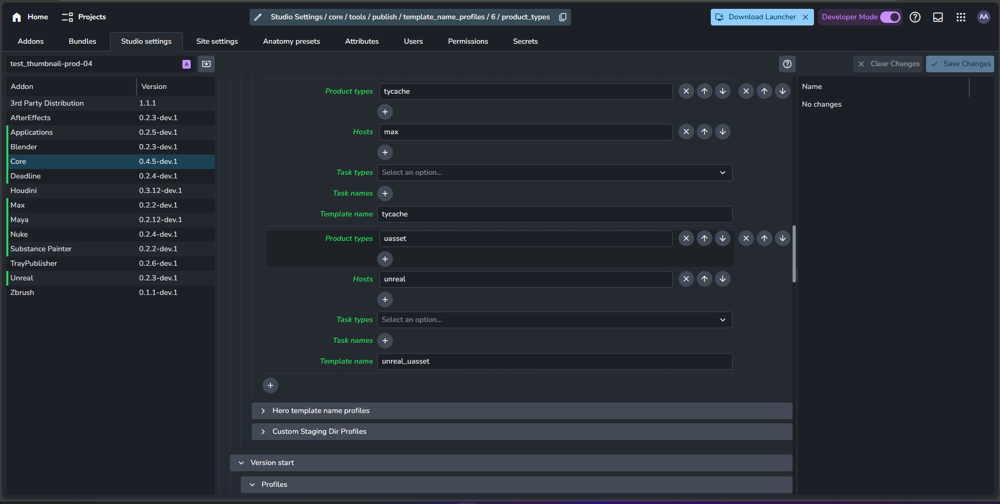

import ReactMarkdown from "react-markdown";
import versions from '@site/docs/assets/json/Ayon_addons_version.json'

<ReactMarkdown>
{versions.Unreal_Badge}
</ReactMarkdown>

import Tabs from '@theme/Tabs';
import TabItem from '@theme/TabItem';

## Custom location of the Ayon plugin for Unreal Engine

Sometimes you might want to use custom paths for the location of plugin for Ayon, instead of using the Marketplace one. This can be useful if you want to make changes to the plugin or want to distribuite the compiled plugin. In this section, we will explain how to set these custom paths.

### Setting custom paths for the UE project of the plugin

This is the source code of the plugin that you can use to make changes to the plugin. By setting this path, when first launching Unreal, the plugin will be compiled and added to the engine as a plugin, and available for any project you create in the future.

To use a custom path for the UE project of the plugin, you need to set an environment variable called `AYON_UNREAL_PLUGIN`. This variable should point to the directory where the source plugin is located. For example, if you have the source plugin in `C:/Ayon/Source`, you should set the following environment variable:

`AYON_UNREAL_PLUGIN=C:/Ayon/Source`

You can set this variable either in Ayon Studio Setting in `applications/unreal/environment`, or, from there, to a specific version of Unreal.

### Setting custom paths for the compiled plugin

If you already have compiled the plugin and want to distribute it, you can set a custom path for the compiled plugin. By setting this path, when first launching Unreal, the plugin will be added to the engine as a plugin, and available for any project you create in the future.

To use a custom path for the compiled plugin, you need to set an environment variable called `AYON_BUILT_UNREAL_PLUGIN`. This variable should point to the directory where the plugin is located. For example, if you have the plugin in `C:/Ayon/CompiledPlugin`, you should set the following environment variable:

`AYON_BUILT_UNREAL_PLUGIN=C:/Ayon/CompiledPlugin`

You can set this variable either in Ayon Studio Setting in `applications/unreal/environment`, or, from there, to a specific version of Unreal.

### Farm rendering via Deadline

AYON Unreal integration supports rendering on Deadline, please take a look how to setup Deadline [here](addon_deadline_admin.md).

Deadline requires Render Queue and Render Settings uassets to be physically present in unreal project at expected locations.

By default they are expected at these paths:
- `/Game/Ayon/renderQueue`
- `/Game/Ayon/DefaultMovieRenderQueueConfig.DefaultMovieRenderQueueConfig`

These could be modified by AYON admin in `ayon+settings://unreal/render_queue_path`.


Deadline workers need to expose location of Unreal editor for rendering via `UnrealExecutable` (or `UnrealEditorExecutable_5_4` for specific version) environment variable.
This variable could be set locally on the workers as needed or could be set and controlled by AYON by setting it in 
`ayon+settings://applications/applications/unreal/variants/3/environment`

Default value could be there as:
```
{
    "UnrealExecutable": {"windows": "C:/Program Files/Epic Games/UE_5.4/Engine/Binaries/Win64/UnrealEditor-Cmd.exe"},
}
```
Please notice platform suport with `windows` key (could be also `linux` value).


### Perforce support

There is also a Perforce support for rendering on a Deadline. `ayon-version-control` addon needs to be installed and configured for that.
(Install addon from AYON Marketplace or from https://github.com/ynput/ayon-version-control).

This addon requires configuration in `Studio Settings` where `Perforce` should be selected as `Backend name`, `Host name` and `Port` filled.

Each artist using this integration need to configure their `Local Setting` in `ayon+settings://version_control/local_setting?project=ayon_test&site=XXX-YYY-ZZZ`


It is expected that value in `My Workspace Directory` would be pointing to existing and configured Perforce workspace on artist machine.
Initial checkout from Perforce should be done by P4V tool. 

AYON Perforce integration handles currently only rendering from P4 on Deadline, commits to Unreal project should be done in P4V or with 
official Unreal Perforce plugin inside of Unreal editor.

Each Deadline worker for this integration need to have set env vars:
- P4PORT (`perforce_host:1666`)
- P4USER
- P4PASSWD

Again these variables could be set locally on the worker or be controlled by AYON in `ayon+settings://applications/applications/unreal/variants/3/environment`.
Please make sure you are modifying appropriate `Variant` of Unreal application as this configuration is separate.


## Manually installing Qt bindings

It might happen that automatic installation of th Qt bindings into Unreal fails. It that case here are manual steps that can be taken to amend it:

### Option A (preferred)

Using Unreal's Python interpreter (located on a path like `Engine\Binaries\ThirdParty\Python3\Win64` depending on the platform):

```sh
python -m pip install pyside6
```
### Option B (unsupported)
You can run following python code either directly from Unreal or using Unreal's Python interpreter:

```python
import pip
pip.main(["install", "pyside6"])
```

Be aware that calling **pip** like so is deprecated by pip itself and might not work in newer versions.

:::note
For Unreal Engine versions `>= 5.4`, use `pyside6`. For earlier versions, use `pyside2`.
:::

## Template Setting for UAsset Publish
### Set up the UAsset publish template in project
You need to set up the template for UAsset product type to ensure they are published without corruption of the file(s).
To set up the template for UAsset publish, you need to go to **Project Settings**(framed by the red square) and **Anatomy**. Then you need to select your project and create custom publish template for UAsset(frame by the blue square).



:::note
You need to add the template as shown below to avoid the possible corruption of the uasset-format files.
```
{
    "name": "unrealuasset",
    "directory": "{root[work]}/{project[name]}/{hierarchy}/{folder[name]}/publish/{product[type]}/{product[name]}/{@version}",
    "file": "{originalBasename}.{ext}"
}
```
:::

Once you finished to add the template, you need to click **Save Changes**.

## Activate the publish template in AYON
After setting up the template, you need to access **Studio Settings** and go to `ayon+settings://core/tools/publish/template_name_profiles`.

By adding the UAsset custom publish template name(i.e `unrealuasset`) with UAsset as product type and Unreal as host, the template would be used as the file structure for the published assets.


