import ReactMarkdown from "react-markdown";
import versions from '@site/docs/assets/json/Ayon_addons_version.json'

<ReactMarkdown>
{versions.Unreal_Badge}
</ReactMarkdown>

## Working with AYON in Unreal Engine

AYON in Unreal Engine allows you to create, publish and manage assets and scenes across different projects and platforms. AYON handles tasks such as versioning, validation, synchronization, rendering and publishing in Unreal.

To launch **Unreal Engine** with AYON user does not use Epic Games Launcher but **AYON Launcher** instead.

import loaderVideoUE from './assets/video/unreal_launch.mp4'

<video controls style={{width: "100%" }}>
  <source src={loaderVideoUE}/>
</video>

## Getting started with Unreal Engine in AYON

### Prerequisites

AYON supports the latest Unreal Engine versions. To use it, you need to install the [AYON Integration plugin](https://www.unrealengine.com/marketplace/en-US/product/ayon-pipeline-integration) from the Unreal Marketplace.

:::info
If you encounter following warning when you run Unreal, your installation is missing Qt bindings.
[Here are the steps](addon_unreal_admin#manually-installing-qt-bindings) to fix it.

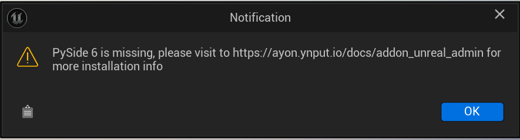
:::

## Unreal project and data structure

While other hosts in AYON have specific workfiles for each task, Unreal Engine is a bit different.
An Unreal project is made by design to contain all the content of a project, so it wouldn't make sense to have more than one.
We recommend creating a task in AYON specifically for Unreal, and use that task to manage the Unreal project.
This way user selects the dedicated task for Unreal Project in AYON Launcher and launch it by UE icon at the bottom.

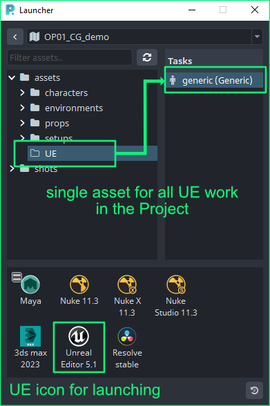

:::note
For linear animation projects, and in particular for episodic formats, we still recommend keeping only one Unreal project. Having a project for each episode would result in duplicated data between the episodes, and it would be hard to manage.
:::

## General Update on Unreal 5.4
AYON has implemented some new features in regards to Unreal 5.4 such as Sequence Hierarchy in AYON menu for building shot structure accordingly to the folder hierarchies. Moreover, it introduces maya preset options for the alembic loaders to ensure the assets loaded in current transform. It also adds the inventory action to connect animation/camera to the level sequence loaded from the layout product type.
In addition, AYON allows users to customize their asset directories(except camera and layout) before loading in the setting.

### AYON Menu and Tools

import loaderVideoUE2 from './assets/video/unreal_menu.mp4'

<video controls style={{width: "100%" }}>
  <source src={loaderVideoUE2}/>
</video>

The AYON menu will be the main tool to interact with AYON in Unreal. It will allow you to create, load, publish and manage assets.

-   [Load](artist_tools_loader) is the tool to load assets from AYON into Unreal.
-   [Publisher](artist_tools_publisher) is the tool to create and publish assets from Unreal to AYON.
-   [Manage (Inventory)](artist_tools_inventory) is the tool to manage loaded assets.
-   *Render* starts the render for a selected `AyonPublishInstance`.
-   *Build Sequence Hierarchy* builds the shot structure in regards to the folder hierarchy.
-   *Experimental tools* contains tools under developement.

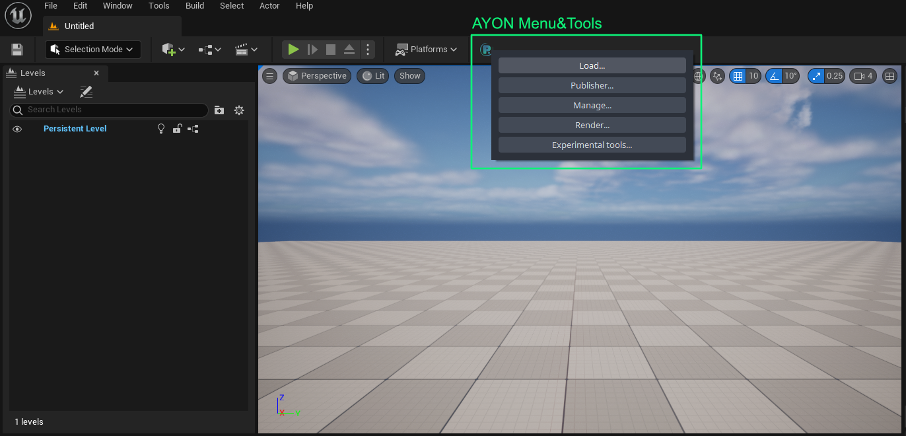

### Default structure

The structure of the project data is handled by AYON. The first time you create an instance or load an asset, AYON will create a folder called `AYON` in the Content Browser. This folder will contain all the data handled by AYON, and it is organised as follows:
- `/Content/AYON/` is the default AYON root directory.
- `/Content/AYON/{your_folder_path}/{your_product_name}` is the default directory which contains all the single assets that are loaded from AYON. Users can customize their asset directories through `ayon+settings://unreal/loaded_asset_dir`

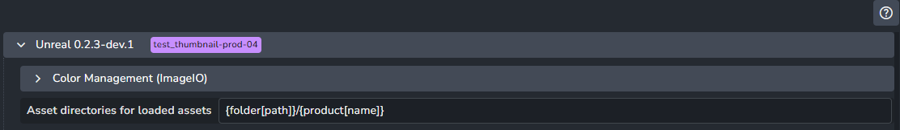

- `/Content/AYON/Assets` contains all the single assets that are loaded from AYON.
- `/Content/AYON/PublishInstances` contains all the instances that are created in Unreal.
- The rest of the directories contain all shot data of your AYON project, keeping same structure as the AYON project. In particular, they contain the levels and level sequences that are generated when you load Layout and Camera assets via **Load** tool.

:::note
AYON data folders are color coded by unique color scheme for easier navigation. As seen on the picture above.
:::

### DataAssets

AYON introduces two type of Unreal Assets acting as sort of containers: `AyonAssetContainer`

and `AyonPublishInstance`.
 

These assets are **used only to manage Ayon metadata** in Unreal, and they are not meant to be used directly in the scene. The first ones, with `_CON` suffix in the name, are used to store metadata of loaded assets, while the second ones, with `_INS` suffix in the name, for metadata of assets that are going to be published.

## Static and Skeletal Meshes

Unreal handles models and rigs as [Static](https://docs.unrealengine.com/en-US/Engine/Content/Importing/FBX/StaticMeshes/index.html) and [Skeletal](https://docs.unrealengine.com/en-US/Engine/Content/Importing/FBX/SkeletalMeshes/index.html) Meshes.
These meshes can be loaded as FBX or as Alembic. The latter can be also be loaded as a point cache, but with some [limitations](https://docs.unrealengine.com/5.1/en-US/alembic-file-importer-in-unreal-engine/).

### Loading

To load a Mesh, follow these steps:
- Choose **AYON → Load ...**.
- Right-click your mesh.
- Select **Import Static Mesh** or **Import Skeletal Mesh**.

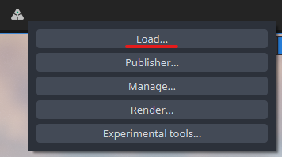
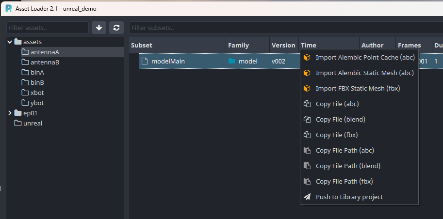

The meshes will be loaded in the `/Content/AYON/Assets` folder, and they will be automatically added to the `AyonAssetContainer` asset that is created in the same folder. The Container will only contain the metadata of the asset, and it will not be used in the scene. Instead, in the same folder you will find the imported mesh, which can be added to the scene [as usual](https://docs.unrealengine.com/5.1/en-US/assets-and-content-packs-in-unreal-engine/).

:::note
New Feature for 5.4: If you are using the Alembic loaders(e.g **Import Alembic Point Cache**, **Import Alembic Static Mesh**), you can choose which presets you want to load by clicking the small memo icon, and it will pop up the dialog to allow you to choose which preset you would like to use.(By default is Maya)

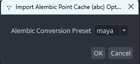
:::

The mesh is named accordingly to their allocated folder name, version number and file extension(i.e. `testProject_v001_abc`)
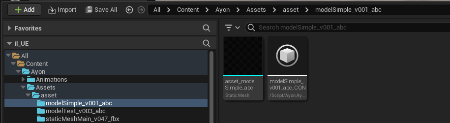

### Updating/Setting Version

To manage loaded assets, click on the AYON icon in Unreal’s main taskbar, and select **Manage**.

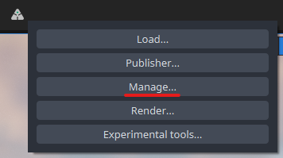

You will get a list of all the assets that have been loaded in the project.
The version number will be in red if it isn’t the latest version.

To update the asset:
- Right click on the element that has available updates.
- Click **Update to latest** or **Set version**.

:::note
Every time you update/set the version, Ayon would create a new exclusive version folder which stores the meshes in the updated version if it never loaded.
:::

### Removing
To remove loaded assets, click on the AYON icon in Unreal’s main taskbar, and select **Manage**.

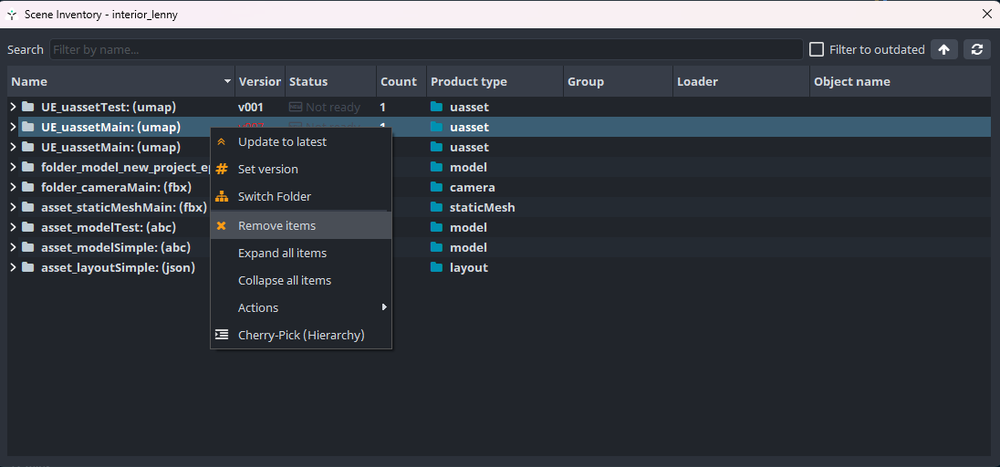

- Right click on the element you want to remove
- Click **Remove items**
- It would remove the selected element

### Publishing

To publish a mesh from Unreal, you need to create a publish instance.

- Select the mesh in the Content Browser. 
- Click on **AYON → Publisher ...** to open the Publisher screen.
  - On the top bar, switch to the **Create** tab.
  - In the Creator screen, select *Static Mesh* or *Skeletal Mesh*.
  - Set the name of the product.
  - Set *Use selection*.
  - Click on **Create**. This will create a `AyonPublishInstance` file in `/Content/AYON/PublishInstances`, with the metadata necessary to publish the asset.

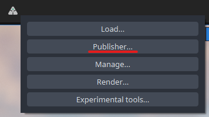
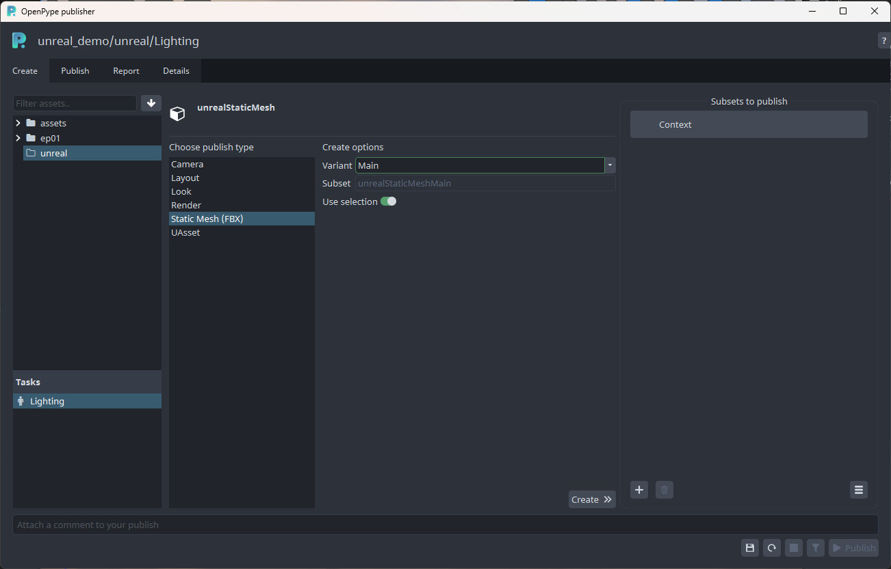

- Click on **AYON → Publisher ...** to open the Publisher screen.
  - On the top bar, switch to the **Publish** tab.
  - On the left, you will see all the publish instances that you have created. 
  - Select the ones that you want to publish, and click on **Publish**.

## UAssets

Unreal Engine uses [UAssets](https://docs.unrealengine.com/5.1/en-US/working-with-assets-in-unreal-engine/) to store assets. AYON supports publishing and loading of this kind of assets.

### Loading

To load a UAsset, follow these steps:
- Choose **AYON → Load ...**.
- Right-click your asset.
- Select **Load UAsset**.

The UAssets will be loaded in the `/Content/AYON/Assets` folder, and they will be automatically added to the `AyonAssetContainer` asset that is created in the same folder. The Container will only contain the metadata of the asset, and it will not be used in the scene.
The UAssets is named accordingly to their allocated folder name and unique version number(i.e. `testUAsset_01`)

### Updating

To manage loaded assets, click on the AYON icon in Unreal’s main taskbar, and select **Manage**.

You will get a list of all the assets that have been loaded in the project.
The version number will be in red if it isn’t the latest version.

To update the asset:
- Right click on the element that has available updates.
- Click **Update to latest** and **Set version**.

:::note
Every time you update/set the version, Ayon would create a new exclusive version folder which stores the meshes in the updated version if it never loaded.
:::

### Removing
To remove loaded assets, click on the AYON icon in Unreal’s main taskbar, and select **Manage**.

- Right click on the element you want to remove
- Click **Remove items**
- It would remove the selected element

### Publishing

:::note
Publishing UAssets has some limitations currently. You can only publish a single UAssets, and it must not have any dependencies.
:::

:::caution

Before publishing, you need to make sure the template, which is used for publishing UAssets, has been set up.

:::

To publish a UAsset, you need to create a publish instance.

- Select the UAsset in the Content Browser. 
- Click on **AYON → Publisher ...** to open the Publisher screen.
  - On the top bar, switch to the **Create** tab.
  - In the Creator screen, select *UAsset*.
  - Set the name of the product.
  - Click on **Create**. This will create a `AyonPublishInstance` file in `/Content/AYON/PublishInstances`, with the metadata necessary to publish the asset.

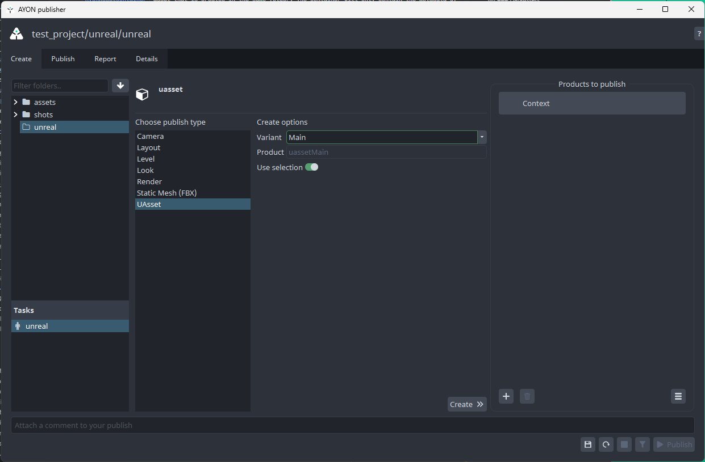

- Click on **AYON → Publisher ...** to open the Publisher screen.
  - On the top bar, switch to the **Publish** tab.
  - On the left, you will see all the publish instances that you have created.
  - Select the ones that you want to publish, and click on **Publish**.

## Layouts for linear animation

There are two different layout options in Unreal, depending on the type of project you are working on. This section explains how to handle layouts for linear animation. To do this, AYON generates [Master Sequences](https://docs.unrealengine.com/5.1/en-US/master-sequences-shots-and-takes-in-unreal-engine/) to track the whole level sequence hierarchy.
To set this mode, you should turn **on** the setting *Generate level sequences when loading layouts* in AYON **Project Settings → Unreal Engine**.

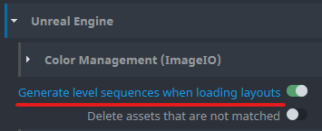

### Loading

To load a layout, follow these steps:
- Choose **AYON → Load ...**.
- Right-click your layout.
- Select **Load Layout**.

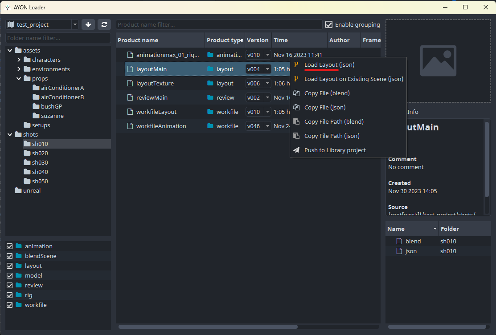

If you need to load multiple layouts, you can select more than one task on the left, and you can load them together.

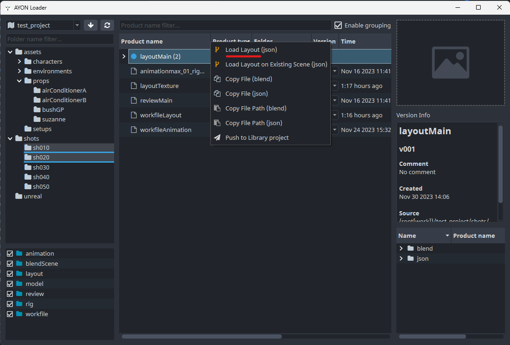

### Navigating the project

The layout will be imported in the directory `/Content/AYON`. The layout will be split into two subfolders. In `/Content/AYON/Assets` you will find all the rigs and models contained in the layout, while the folder with the name of the layout will contain the levels and the level sequences.

Typically, in a linear animation project, the project will be split into several shots, and shots are organised in scenes. If the project is episodic, scenes will also be organised in episodes. To reflect this structure, whenever you load a layout, AYON will create the same hierarchy of your project with [Level Sequences](https://docs.unrealengine.com/5.1/en-US/unreal-engine-sequencer-movie-tool-overview/) and Levels.

Cameras and Layouts follow the same structures, so when loading one of the two, you will get the same hierarchy. If you load one of them first, the whole hierarchy will be generated. If you load the other one later, and the hierarchy was already generated, the new asset will be added to the existing hierarchy.

In the main folder of the layout (or the episode folder, in case of an episodic project), you will find the *master level* and the *master level sequence* and the folders for all the scenes in the episodes. AYON is then flexible to accomodate any kind of project structure, and each layer will have its own level sequence. Finally, each shot will have again their own level sequence, and their own level.

#### Adding environment or lighting to the master level

After opening the master level, open the *Levels* window (from the menu **Windows → Levels**), and you will see the list of the levels of each shot of the episode for which a layout has been loaded.

Here you will be able to add any other level that you need to the master level. For example, you can add the environment level to the master level, so that it is always loaded when you open the master level, or any level that contains the lighting.

To add a level to the master level:

- Open the *Levels* window from the menu  **Windows → Levels**.
- Click on the **Levels** menu in the top right corner of the window.
- Click **Add Existing...**.
- Select the level you want to add to the master level.

After adding the environment level to the master level, you will need to set it as always loaded by right clicking it, and selecting **Change Streaming Method** and selecting **Always Loaded**.

Otherwise, you will need to set the visibility in the master sequence.

<!-- TODO: Add image of visibility track from level sequence -->

### Updating

To manage loaded layouts, click on the AYON icon in Unreal’s main taskbar, and select **Manage**.

You will get a list of all the assets that have been loaded in the project.
The version number will be in red if it isn’t the latest version.

To update the layout:
- Right click on the element that has available updates.
- Click **Update**.

:::warning
**DO NOT** update rigs or models imported with a layout. Update only the layout.
:::

## Layouts for interactive projects

There are two different layout options in Unreal, depending on the type of project you are working on. This section explains how to handle layouts for interactive projects. In this case, AYON will not generate the level sequences hierarchy, but will load the layout in a single level and with a single level sequence.
To set this mode, you should turn **off** the setting *Generate level sequences when loading layouts* in AYON **Project Settings → Unreal Engine**.

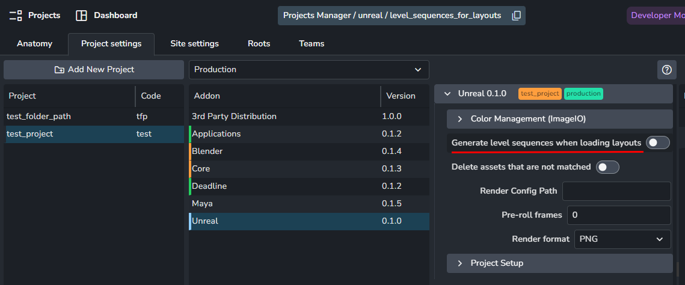

### Loading

To load a layout, follow these steps:
- Choose **AYON → Load ...**.
- Right-click your layout.
- Select **Load Layout**.

The layout will be imported in the directory `/Content/AYON`. The layout will be split into two subfolders. In `/Content/AYON/Assets` you will find all the rigs and models contained in the layout, while the folder with the name of the layout will contain the levels and the level sequences.

The layout level will and should contain only the data included in the layout. To add other elements, like the environment or the lighting, you have to create a *master level*, and add the layout level as a [streaming level](https://docs.unrealengine.com/5.1/en-US/level-streaming-in-unreal-engine/).

- Create the master level.
  - To create a level, click on **File → New Level**.
  - Select **Empty Level** or one of the presets.
  - Save the level.
- Open the master level.
- Open the *Levels* window from the menu  **Windows → Levels**.
- Click on the **Levels** menu in the top right corner of the window.
- Click **Add Existing...**.
- Select the level you want to add to the master level.

The following example shows a master level in which have been added a level with lighing and the layout level.

### Updating

To manage loaded layouts, click on the AYON icon in Unreal’s main taskbar, and select **Manage**.

You will get a list of all the assets that have been loaded in the project.
The version number will be in red if it isn’t the latest version.

To update the layout:
- Right click on the element that has available updates.
- Click **Update**.

:::warning
**DO NOT** update rigs or models imported with a layout. Update only the layout.
:::

### Publishing layouts

To publish a layout, you need to create a publish instance.

- Open a level from which you want to publish a layout from.
- Select the actors you want to include in the layout.
- Click on **AYON → Publisher ...** to open the Publisher screen.
  - On the top bar, switch to the **Create** tab.
  - In the Creator screen, select *UAsset*.
  - Set the name of the product.
  - Click on **Create**. This will create a `AyonPublishInstance` file in `/Content/AYON/PublishInstances`, with the metadata necessary to publish the layout.

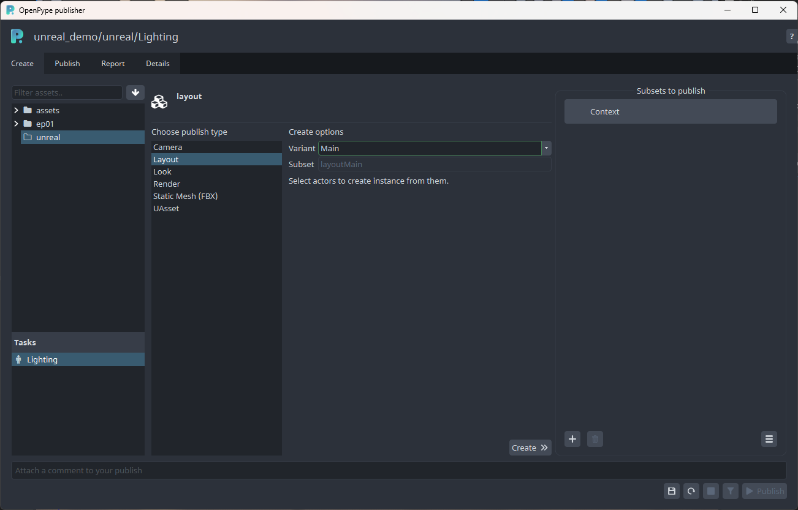

- Click on **AYON → Publisher ...** to open the Publisher screen.
  - On the top bar, switch to the **Publish** tab.
  - On the left, you will see all the publish instances that you have created.
  - Select the ones that you want to publish, and click on **Publish**.

## Layout on existing project

In case you already loaded the assets in Unreal, or imported them manually, and have assembled a scene in Unreal, you can still load the layout to match the existing assets. 

- Publish a layout from Maya or Blender.
- In Unreal, open a level that contains the assets you want to match with the layout.
- Choose **AYON → Load ...**.
- Right-click your layout.
- Select **Load Layout on Existing Scene**.

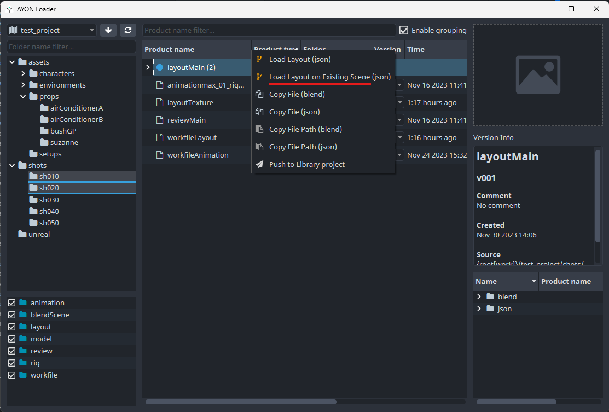

This will create the *AyonAssetContainer* for each asset you have in the scene that does not have one yet, and will create the *AyonAssetContainer* for the layout.

You have the option, in **Project Settings → Unreal Engine** to delete any unmatched asset in the scene.

## Cameras with master sequences

There are two different camera options in Unreal, depending on the type of project you are working on. This section explains how to handle cameras with the generation of [Master Sequences](https://docs.unrealengine.com/5.1/en-US/master-sequences-shots-and-takes-in-unreal-engine/).
To set this mode, you should turn **on** the setting *Generate level sequences when loading layouts* in AYON **Project Settings → Unreal Engine**.

### Loading

To load a camera, follow these steps:
- Choose **AYON → Load ...**.
- Right-click your camera.
- Select **Load Camera**.

<!-- TODO: Change images to camera -->

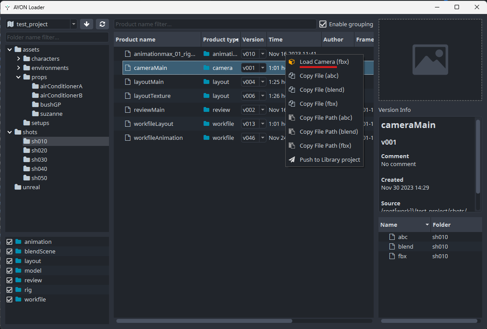

If you need to load multiple cameras, you can select more than one task on the left, and you can load them together.

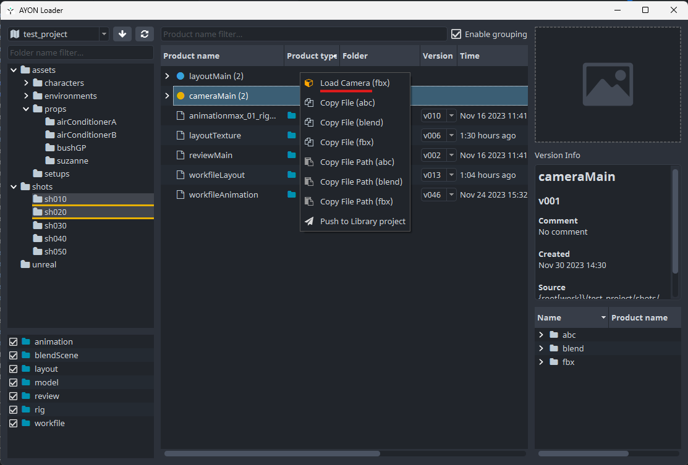

### Navigating the project

The camera will be imported in the directory `/Content/AYON`.

Typically, in a linear animation project, the project will be split into several shots, and shots are organised in scenes. If the project is episodic, scenes will also be organised in episodes. To reflect this structure, whenever you load a camera (or a layout), AYON will create the same hierarchy of your project with [Level Sequences](https://docs.unrealengine.com/5.1/en-US/unreal-engine-sequencer-movie-tool-overview/) and Levels.

Cameras and Layouts follow the same structures, so when loading one of the two, you will get the same hierarchy. If you load one of them first, the whole hierarchy will be generated. If you load the other one later, and the hierarchy was already generated, the new asset will be added to the existing hierarchy.

In the main folder of the camera (or the episode folder, in case of an episodic project), you will find the master level and the master level sequence and the folders for all the scenes in the episodes. AYON is then flexible to accomodate any kind of project structure, and each layer will have its own level sequence. Finally, each shot will have again their own level sequence, and their own level.

### Updating

To manage loaded cameras, click on the AYON icon in Unreal’s main taskbar, and select **Manage**.

You will get a list of all the assets that have been loaded in the project.
The version number will be in red if it isn’t the latest version. 

To update the camera:
- Right click on the element that has available updates.
- Click **Update**.

## Cameras for a single level

Cameras do not require a master sequence. If you are working on a project that does not require a master sequence, you can simply load the camera in the level you currently have open.
To set this mode, you should turn **off** the setting *Generate level sequences when loading layouts* in AYON **Project Settings → Unreal Engine**.

## Removing Cameras
To remove the loaded layout, click on the AYON icon in Unreal’s main taskbar, and select **Manage**.

- Right click on the Cameras you want to remove
- Click **Remove items**

The sequence, map and container associated with the selected layout would be removed. Unreal would dive into the default level map after the deletion.

### Loading

To load a camera, follow these steps:
- Choose **AYON → Load ...**.
- Right-click your camera.
- Select **Load Camera**.

In `/Content/AYON` you will find a folder with the name of the camera that contains the camera level sequence. The camera will be loaded in the current level open, so you will need to save it, if you haven’t already.
The imported level sequence and map are named accordingly to their allocated folder name, version number and file extension(i.e. `testProject_v001_fbx`)

### Updating

To manage loaded cameras, click on the AYON icon in Unreal’s main taskbar, and select **Manage**.

You will get a list of all the assets that have been loaded in the project.
The version number will be in red if it isn’t the latest version. 

To update the camera:
- Right click on the element that has available updates.
- Click **Update to latest** and **Set version**.

:::note
Every time you update/set the version, Ayon would create a new exclusive version folder which stores the related assets(level sequence and map) in the updated version if they never loaded.
:::

## Animations

:::note
Loading animations requires a layout loaded with the option to create the level sequences **on**.
:::

AYON allows you to load animations in Unreal. To load an animation, you will first need to load a layout with the option to create the level sequences **on**. This is because the animations will be added to the same level sequences generated for the layout.

### Loading the layout

To load a layout, follow these steps:
- Choose **AYON → Load ...**.
- Right-click your layout.
- Select **Load Layout**.

The layout will be imported in the directory `/Content/AYON`. For more information, we recommend reading the section dedicated to the [layout for linear animation](#layouts-for-linear-animation).

## Removing the layout
To manage the loaded layout, click on the AYON icon in Unreal’s main taskbar, and select **Manage**.

- Right click on the layout you want to remove
- Click **Remove items**

The sequence, map and container associated with the selected layout would be removed. Unreal would dive into the default level map after the deletion.

### Loading the animation

To load an animation, follow these steps:
- Choose **AYON → Load ...**.
- Right-click your animation.
- Select **Load Animation**.

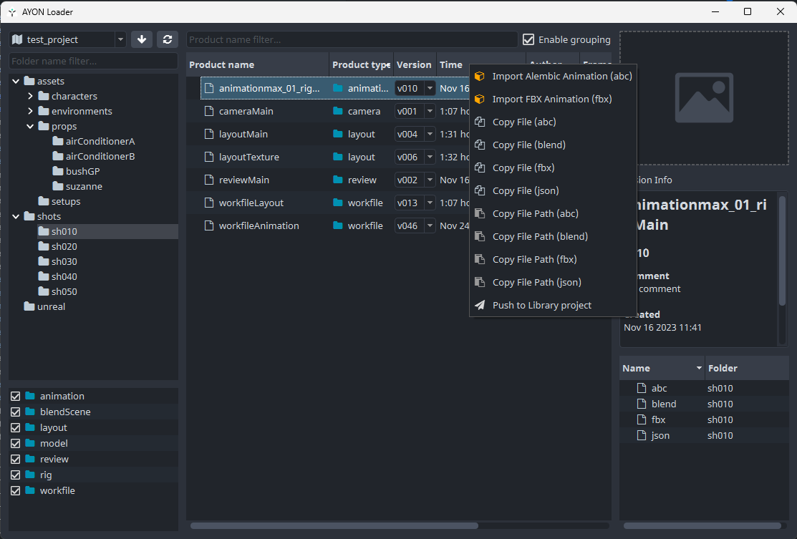

The animation would be imported in `/Content/AYON/Animations` and it is named accordingly to their allocated folder name, version number and file extension(i.e. `testProject_v001_abc`)

### Connecting animation(and camera) to the sequence loaded from layout
You can connect your loaded animation sequence and camera to the level sequence loaded via layout loader.

- To connect your loaded animation sequence, click on the AYON icon in Unreal’s main taskbar, and select **Manage**.
- Select the element(s) respectively from the animation and layout product type.
- Right click **Actions** and **Connect Fbx Animation to Level Sequence** or
  **Connect Alembic Animation to Level Sequence**

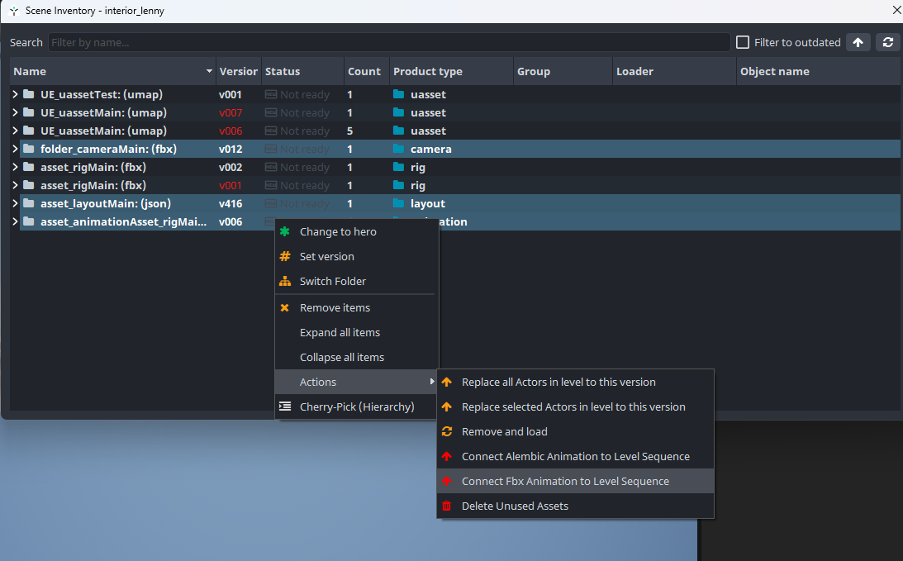

- It would add the loaded camera and animation sequence into the level sequence which stores the meshes loaded from the layout.

:::note
The current connect action is not applicable for the level sequence which has an existing camera cut track. If users want to connect camera and animation, they need to remove the camera cut track first and perform the action.

:::

### Updating

To manage loaded animations, click on the AYON icon in Unreal’s main taskbar, and select **Manage**.

You will get a list of all the assets that have been loaded in the project.
The version number will be in red if it isn’t the latest version.

To update the animation:
- Right click on the element that has available updates.
- Click **Update to latest** or **Set version**.

:::note
Every time you update/set the version, Ayon would create a new exclusive version folder which stores the related assets(level sequence and map) in the updated version if they never loaded.
:::

## Rendering

:::note
The rendering requires a layout loaded with the option to create the level sequences **on**.
:::

### Prerequisites

To render with AYON in Unreal, you will need to set a new root in AYON Project Settings. This root will be the folder where all the renders will be published.

- Open AYON Project Settings from the tray icon from **Admin → Studio Settings**
- Go to **Project Settings → Anatomy → Roots**.
- Add a new root with the name `renders`.
- Add the path you want to use for the renders. This path should be an absolute path.

### Render settings

AYON offers a set of render settings that you can set from the Projects Settings. Settings like frame rate, frame range, and resolution can be set in the **Project Settings → Anatomy → Attributes**. Settings more specific to Unreal can be found in **Project Settings → Unreal Engine**, and these are:
- Render Format, Unreal supports **EXR**, **PNG**, **JPG** and **BMP**. 
- Pre-roll Frames, the amount of warm up frames that will be rendered before the actual render.

Additionally, AYON allows you to prepare a [preset of settings](https://docs.unrealengine.com/5.1/en-US/cinematic-render-settings-in-unreal-engine/) directly from the [Movie Render Queue](https://docs.unrealengine.com/5.1/en-US/render-cinematics-in-unreal-engine/) and pass them to the render. To do so, you will need to set the path of the preset in **Project Settings → Unreal Engine**.

### Creating the render instance for existing hierarchy

To render and publish an episode, a scene or a shot, you will need to create a Render `AyonPublishInstance`. The publish instance for the rendering is based on one level sequence. That means that if you want to render the whole project (or a the whole episode), you will need to create it for the master level sequence, but if you want to render just one shot, you will need to create it for that shot.

- Navigate to the folder that contains the level sequence that you need to render.
- Select the level sequence.
- Click on **AYON → Publisher ...** to open the Publisher screen.
  - On the top bar, switch to the **Create** tab.
  - In the Creator screen, select *Render*.
  - Set the name of the product.
  - Check the **Use Hierarchy** checkbox.
  - Click on **Create**. This will create a `AyonPublishInstance` file in `/Content/AYON/PublishInstances`, with the metadata necessary to render and publish it.

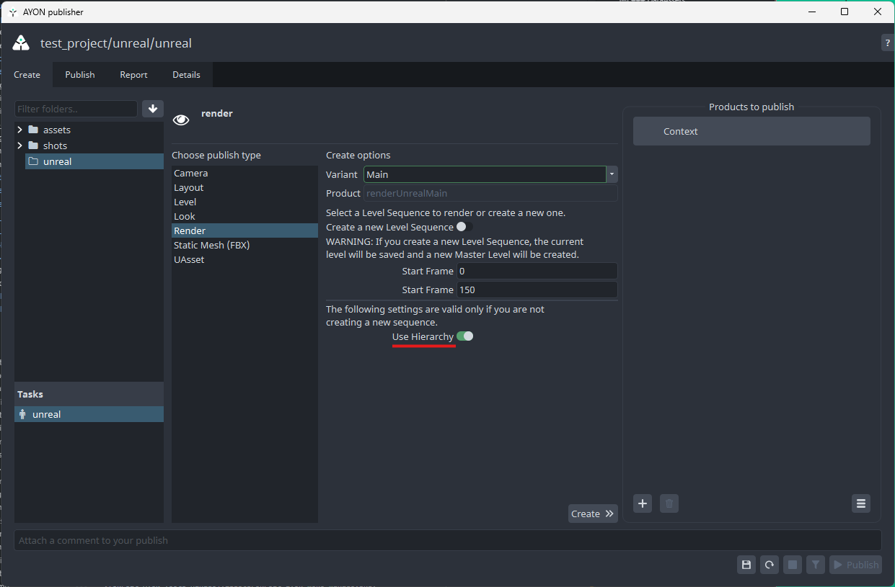

### Creating the render instance with new level sequence

To render just a scene, without creating a whole hierarchy, you can create an `AyonPublishInstance` and a new level sequence from the Publisher.

- Click on **AYON → Publisher ...** to open the Publisher screen.
  - On the top bar, switch to the **Create** tab.
  - In the Creator screen, select *Render*.
  - Set the name of the product.
  - Check the **Create a new Level Sequence** checkbox.
  - Set *Start* and *End Frames*.
  - Click on **Create**. This will create a `AyonPublishInstance` file in `/Content/AYON/PublishInstances`, with the metadata necessary to render and publish it.

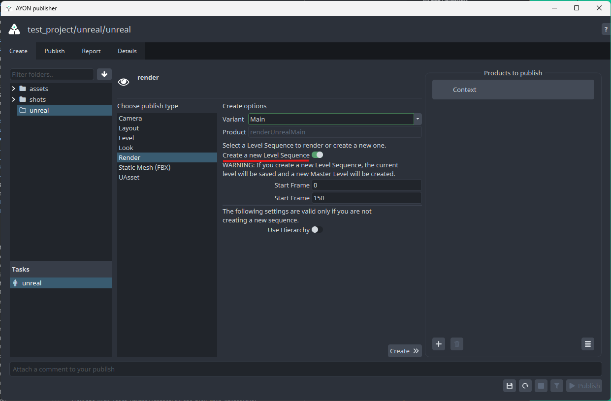

### Start the rendering

To start the rendering, just select the render `AyonPublishInstance` you want to render, and then click on the AYON icon in Unreal’s main taskbar, and select **Render**. You can render more than one instance at a time, if needed. Just select all the instances that you need to render before selecting the **Render** button from the AYON menu.

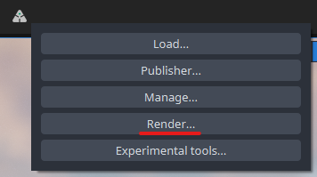

### Publish the render

Once the render is finished, you can publish the render. Click on the AYON icon in Unreal’s main taskbar, and select **Publish**.

- Click on **AYON → Publisher ...** to open the Publisher screen.
  - On the top bar, switch to the **Publish** tab.
- On the left, you will see all the publish instances that you have created.
  - They will be automatically reorganised to have an instance for each shot. So, for example, if you have created the render instance for the whole episode, here you will have an instance for each shot in the episode.
- Select the ones that you want to publish, and click on **Publish**.

### Farm rendering

Unreal integration also supports rendering on Deadline. Process of creation of render instance is same as higher, difference is in
selection of `Farm rendering` in `Render target`.

Deadline rendering process expects physically existing Render Queue and Render Settings uassets in the Unreal project.

By default they are expected at these paths:
- `/Game/Ayon/renderQueue`
- `/Game/Ayon/DefaultMovieRenderQueueConfig.DefaultMovieRenderQueueConfig`

These could be modified by AYON admin in `ayon+settings://unreal/render_queue_path`

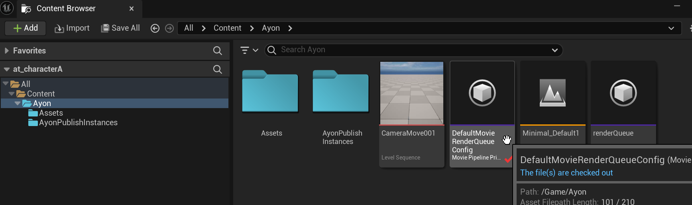

## AYON Perforce Support

:::tip
AYON has a dedicated addon for Perforce support.
Please refer to [Version Control Artist Docs](addon_version_control_artist.md) to learn more.
:::

## Build Sequence Hierarchy
Ayon supports to build the shot structure accordingly to the folder hierarchies.
Users can click on Ayon menu -> **Build sequence hierarchy**

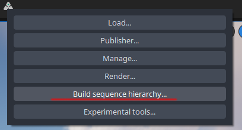

There would be the folder selector dialog popping up for users to choose the folders to build shot structure.

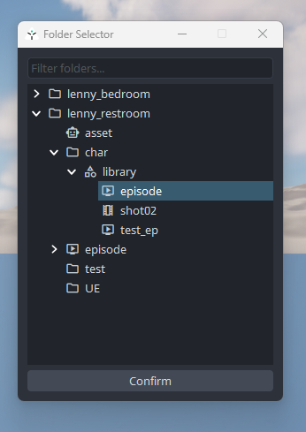

Once the users select the preferred folder(s) to build the sequence, AYON would create map(s) and level sequence(s) inside it.

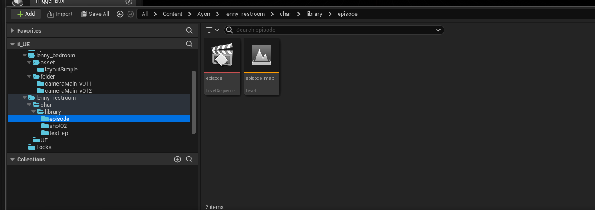

It also builds the level sequence(s) in its parent folder, which stores level visibility of the map(s) and subsequences storing with the level sequence(s) of the preferred folder.

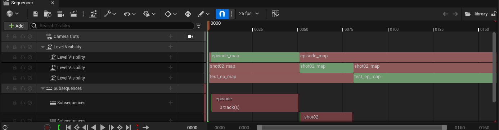