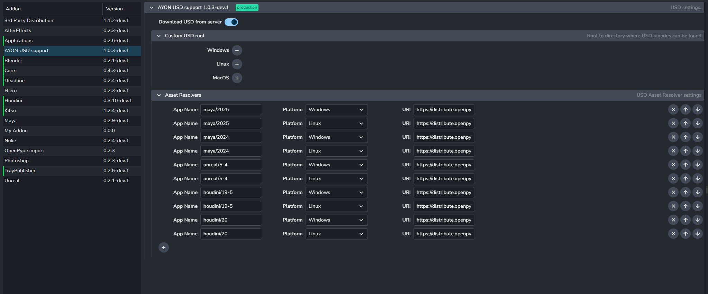
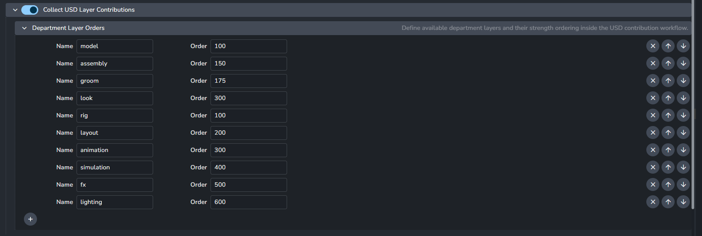

import ReactMarkdown from "react-markdown";
import versions from '@site/docs/assets/json/Ayon_addons_version.json'

  

    

      <ReactMarkdown>
        {versions.Core_Badge}
      </ReactMarkdown>
    

    

      <ReactMarkdown>
        {versions.USD_Badge}
      </ReactMarkdown>
    

    

      <ReactMarkdown>
        {versions.Houdini_Badge}
      </ReactMarkdown>
    

    

      <ReactMarkdown>
        {versions.Maya_Badge}
      </ReactMarkdown>
    

    

      <ReactMarkdown>
        {versions.Blender_Badge}
      </ReactMarkdown>
    

  

:::tip
Currently, there's no need to install the [ayon-usd](https://github.com/ynput/ayon-usd) addon to utilize our USD workflow outlined in our [USD Artist Docs](category/usd).

The base functionality is implemented in the [ayon-core](https://github.com/ynput/ayon-core) addon and each DCC specific workflow is implemented in its related DCC addon. e.g. Houdini USD workflow is implemented in [ayon-houdini](https://github.com/ynput/ayon-houdini).

For the future, it is considered to move all the USD bits into [ayon-usd](https://github.com/ynput/ayon-usd) addon in a similar fashion to [ayon-deadline](https://github.com/ynput/ayon-deadline) addon.
:::

## USD Addon Settings
Currently, the usd addon is only responsible for downloading of USD binaries for AYON, along with pre-built AYON USD resolvers for various DCCs.

> The snippet below is from an early version of the USD add-on, which is still in development.

## USD Workflow Settings
The USD workflow settings are currently limited. You can customize only the names and order of department layers at this stage.

- `ayon+settings://core/publish/CollectUSDLayerContributions`

:::tip
Hover over the `Order` field for more details on the strength ordering:
- Higher order means a higher strength and stacks the layer on top.
- Opinions from a layer that is on top are stronger than those below it.
- See the USD acronym [LIVRPS](https://remedy-entertainment.github.io/USDBook/terminology/LIVRPS.html) for more details on USD's strength ordering.
:::