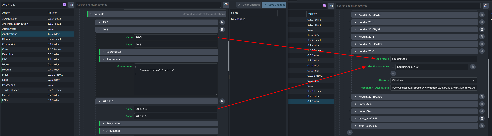

import ReactMarkdown from "react-markdown";
import versions from '@site/docs/assets/json/Ayon_addons_version.json'

  

    

      <ReactMarkdown>
        {versions.Core_Badge}
      </ReactMarkdown>
    

    

      <ReactMarkdown>
        {versions.USD_Badge}
      </ReactMarkdown>
    

    

      <ReactMarkdown>
        {versions.Houdini_Badge}
      </ReactMarkdown>
    

    

      <ReactMarkdown>
        {versions.Maya_Badge}
      </ReactMarkdown>
    

    

      <ReactMarkdown>
        {versions.Blender_Badge}
      </ReactMarkdown>
    

  

## Binary Distribution
> Setting Location: `ayon+settings://usd/distribution`

- **Server URL**: The URL for the USD binary distribution LakeFs server. It's recommended to keep the default value to use the USD builds we provide.
- **Repository URI**: The repository tag or branch URI within the LakeFs server.
- **Access Key ID**: The LakeFs server access key ID.
- **Secret Access Key**: The LakeFs server secret access key.

:::info Access Keys
These are currently not public, however they are provided upon request.

Reach out us on our website [ynput.io](https://ynput.io/contact/) or Forums [community.ynput.io](https://community.ynput.io/) or Discord Server [Ynput Community](https://discord.gg/ynput).
:::

### Resolver Application Paths
> Setting Location: `ayon+settings://usd/distribution/asset_resolvers`

Define a specific Resolver Zip for a particular application.  
**You won't need to modify this setting as it comes pre-configured with all the packages we provide. However, you may tweak the `Application Alias` to suit your applications' setup.**

1. Each Application path group:
   - **App Name**: Application name, e.g. `maya/2025`
   - **Application Alias**: Define a list of App Names that use the same resolver.
   - **Platform**: drop down menu to select the platform: `windows`, `linux` & `darwin`.
   - **Repository Object Path**: The LakeFs internal path to the resolver zip, e.g., `AyonUsdResolverBin/Hou/ayon-usd-resolver_hou19.5_linux_py37.zip`. You can find LakeFs `Path` information in the Object Info section by clicking the gear icon on the right side when hovering over a file on the [LakeFS](https://lake.ayon.cloud) server.
2. **+**: Add application path group

:::tip Application Alias
You'll likely find the **Application Alias** setting most useful, as it lets you use the same resolver build with different versions of an app (e.g., different patch versions of Houdini 20.5).

:::

### Resolver Application Overrides
> Setting Location: `ayon+settings://usd/distribution/lake_fs_overrides`

Define a specific Resolver Zip for a specific Application.

- Each Application override group:
  - **App Name**: Application name, e.g. `maya/2025`
  - **Platform**: drop down menu to select the platform: `windows`, `linux` & `darwin`.
  - **Repository Object URI**: Path to USD Asset Resolver plugin zip file on the LakeFs server, e.g: `lakefs://ayon-usd/V001/AyonUsdResolverBin/Hou/ayon-usd-resolver_hou19.5_linux_py37.zip`.
- **+**: Add application override group

## AYON USD Resolver Config
> Setting Location: `ayon+settings://usd/ayon_usd_resolver`

AYON USD resolver Settings

- **Resolver Log Level**: Set verbosity of the AyonUsdResolver logger.
- **Resolver File Logger Enabled**: Enable or disable AyonUsdResolver file logger.
- **Resolver File Logger file path**: Set a custom location where the file logger will export to. This can be a relative or absolute path. This is only used if `ayon_file_logger_enabled` is enabled.
- **AyonCppApi Logging Keys**: List of extra logging options for the `AyonCppApi`.

## USD Library Config
> Setting location: `ayon+settings://usd/usd`

Settings for USD Library

- **Tf Debug Variable for Debugging USD**: Its value will be set to `TF_DEBUG` which allows you to inspect specific log outputs of Usd. Typical use cases are to check if plugins are loaded correctly or if data is properly being refreshed.

:::tip `TF_DEBUG`
For more info about `TF_DEBUG`, See [Debugging | lucascheller USD Survival Guide](https://lucascheller.github.io/VFX-UsdSurvivalGuide/pages/core/profiling/debug.html#debugging).

:::

## Publish plugins
### Process USD files to use relative paths
> Setting Location: `ayon+settings://usd/publish/USDOutputProcessorRemapToRelativePaths`

- **Enable**: The default state of the plugin.
- **Optional**: Allows the user to toggle this setting in the publisher UI.
- **Active**: The default value of the toggle in the publisher UI.
