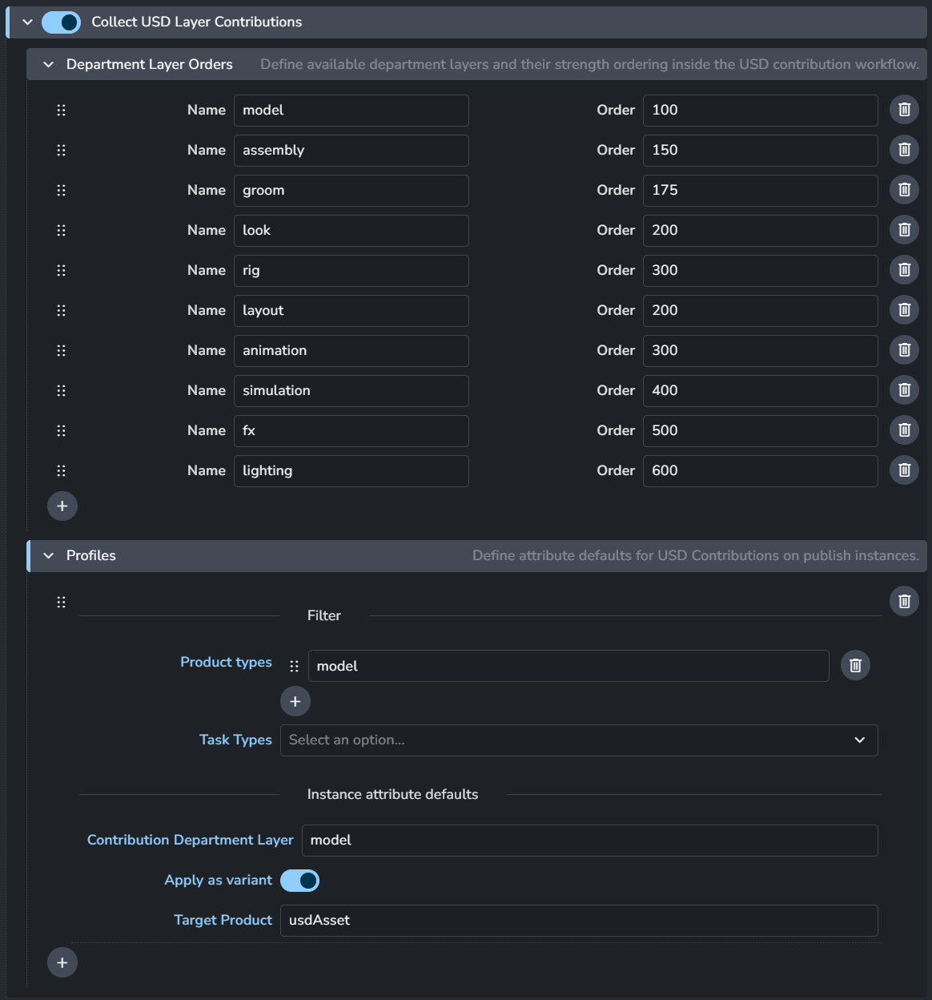
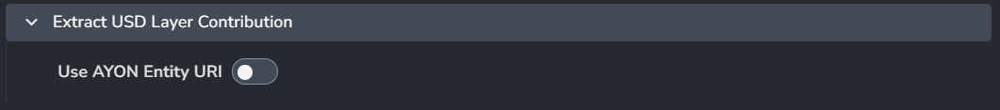
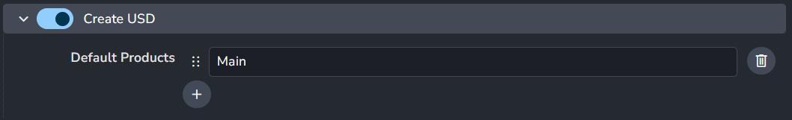
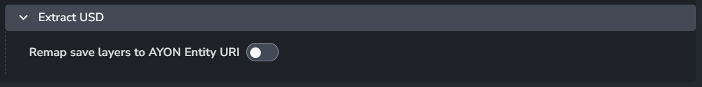
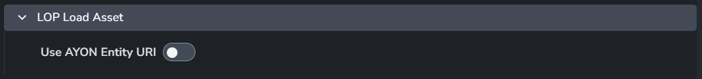
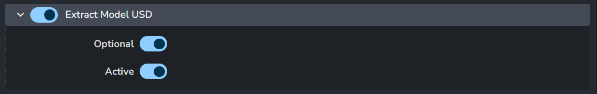

import ReactMarkdown from "react-markdown";
import versions from '@site/docs/assets/json/Ayon_addons_version.json'

  

    

      <ReactMarkdown>
        {versions.Core_Badge}
      </ReactMarkdown>
    

    

      <ReactMarkdown>
        {versions.USD_Badge}
      </ReactMarkdown>
    

    

      <ReactMarkdown>
        {versions.Houdini_Badge}
      </ReactMarkdown>
    

    

      <ReactMarkdown>
        {versions.Maya_Badge}
      </ReactMarkdown>
    

    

      <ReactMarkdown>
        {versions.Blender_Badge}
      </ReactMarkdown>
    

  

These settings are related to USD contribution workflow but currently live outside of USD addon. 

:::tip settings filter

You can set the settings filter to `usd` to quickly show usd settings within the addon.

:::

## Core Addon

<ReactMarkdown>
  {versions.Core_Badge}
</ReactMarkdown>

### Collect USD Layer Contributions
> Setting Location: `ayon+settings://core/publish/CollectUSDLayerContributions`

Define available department layers and their strength ordering inside the USD contribution workflow.

- Each item group
  - **Name**: Department layer name.
  - **Order**: Department layer order.
- **+**: Add an item.

:::tip Default Department Layers

- **Asset layers**
  - **model**: `100`
  - **assembly**: `150`
  - **groom**: `175`
  - **look**: `300`
  - **rig**: `100`
- **Shot layers**
  - **layout**: `200`
  - **animation**: `300`
  - **simulation**: `400`
  - **fx**: `500`
  - **lighting**: `600`

:::

:::info Layer Order
Hover over the `Order` field for more details on the strength ordering:
- Higher order means a higher strength and stacks the layer on top.
- Opinions from a layer that is on top are stronger than those below it.
- See the USD acronym [LIVRPS](https://remedy-entertainment.github.io/USDBook/terminology/LIVRPS.html) for more details on USD's strength ordering.
:::

### Extract USD Asset Contribution
> Setting Location: `ayon+settings://core/publish/ExtractUSDAssetContribution`

- **Use AYON Entity URI**: Enable to use Entity's URI instead of file path.

### Extract USD Layer Contribution
> Setting Location: `ayon+settings://core/publish/ExtractUSDLayerContribution`

- **Use AYON Entity URI**: Enable to use Entity's URI instead of file path.

## Houdini Addon

<ReactMarkdown>
  {versions.Houdini_Badge}
</ReactMarkdown>

### Creator Plugins
#### Create USD Look
> Settings Location: `ayon+settings://houdini/create/CreateUSDLook`

- **Default Products**: List of default variants for each product.
  
#### Create USD
> Settings Location: `ayon+settings://houdini/create/CreateUSD`

- **Default Products**: List of default variants for each product.

#### Create USD render
> Settings Location: `ayon+settings://houdini/create/CreateUSDRender`

- **Default Products**: List of default variants for each product.
- **Default Renderer**: Specify either the Hydra renderer plug-in nice name, like `Karma CPU`, or the plug-in name, e.g. `BRAY_HdKarma`.

### Publish Plugins
#### Validate USD Look Assignments
> Settings Location: `ayon+settings://houdini/publish/ValidateUsdLookAssignments`

- **Enable**: The default state of the plugin.
- **Optional**: Allows the user to toggle this setting in the publisher UI.
- **Active**: The default value of the toggle in the publisher UI.

#### Validate USD Render Product Paths
> Settings Location:`ayon+settings://houdini/publish/ValidateUSDRenderProductPaths`

- **Enable**: The default state of the plugin.
- **Optional**: Allows the user to toggle this setting in the publisher UI.
- **Active**: The default value of the toggle in the publisher UI.

#### Validate USD Render Resolution
> Settings Location:`ayon+settings://houdini/publish/ValidateRenderResolution` 

- **Enable**: The default state of the plugin.
- **Optional**: Allows the user to toggle this setting in the publisher UI.
- **Active**: The default value of the toggle in the publisher UI.

#### Extract USD
> Settings Location:`ayon+settings://houdini/publish/ExtractUSD`

- **Remap save layers to AYON Entity URI**: Enable to use Entity's URI instead of file path.

### Loader Plugins
#### LOP Load Asset
> Settings Location: `ayon+settings://houdini/load/LOPLoadAssetLoader`

- **Use AYON Entity URI**: Enable to use Entity's URI instead of file path.

#### LOP Load Shot
> Settings Location: `ayon+settings://houdini/load/LOPLoadShotLoader`

- **Use AYON Entity URI**: Enable to use Entity's URI instead of file path.

#### USD Sublayer Loader
> Settings Location: `ayon+settings://houdini/load/USDSublayerLoader`

- **Use AYON Entity URI**: Enable to use Entity's URI instead of file path.

#### USD Reference Loader
> Settings Location: `ayon+settings://houdini/load/USDReferenceLoader`

- **Use AYON Entity URI**: Enable to use Entity's URI instead of file path.

#### USD SOP Import Loader
> Settings Location: `ayon+settings://houdini/load/SopUsdImportLoader`

- **Use AYON Entity URI**: Enable to use Entity's URI instead of file path.

## Maya Addon

<ReactMarkdown>
  {versions.Maya_Badge}
</ReactMarkdown>

:::info explicit plugins loading

Default values of **Explicit Plugins Loading** (`ayon+settings://maya/explicit_plugins_loading`) includes `mayaUsdPlugin`

:::

### Creators
#### Create Multiverse USD
> Settings Location: `ayon+settings://maya/create/CreateMultiverseUsd`

- **Default Products**: List of default variants for each product.

#### Create Multiverse USD Composition
> Settings Location: `ayon+settings://maya/create/CreateMultiverseUsdComp`

- **Default Products**: List of default variants for each product.
  
#### Create Multiverse USD Override
> Settings Location: `ayon+settings://maya/create/CreateMultiverseUsdOver`

- **Default Products**: List of default variants for each product.

### Publishers
#### Extract Maya USD Model
> Settings Location: `ayon+settings://maya/publish/ExtractMayaUsdModel`

- **Enable**: The default state of the plugin.
- **Optional**: Allows the user to toggle this setting in the publisher UI.
- **Active**: The default value of the toggle in the publisher UI.

#### Extract Maya USD Pointcache
> Settings Location: `ayon+settings://maya/publish/ExtractMayaUsdPointcache`

- **Enable**: The default state of the plugin.
- **Optional**: Allows the user to toggle this setting in the publisher UI.
- **Active**: The default value of the toggle in the publisher UI.

#### Extract Maya USD Animation
> Settings Location:  `ayon+settings://maya/publish/ExtractMayaUsdAnim`

- **Enable**: The default state of the plugin.
- **Optional**: Allows the user to toggle this setting in the publisher UI.
- **Active**: The default value of the toggle in the publisher UI.

### Loaders
#### Multiverse USD Loader
> Settings Location: `ayon+settings://maya/load/MultiverseUsdLoader`

- **Enable**: The default state of the plugin.

#### Multiverse USD Override Loader
> Settings Location: `ayon+settings://maya/load/MultiverseUsdOverLoader`

- **Enable**: The default state of the plugin.

## Blender Addon

<ReactMarkdown>
  {versions.Blender_Badge}
</ReactMarkdown>

### Extract Model USD
> Setting Location: `ayon+settings://blender/publish/ExtractModelUSD`

- **Enable**: The default state of the plugin.
- **Optional**: Allows the user to toggle this setting in the publisher UI.
- **Active**: The default value of the toggle in the publisher UI.