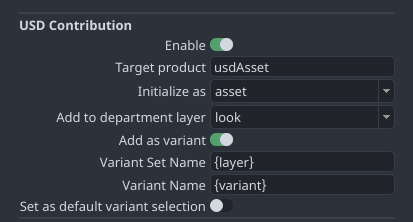
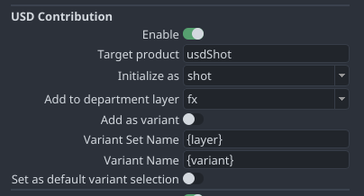

:::info
This page is still under construction 👷🚧🛠️🔜🏗️.
:::

# Ayon USD Contribution Workflow

[A recent PR](https://github.com/ynput/ayon-core/pull/295) implemented a special **AYON USD Contribution Workflow**.

### What is it?

The AYON USD Contribution Workflow allows to create small contribution publishes from DCCs with USD export support to directly add your publish into an asset's model or look variants or a shot's department layers. Automatically building up the USD structure for you.

Traditionally each department or artist would generate multiple products that downstream departments would load individually. For example, a lighting department may load each character animation product, each FX product individually.

So there would be some scattered products like:

- pointcacheMain
- pointcacheFX_building
- animationChar01

However, **USD can reference and layer non-destructively** which means we can safely merge these together at any point. Also making it easy for multiple departments to stack their own opinions and changes onto the departments before you.

This is where the USD Asset Contribution workflow automates this for you.

With the **USD Contribution** enabled :white_check_mark: on the USD publish instances this means it will automatically add your product into the department layer for the Asset or Shot.

- usdShot
    - usdShot_animation
        - animationChar01
        - pointcacheMain
    - usdShot_fx
        - pointcacheFX_building

TL:DR :see_no_evil: 

With AYON's USD Contribution each product publish adds up into the target USD asset or USD shot. :tada: 

### Configuring the USD Contribution

Examples in publisher UI:

####  Asset contribution to `usdAsset` for the Look department layer:

#### Shot contribution to `usdShot` for the FX department layer:

**Note:**
- Currently it's a manual process to target `usdShot` instead of `usdAsset` for shot contributions. It's on the planning to improve that workflow! This is notably a common mistake to forget changing that, so be aware!

#### Disabling USD contribution workflow

If you just disable the **USD Contribution > Enable** checkbox you will write out just the USD file using the host's export methods without any automated layering into another product - as such, disabling that means that all the settings underneath it do nothing at all. (They should appear greyed out, but unfortunately it's a limitation of the publisher UI that it can't currently)

---

TODO (Add explanations):
- How to define the layer strength 

### Add as variant - or not?

In most cases:
- an **asset** contribution is a variant.
- a **shot** contribution is **not** a variant.

##### Add as variant ENABLED

When enabling _Add as variant_ it means your single contribution will be added as a variant in a variant set on the asset's root primitive (the default prim). As such, multiple variant contributions to the same department layer (and same variant set) are not active at the same time, but they are switchable variants. So you can for example:

- Publish a model main variant
- Publish a model damaged variant

Now in the USD asset on the root primitive you may have a variant set _model_ that contains your _modelMain_ and _modelDamaged_ variants that downstream departments can switch between in your asset.

##### Add as variant DISABLED

With _Add as variant_ **disabled** each contribution to a single department layer is just added as essentially another layer - meaning that the contributions inside a single department layer are all live at the same time.

You can for example:

- Publish a FX shockwave
- Publish a FX building destruction

Both to the FX department layer - one isn't necessarily 'in front of' the other they are both just unordered contributions in that layer, present at the same time.

So loading the shot with the FX layer will show both the shockwave and building destruction - you're not picking between the two.