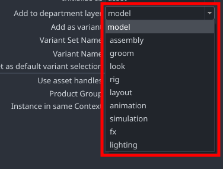
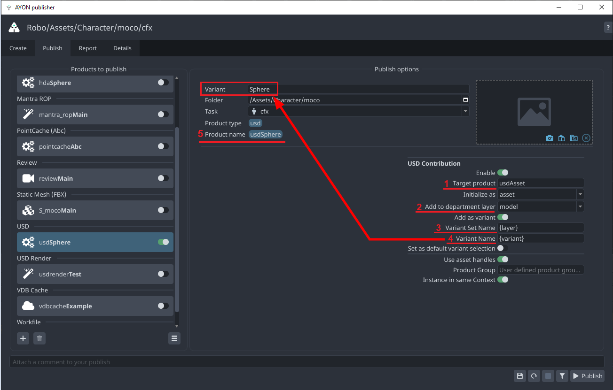
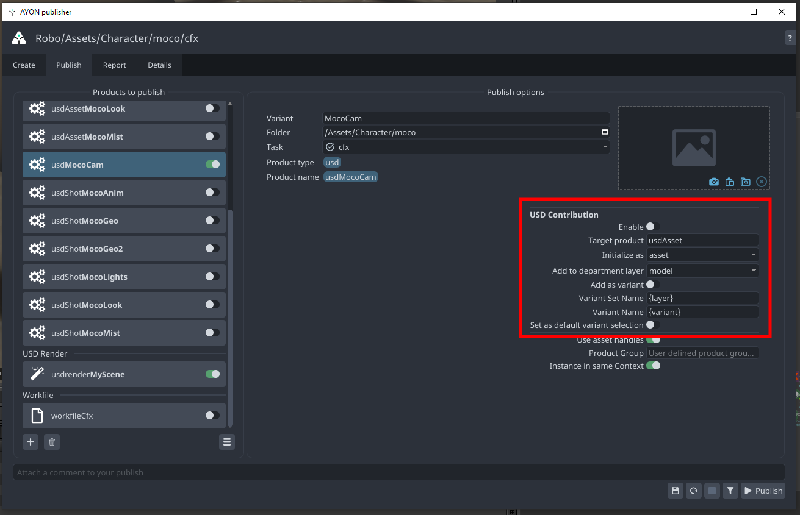
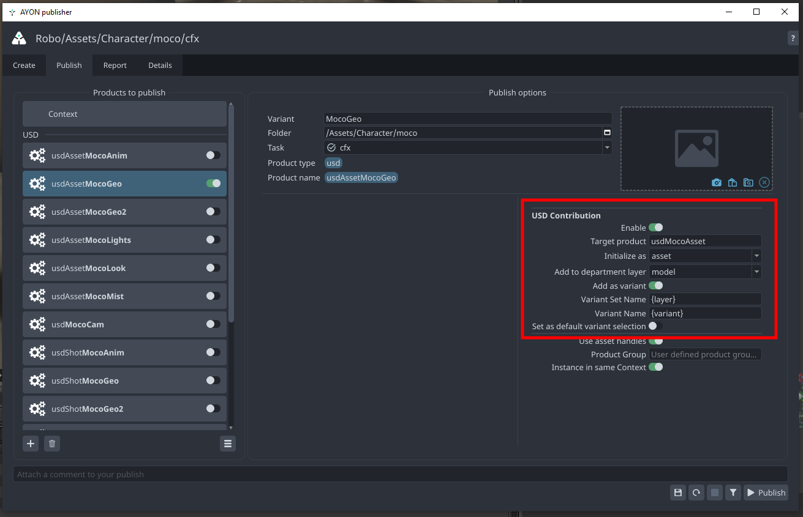
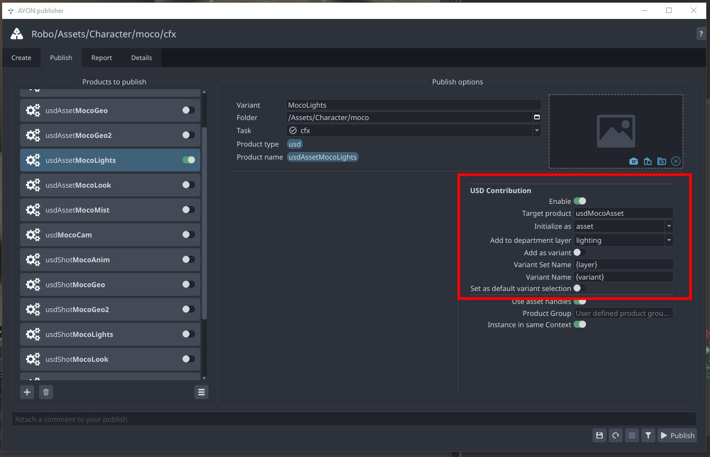

Frequently Asked Questions or Issues

### I do not see my model on loading the asset 

<details><summary>On Load warning message "Unresolved Reference Path" shows</summary>


Since you're publishing into the asset structure make sure your data is inside the expected default primitive path for that asset, where the default primitive is always `{folder[name]}` so your data should be inside `/{folder[name]}/...` so that the data resides inside the default primitive path.

This is wrong: :warning: 

```
/geo/marble
/materials/material1
```

This is correct: :trophy: 

```
/char_hero
    /geo/marble
    /materials/material1
```


You are lacking the default primitive it expects.
</details>

### What are all these publisher options, like Target Product?


<details><summary>Some technical details explained by @MustafaJafar </summary>

**<font size="6">USD Publish Settings explained</font>**

**<font size="5">Initialize as asset vs shot</font>**

As the explained in [Getting Started](addon_usd_artist_get_started)
- `Asset` Layer supports:
  - Load/unload the asset
  - Have different layers to hold data from different departments
  - Allow each layer to have switchable variants
- `Shot` Layer only combines different layers from different departments.

Here's an example of the generated asset and shot structure
by AYON USD publish plugins.
- USD Asset Structure
  ```
  # USD Asset
  {target-product}.usda
    └── Xform {folder[name]}
          ├── inherits __class__/{folder[name]}
          └── payload ./payload.usda  # Relative path

  payload.usda
    └── mata data
          └── sublayers
                └── {target-product_department-name}.usda:ARGS:{layer-id}, {order}
  ```
- USD Shot Structure
  ```
  # USD Shot
  {target-product}.usda
    └── mata data
          └── sublayers
                └── {target-product_department-name}.usda:ARGS:{layer-id}, {order}
  ```

**<font size="5">Available Department Layers</font>**

Please, be aware that we currently do not provide validators to confirm if the content you intend to publish matches your selected layer. As it stands, layers function as labels with a predetermined order. For example, the model layer will consistently be evaluated before the material layer.


<div class="row">
<div class="col">

**Layers order:**
- **Asset layers**
  - model: 100
  - assembly: 150
  - groom: 175
  - look: 200
  - rig: 300
- **Shot layers**
  - layout: 200
  - animation: 300
  - simulation: 400
  - fx: 500
  - lighting: 600
  
</div>
<div class="col">



</div>
</div>


**<font size="5">USD Different publish options</font>**



Let's focus on 4 interesting settings + 1 computed value by the publisher.
1. `target-product` which is a user editable text.
2. `target-product_department-name` which is a selection from a drop down list.
3. `variant-set-name` which is by default is set to `{layer}` which evaluates to the selected item in the drop down list in Num2
4. `variant-name` which is by default is set to `{variant}` as the arrow in the screenshot points.
5. `product-name` which what we have by default from the publisher for any publish instance.

**<font size="4">Publish a separate layer</font>**

By disabling `Enable` toggle.
USD publish plugins will skip the USD contribution and publish a single layer.
and, it doesn't affect the version in the latest published `target-product` or `target-product_department-name`. 



Resultant Products:
- Product: `product-name`
  ```
  {product-name}.usd
  # It can be any usd hierarchy.
  ```
**<font size="4">Publishing Asset contribution with Variant</font>**



:::tip
When choosing shot instead of asset, the resultant Product: `target-product`
will follow the same shot structure mentioned earlier.
:::

Resultant Products:
- Product: `target-product` (2 layers)
  ```
  # USD Asset
  {target-product}.usda
    └── Xform {folder[name]}
          ├── inherits __class__/{folder[name]}
          └── payload ./payload.usda  # Relative path

  payload.usda
    └── mata data
          └── sublayers
                └── {target-product_department-name}.usda:ARGS:{layer-id}, {order}
  ```
- Product: `target-product_department-name`
  ```
  # USD Asset Layer
  {target-product_department-name}.usda
    └── Xform {folder[name]}
          ├── Variant Sets -> ["{variant-set-name}"]
          └── Variant Set "{variant-set-name}"
                └── Variant {variant-name}
                      ├── reference -> {product-name}
                      └── custom data
                            ├── ayon_order
                            └── ayon_uri -> AYON URI for the published AYON USD product variant
  ```
- Product: `{product-name}`
  ```
  # USD product
  {product-name}.usd
  # It can be any hierarchy.
  ```

**<font size="4">Publishing Asset contribution with no Variant</font>**



:::tip
When choosing shot instead of asset, the resultant Product: `target-product`
will follow the same shot structure mentioned earlier.
:::

Resultant Products:
- Product: `target-product` (2 layers)
  ```
  # USD Asset
  {target-product}.usda
    └── Xform {folder[name]}
          ├── inherits __class__/{folder[name]}
          └── payload ./payload.usda  # Relative path

  payload.usda
    └── mata data
          └── sublayers
                └── {target-product_department-name}.usda:ARGS:{layer-id}, {order}
  ```
- Product: `target-product_department-name`
  ```
  # USD Asset Layer
  {target-product_department-name}.usda
    └── mata data
          └── sublayers
                └── {product-name}.usda:ARGS:{layer-id}
  ```
- Product: `{product-name}`
  ```
  # USD product
  {product-name}.usd
  # It can be any hierarchy.
  ```

</details>

### We need to manually rename primitive paths the whole time?

> We use reference so we can manually enter the primitive path, but i don't think that should be the way to go, they should all be connected and work without renaming and further input.

<details><summary>You should not need to manually rename all referenced primitive paths for assets</summary>

Using the AYON USD Contribution Workflow manual 're-assigning' all the time for assets should be redundant for the majority of the workflow. (Preferably this should never be needed, but some sections like animation from shot layers may still fall outside of that scope.)

1. Use the AYON USD Contribution workflow where the asset build is built automatically from single product contributions into the root primitive.
2. Load the `usdAsset` - avoid using the indidiviual layers, you should not need to load those individually since they are all in the main asset. 

Now, in a shot based workflow you'd just load the asset and since e.g. Maya animation caches are not already overlaid over a USD asset structure that is one of the moments where you *will* need to define the path you're overlaying to.

That's usually like:

1. Reference the `usdAsset` into your shot's structure, e.g.
```
/asset/char_hero
```
Which may result in e.g. an asset with model and look:
```
/asset/
    char_hero/
        geo/..
        mtl/..
```
(The "char_hero" is the prim where you have the reference to the `usdAsset`)

What you need to make sure to do is that anything you want to layer on top of your asset comes in with the same hierarchy, so an animation cache preferably also has the structure:
```
char_hero/
    geo/..
```
With the animated geometry only. That you can then also reference on top of `/asset/char_her` in the shot structure which makes your referenced asset (that already has materials) move because just the geometries are being overridden.

**<font size="4">Keep in mind the layer strength - referencing lower in the hierarchy means a stronger opinion!</font>**

It's usually important to reference on the same root prim of the asset, because as soon as you e.g. reference over `asset/char_hero/geo` instead your reference is lower in hierarchy than any reference on a higher prim like `asset/char_hero` and hence will ALWAYS be the stronger opinion.
</details>
