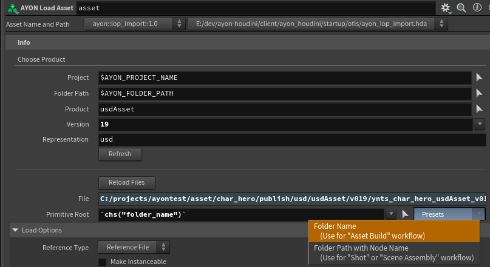
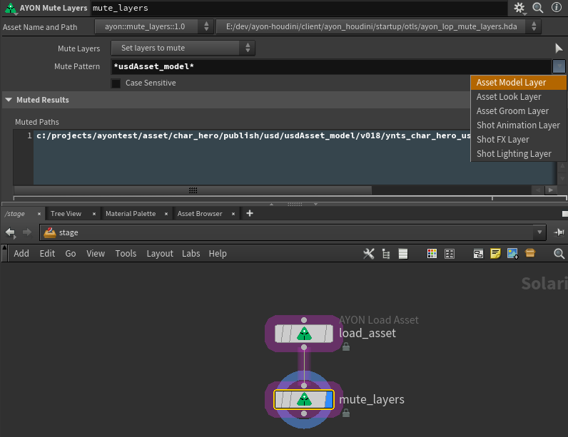

Getting started with AYON USD integration in SideFX Houdini

import ReactMarkdown from "react-markdown";
import versions from '@site/docs/assets/json/Ayon_addons_version.json'


<div class="container">
  <div class="row">
    <div class=".col-sm-"  style={{'margin-right':10+'px'}}>
      <ReactMarkdown>
        {versions.Houdini_Badge}
      </ReactMarkdown>
    </div>
    <div class=".col-sm-" style={{'margin-right':10+'px'}}>
      <ReactMarkdown>
        {versions.Core_Badge}
      </ReactMarkdown>
    </div>
    <div class=".col-sm-" style={{'margin-right':10+'px'}}>
      <ReactMarkdown>
        {versions.USD_Badge}
      </ReactMarkdown>
    </div>
  </div>
</div>

## Loading an asset or shot

See the _[Getting Started | Assets and Shots](addon_usd_artist_get_started.md#assets-and-shots)_ for how they differ and how they are usually loaded (reference versus sublayer).

In Houdini you'll most likely use the dedicated AYON nodes:

- **AYON Load Asset LOP node**, superpowered Reference LOP node.
- **AYON Load Shot LOP node**, superpowered Sublayer LOP node.

## Assets

### Loading an asset

Whether you're loading the asset because you're working on the asset build itself, like look or grooms, OR you are assembling a scene defines what primitive path you load them as.

You would usually *always* **reference** the asset. That is the `usdAsset` product - not the separate layers or contributions.

### Asset Build

When working on the asset build, the asset name requires to remain constant and be in a root prim with the folder name. A trick is to set the Primitive Path on the Load Asset LOP to:

```
/`chs("folder_name")`
```
So that it's always the folder name of the loaded content.

:::note
The `chs("folder_name")` trick only applies to the Ayon Load Asset LOP.
:::

:::tip Easy primitive path presets on AYON Load Asset LOP
Note that the Load Asset LOP provides some quick access to primitive path presets directly in the parameter view.


:::

## Shot Assembly

For scene assembly, like doing bigger scene layouts or even just loading assets into a shot. Since these are also for "shot" workflows (you're building a shot layer) and these sublayer in the different apartments you don't need a single root primitive, you can layout your scene hierarchy any way you want.

As such you usually want each loaded asset to be a unique prim path in your scene - which is the default primitive path for the Load Asset LOP.

```
`chs("folder_path")`/$OS
```

Which translates to the full folder's path and the node's name. However, here you are free to make the hierarchy work in a way that makes sense for your scene assembly structure.

## Assembly Prop (asset scene assembly)

:::info TODO
Document how one could make an asset which is essentially an assembly of other assets. This would still require one root prim (a default primitive) and in large part behaves like Asset Build, but just containing child references of other assets.
:::

## Manage Layers

###  Layer Break

Via **[Layer Break LOP node](https://www.sidefx.com/docs/houdini/nodes/lop/layerbreak.html)**

If you have Houdini Solaris experience you most definitely know the Layer Break node. It is not a USD fundamental concept but a Houdini Solaris specific fundamental.

The layer break, when found in your graph, makes it so that exporting USD files from downstream in that graph will exclude all data above the layer break as opinions. So that for example loading a USD file or writing certain preview opinions can be excluded from your exported scene.

:::info TODO
Explain layer break in more details
:::

### Mute Layers

Via **AYON Mute Layers LOP** or **[Configure Stage LOP node -> Mute Layers](https://www.sidefx.com/docs/houdini/nodes/lop/configurestage.html)**

Muting layers allow you to mute for example your own department layer in a loaded USD asset or shot. This way you avoid that your Houdini Solaris graph after publishing and updating already has your generated data loaded back in at the start of the graph.

:::tip
It is usually (99% of the time) good practice to mute your current department's layer.  
Basically, always mute your own task/department layer to be sure.
:::

Imagine you load a USD Shot containing the layers:

- layout
- animation

Now you're working in lighting and write out your contribution.
The USD shot now has:

- layout
- animation
- lighting

As such, your USD scene is now already loading back in what you wrote out last time - which is if you were to remove e.g. a light from Solaris graph it would still be there, because it's already being loaded in. So, **layer muting** is what you need here. You basically ensure that you mute your OWN layer so that you don't include that while you're working.

::: note Layer Muting is not written to USD files
The state of muting layers is never written into a USD file - it's a run-time effect only on your composed USD stage. As such, you can not e.g. write out the opinion from one layer that another layer must be muted from now on. So, [**you can't save layer muting into USD files**](https://www.sidefx.com/forum/topic/86607/#post-374289). You can however write new opinions onto the prims or hide/deactivate prims you don't want - which will be opinions that you can write out and then effect downstream departments.
:::

The **AYON Mute Layers** lop allows you to easily mute the layers for a particular department by using the context menu to the side of the Mute Patterns parameter:




---

## Implicit versus Explicit Layer Save Paths

This is Houdini-specific and not necessarily a USD feature. Houdini can generate in-memory sublayers or references to USD files that does not exist on disk yet - these are so called anonymous layers that Houdini gives an "implicit save path".

When exporting your USD file (e.g. USD ROP) these implicit layers will be written out from your Houdini scene *in addition* to the USD file path your set on the USD ROP node.

## Publishing with explicit anonymous layers

_What does the publisher do with these anomymous layers?_

Any anonymous layers generated in your current USD layer being exported can directly be published along. The `ayon-houdini` USD publishing logic detects these anonymous layers that will additionally be saved out, generates publish instances for them dynamically. It suffixes the Explicit Save Path's filename to the product name generating additonal products, like `{product_name}_{explict_save_filename}`

So it is totally fine to generate *more* layers at once and have them published - this will work *with* and *without* the [Contribution Workflow](https://community.ynput.io/t/ayon-usd-workflow-guide/1545/2).

However, there may be many cases where you do essentially not want this extra layer. For example, a SOP import by default generates that additional sublayer, but you may *just* want to write out that SOP data completely into the resulting USD file - not in an extra sublayer USD file that is layered into a USD file.

---

:::info TODO
- Explain Implicit Layer Save Paths and the USD ROP settings for flattening
- Houdini USD Rop: Flatten All Layers
:::