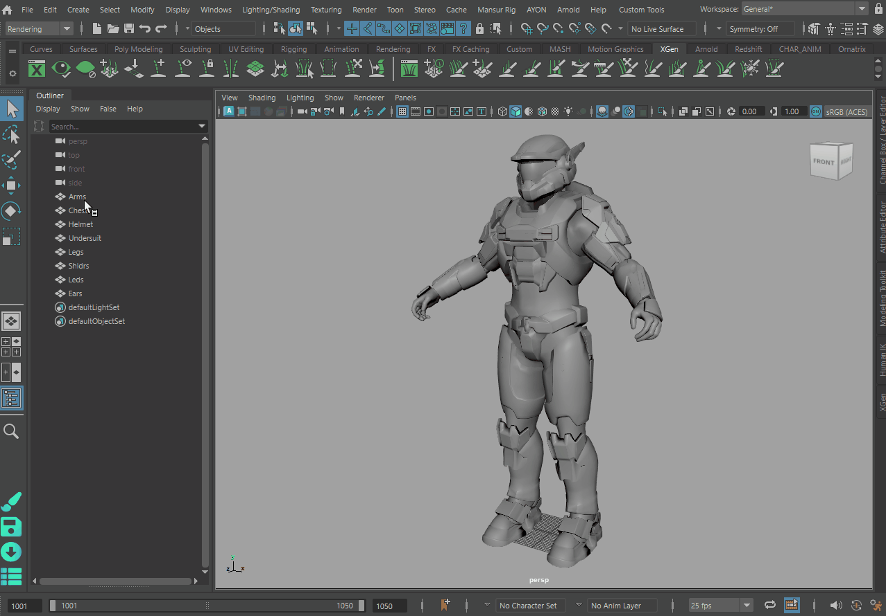
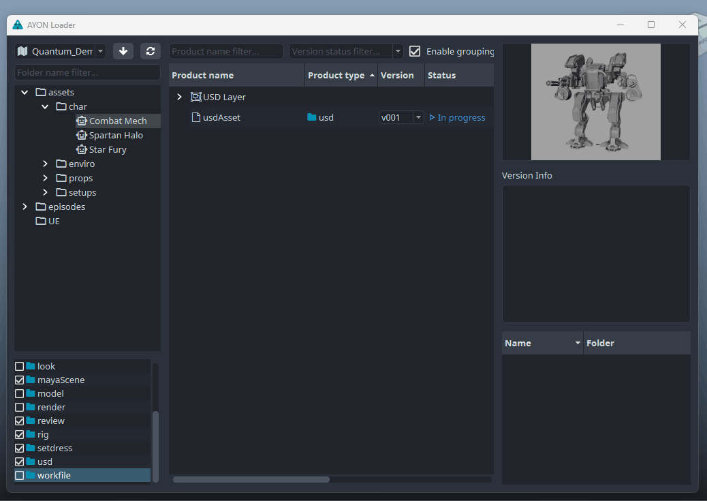
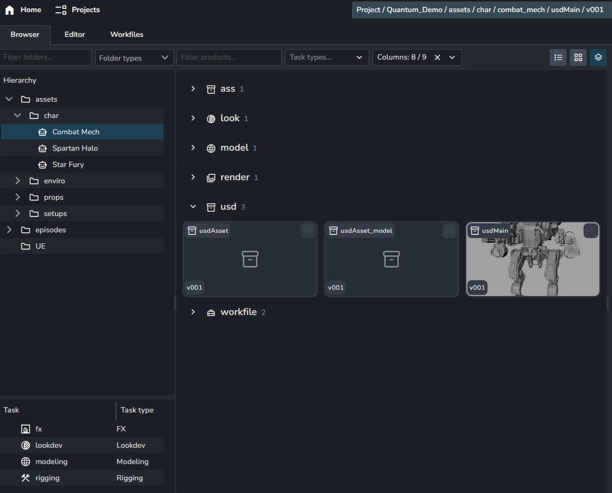
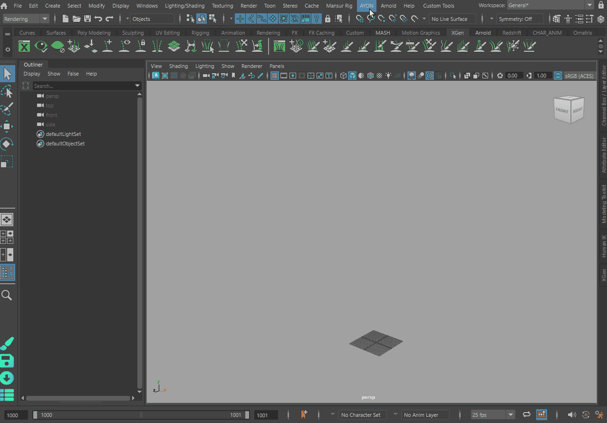

Getting started with AYON USD integration in Autodesk Maya

import ReactMarkdown from "react-markdown";
import versions from '@site/docs/assets/json/Ayon_addons_version.json'


<div class="container">
  <div class="row">
    <div class=".col-sm-"  style={{'margin-right':10+'px'}}>
      <ReactMarkdown>
        {versions.Maya_Badge}
      </ReactMarkdown>
    </div>
    <div class=".col-sm-" style={{'margin-right':10+'px'}}>
      <ReactMarkdown>
        {versions.Core_Badge}
      </ReactMarkdown>
    </div>
    <div class=".col-sm-" style={{'margin-right':10+'px'}}>
      <ReactMarkdown>
        {versions.USD_Badge}
      </ReactMarkdown>
    </div>
  </div>
</div>

## Publishing a model

Any contribution to an asset structure should be within the default root primitive. In AYON, that defaults to the asset's folder name. 

So for folder path `/asset/characters/hero` that root name is `hero`.

The Creator allows to create that asset structure for you by enabling the `Create Asset Structure` checkbox.
Then select your geometry, create and it will directly be conveniently parented to the required hierarchy.



:::tip Create Asset Structure

The Create Asset Structure checkbox will create a root group `{asset}` and child group `geo`.
The root group is namespaced with the variant so that you can easily publish multiple variants from one scene without having naming conflicts on that root node's name which must match the current folder name exactly.

So when working in `/asset/characters/hero` it will create for variant `modelMain`:
```
modelMain:hero/
    geo/
```

Note: If the **Use Selection** checkbox was also enabled then any active selection will be reparented to that `geo` group.
:::

After publishing this asset contribution you will have generated three products:




The AYON asset contribution workflow automates the generation of the layers for you.

Above we published a `usdMain` product, which had USD contributions enabled and targeted the product `usdAsset` with the department layer `model`.

So it generated:

- The target `usdAsset` product.
- The department layer for the `usdAsset`, specifically `usdAsset_{layer}` -> `usdAsset_model`.
- The `usdMain` product is added into that department layer, so the `usdMain` product is in the `usdAsset_model` layer.

Generating the asset structure:
```
usdAsset               (target product)
  - usdAsset_model     (department layer)
    - usdMain          (product of the instance)
```

If you were to publish multiple products at once, say we would generate `usdModelMain` and `usdModelDamaged`. It would then generate:

```
usdAsset               (target product)
  - usdAsset_model     (department layer)
    - usdModelMain
    - usdModelDamaged
```

The [USD Contributions are additive](addon_usd_artist_contribution_workflow.md) and will on each contribution populate and update the target product, like the `usdAsset`.

## Loading USD products

You can load USD products back to Maya into Maya USD Proxy Shapes.



:::note Looking for different loaders?

Different Loaders are being implemented, like referencing the data as regular
maya geometry or "referencing" directly into an existing Maya USD Proxy.

See: [Implement loading directly into a Maya USD Proxy Shape #61](https://github.com/ynput/ayon-maya/pull/61) 

:::

---

:::info TODO
- Explain LookdevX look workflow to publish a look layer with asset contribution
- Explain general shot workflow in Maya
- Explain Rig -> Animation workflow to publish animations for shot workflows.
:::
