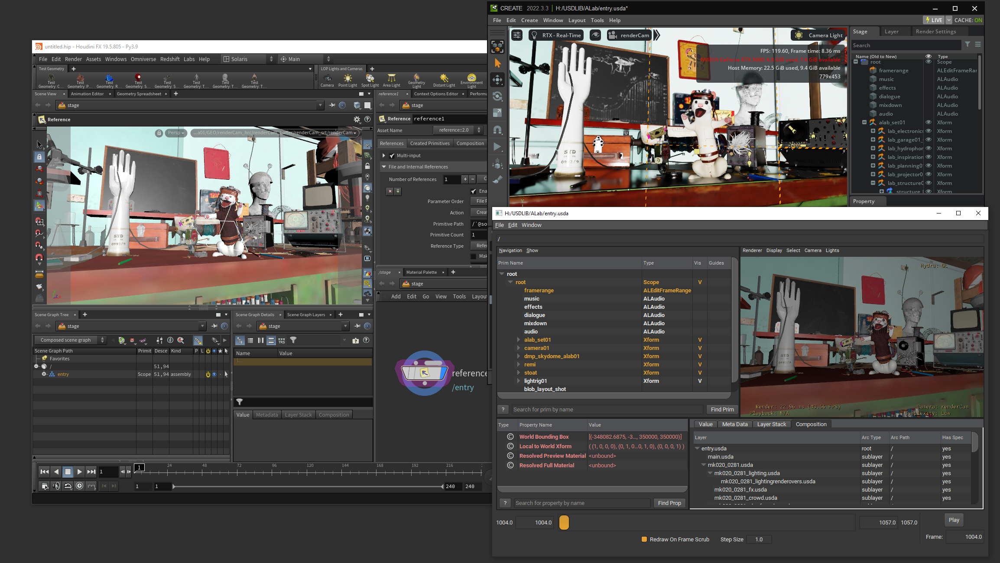
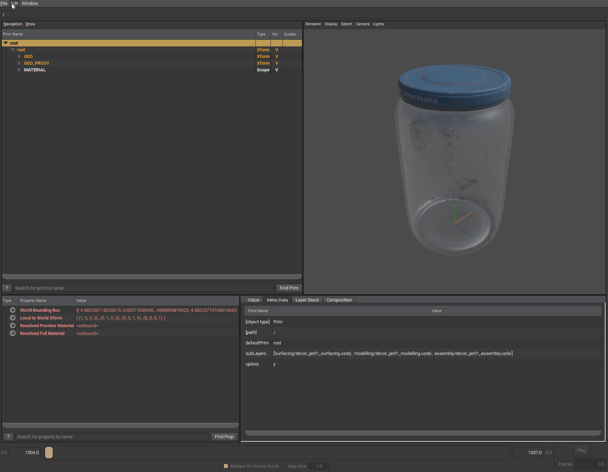
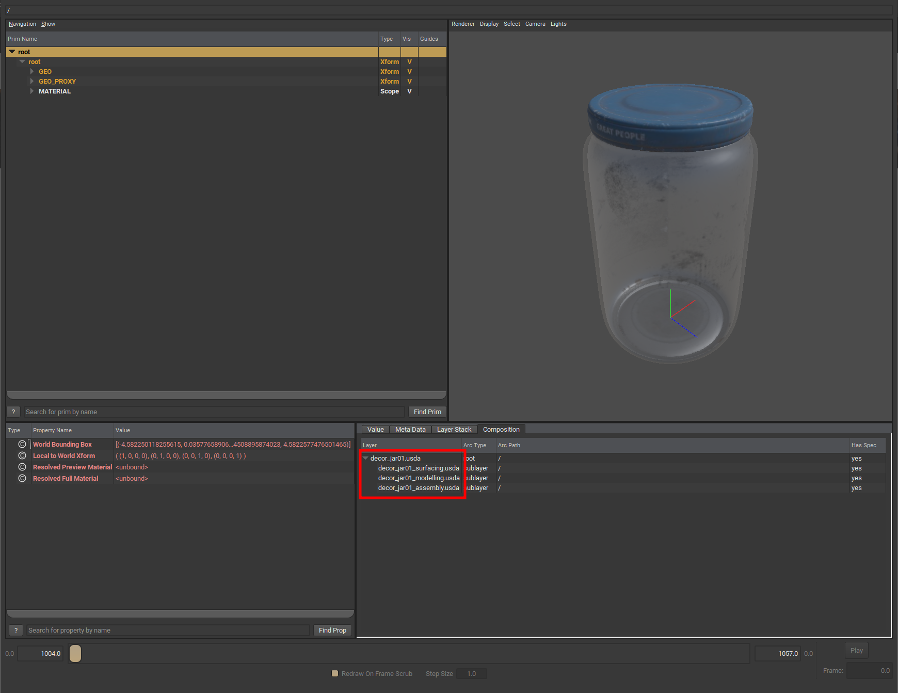
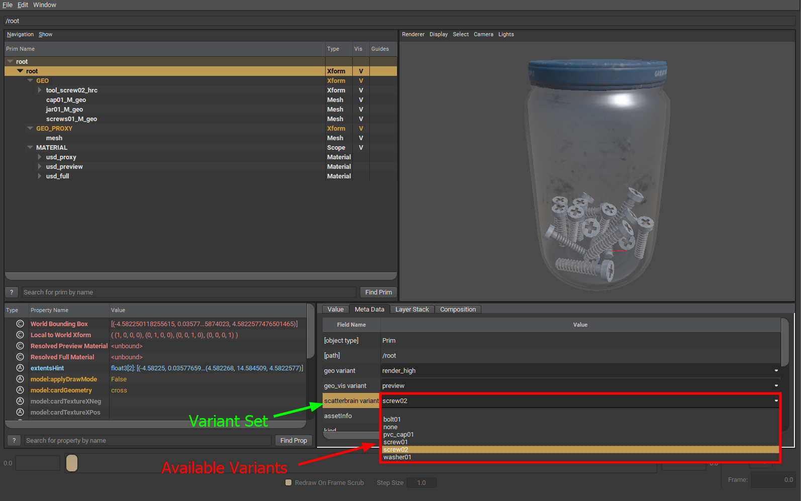
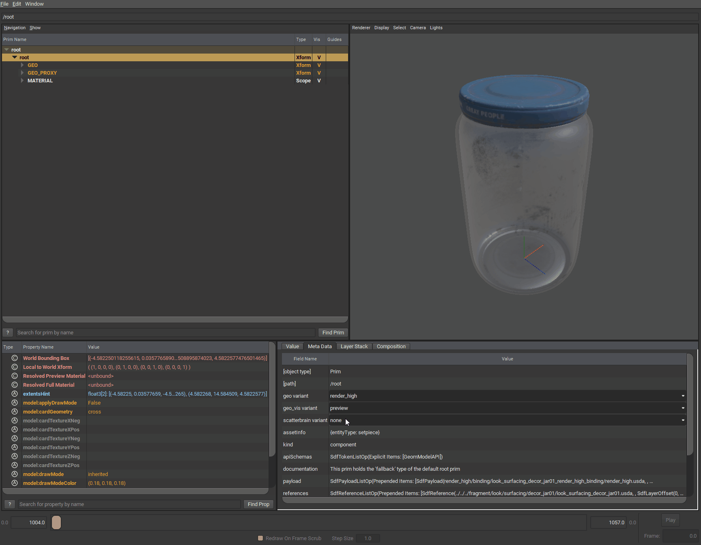
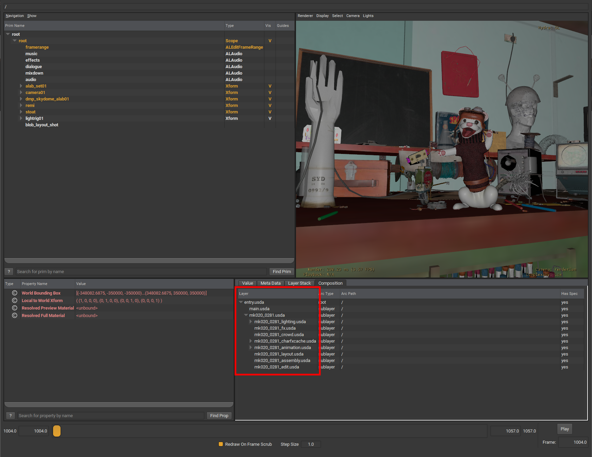

:::info
This page is still under construction 👷🚧🛠️🔜🏗️.
:::

## Why USD
[USD Explainer Guide](https://www.foundry.com/insights/film-tv/usd-explainer-guide) article provides great insights about why USD is very useful

Let me paraphrase it:

Traditional pipeline production was like a waterfall. Each stage has a baking process and in order to change anything, you’d have to go back to the beginning.
On the other hand, USD enables the continuity of decisions throughout the pipeline through live updating these descriptions without baking by allowing creating a higher order USD layer that overrides an attribute or a value without baking existent layers.
So, USD enhances team collaboration as people can work simultaneously on different layers of the same assets or shots. People can override others work in a non destructive manner.

## What is USD
USD is an ecosystem that provides a powerful file format and Library API.
- USD file format can represent/describe arbitrary 3D data e.g. scene hierarchy, geometry, instancing, material networks, lights, cameras, volumes, coordinate systems, shading nodes.
- USD API defines a set tools that can be adopted by wide range of applications allowing them to interact with USD.

That's how USD earned its name Universal Scene Description as it can "describe" scenes universally regardless of the application that hosts USD, and regardless of the host operating system that hosts that application.

In the following screenshot, I opened [ALab usd scene](https://animallogic.com/alab/) in different applications, Houdini, Omniverse and Usdview. 

## What is a USD Asset
A USD content structured in a way that's favorable for asset exchange.
It provides many features: 
- Load/unload the asset
- Have different layers to hold data from different departments
    e.g. model. material, fx, lighting, animation
- Allow each layer to have switchable variants

### Load and Unload
Unload the asset to make it appear like an empty folder, this can be very helpful to make the scene lighter. you'd typically get benefit from it when assembling scenes.

### Different Layers
This jar asset consists of three layers:
- surfacing 
- modeling
- assembly

### Variants
Assets can have multiple variant sets but only one variant for each variant set can be active at a time.

## What is a USD Shot
A USD file that structured in a way that's favorable for shot exchange.
It combines different layers from different departments.

