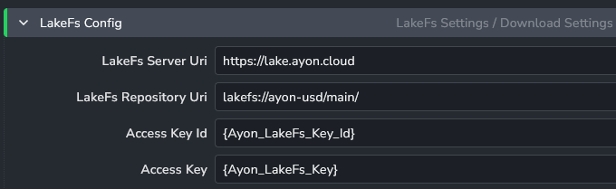
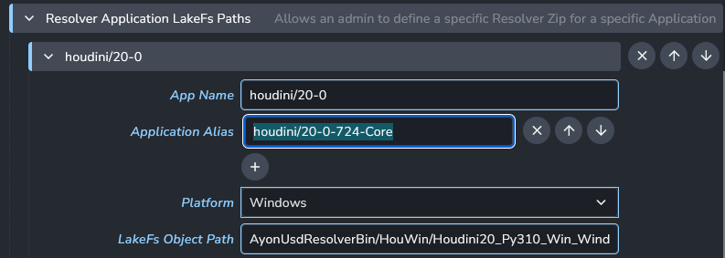

import ReactMarkdown from "react-markdown";
import versions from '@site/docs/assets/json/Ayon_addons_version.json'

<ReactMarkdown>
  {versions.USD_Badge}
</ReactMarkdown>

Using the AYON USD Resolver requires some small steps to enable the full
usage of the AYON Entity URI in USD throughout AYON and have the resolver
downloaded and configured.

## Enabling the AYON USD Resolver

1. Install the `ayon-usd` addon, and enable it in your bundle.
2. Configure the LakeFS settings to use the right AYON USD resolver for your applications.

:::tip Want to learn more about what the AYON USD Resolver is?

The AYON USD Resolver artist documentation provides more details on what it is and how it works (from a simplified perspective).

:::

### AYON USD LakeFS Settings

The `ayon-usd` addon is able to download and activate a matching AYON USD 
Resolver automatically for an application. These are distributed from compiled binaries that we provide for multiple recent versions of major DCCs, like Houdini and Maya. 

This configuration requires access to the server with an access key and a
configuration to the server.



:::note Access Keys and URIs

These are currently not public, however they are provided upon request.

:::

:::tip Application aliases

You can configure additional application aliases for which the resolver matches
and should be downloaded and activated for.



This allows you to manage a single entry for multiple application variants.

:::

## Enabling AYON Entity URIs

To enable publishing and loading of AYON Entity URIs in your project you need to enable:

#### core
```
ayon+settings://core/publish/ExtractUSDAssetContribution/use_ayon_entity_uri
ayon+settings://core/publish/ExtractUSDLayerContribution/use_ayon_entity_uri
```

#### houdini
```
ayon+settings://houdini/load/LOPLoadAssetLoader/use_ayon_entity_uri
ayon+settings://houdini/load/LOPLoadShotLoader/use_ayon_entity_uri
ayon+settings://houdini/load/USDSublayerLoader/use_ayon_entity_uri
ayon+settings://houdini/load/USDReferenceLoader/use_ayon_entity_uri
ayon+settings://houdini/load/SopUsdImportLoader/use_ayon_entity_uri
```

#### maya
```
ayon+settings://maya/load/MayaUsdLoader/use_ayon_entity_uri
```

:::tip Want to enable for only some projects?

The setting URLs shared above link to the Studio Setting, but these same 
toggles are available in project settings to enable/disable the usage of 
AYON Entity URIs only in a specific project.

:::

## Pinning

The AYON USD Resolver supports **pinning**, mapping an entity URI to a 
resulting path without requiring a server connection. This is crucial for
(large) renderfarms to avoid the many resolves and server queries degrading
the server's performance.

**TODO** Explain how the pinning works technically and what env vars will be set to
enable pinning in the resolver.

## API and Technical References

Looking for more technical documentation? The [AYON-USD Resolver repository](https://github.com/ynput/ayon-usd-resolver) contains more details about the resolver itself and provides a link to the [AYON USD Resolver API documentation](https://ynput.github.io/ayon-usd-resolver/index.html).