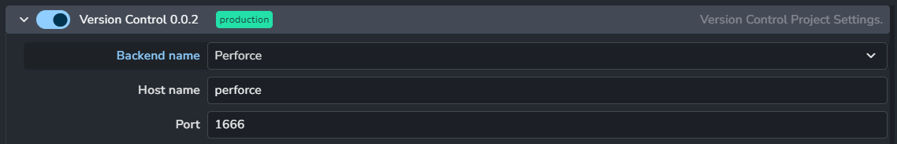
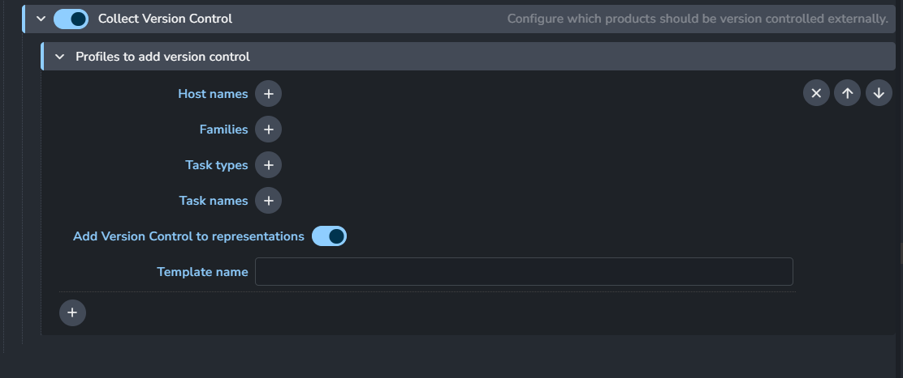

import ReactMarkdown from "react-markdown";
import versions from '@site/docs/assets/json/Ayon_addons_version.json'

<ReactMarkdown>
    {versions.VersionControl_Badge}
</ReactMarkdown>

## Settings

- **Backend name:** List of active version control systems. 
- **Host name:** Pipeline integration name for the backend name.
- **Port:** port number that perforce server uses. 
  :::info
  By default, The server url for perforce is expected to be `http://localhost:{Port}`.
  Keep in mind that the addon sets the URL to `PERFORCE_WEBSERVER_URL` environment variable.
  :::

## Publish Plugins

### Collect Version Control

Profiles: 
- Host names
- Families
- Task Types
- Task names
- Add Version Control to representations
- **Template name:** Name from Anatomy to provide path and name of committed file.

