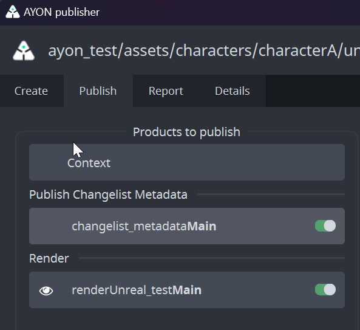

:::tip
Currently, the addon implements basic Perforce support inside of Unreal.
:::

## Get Started

### User Setup

:::info Perforce Workspace
It is expected that P4 workspaces would be setup and existed on artists machines.

Initial checkout from Perforce should be done by P4V tool. 
:::

> Settings Location: `ayon+settings://version_control/local_setting?project={project_name}&site={site_id}`

You'd need to setup your Perforce site settings: user name, password and path to existing configured Perforce workspace.

### Launch Unreal with version control enabled

When starting Unreal via AYON Launcher, a pop window will show up before Unreal launch allows you to sync to specific a change list.

Any line with changelist could be selected and synched by `Sync to` button. When synching process finishes, it will be highlighted under the list of changes.

## How Perforce support works

### Workflow

Perforce doesn't replace regular AYON publishing.
Because commit changes to perforce and publish to AYON are two separate actions.
And, you can do both for the same asset!

So for example, you can use AYON to publish assets and use perforce to setup and version control your scene.

Also, AYON will create `changelist_metadata` product by default in your Unreal Scene.
`changelist_metadata` product highlights the last existing `change list` id at the time of publishing
This product must be enabled to trigger usage of Perforce on the Deadline.
Without it Deadline will just render from current state of Unreal project file.

### Commit Strategy

Any manual commits done in Unreal projects via `Unreal editor official Perforce tool` or via `P4V` won't be add to AYON published products.
Unlike publishing to AYON via AYON publisher will commit to Perforce any uncommitted changes and then publish your work to AYON.

| Inside Unreal | Visible in Perforce | Visible in AYON |
|--|--|--|
| commit manually | ✅ | |
| commit manually | ✅ | |
| Publish to AYON | ✅ | ✅ |
| commit manually | ✅ | |
| Publish to AYON | ✅ | ✅ |

### `Publish to AYON` Process

- Commit to Perforce any uncommitted changes.
- Publish `changelist metadata` product as json file.
- Publish your files to AYON.
  
:::info
If you are publishing the same asset that you are pushing to perforce, then AYON publish will be more like taking a snapshot of that asset at a particular `change list` and save it like any other published assets. which makes it available for other DCCs as well.
:::

### Deadline

<!-- TODO: This should go to the admin docs.
We should add here instructions for artist about submitting to deadline while using Perforce, explain how it works
and how to modify the change list for a particular render.

`changelist_metadata` replaces `workfile` as there are no versioned Unreal projects (because of size).
 -->

:::info
Current Deadline implementation requires `P4` depots to be of type 'stream' and workspace to be assigned to a stream.
:::

Unreal Perforce Deadline Support requires our [custom `UnrealEngine5` deadline plugin](https://github.com/ynput/ayon-deadline/tree/develop/client/ayon_deadline/repository/custom/plugins/UnrealEngine5) which implements `PreLoad` scripts that syncs your project to `change list` id within the `changelist_metadata` before rendering.

Our custom `UnrealEngine5` deadline plugin expects the following environment variables for each Deadline workers:
- `P4PORT`: Port number that perforce server uses `http://localhost:{Port}`.
- `P4USER`: Perforce user.
- `P4PASSWD`: Password of the given user.

:::tip Setting Environment Variables
Environment variables could be set locally on the worker or be set on studio or project wise by admin via [application settings](addon_applications_admin.md#applications-definitions).
:::
