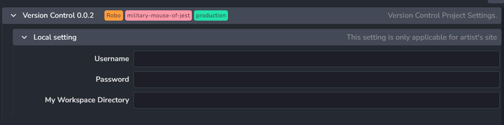
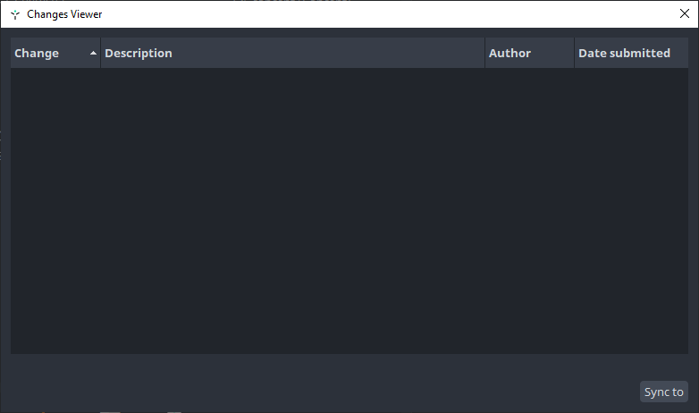

:::tip
Currently, the addon implements basic Perforce support inside of Unreal.
:::

## Get Started

### User Setup

:::info Perforce Workspace
It is expected that P4 workspaces would be setup and existed on artists machines.
:::

Perforce site settings user name, password and workspace directory.

### Launch Unreal with version control enabled

When starting Unreal via AYON Launcher, a pop window will show up before Unreal launch allows you to sync to specific a change list.

## How Perforce support works

:::tip
We assume that you always on the latest change list.
:::

## Workflows

Perforce doesn't replace regular AYON publishing.
Because commit changes to perforce and publish to AYON are two separate actions.
And, you can do both for the same asset!

So for example, you can use AYON to publish assets and use perforce to setup and version control your scene.

### Commit Strategy

| Unreal | Visible in AYON |
|--|--|
| commit | |
| commit | |
| Publish to AYON | ✅ |
| commit | |
| Publish to AYON | ✅ |

### `Publish to AYON` Process

When having any workfile changes while workfile instance is enabled, AYON will commit them automatically before publishing.

Publish `change list` info as Json file.
Publish your files to AYON.
if you are publishing the same asset that you are pushing to perforce, then AYON publish will be more like taking a snapshot of that asset at a particular `change list` and save it like any other published assets. which makes it available for other DCCs as well.

### Deadline

:::info
Current Deadline implementation requires P4 depots to be of type 'stream' and workspace to be assigned to a stream.
:::

When having any workfile changes while workfile instance is enabled, AYON will commit them automatically before sending the deadline job.

<!-- TODO: Answer the following questions
## FAQ

### Do the addon support submitting a deadline job with a specific change list number?

### What happens when I submit a render, pause it, do some commits in perforce and requeue the render job? -->
