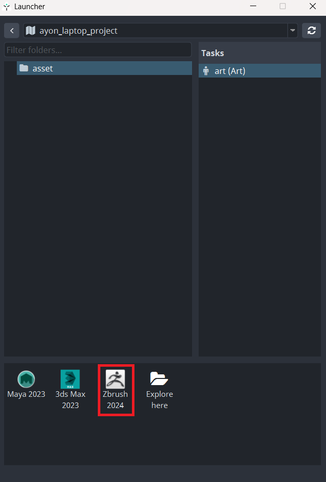
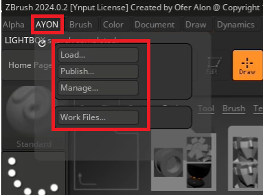
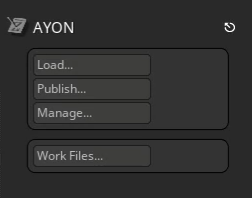

import ReactMarkdown from "react-markdown";
import versions from '@site/docs/assets/json/Ayon_addons_version.json'

<ReactMarkdown>
{versions.Zbrush_Badge}
</ReactMarkdown>

import Tabs from '@theme/Tabs';
import TabItem from '@theme/TabItem';

## First Steps With AYON

Locate **AYON Icon** in the OS tray (if hidden dive in the tray toolbar).

> If you cannot locate the AYON icon ...it is not probably running so check [Getting Started](artist_getting_started.md) first.

By clicking the icon  ```AYON Menu``` rolls out.


Choose ```AYON Menu > Launcher``` to open the ```Launcher``` window.

When opened you can **choose** the **project** to work in from the list. Then choose the particular **asset** you want to work on then choose **task**
and finally **run zbrush by its icon** in the tools.



:::note Launcher Content
The list of available projects, assets, tasks and tools will differ according to your Studio and need to be set in advance by supervisor/admin.
:::

## Running in the Zbrush

If Zbrush has been launched via AYON Launcher there should be **AYON Menu** visible in Zbrush **top header** after start.


The **AYON Menu** is moveable which allows user to drag it to the right corner.

import ayonMenuVideo from './assets/video/zbrush_ayon_menu_draggable.mp4'


<video controls style={{width: "75%" }}>
  <source src={ayonMenuVideo}/>
</video>


The AYON menu located in the right corner would look like this:



This is the core functional area for you as a user. Most of your actions will take place here.


:::note AYON Menu
User should use this menu exclusively for **Opening/Saving** when dealing with work files not standard ```File Menu``` even though user still being able perform file operations via this menu but preferably just performing quick saves during work session not saving actual workfile versions.
:::

## Working With Scene Files

In AYON menu first go to ```Work Files``` menu item so **Work Files  Window** shows up.

 Here you can perform Save / Load actions as you would normally do with ```Save As ``` and ```Open``` in the Zbrush ```File Tool``` and navigate to different project components like assets, tasks, workfiles etc.


You first choose particular asset and assigned task and corresponding workfile you would like to open.

If not any workfile present simply hit ```Save As``` and keep ```Subversion``` empty and hit ```Ok```.

AYON correctly names it and add version to the workfile. This basically happens whenever user trigger ```Save As``` action. Resulting into incremental version numbers like

```workfileName_v001```

```workfileName_v002```

 etc.

 Basically meaning user is free of guessing what is the correct naming and other necessities to keep everything in order and managed.

## Understanding Context

As seen on our example AYON created pretty first workfile and named it ```il_modelCreature_head_v002.zpr``` meaning it sits in the Project ```il``` being it ```modelCreature``` folder path and workfile being ```head``` task and obviously ```v002``` telling user its first existing version of this workfile.

It is good to be aware that whenever you as a user choose ```folder path``` and ```task``` you happen to be in so called **context** meaning that all user actions are in relation with particular ```folder path```. This could be quickly seen in host application header and ```AYON Menu``` and its accompanying tools.


> Whenever you choose different ```folder path``` and its ```task``` in **Work Files window** you are basically changing context to the current asset/task you have chosen.

This concludes the basics of working with workfiles in Zbrush using AYON and its tools. Following chapters will cover other aspects like creating multiple folder paths and their publishing for later usage in the production.

---

## Creating and Publishing Instances

:::warning Important
Before proceeding further please check [Glossary](artist_concepts.md) and [What Is Publishing?](artist_publish.md) So you have clear idea about terminology.
:::
