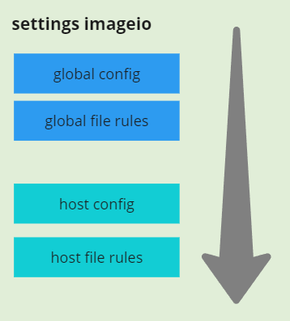
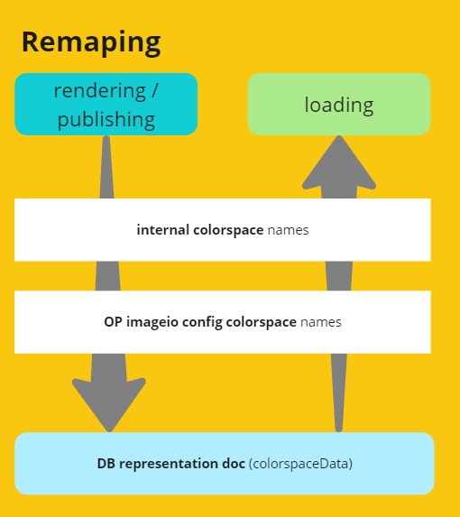
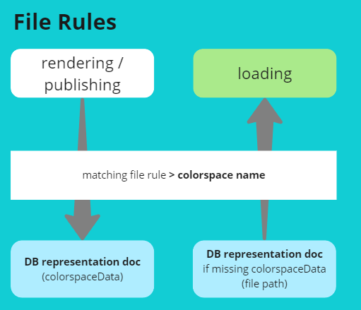
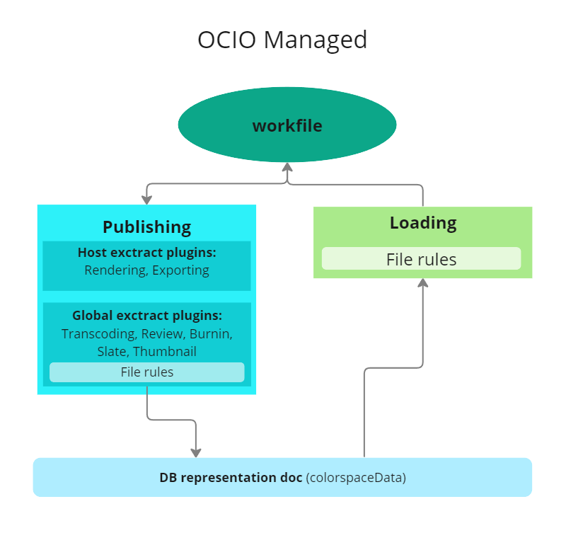
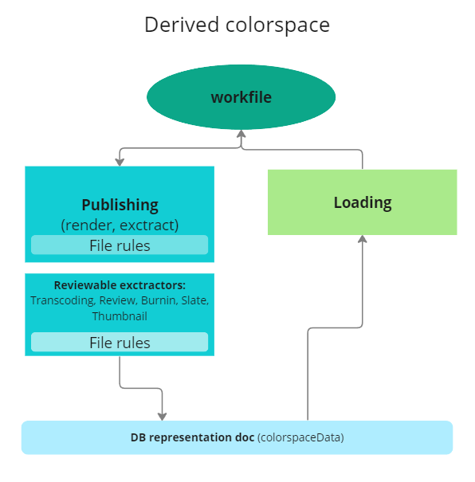
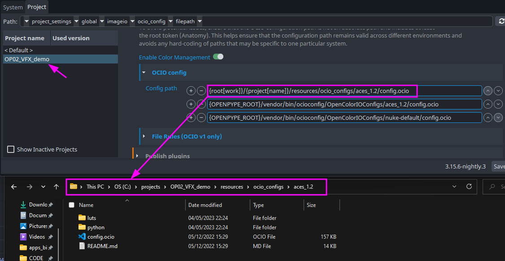
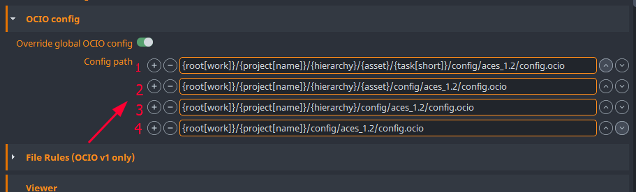
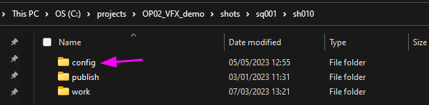
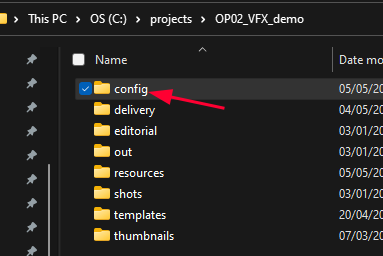
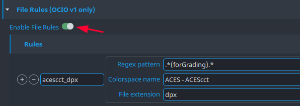

import ReactMarkdown from "react-markdown";
import versions from '@site/docs/assets/json/Ayon_addons_version.json'

<ReactMarkdown>
{versions.ThirdPart_Badge}
</ReactMarkdown>

import Tabs from '@theme/Tabs';
import TabItem from '@theme/TabItem';

:::important Actual limitations

This is a work in progress. The current implementation is a bit limited and will be improved in the future.
Currently only limited amount of hosts are supported and only publishing is implemented. Loading is not yet supported.

:::

## Key concept of colorspace distribution

### Host groups

Hosts are divided into 3 groups regarding the level of control of a DCC's native colorspace manageability.

1. **OCIO managed** - This application's colorspace management can be controlled through AYON settings. Specifically, the configured OpenColorIO (OCIO) config path is utilized in the application's workfile. Additionally, the File Rules feature can be leveraged for both publishing and loading procedures.

2. **Remapped internal colorspace** - This application includes internal color management functionality, but it does not offer external control over this feature. To address this limitation, AYON uses mapping rules to remap the native colorspace names used in the internal color management system to the OpenColorIO (OCIO) color management system. Remapping feature is used in Publishing and Loading procedures.

3. **Derived colorspace** - This application does not include any built-in color management capabilities, AYON offers a solution to this limitation by deriving valid colorspace names for the OpenColorIO (OCIO) color management system from file paths, using File Rules feature (publishing only).

### Comparison of host group features

| **Implementation**           |    **Publishing**    |      **Loading**     |    **Workfile**    |
|------------------------------|:--------------------:|:--------------------:|:------------------:|
| OCIO managed                 | :heavy_check_mark:   | :heavy_check_mark:   | :heavy_check_mark: |
| Remapped internal colorspace | Remap internal->OCIO | Remap OCIO->internal |                    |
| Derived colorspace           | File rules only      |                      |                    |

| Host            | OCIO | Remapped | Derived |
| --------------- | :--: | :------: | :-- --: |
| Maya            |  x   |          |         |
| Hiero           |  x   |          |         |
| Fusion          |  x   |          |         |
| Harmony         |  x   |          |         |
| Houdini         |  x   |          |         |
| Nuke            |  x   |          |         |
| Unreal          |  x   |          |         |
| Blender         |  x   |          |         |
| AfterEffects    |  x   |          |         |
| Resolve         |  x   |          |         |
| Photoshop       |      |     x    |         |
| Flame           |      |     x    |         |
| TV Paint        |      |     x    |         |
| TrayPublisher   |      |          |    x    |
| CelAction       |      |          |    x    |
| WebPublisher    |      |          |    x    |

### Host specific overrides

Each project can have its own global config.ocio file. This file is used as a base for all hosts. Each host can override this config.ocio file with its own config.ocio file but it is recommended to derivate it from the global config.ocio file. This way the continuity of the color management is preserved.

Host can also override the global file rules. This is useful when multiple hosts has different colorspace applicable the same file rule. For example, Nuke can have different colorspace for renders and Maya can have different colorspace for renders. In this case, the global file rule can be overridden by the host file rule.

### Host specific remapping

Remapping is used to remap the native colorspace names used in the internal color management system to the OpenColorIO (OCIO) color management system. Remapping feature is used in Publishing and Loading procedures.

### Host specific file rules

File rules feature is mainly supported for OCIO v1. It is used to derive colorspace from the file path. This feature is used mainly during in publishing. The feature is activated during Loading only if a representation is not having `colorspaceData` key.

### Host level colorspace distribution workflow
#### OCIO managed

When the host uses the OCIO config from AYON settings, the colorspace distribution is most accurately rendered. File rules come into play only during transcoding or when creating reviewable files. Upon publishing, the resulting colorspace distribution is indicated by the [**colorspaceData**](dev_colorspace.md#data-model) key in the representation document. If the representation lacks a [**colorspaceData**](dev_colorspace.md#data-model) key, the loading process resorts to File rules.

#### Remapped internal colorspace

When the host uses the internal colorspace, the colorspace distribution employs the remapping rules which operate at the host level. File rules are only used during transcoding or when creating reviewable files. When publishing, the resulting colorspace distribution is indicated by the [**colorspaceData**](dev_colorspace.md#data-model) key in the representation document.

During loading of the representation, there is a chance that the [**colorspaceData**](dev_colorspace.md#data-model) key might be missing. In such a scenario, the loading process follows two steps. Firstly if necessary, it resorts to File rules matching, and then, it remaps the colorspace to match the internal colorspace names.

#### Derived colorspace

When the host does not have any internal colorspace management, the colorspace distribution is derived from the file path. File rules are only used during transcoding or when creating reviewable files. When publishing, the resulting colorspace distribution is indicated by the [**colorspaceData**](dev_colorspace.md#data-model) key in the representation document.

Since the host does not have any internal colorspace management, the loading process is ignoring [**colorspaceData**](dev_colorspace.md#data-model).

## Configuration of global settings
### Activating colorspace management on project

Colorspace management and distribution is disabled by default all project at the global level. Once it is enabled it is applied to all hosts. It is possible to override the global settings at the [host level](#configuration-of-host-settings).

:::warning Studio default

Please be aware that activating the studio default project colorspace management will cause all projects to inherit the activation and this may potentially break some of the existing projects.

:::

### Config order

It's worth noting that the order in which the configuration paths are defined matters, with higher priority given to paths listed earlier in the configuration list. In the example image above, the production team decided to switch a project to use the `nuke-default` ([v1, linear, sRGB, rec709](https://opencolorio.readthedocs.io/en/latest/configurations/nuke_default.html)) OCIO config. This implies that all hosts will implement this config for publishing and loading within the [mentioned scope](#host-level-colorspace-distribution-workflow).

### Project level config

To avoid potential issues, ensure that the OCIO configuration path is not an absolute path and includes at least
the root token (Anatomy). This helps ensure that the configuration path remains valid across different environments and
avoids any hard-coding of paths that may be specific to one particular system.

The example image above shows project level OCIO config file. This way the production is securing that any future changes on studio OCIO config file will not break any of old projects. It is recommended to use the project's OCIO config as starting point for all derivations of host level OCIO configs.

### File rules activation
File rules are disabled by default. Once it is enabled it is applied to all hosts. It is possible to override them at the [host level](#configuration-of-host-settings).

## Configuration of host settings
### OCIO config override

The image above illustrates a possible use case with four levels defined, starting from the task-related configuration down to the project-level OCIO config file. The API functionality operates by testing if a file exists at the given path. If no file exists, the path is skipped, and the next path is tested down the order. This allows for the overriding of the OCIO config at any level.

Example of task level file structure.

Example of shot level file structure.

Example of shots sequence level file structure.

Example of project level file structure.

### OCIO config versioning

During production, it may be necessary to modify the OCIO config files. We recommend using a versioning system to keep track of changes. The path to the config file version used during publishing will be stored in the representation document. This allows you to track which version of the OCIO config file was used during publishing.

:::warning

Please note that since representation data might be pointing at older versions, it's essential to maintain the same file path to avoid any confusion. Therefore, make sure that the path in the representation document points to the folder that contains all versions of the OCIO config file.

:::

#### OCIO config description

We recommend using the `description` field to store information about the changes made to the OCIO config file. The file is in YAML format, and it's possible to use multiple lines in the `description` field only if `|` is used at the end of the line. Additionally, we add the `origin` and `changes` fields to the file. This allows you to track the origin of the OCIO config file and the changes made to it.

### File rules activation

If the global File rules are disabled, but the host level File rules are enabled, then the host level rules will be applied. However, if the global File rules are enabled and the host level File rules are disabled, then the global rules will be applied.

## Upgrading from previous versions
Upgrading may not always be a straightforward process, and we understand that its complexity can be frustrating. We strive to keep the upgrade process as simple as possible and to avoid any breaking changes. However, sometimes it's not possible, and we may need to introduce some breaking changes. This section aims to help you understand what needs to be done after the upgrade.

### 1. Example of usage - [DCCs](#used-acronyms) are set to native linear rec709 colorspace

#### Actual configuration:
A studio is having on-going production with project configured imageio at op 3.15. All hosts are set to `linear rec709` space with following combination of settings:
- Nuke host [**CMS**](#used-acronyms) custom config was not activated and it used `nuke-default`
- Maya was set to internal ocio config in v2 `maya-scene-linear-rec709`
- Global imageio custom config was set to `nuke-default`

#### Required action after the upgrade:
No need to do anything. Be aware that once the Global [**CMS**](#used-acronyms) is enabled, the default config is set to `aces_1.2` and it will be applied to all hosts. If you want to keep the same behavior as before the upgrade, you need to set the Global [**CMS**](#used-acronyms) to `nuke-default` config or disable it.

### 2. Example of usage - [DCCs](#used-acronyms) are set to native ACES OCIO config
#### Actual configuration:
A studio is having on-going production with project configured imageio at op 3.15. All hosts are set to `ACES 1.2` space with following combination of settings:
   - Nuke host [**CMS**](#used-acronyms) custom config was not activated and it used OCIO with provided `aces_1.2`
   - Maya was set to internal ocio config in v2 `maya-aces_1.2`
   - Global imageio custom config was set to distributed `aces_1.2`

#### Required action after the upgrade:
No need to do anything. Be aware that once the Global [**CMS**](#used-acronyms) is enabled, the default config is set to `aces_1.2` and it will be applied to all hosts. If you want to keep the same behavior as before the upgrade, you need to set the Global [**CMS**](#used-acronyms) to `aces_1.2` config or disable it.

### 3. Example of usage - Global custom ocio config used
#### Actual configuration:
A studio is having on-going production with project configured imageio at op 3.15. All hosts are set to custom config path via OCIO env var with following combination of settings:
   - Nuke host [**CMS**](#used-acronyms) is having defined creator nodes to corresponding colorspace name found in provided OCIO config
   - Maya is having activated OCIO v2 via OCIO env var and it is using provided OCIO config
   - Global File rules were defined to:
        - capture all render family products to be **acescg** colorspace
        - capture all plates family products to be **acescc** colorspace
        - capture all mp4 extensions to be **Output Rec.709** colorspace

#### Required action after the upgrade:
1. Enable Global [**CMS**](#used-acronyms).
2. Add Studio OCIO config into any folder within Root defined storage (the suggested approach will enhance the security of the distribution, ensuring its smooth operation across various platforms and workflows).
3. Add path to the project config into Global [**CMS**](#used-acronyms) or host config paths to first position from top. Path should not be absolute and should point at Anatomy root storage template - e.g. `{root[work]}/configs/ocio/aces_1.2/config.ocio`
4. Enable Global File rules.

### Used acronyms:
-  **CMS**: Color Management Settings
-  **DCC**: Digital Content Creation software
