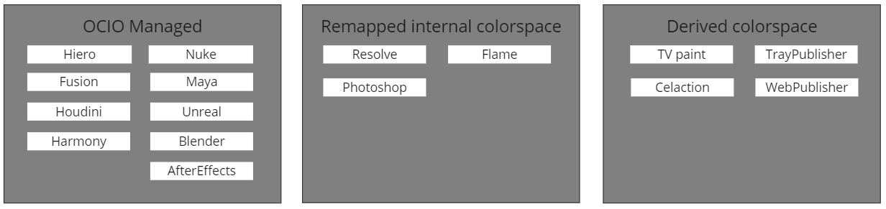

import Tabs from '@theme/Tabs';
import TabItem from '@theme/TabItem';

:::important Actual limitations

This is a work in progress. The current implementation is a bit limited and will be improved in the future.
Currently only limited amount of hosts are supported and only publishing is implemented. Loading is not yet supported.

:::

## Key concept of colorspace distribution

### Host groups
Hosts are divided into 3 groups regarding the level of control of a DCC's native colorspace manageability.

1. **OCIO managed** - This application's colorspace management can be controlled through OpenPype settings. Specifically, the configured OpenColorIO (OCIO) config path is utilized in the application's workfile. Additionally, the File Rules feature can be leveraged for both publishing and loading procedures.

2. **Remapped internal colorspace** - This application includes internal color management functionality, but it does not offer external control over this feature. To address this limitation, OpenPype uses mapping rules to remap the native colorspace names used in the internal color management system to the OpenColorIO (OCIO) color management system. Remapping feature is used in Publishing and Loading procedures.

3. **Derived from OCIO** - This application does not include any built-in color management capabilities, OpenPype offers a solution to this limitation by deriving valid colorspace names for the OpenColorIO (OCIO) color management system from file paths, using File Rules feature only during Publishing.

### How does hosts overrides work
Each project can have its own global config.ocio file. This file is used as a base for all hosts. Each host can override this config.ocio file with its own config.ocio file but it is recommended to derivate it from the global config.ocio file. This way the continuity of the color management is preserved.

Host can also override the global file rules. This is useful when multiple hosts has different colorspace applicable the same file rule. For example, Nuke can have different colorspace for renders and Maya can have different colorspace for renders. In this case, the global file rule can be overridden by the host file rule.

### How does remapping work
Remapping is used to remap the native colorspace names used in the internal color management system to the OpenColorIO (OCIO) color management system. Remapping feature is used in Publishing and Loading procedures.

### How does file rules work
File rules feature is mainly supported for OCIO v1. It is used to derive colorspace from the file path. This feature is used mainly during in publishing. The feature is activated during Loading only if a representation is not having `colorspaceData` key.

### How does colorspace distribution work at host level
#### OCIO managed

#### Remapped internal colorspace

#### Derived from OCIO

## Configuration of global settings

Text and images about the configuration of global settings.

## Configuration of host settings

Text and images about the configuration of host settings.

## Upgrading from previous versions
**Acronyms**:
-  **CMS**: Color Management Settings

### Usecase 1 - DCCs are set to native linear rec709 colorspace

#### Actual configuration:
A studio is having on-going production with project configured imageio at op 3.15. All hosts are set to `linear rec709` space with following combination of settings:
- Nuke host **CMS** custom config was not activated and it was used as `nuke-default`
- Maya was set to internal ocio config in v2 `maya-scene-linear-rec709`
- Global imageio custom config was set to `nuke-default`

#### Required action after the upgrade:
Nothing - since default Global **CMS** is disabled

### Usecase 2 - DCCs are set to native ACES OCIO config
#### Actual configuration:
A studio is having on-going production with project configured imageio at op 3.15. All hosts are set to `ACES 1.2` space with following combination of settings:
   - Nuke host **CMS** custom config was not activated and it was used OCIO with provided `aces_1.2`
   - Maya was set to internal ocio config in v2 `maya-aces_1.2`
   - Global imageio custom config was set to distributed `aces_1.2`

#### Required action after the upgrade:
Nothing - since default Global **CMS** is disabled

### Usecase 3 - Global custom ocio config used
#### Actual configuration:
A studio is having on-going production with project configured imageio at op 3.15. All hosts are set to custom config path via OCIO env var with following combination of settings:
   - Nuke host **CMS** is having defined creator nodes to corresponding colorspace name found in provided OCIO config
   - Maya is having activated OCIO v2 via OCIO env var and it is using provided OCIO config
   - Global File rules were defined to:
        - capture all render family subsets to be **acescg** colorspace
        - capture all plates family subsets to be **acescc** colorspace
        - capture all mp4 extensions to be **Output Rec.709** colorspace

#### Required action after the upgrade:
1. Enable Global **CMS**.
2. Add Studio OCIO config into any folder within Root defined storage.
3. Add path to the project config into Global **CMS** or host config paths to first position from top. Path should not be absolute and should point at Anatomy root storage template - a.g. `{root[work]}/configs/ocio/aces_1.2/config.ocio`
