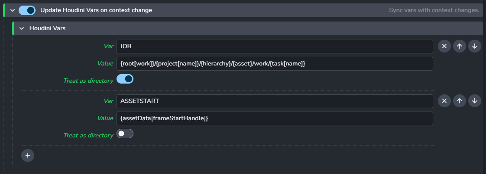
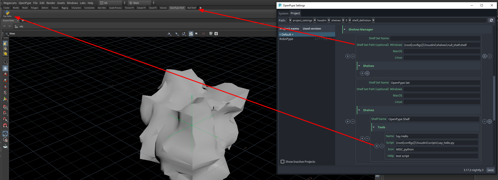
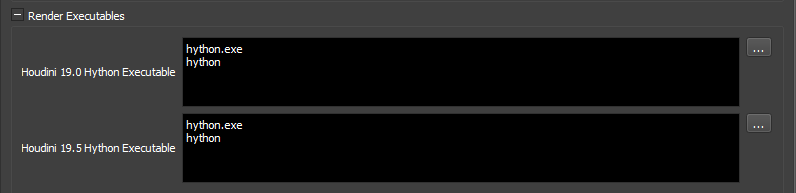
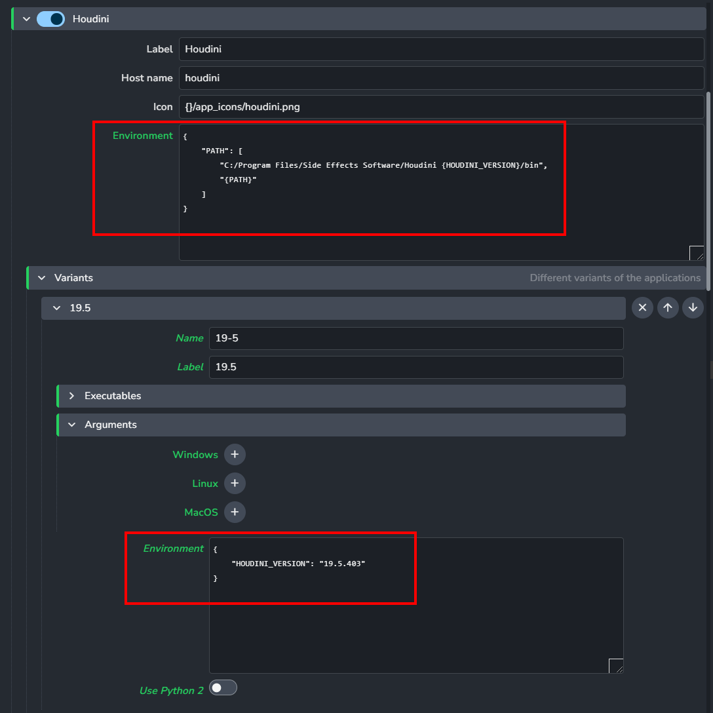

## General
### Update Houdini Vars on context change

Allows admins to have a list of vars (e.g. JOB) with (dynamic) values that will be updated on context changes, e.g. when switching to another asset or task.

Using template keys is supported but formatting keys capitalization variants is not, e.g. `{Asset}` and `{ASSET}` won't work

:::note
If `Treat as directory` toggle is activated, Ayon will consider the given value is a path of a folder.

If the folder does not exist on the context change it will be created by this feature so that the path will always try to point to an existing folder.
:::

Disabling `Update Houdini vars on context change` feature will leave all Houdini vars unmanaged and thus no context update changes will occur.

> If `$JOB` is present in the Houdini var list and has an empty value, Ayon will set its value to `$HIP`

:::note
For consistency reasons we always force all vars to be uppercase.
e.g. `myvar` will be `MYVAR`
:::

## Color Management (ImageIO)

Allows admins to override the global color management settings, check [Host specific overrides](https://ayon.ynput.io/docs/admin_colorspace#host-specific-overrides)

## Shelves Manager
You can add your custom [Shelves](https://www.sidefx.com/docs/houdini/shelf/index.html) into Houdini by setting your shelf sets, shelves and tools in **Houdini -> Shelves Manager**.

The Shelf Set Path is used to load a .shelf file to generate your shelf set. If the path is specified, you don't have to set the shelves and tools.

1. **Shelf set name:** enter the name of the **shelf set** you want to import or create.
2. **Shelf Set Path (optional):** enter the Shelf set path (on Windows, MacOs or Linux) (optional).
3. **(+/-) :** add or delete a **shelf set**.
4. **(+/-) :** add a **shelf** to the **shelf set**.
5. **(+/-) :** add a **tool** to this shelf.
6. **Shelf Name:** enter the **shelf**'s name you want to create.
7. **Name:** enter the **tool** name you want to add to this **shelf**.
8. **Script:** enter the tool's script to import it.
9. **Icon:** add the tool's icon.
10. **Help:** add a help text to the tool. It shows when you rest the cursor on the tool
11. **⇅:** change the **shelf** order into the **shelf set**.
12.  **⇅:** change the **tool** order in it **shelf**.

### Shelves Example

Using template keys is supported but formatting keys capitalization variants is not, e.g. `{Asset}` and `{ASSET}` won't work.

## Creator plugins
Enable or disable the plugins. Some of them have extra options such as defining the default subsets names.

**Plugins list:** Create Alembic Camera, Create Arnold Ass, Create Arnold ROP, Create Composite (Image Sequence), Create Houdini Digital Asset, Create Karma ROP, Create Mantra ROP, Create PointCache (Abc), Create PointCache (Bgeo), Create Redshift Proxy, Create Redshift ROP, Create Review, Create Static Mesh, Create USD (experimental), Create USD render (experimental), Create VDB Cache, Create VRay ROP.

## Publish plugings
Enable or disable the plugins executed at publishing.

**Publish plugins list:** Validate Latest Containers, Validate Mesh is Static, Validate Review Colorspace, Validate Subset Name, Validate Unreal Static Mesh Name,Validate workfile paths settings.

---

## FAQ

### When will we need to modify Houdini addon code ?
We've spent a lot of time making it possible to customize Houdini addon from settings.
e.g. you can add your studio's menus, tools and digital assets from settings. 

Still, you may need to modify Ayon addons only when :  
- Adding/Modifying/Customizing Launch Hooks
- Registering new Callbacks
- Adding/Modifying/Customizing plugins (create, publish, load, Actions)
- Adding a new Ayon launcher tray tool

### How to add my menus, tools and digital assets to Houdini ?
Mostly, you'd only need to update Environment to share these tools with your team. 
e.g., 
- `PYTHONPATH` to add a custom python library path
- `HOUDINI_MENU_PATH` to add a custom menu path
- `HOUDINI_OTL_PATH` to add a custom digital assets path

Ayon allows you to add environment variables as:
1. Global environment variable (it wil be available for all DCCs)
2. Application specific (it wil be available for a particular DCC)
3. Application variant specific (it wil be available for a particular DCC version)
4. Tool (it wil be available on demand per project per asset from project Editor)

For a detailed guide visit: [Ayon/Openpype Env Vars and Tools Configuration Explained](https://community.ynput.io/t/openpype-env-vars-and-tools-configuration-explained/540)

### How to publish lookdev from Houdini ? 

Publishing and managing Lookdev in Houdini is within our plan.
The current solution to publish materials is to use HDAs as you can publish most of Houdini nodes as hda.

### How to submit houdini patch version to deadline ?

The custom AYON Deadline `GlobalJobPreLoad` functionality can help with that by adding the application specific environment variables before the job starts rendering. Using that we can point the Deadline Houdini plugin to e.g. just `houdini` for Deadline to find the executable by name instead of full path. To ensure it's found we just need to make sure the executable is available on the `PATH` environment variable. Like so:
- update Houdini deadline config
  
- add Houdini dir to `PATH` environment variable and add `HOUDINI_VERSION` for each variant
  