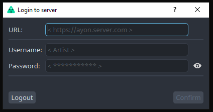

import Tabs from '@theme/Tabs';
import TabItem from '@theme/TabItem';

## Run AYON

To use AYON on a workstation, simply run the `ayon` executable that was [installed](admin_launcher_distribute.md#install).

:::info
Make sure to use the AYON executable and not OpenPype's.
:::

On the first run, the user will be prompted for the AYON Server URL and credentials. This information needs to be provided by the admin who set up AYON in the studio.



Once the artist logs in, they will receive an API token, which AYON will remember for the next launch until the token expires. From that moment, AYON will do its best to always keep up-to-date with the latest updates.

If the launch is successful, the artist should see a green AYON logo in their tray menu.


:::tip Platforms
<Tabs
  groupId="platforms"
  defaultValue="win"
  values={[
    {label: 'Windows', value: 'win'},
    {label: 'Linux', value: 'linux'}
  ]}>
<TabItem value="win">
On Windows, this icon might be hidden by default. In this case, the artist can simply drag the icon down to the tray.
</TabItem>
<TabItem value="linux">
Linux distributions usually don't have the system tray available, and additional extensions have to be installed.
</TabItem>
</Tabs>
:::

### Launch checks

When you run the AYON executable, a few checks are made.

#### Check for AYON Server URL

The server URL should start with `https://` or `http://`.

When you start AYON for the first time, the login UI will show up to ask you for the server URL and credentials. It will then save it securely to your system's keyring - on Windows, it is **Credential Manager**, on macOS, it will use its **Keychain**, on Linux, it can be **GNOME Keyring** or other software, depending on your distribution.

This can also be set beforehand with the environment variable `AYON_SERVER_URL`. If set, it takes precedence over the one set in the keyring.

#### Check for AYON Add-ons Updates

When a connection to the server is made, AYON will get various information from the server - one among them is updates of add-ons. If add-ons are missing or outdated, the right versions are downloaded, validated, and extracted to the artist workstation.

### Runtime provided environment variables

AYON provides the following environment variables for its subprocesses that can be used in various places, like scripting, etc.

:::note
Some of OpenPype environment variables don't have an AYON variant yet. They will be replaced and removed over time.
:::

- `USE_AYON_SERVER` - AYON mode is enabled.
- `AYON_VERSION` - String of the current desktop application version, like `1.0.0`.
- `AYON_ROOT` - Path to the root of the desktop application.
- `AYON_EXECUTABLE` - Path to the executable used to run AYON subprocesses - points to the **python** executable in the virtual environment when run from sources. If run from frozen code, it will point to either `ayon` (or `ayon_console` on windows).
- `AYON_HEADLESS_MODE` - Headless mode is enabled (`"1"`).
- `AYON_LOG_LEVEL` - Logging level for AYON logger.
- `AYON_DEBUG` - Debug mode enabled (affecting logs).
- `AYON_USE_STAGING` - Staging mode is enabled (`"1"`).
- `AYON_BUNDLE_NAME` - Bundle name that is used.
- `OPENPYPE_HEADLESS_MODE` - Variable leading to same value as `AYON_HEADLESS_MODE`.
- `OPENPYPE_USE_STAGING` - Variable leading to same value as `AYON_USE_STAGING`.
- `OPENPYPE_LOG_LEVEL` - Variable leading to same value as `AYON_LOG_LEVEL`.
- `OPENPYPE_DEBUG` - Variable leading to same value as `AYON_DEBUG`.
- `OPENPYPE_VERSION` - Variable leading to same value as `AYON_VERSION`.
- `OPENPYPE_EXECUTABLE` - Variable leading to same value as `AYON_EXECUTABLE`.
- `OPENPYPE_ROOT` - Variable leading to same path as `AYON_ROOT`.
- `OPENPYPE_REPOS_ROOT` - Variable leading to same path as `AYON_ROOT`.

## Arguments

Desktop can be launched with various arguments to change how behaves or what is launched. The command arguments are defined by addons. The source of main command line handling is, ATM, `openpype` addon.

It is possible to run python scripts when passed as positional argument `ayon ` 

### Common Arguments

These arguments apply to whole AYON process.

`--headless` - to run AYON without graphical UI (useful on server or on automated tasks, etc.).

`--use-staging` - to use staging versions of AYON.

`--verbose` `<level>` - change the log verbose level of AYON loggers.

`--skip-bootstrap` - bootstrap is skipped (no updates and addons/dependency packages are not available).

Level value can be integer in range `0-50` or one of enum strings `"notset" (0)`, `"debug" (10)`, `"info" (20)`, `"warning" (30)`, `"error" (40)`, `"critical" (50)`. Value is stored to `AYON_LOG_LEVEL` environment variable for next processes.

```shell
ayon --verbose debug
```

`--debug` - set the debug flag, which affects logging.

Enable debug flag for AYON process. Change value of environment variable `AYON_DEBUG` to `"1"`. At this moment affects only AYON loggers. Argument `--verbose` or environment variable `AYON_LOG_LEVEL` are used in preference to affect log level.

```shell
ayon --debug
```

`--use-staging` - to specify you prefer staging version. In that case it will be used instead of production one.
:::warning
Staging feature is **not yet available**. Only production addon versions will be used now.
:::


## OpenPype addon Commands

| Command | Description | Arguments |
| --- | --- | --- |
| contextselection | Open Context selection dialog. | [📑](#contextselection-arguments) |
| module | Run command line arguments of addons/modules. | |
| tray | Launch AYON Tray. | [📑](#tray-arguments) |
| publish | AYON takes JSON from the provided path and uses it to publish data in it. | [📑](#publish-arguments) |
| extractenvironments | Extract environment variables for the entered context to a JSON file. | [📑](#extractenvironments-arguments) |
| run | Execute the given Python script within AYON environment. | [📑](#run-arguments) |
| interactive | Start Python-like interactive console session. | |

---

### `tray` Arguments {#tray-arguments}

```shell
ayon tray
```

---

### `contextselection` Arguments {#contextselection-arguments}
| Argument | Description |
| --- | --- |
| `output_json_path` | Path to a JSON file where the output will be stored. |
| `--project` | Pre-define project context. The project cannot be changed when passed. |
| `--asset` | Pre-define folder (asset) in the project. The project must be passed. |
| `--strict` | The full context must be set, or the dialog cannot be confirmed. |

**Example output:**
```json
{
    "project": "OP01_CG_Demo",
    "asset": "robot",
    "task": "modeling"
}
```

```shell
ayon contextselection <PATH_TO_JSON> 
```

---

### `publish` Arguments {#publish-arguments}

Run publishing based on metadata passed in the JSON file, for example, on a farm.

| Argument | Description |
| --- | --- |
| `--targets` | Define publishing targets (e.g., "farm"). |
| `--gui` (`-g`) | Show publishing. |
| Positional argument | Path to metadata JSON file. |

```shell
ayon publish <PATH_TO_JSON> --targes farm
```

---

### `extractenvironments` Arguments {#extractenvironments-arguments}

The entered output filepath will be created if it does not exist.
All context options must be passed; otherwise, only AYON's global environments will be extracted.
Context options are `project`, `asset`, `task`, `app`.

| Argument | Description |
| --- | --- |
| `output_json_path` | Absolute path to the exported JSON file. |
| `--project` | Project name. |
| `--asset` | Folder (asset) name. |
| `--task` | Task name. |
| `--app` | Application name. |

```shell
ayon /home/openpype/env.json --project Foo --asset Bar --task modeling --app maya-2019
```

---
### `run` arguments {#run-arguments}

| Argument | Description |
| --- | --- |
| `--script` | run specified python script |

Note that additional arguments are passed to the script.

```shell
ayon run --script /foo/bar/baz.py arg1 arg2
```

:::info
Running AYON without any commands will default to `tray`.
:::

:::note Development
You can substitute `ayon` with `poetry run python ayon_start.py` if you want to run it directly from sources.
:::