import clsx from "clsx";
import styles from "@site/src/pages/features/styles.module.scss";
import addons from "@site/src/data/addons/index.ts";
import AddonCard from "@site/src/pages/features/_components/AddonCard";

## Addons
### What is an Addon?

An addon is a set of code and settings used to extend the AYON server and pipeline. 
You can find a comprehensive list of available addons [here](/features).

<ul
    className={clsx(
        "container",
        "clean-list",
        styles.showcaseList
    )}
>
    {addons.slice(0, 6).map((addon, i) => (
        <AddonCard key={addon.title} addon={addon} />
    ))}
</ul>

### Addons Tab

The "Addons" tab in the AYON server is used to manage your addon packages. Navigate to the "Studio Settings" (S+S hotkey combo) and switch to "Addons" pane at the very top left to display all installed addons their status and available versions.

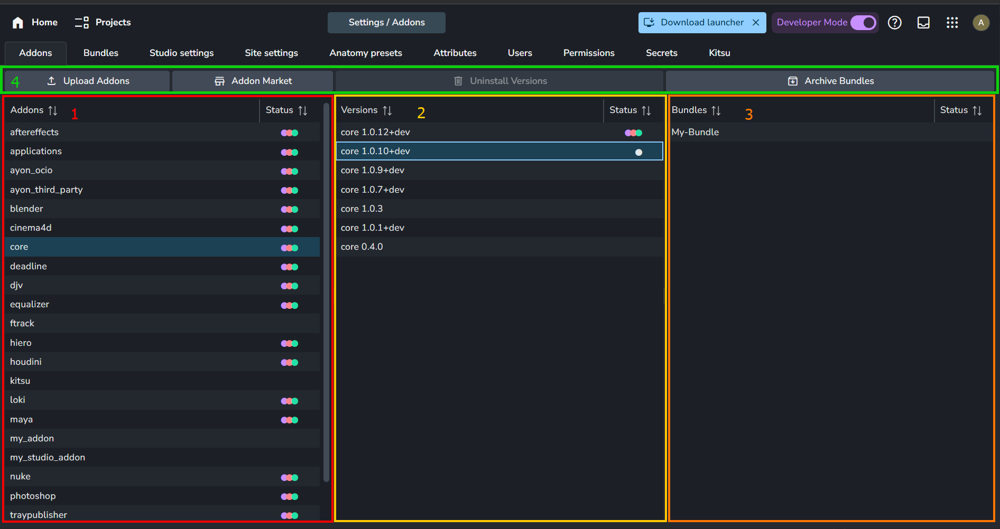

1. **Addons List**: Displays available addons on your server.
2. **Versions List**: Shows available versions of the selected addon.
3. **Bundle List**: Lists bundles that include the selected addon version.
4. **Actions**:
   - **Upload Addons**: Upload addon `.zip` packages to your server.
   - **Addon Market**: Redirects to the [Addon Market](admin_server_market.md).
   - **Uninstall Versions**: Removes the selected addon version from your server.
   - **Archive Bundles**: Archives the selected bundles.

:::tip Right-Click Menu
Each list item has a right-click menu.

| **Addons list** | **Versions list** | **Bundle list** |
|--|--|--|
| 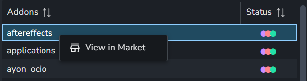 | 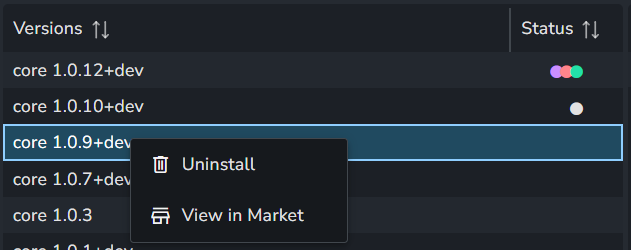 | 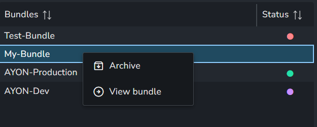 |

:::

:::info Color Code
- ⬤ : Addon is included in a Production bundle.
- ⬤ : Addon is included in a Staging bundle.
- ⬤ : Addon is included in a Development bundle.
- ⬤ : Addon is included in an Unarchived bundle.
:::

:::tip
Developers can upload or remove addons using the AYON Python API.  
For example, see [AYON Python API First Steps: Upload Addon | Ynput Forums](https://community.ynput.io/t/ayon-python-api-first-steps/1278#upload-addon-7).
:::

### Install Addons

You can install addons to your AYON server in a few ways:
1. **Using Addon Market:** Search for addon releases and choose which one to install. Check out the [Addon Market](admin_server_market.md#market-addons) for more details.
2. **Upload Addon `.zip` Packages:** Use the **Upload Addons** option on the [Addons](#addons-tab) or [Bundles](#bundles-tab) tab. This is usually for creating `.zip` packages for addons that aren't released yet, GitHub pull requests, or packages shared within the community. For more information, see [How to Test Addons in Active Development on GitHub | Yn Forums](https://community.ynput.io/t/how-to-test-addons-in-active-development-on-github/2203).

:::info Add Installed Addons to Your Pipeline

To add addons to your pipeline, [create a bundle](#create-a-bundle) and include or update the desired addons in it. Assign a pipeline mode to the bundle. More details about bundles and how to create them are in the next section.
:::

## Bundles

### What is a Bundle?

A bundle is a collection of AYON products used in the AYON pipeline. It includes:

- Launcher Version
- Dependency Package
- Addons List

Bundles can be activated in different variant statuses to indicate their [Pipeline Mode](#pipeline-modes), such as Production , Staging or Dev.

### Bundles Tab

The Bundles Tab in the AYON server is used to manage your bundles.

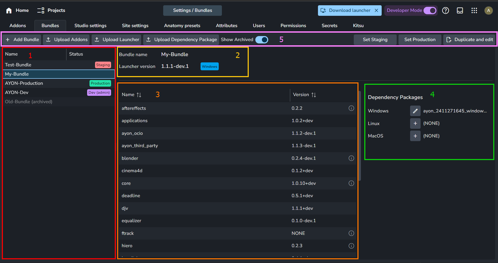

1. **Bundles List**: Displays available bundles on your server.
2. **Name and Launcher**: Shows the bundle's name and the assigned version of the AYON launcher.
3. **Addon List**: Lists addons included in your bundle.
4. **Dependency Packages**: Python modules needed for your bundle. Learn more at [What are dependency packages and how to update them? | Ynput Forums](https://community.ynput.io/t/what-are-dependency-package-and-how-to-update-them/1991).
5. **Actions**:
   - **+ Add Bundle**: Create a new bundle from scratch.
   - **Upload Addons**: Upload addon `.zip` packages to your server.
   - **Upload Launcher**: Upload an AYON Launcher.
   - **Upload Dependency Package**: Upload a dependency package.
   - **Show Archived**: Enable to display archived bundles.
   - **Set Staging**: Assign a `Staging` status to your bundle.
   - **Set Production**: Assign a `Production` status to your bundle.
   - **Duplicate and Edit**: Create a new bundle from the selected bundle.

:::info Upload Addons, Launchers, and Dependency Packages

You can easily install or update existing AYON addons, launchers, and dependency packages on your server using the [installing pipeline releases](admin_server_updating_pipeline.md) or by getting new addons from the [Addon Market](admin_server_market.md).

However, when customizing your pipeline, you might need to manually upload different AYON addons, launchers, and dependency packages. Use the **Upload Addons**, **Upload Launcher**, and **Upload Dependency Package** buttons for this process.

For more details on customizing your pipeline, please refer to:
- [Dev Docs](dev_introduction.md)
- [`addon-dev` tag | Ynput Forums](https://community.ynput.io/tag/addon-dev)

:::

:::caution Addons Upload Restriction

[Ynput Cloud](https://ynput.cloud/) instances restrict custom addon uploads by default.
This restriction does not apply to the [Addon Market](admin_server_market.md) since those addons are official and verified.

:::

:::tip Right-Click Menu

Each list item has a right-click menu.

| **Bundle List** | **Bundle List** (Archived Bundle) | **Addons List** |
|---|---|---|
| 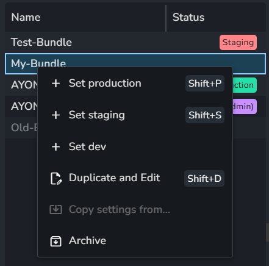 | 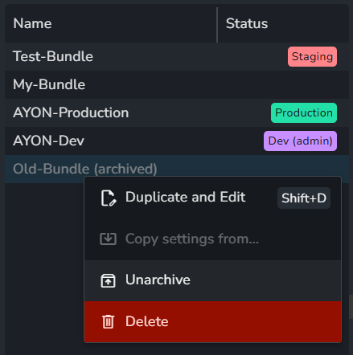 | 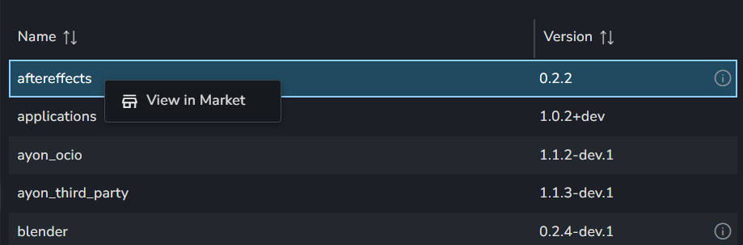 |

:::

### Create a Bundle

There are two ways to start creating a bundle:

- **Duplicate and Edit**: Duplicate the selected bundle and begin editing its contents.
- **+ Add Bundle**: Start creating a new bundle from scratch.

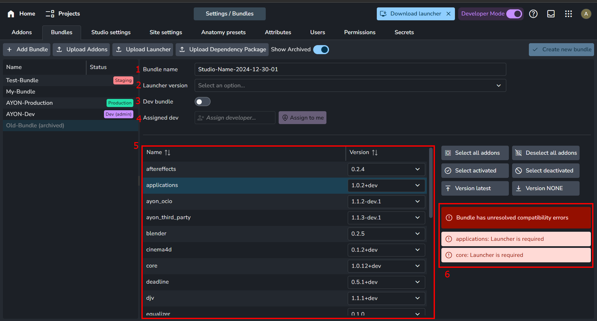

When creating a bundle, several options are available:

1. **Bundle Name**: The name of the bundle.
2. **Launcher Version**: The assigned version of the AYON launcher.
3. **Dev Bundle**: Enable this to set the bundle to `Dev`. *This setting is available when [Developer Mode](dev_dev_mode.md) is enabled.*
4. **Assigned Dev**: The developer assigned to the dev bundle. *This setting is available when [Developer Mode](dev_dev_mode.md) is enabled.*
5. **Addons List**: A list of addons included in your bundle, where you can specify the version of each addon.
6. **Compatibility Checker**: Ensures your selected addons meet compatibility requirements with other AYON products in the bundle. Learn more in [Understanding Dependencies in AYON Addons | Ynput Forums](https://community.ynput.io/t/understanding-dependencies-in-ayon-addons/1992).

:::info
After a bundle is created, most of the options will be locked. You can only change:

- Dependency Packages
- Version of some server addons that don't affect the pipeline, e.g., [Jira Addon](/features?addons=jira).
:::

### Dependency Packages

Dependency packages are essential in bundles as they include the necessary Python dependencies for the addons' client code to function properly.

Once a bundle is created, you can set or update the dependency package for each operating system. Clicking the `+` button shows a dropdown menu where you can select a dependency package.

:::tip Get Dependency Packages
When [updating the pipeline to the latest release](admin_server_updating_pipeline.md), you receive a bundle and a compatible dependency package. In some cases, when building a custom bundle, you may need to build a dependency package for it. For this, use the [ayon-dependencies-tool](https://github.com/ynput/ayon-dependencies-tool). For more information, check out this community [guide: What are dependency packages and how to update them? | Yn Forums](https://community.ynput.io/t/what-are-dependency-package-and-how-to-update-them/1991).

:::

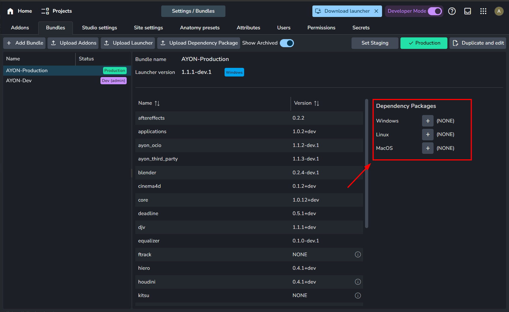

## Pipeline Modes and Settings

### Pipeline Modes
AYON supports three modes for running your pipeline:
- Production: This is the stable mode for your studio's daily work.
- Staging: This experimental mode allows you to test new addons or settings without affecting production.
- Development: In this mode, developers can modify AYON products in the pipeline and run it live from code. For more info, see <a href='dev_dev_mode'>Developer Mode</a> and <a href='https://community.ynput.io/t/ayon-developer-mode-guide/993'>Ayon Developer Mode – Guide | Ynput Forums</a>.

To start working with a bundle, you'll need to assign it a status so the system can recognize it. As shown in the screenshots below, the settings tab only lists bundles with statuses.
> A refers to the active development bundle for the currently logged-in user.

| Bundles Tab | Settings Tab |
|--|--|
|  | 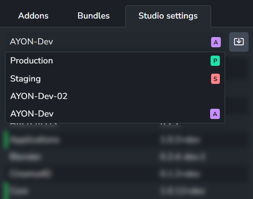 |

**Quick Notes:**
- **Production** and **Staging** statuses can only be assigned to one bundle each.
- You can set **Production** and **Staging** to the same bundle to experiment with different settings, or to two different bundles to test different addon versions.
- A bundle marked as **Dev** cannot be changed to **Production** or **Staging**. You must `unset Dev` before changing its status.
- Dev bundles are exclusive to one developer, so each developer should have their own dev bundle.
- The AYON launcher supports selecting the pipeline mode—**Production**, **Staging**, or **Dev**—which automatically picks the bundle associated with the selected mode.

:::tip Override Pipeline Mode
The AYON launcher lets you override the default behavior, allowing you to specify a bundle and pipeline mode. For more details, visit [How to use different bundles with different projects? | Ynput Forums](https://community.ynput.io/t/how-to-use-different-bundles-with-different-projects/1096).
:::

### How are settings organized?

Each addon version includes different settings variations:

- **Factory defaults**: These values are built into the addon version.
- **Production**: This variation is accessed when the addon is added to a bundle marked as production.
- **Staging**: This variation is accessed when the addon is added to a bundle marked as staging.
- **Development variations**: They are added on demand when the addon is included in a dev bundle. The variation name matches the name of the dev bundle that includes the addon.
  
:::info
The following example assumes a dev bundle named `Develop`.
:::

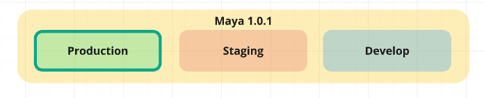 
*Example addon with three variations: Production, Staging, and Develop.*

**It's important to remember that bundles only group the addons for use in the AYON pipeline, and any settings values are saved within the addons themselves. This explains why the same addon retains its production and staging values when added to other bundles marked as production or staging.**

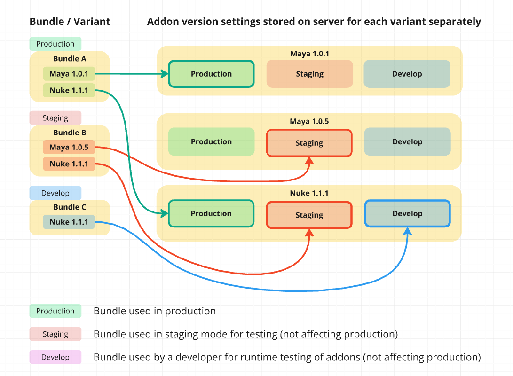 
*Example of Production, Staging, and Develop Bundles. These bundles group different addons and demonstrate how they access various settings variations.*

### Addon Settings Categories

Addon settings in AYON are divided into four categories:

- **Studio Settings `S+S`**: These are addon settings at the studio level. They inherit factory defaults and allow overriding these defaults across the studio for all projects.
- **Project Settings `P+P`**: These settings are at the project level. They inherit studio settings and allow overriding them for the specific project.
- **Studio Site Settings**: These are addon settings per `Site ID` at the studio level.
- **Project Site Settings**: These are addon settings per `Site ID` at the project level.

:::info `Site ID` and Site Settings
`Site ID` refers to each machine with the AYON launcher installed.
Each machine receives a unique `Site ID` when launching the app for the first time and connecting to the AYON server.

- Both **Studio** and **Project** site settings are entirely separate and distinct.
  - They do not inherit or override any other settings.
  - They only appear for addons in the production bundle.
:::

### Settings Values and Overrides

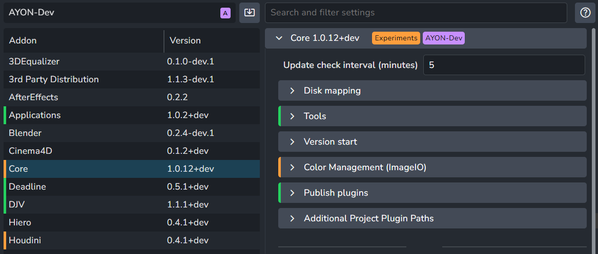

Settings and their overrides use the following color code:

- **No Color**: Default value
- ▌: Studio override
- ▌: Project override

### Settings Filter

In the **Studio Settings `S+S`** or **Project Settings `P+P`** tabs, a settings filter is available at the top of the tab for easy access to settings. This filter allows:

- Search by a setting name or part of the name, including setting titles or nested settings.
- Searching by a setting value or part of the value.

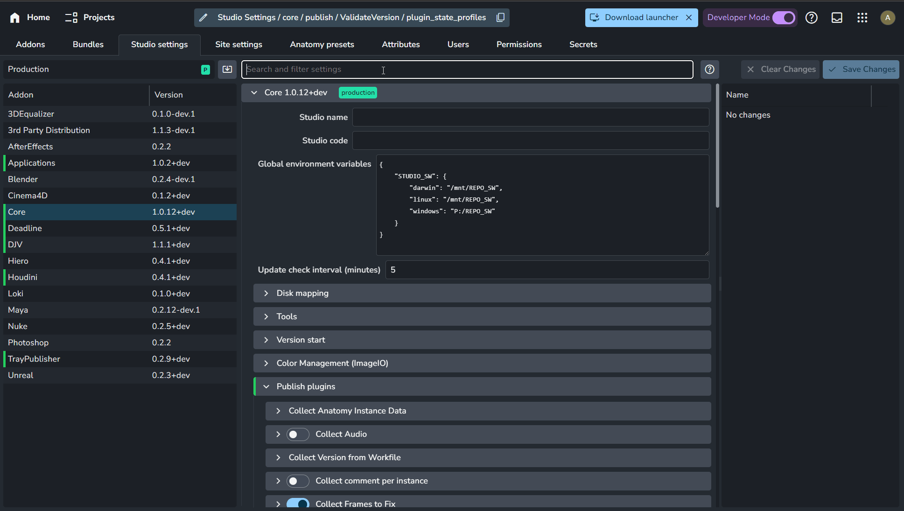
*Settings Filter, introduced in `1.5.4`*

## Copy Settings
### Copy from Another Bundle

In the **Bundles `B+B`** tab, under the Bundle list, right-click on any bundle and select `Copy settings from...`.

The selected bundle will be the destination, and you can choose the source bundle to copy from.

This tool is primarily used when creating a new bundle, so it doesn't provide details about the copied settings.

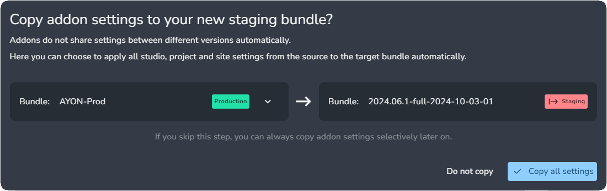

### Copy from Another Bundle (Verbose)

In the **Studio Settings `S+S`** or **Project Settings `P+P`** tabs, next to the Bundle selection dropdown menu, use the `Copy settings from another bundle` option.

The selected bundle will be the destination, and you can choose the source bundle to copy from.

It offers a detailed comparison between the current and new values for each changed item within each addon.

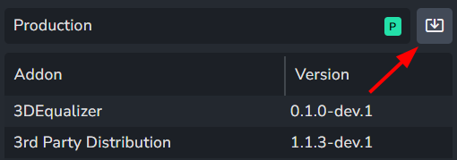

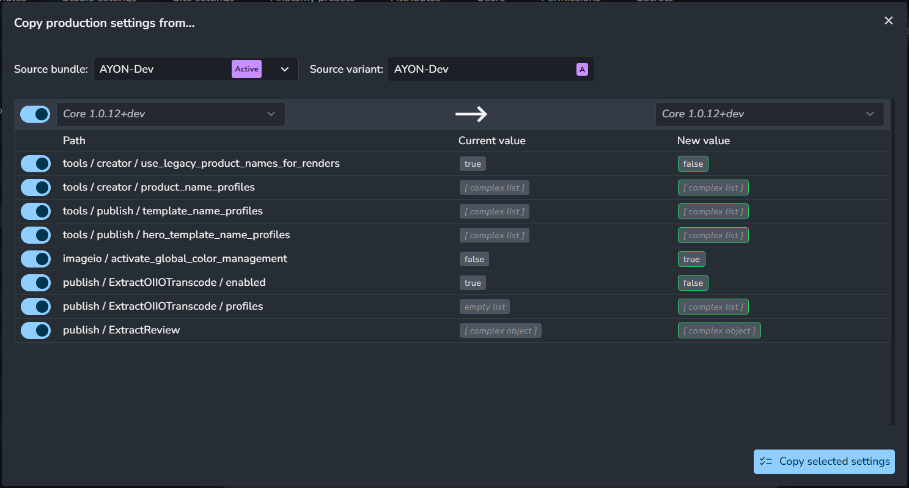

:::tip Project Settings `P+P`
In Project Settings, the tool reveals an additional setting: **Source Project**.

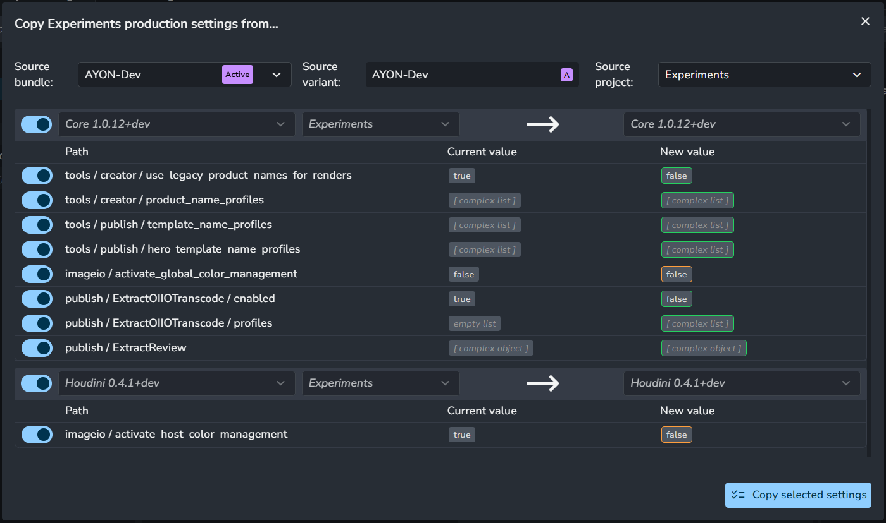
:::

### Copy from another addon
In the **Studio Settings `S+S`** or **Project Settings `P+P`** tabs, under the Addon list, right-click on any addon and select `Copy settings from...`.

You can copy from available addons, regardless of bundles they are included in.

It offers a detailed comparison between the current and new values for each changed item within each addon.

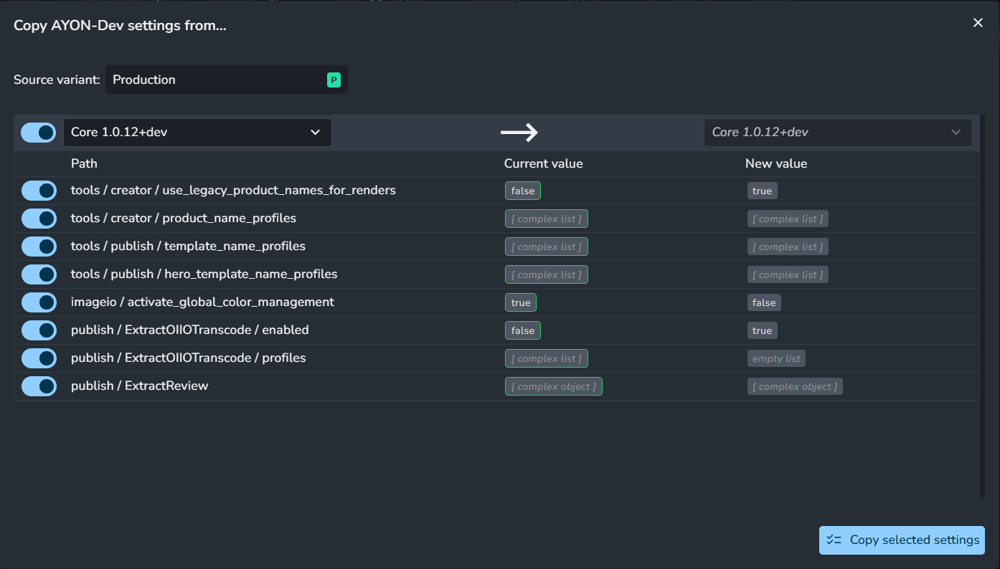

:::tip Project Settings `P+P`
In Project Settings, the tool reveals an additional setting: **Source Project**.

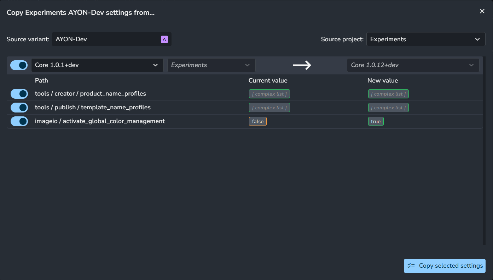
:::

### Copy from Another Setting

In addon settings, right-click on any setting to display a menu where you can copy and paste values directly.

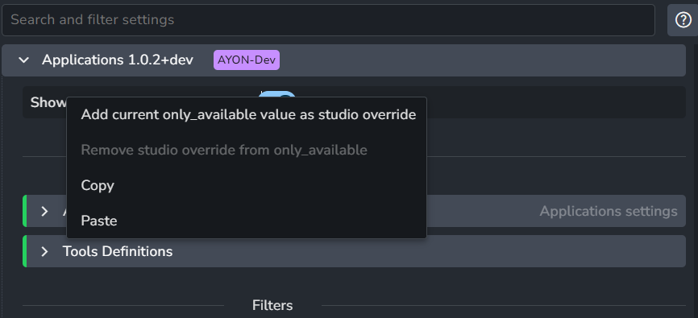

### Low-Level Editor

This feature lets you edit settings directly, just like using a text editor.

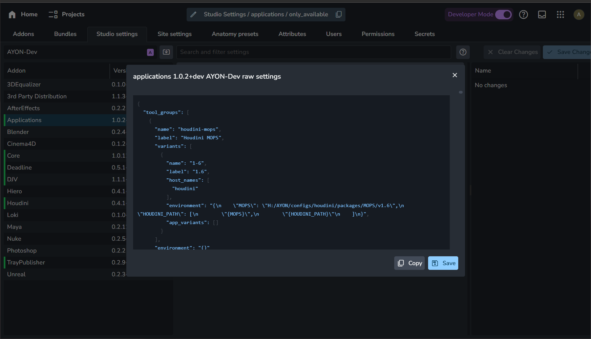