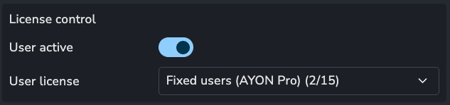

The AYON server operates under a [Functional Source License (FSL)](https://fair.io/), ensuring that most features remain free for users.

Some AYON features and addons require a license, which can be obtained through an AYON subscription or granted on a per-instance basis. For example, PowerPack features require an AYON subscription.

An AYON subscription includes a set number of seats, limiting how many users can log in and use AYON. This limit is called a **license pool**, and you can have multiple pools of different types.

## Fixed User Pools

The primary pool type is a **fixed user pool**, where a set number of seats are assigned to specific users.

For example, a yearly AYON Pro subscription for 20 users provides a fixed pool of 20 seats, allowing 20 assigned users to log in.

You can have multiple fixed pools. If you purchase a yearly subscription for 20 users and a quarterly subscription for 10 users, you would have two fixed pools: one for 20 users and one for 10 users. This allows 30 users to log in while both subscriptions are active. If the quarterly subscription ends, the 10-user pool is removed, and those users lose access.

## Metered User Pool

AYON also offers **metered licensing**, where you only pay for users who log in during a given month. If a user does not log in, you are not charged for them.

By default, metered usage is disabled, meaning only users in a fixed pool can log in. To enable metered usage, please [contact our support team](https://ynput.io/contact/).

For a user to consume a metered license, they must be assigned to the pool.

:::note
Billing is based on the number of unique metered users who log in for the first time during the month, not on the number of assigned metered users at any given time.
:::

:::warning
A user who logs in even once will be billed for the entire month. We recommend assigning metered pools only to trusted users.
:::

## Assigning User Licenses

User licenses are assigned on the user settings page: `/settings/users`.

A user must be **active** and assigned to a **license pool** to log in.

:::tip
If a user tries to log in without an assigned license pool, the server will attempt to assign them to an available fixed license. If no free slots are available, they will be unable to log in.
:::
