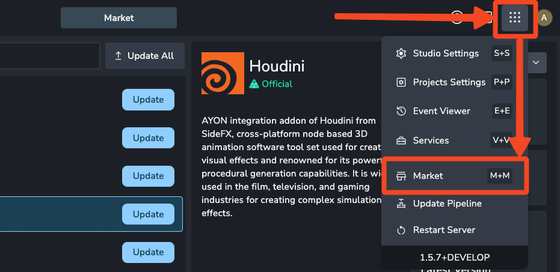
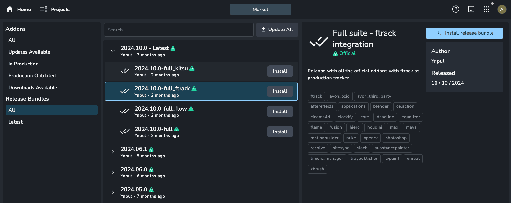
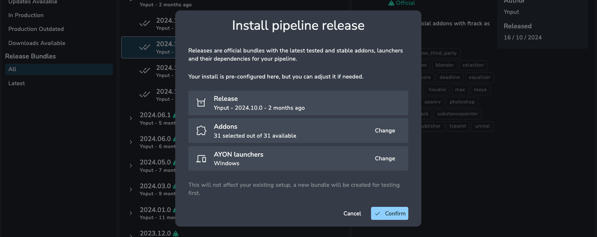
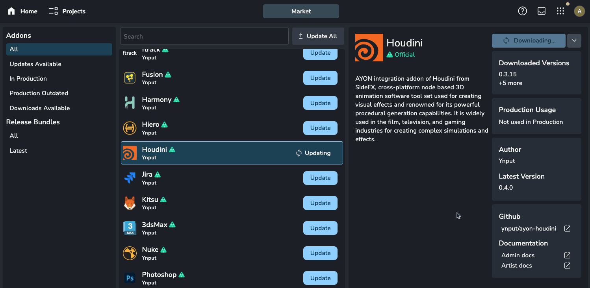

:::info
To access the market, you need to use AYON Cloud or have a local instance connected to Ynput Cloud.
:::

The AYON Market provides the latest official addons and releases, making it easy to enhance your server and pipeline. Access the market through the app menu or by pressing the shortcut `m+m` (double-tap the **m** key).

## Release Bundles

Release bundles include addons, dependency packages, and launchers tested by Ynput for compatibility. We recommend starting with a release bundle rather than individual addons.

Bundles are tailored for different production tracking setups. You can deselect unnecessary pre-bundled addons before installation.

After installing a release bundle, a new bundle is automatically created with your selected addons, launcher platforms, and pre-built, compatible dependency packages. We recommend testing the new bundle in a staging environment before using it in production. You can configure this in the Bundle Settings within Studio Settings.

:::info
The Community Edition always has access to the latest release bundle, while AYON subscribers can access all previous release bundles.
:::

## Market Addons

Addons expand your server's capabilities, offering support for DCCs and new features in the web interface.

You can download and update addons directly from Ynput's servers through the market, eliminating the need for manual installation.

After downloading a new addon version, you must add it to a bundle before using it. This ensures the version can be tested on your server prior to deployment in production.

:::warning
Installing addons individually is not recommended, as versions may not be compatible and do not include dependency packages or a launcher. [Release bundles](#release-bundles) are safer and more convenient.
:::
