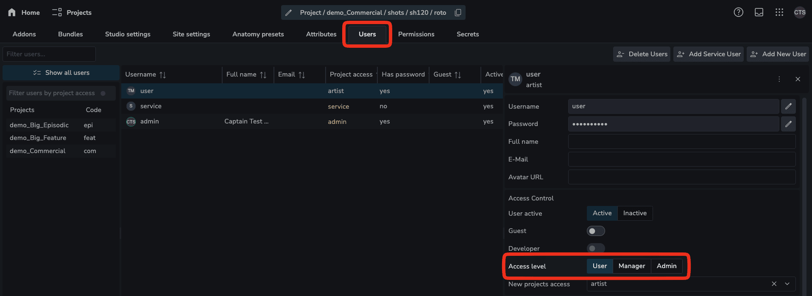
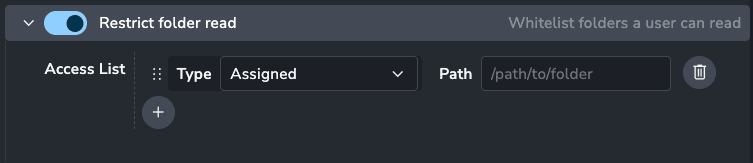
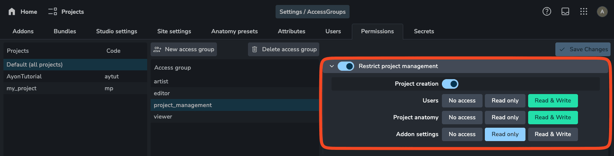
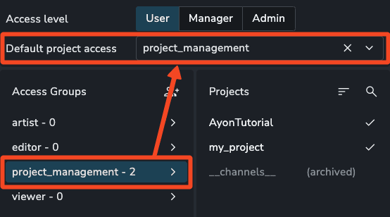
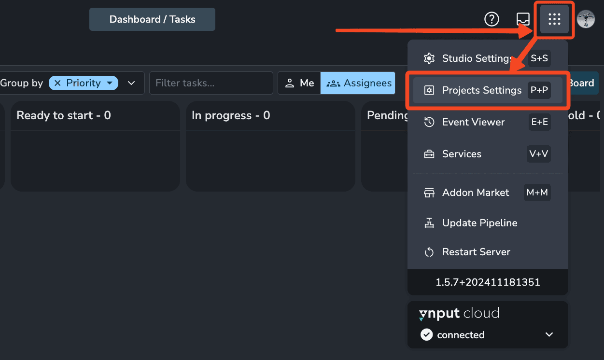
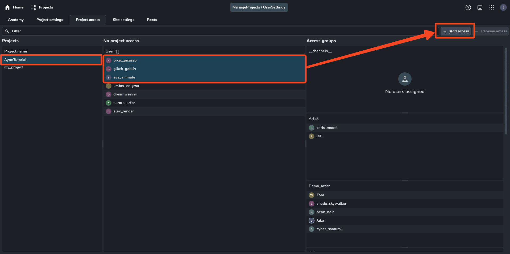

# User Permissions and Project Access Groups

AYON provides comprehensive and granular permissions to manage user access within projects and their settings.

## Overview

-   Users can be assigned one of three levels: `User`, `Manager`, or `Admin`.
-   By default, a `User` does not have access to any projects.
-   [Access groups](#project-access-groups) grant specific permissions within a project.
-   To gain project access, a `User` must be assigned to an access group. For detailed steps, see the [Adding Users to Projects](#adding-users-to-projects) section.

## Top-Level Access Roles

AYON has three main access levels: **Admin**, **Manager**, and **User**.

| Access Level | Studio Settings | Project Settings | Bundle Control | Access Level Control | Project Access | Restart Server |
| ------------ | --------------- | ---------------- | -------------- | -------------------- | -------------- | -------------- |
| **Admin**    | Yes             | Yes              | Yes            | Yes                  | All            | Yes            |
| **Manager**  | Limited         | Yes              | No             | Limited              | All            | No             |
| **User**     | No              | Explicit         | No             | No                   | Explicit       | No             |

-   **Admin**: Full access to all projects and studio settings, including the ability to add or remove other admins.
-   **Manager**: Access to all projects and most settings, with the ability to manage users and assign roles up to the Manager level.
-   **User**: By default, has no access to studio settings, project settings, or projects. However, access to project settings and projects can be granted based on assigned access groups.

### Setting User Access Level

Admins and Managers can assign users to access levels equal to or lower than their own on the user settings page.

## Project Access Groups

While Admins and Managers have automatic access to all projects, Users need to be assigned to specific access groups to gain project permissions.

Access Groups are configured on the **Permissions** page. These groups determine what actions users can perform within a project, such as reading, creating, updating, or deleting project resources. Permissions can apply to all projects or be customized per project using project overrides.

### Partial Project Access

Access groups can provide selective permissions, such as restricting a user to only view tasks they are assigned to, while hiding other tasks and folders.

### User Management Permissions

By default, users have limited project settings access. To allow roles like production coordinators to manage project-specific settings without full project and studio permissions, use customized access groups.

**Example**: Assigning a `project_management` access group allows a user to create projects, manage user access, and modify project anatomy but restricts them to read-only access for project addon settings.

:::note
To grant a user the ability to view the **Project Access** page and manage users, ensure they have the corresponding access group in their Default Project Access list. This provides them with access to all studio users.

:::

### Default Project Access

Users can be assigned default access groups for new projects. This ensures they automatically receive those access groups when new projects are created. Note that this does not apply retroactively to existing projects.

### Adding Users to Projects

To grant project access to a user, assign them to one or more access groups for each project:

1. Navigate to the **Project Access** page in Project Settings.
   
2. Select one or multiple projects to give users access to.
3. Choose one or more users to assign the access groups to.
4. Assign one or more access groups to these users for the selected projects.

This approach allows for precise control of user permissions on a per-project basis.

