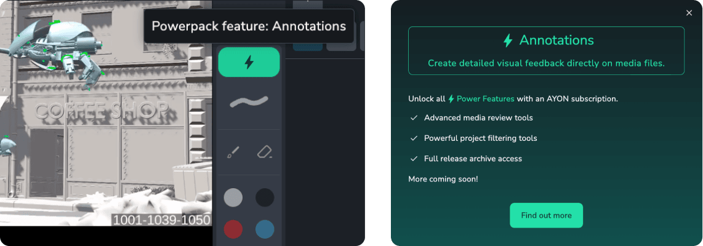
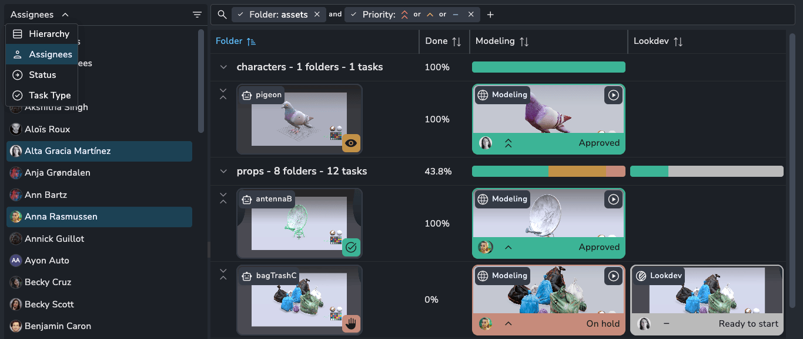
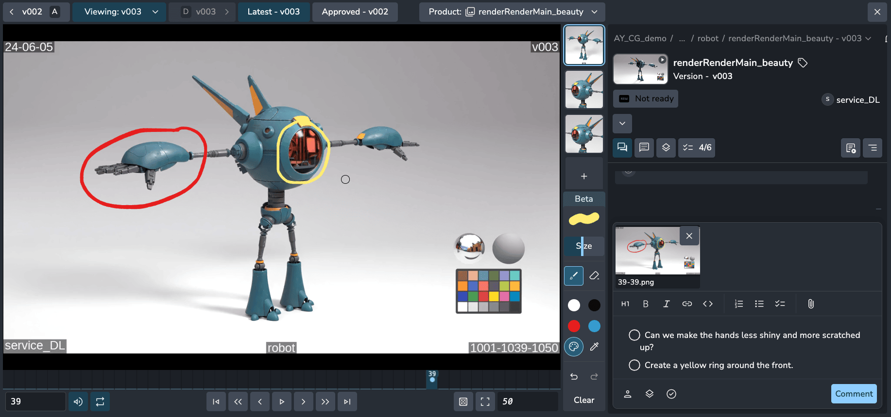
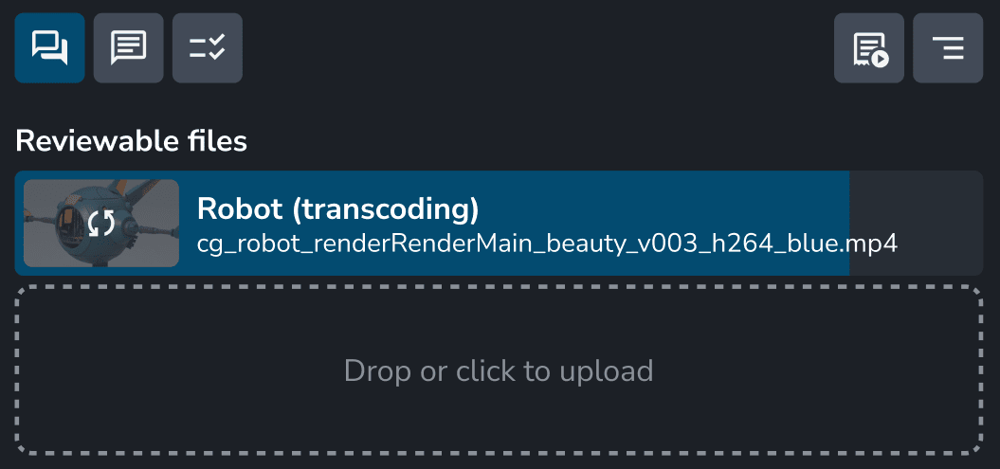
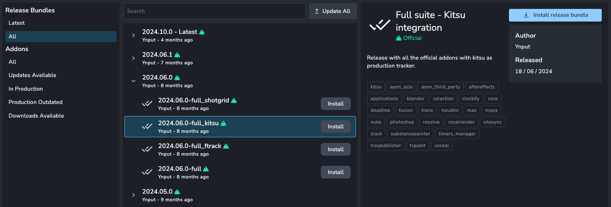

AYON offers **Power Features** to enhance production tracking tools for studios that need advanced functionality. Power Features are only available with an [AYON subscription](https://ynput.io/ayon/pricing/).

Features that require a Power license are marked with a ⚡️ symbol throughout the app. Clicking on this icon provides more details about the feature.

:::tip
Some Power Features may not appear if you don’t have access. Check this page for the full list of features!
:::

## Power Features List

This list will continue to expand, with new features being added. We would love to hear your feedback or ideas for future features!

| Feature                                                           | Description                                                                                    | Delivery        | Status            |
| ----------------------------------------------------------------- | ---------------------------------------------------------------------------------------------- | --------------- | ----------------- |
| [Multi view slicer](#multi-view-slicer)                           | Effortless, on-the-fly filtering to streamline project exploration.                            | PowerPack Addon | Production        |
| [Annotations](#annotations)                                       | Create detailed visual feedback directly on media files.                                       | PowerPack Addon | Beta              |
| [Reviewables transcoder service](#reviewables-transcoder-service) | Transcode and optimize uploaded reviewable video formats.                                      | Service         | Production        |
| [Pipeline releases](#full-pipeline-release-access)                | Access and download the complete archive of releases                                           | Built-in        | Production        |
| [SSO (OAuth2.0, Google)](#sso-oauth20-google)                     | Allow users to login using SSO options, like "Continue with Google".                           | SSO Addon       | Production        |
| Complex Filters                                                   | Advanced filter tools like, excludes, different operators (AND/OR) and more.                   | PowerPack Addon | Under development |
| Save views and sharing                                            | Save different filters as views and share views with other team members.                       | PowerPack Addon | Under development |
| E-mail notifications                                              | Receive email notifications for task specific and project overview updates.                    | Service         | Under development |
| Team assignments and mentions                                     | Ability to assign teams to tasks and tag @team in comments.                                    | PowerPack Addon | Under development |
| Related work panel                                                | See and compare related tasks to your currently selected task, like the next and before shots. | PowerPack Addon | Planning phase    |
| Smart lists                                                       | Create dynamic lists of tasks or versions based on a set of rules.                             | PowerPack Addon | Planning phase    |

## Multi view slicer

The slicer lets you quickly refine your view by filtering attributes on the fly, without modifying your existing filters. It’s a fast and flexible way to explore data, helping you focus on what matters most—without disrupting your workflow. Slice by hierarchy, assignee, status, and task type, with more coming soon.

:::note
Currently, the slicer is only available on the Task Progress page, but we plan to bring it to more pages in the future.
:::

## Annotations

Enhance collaboration with **Annotations**, allowing you to draw directly on videos and images for clearer communication.

-   Mark up any frame of a video or image.
-   Adjust brush size and erase with a simple right-click.
-   Choose from preset colours, pick a custom shade, or use the eyedropper tool.
-   Full keyboard support.

:::note
Annotations are currently in beta, so you may encounter bugs. Please let us know if you do!
:::

## Reviewables transcoder service

The **Reviewables transcoder service** automatically transcodes and optimises any video format to meet web and browser standards, ensuring smooth playback in the browser. By default, only specific `.mp4` formats are supported for publishing and playback due to browser limitations. This service takes care of transcoding your reviewables into the compatible format for you.

## Full pipeline release access

With **Power Features**, you gain access to not just the latest pipeline release, but all historical releases. By default, only the latest release is available.

## SSO (OAuth2.0, Google)

Let your users log in using any SSO provider instead of email and password. Google SSO and Discord SSO are natively supported, and all other providers are supported through **Keycloak**. We can also add more providers natively upon request, thanks to AYON’s OAuth2.0 capabilities. Configure it so that SSO logins automatically create new users with the correct details, such as name and profile image.

