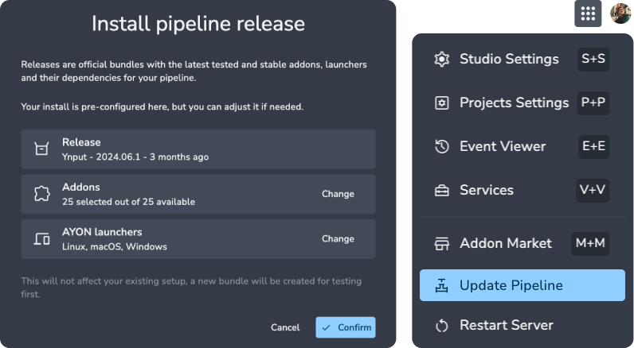

:::tip Pipeline releases
Pipeline releases are official bundles with the latest tested and stable addons, launchers and their dependencies for your pipeline.
:::

The `Update Pipeline` option is designed to be user-friendly, transparent, and fast. it automatically detects which addons need updates and identifies the platforms you’re already using (whether it’s MacOS, Windows, or Linux). The update process only requires two simple clicks, select the menu option, and hit the install button.

:::info
Once the update starts, you can't stop it, but it shouldn't take long.
:::