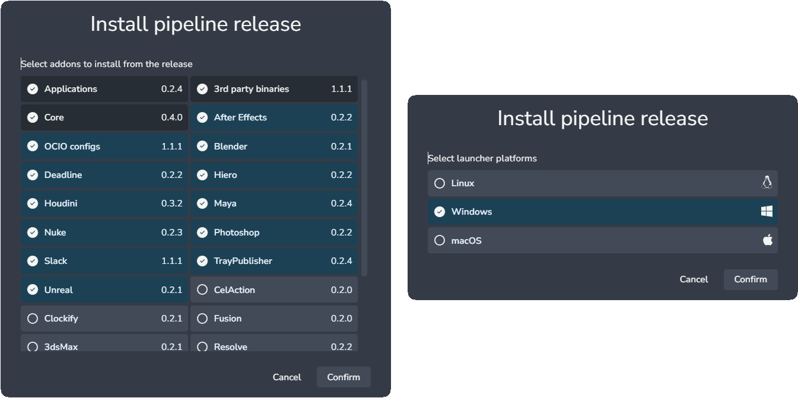

:::tip Pipeline releases
Pipeline releases are official bundles with the latest tested and stable addons, launchers and their dependencies for your pipeline.
:::

The `Update Pipeline` tool is designed to be user-friendly, transparent, and fast. It automatically detects which addons need updates and identifies the platforms you’re already using (whether it’s MacOS, Windows, or Linux). The update process only requires two simple clicks, select the menu option, and hit the `Update Pipeline` button.

:::info
Keep in mind this will not affect your current production configuration, a new bundle will be created for the new release.
:::

The `Update Pipeline` UI is pre-configured, but you can adjust it by clicking the `change` button next to `Addons` and `AYON launchers`.

:::info
Once the update begins, it should not be interrupted. In the rare event the update fails to complete, restarting the server will cancel the download process.
:::

:::tip Next Steps
After the update is complete, you can start testing by setting the bundle to staging. A dialog will appear, allowing you to copy settings from existing bundles. Once you’re satisfied with the changes, set the bundle to production using the same process.

:::