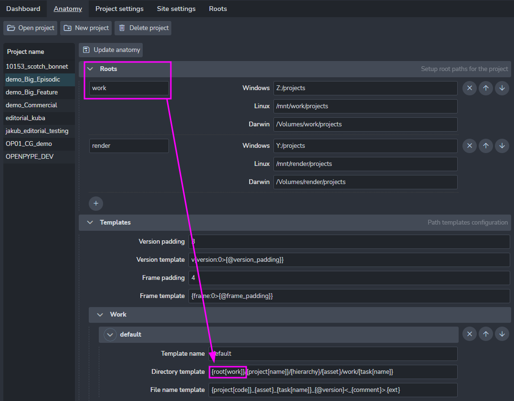
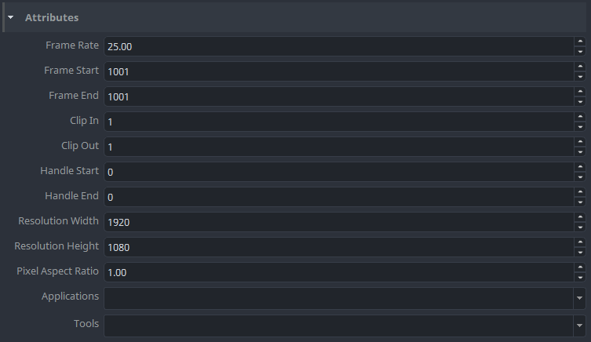
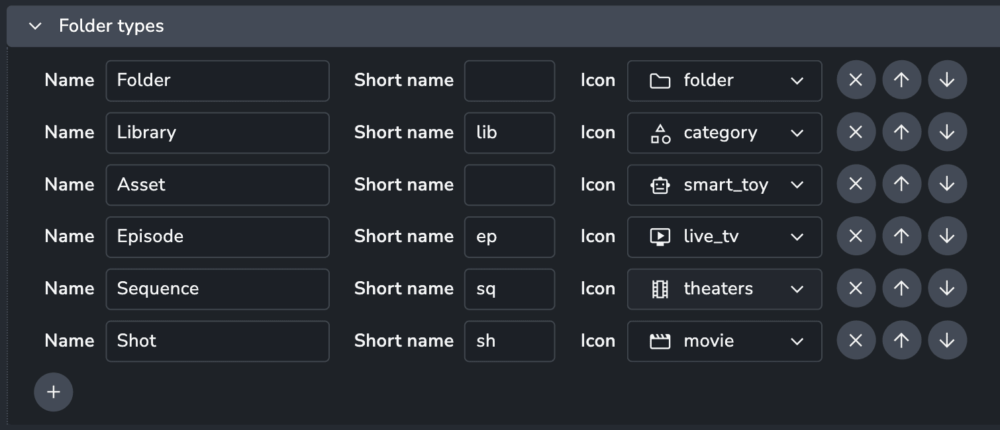
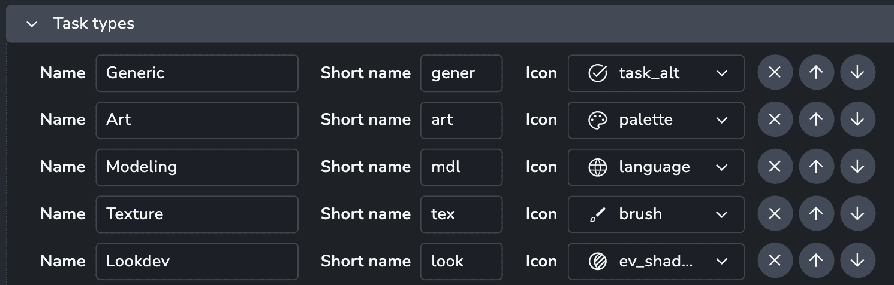
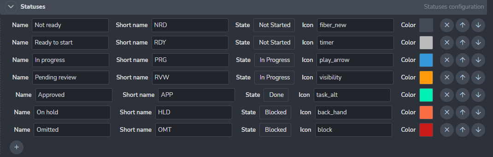
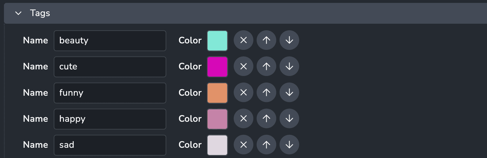

import Tabs from '@theme/Tabs';
import TabItem from '@theme/TabItem';

Project Anatomy is the most important configuration piece for each project you work on with AYON.

It defines:
- Project Root folders
- File naming conventions
- Folder structure templates
- Default project attributes
- Folder types
- Task types
- Statuses
- Tags

Anatomy is the only configuration that is always saved as an project override. This is to make sure that any updates to AYON or Studio default values, don't affect currently running productions.

## Roots

Roots define where files are stored with path to a shared folder.  It is required to set the  root path for each platform you are using in the studio. All paths must point to the same folder!

It is possible to set multiple roots when necessary. That may be handy when you need to store a specific type of data on another disk.

Note how multiple roots are used here, to push different types of files to different shared storage.

## Templates

Templates define the project's folder structure and filenames.

We have a few required anatomy templates for AYON to work properly, however we keep adding more when needed.

### Available template keys

| Context key | Description |
| --- | --- |
| `root[name]` | Path to root folder |
| `studio[name]` | Studio's full name |
| `studio[code]` | Studio's code |
| `project[name]` | Project's full name |
| `project[code]` | Project's code |
| `folder[name]` | Name of asset or shot |
| `folder[type]` | Folder type |
| `folder[path]` | Full folder path of asset or shot within a project |
| `hierarchy` | The folder path excluding the folder name |
| `parent` | Name of hierarchical parent of the folder|
| `task[name]` | Name of task |
| `task[type]` | Type of task |
| `task[short]` | Short name of task type (eg. `Modeling` ➜ `mdl`) |
| `version` | Version number |
| `product[name]` | Product name |
| `product[type]` | Product type |
| `ext` | File extension |
| `representation` | Representation name |
| `frame` | Frame number for sequence files. |
| `app` | Application Name |
| `user` | User's login name (can be overridden in local settings) |
| `output` | Extract review output profile name |
| `comment` | Subversion string from workfiles tool (only relevant for workfiles template right now.)|
| `colorspace` | Colorspace profile name |
| `originalDirname` | Original directory of published file  |
| `originalBasename` | Original file name without extension |

| Key | Example result | Description |
| --- | --- | --- |
| `d` | 1, 30 | Short day of month |
| `dd` | 01, 30 | Day of month with 2 digits. |
| `ddd` | Mon | Shortened week day name. |
| `dddd` | Monday | Full week day name. |
| `m` | 1, 12 | Short month number. |
| `mm` | 01, 12 | Month number with 2 digits. |
| `mmm` | Jan | Shortened month name. |
| `mmmm` | January | Full month name. |
| `yy` | 20 | Shortened year. |
| `yyyy` | 2020 | Full year. |
| `H` | 4, 17 | Shortened 24-hour number. |
| `HH` | 04, 17 | 24-hour number with 2 digits. |
| `h` | 5 | Shortened 12-hour number. |
| `hh` | 05 | 12-hour number with 2 digits. |
| `ht` | AM, PM | Midday part. |
| `M` | 0 | Shortened minutes number. |
| `MM` | 00 | Minutes number with 2 digits. |
| `S` | 0 | Shortened seconds number. |
| `SS` | 00 | Seconds number with 2 digits. |

### Anatomy reference keys

Anatomy templates have the ability to use "referenced keys". Best example is `path` in publish or work templates which just contains references to `folder` and `file` (`{@folder}/{@file}`). Any changes in folder or file template are propagated to the path template. The another example is simplification of version and frame formatting with paddings. You can notice that keys `{@version}` or `{@frame}` are used in default templates. They are referencing `Anatomy` -> `Templates` -> `Version` or `Frame` which handle version and frame formatting with padding.

So if you set `project_anatomy/templates/defaults/version_padding` to `5` the `{@version}` key will be transformed to `v{version:0>5}` automatically and version number in paths will have 5 numbers -> `v00001`.

### Optional keys

In some cases of template formatting not all keys are available and should be just ignored. For example `{frame}` should be available only for sequences but we have single publish template. To handle these cases it is possible to use special characters to mark segment of template which should be ignored, if it can't be filled because of missing keys. To mark these segments use `<` and `>`.
.
Template `{project[code]}_{asset}_{product}<_{output}><.{@frame}>.{ext}` can handle all 4 possible situations when `output` and `frame` keys are available or not. The optional segments can contain additional text, like in the example dot (`.`) for frame and underscore (`_`) for output, those are also ignored if the keys are not available. Optional segments without formatting keys are kept untouched: ` ` -> stays as ` `. It is possible to nest optional segments inside optional segments `<{asset}<.{@frame}> >` which may result in empty string if `asset` key is not available.

## Attributes

Project attributes are used as default values for new *folders* created under a project, except `Applications` which is project specific. Values of attributes that are **not** project specific are always used from *folders*. So if `tools` are not loading as expected it is because the *folders* have different values.

| Attribute | Description |
| --- | --- |
| `Applications` | List of applications that can be used in the project. At the moment used only as a possible filter of applications. |
| `Tools` | List of application tools. This value can be overridden per asset. |

## Folder Types

:::info
Templates are not supporting use of `{folder[type]}` yet.
:::

Read more about folders in User docs: [Folders](artist_concepts#folder)

## Task Types

Available task types on a project. Each task on an asset is referencing a task type on the project which allows access to additional task type attributes. At this moment only `short_name` is available (can be used in templates as `{task[short_name]}`).

## Statuses

Place to manage all your task statuses.

## Tags

Place to manage all project tags.

