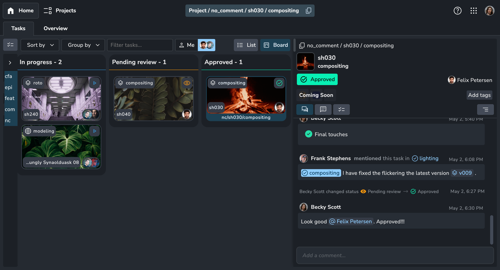
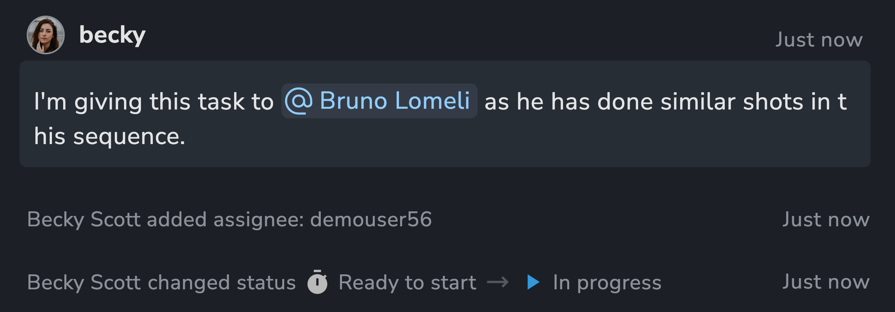
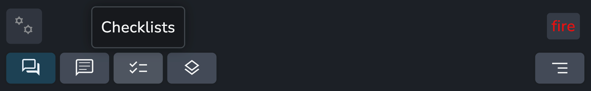
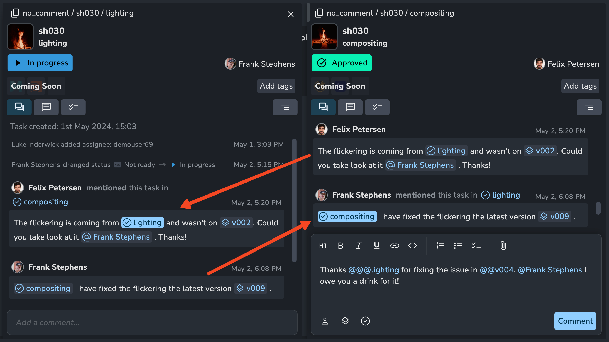
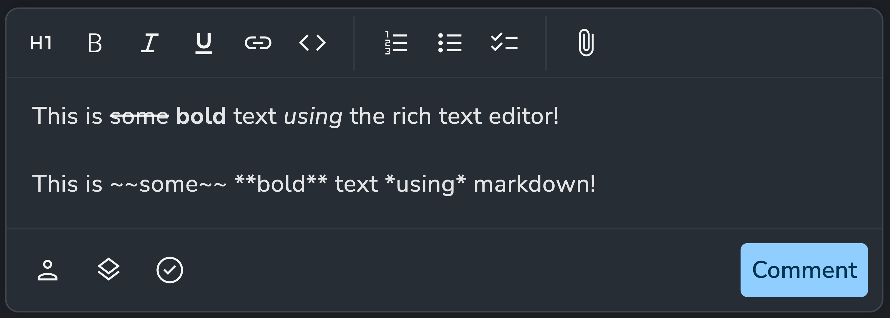
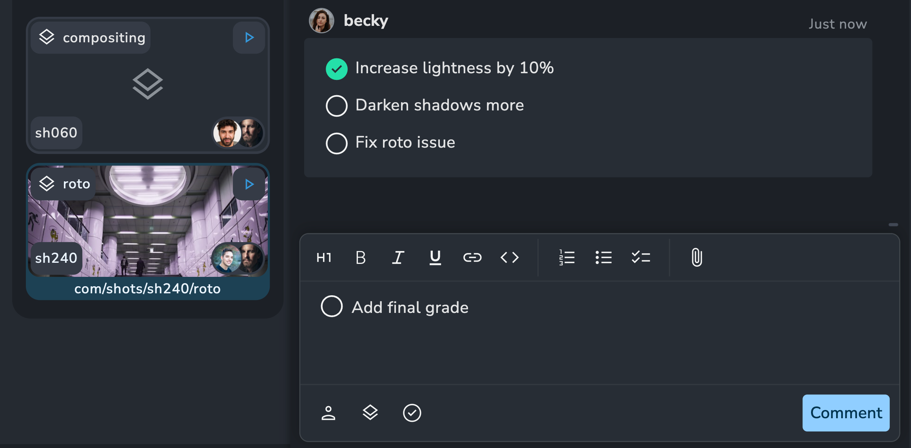
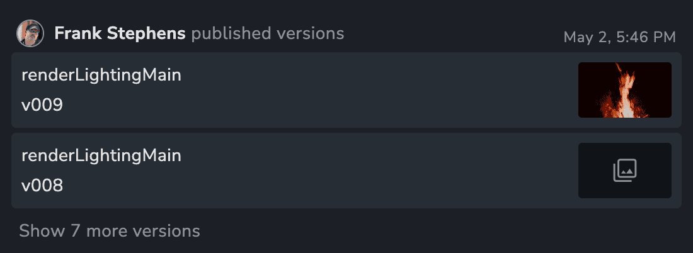
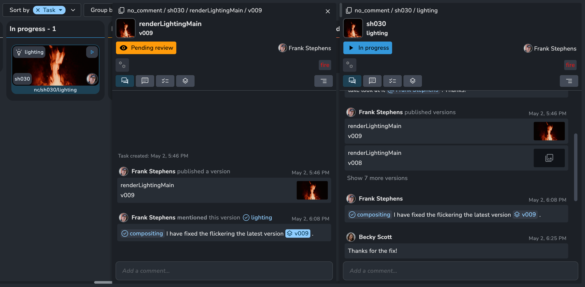
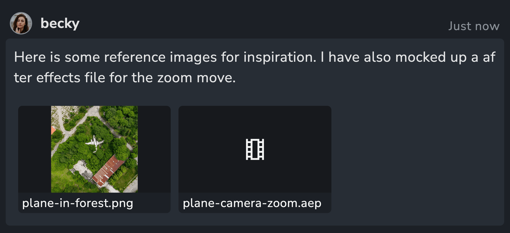
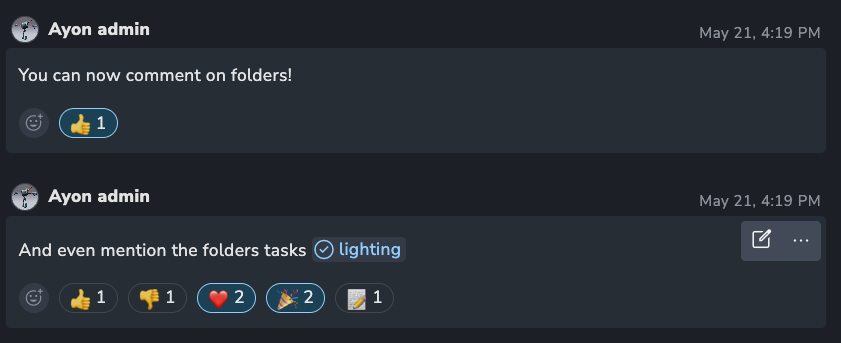

:::info
The activity feed is a suite of features that were introduced in `1.1.0`.
:::

### Overview

In essence, the activity feed serves as a unified interface for viewing a stream of events associated with a specific entity. For instance, the activity feed for a task may include comments from supervisors, status updates, or instances when a user was assigned to the task.

Think of it as a timeline illustrating different activities associated with the entity.

The activity feed encompasses more than just a section for comments; it aggregates a variety of distinct "activities" into a single feed.

The activity feed will primarily be utilized on your tasks board but will be extended to additional pages in the future.

:::note
Initially, the activity feed will be accessible on tasks and versions but may potentially be expanded to include other entity types in the future, such as folders.
:::

### Types of activities

1. Comments
2. Status changes
3. Assignee changes
4. Published versions

:::tip
You can filter these different types for a more focused feed. Additionally, there are special filters available to target specific comment types, such as comments containing checklist items.

:::

### Mentions

The activity feed features a robust linking system among entities, enabling seamless collaboration and contextual communication.

You can mention or "tag" three different things using the @ annotation:

1. @users - any user on the same project.
2. @@versions - versions related to the entity.
3. @@@tasks - sibling tasks of the same folder.

When something is mentioned in a comment, it will be displayed in the activity feed associated with that mention.

:::info
In this example, Felix leaves a comment on his Compositing task, mentioning the Lighting task that requires fixes. Felix doesn't need to search for the Lighting task and rewrite his comment; it automatically appears on the Lighting task. Now, both Felix and Frank can collaborate on the fix without leaving the context of their tasks. Frank can then mention the Compositing task to inform Felix that a new version is ready.
:::

### Relations

Certain activity items can be related to another entity besides their origin. For instance, comments made on versions are related to their parent task. When a comment is made on a version, this relation causes the comment to be visible on the task itself. This operates similarly to mentions but without requiring an explicit mention.

### Rich Text Editor and Markdown

Comments fully support [github flavoured](https://github.github.com/gfm/#:~:text=1Introduction-,1.1What%20is%20GitHub%20Flavored%20Markdown%3F,-GitHub%20Flavored%20Markdown) [markdown](https://www.markdownguide.org/basic-syntax/). You might be wondering, what is markdown? Don't worry, the comment text editor is also a rich text editor and supports everything you would expect, including headings, bold, italic, underlines, and lists.

### Checklists

Checklists can be created and checked/unchecked by any user. They do not affect the status of the task but provide a general idea of the remaining work on a task. They are useful for reviews to keep track of whether feedback has been addressed.

### Versions

Published versions will appear in the activity feed, allowing you to track when a new version is published and understand its context. To view all versions without grouping, utilize the "Published Versions" filter.

Click on a version to access its details and activity feed. Any comments made on a version will be visible in the parent task activity feed.

### Attachments

You can attach any type of file to a comment. Common image types will be previewable inside the web app, and we plan to support previewable videos in the future.

:::tip
In addition to using the attachments button, you can drag and drop files or even paste images directly from your clipboard.

Review workflow: Capture a screenshot -> Markup in your preferred app -> Paste the marked-up image as an attachment.
:::

:::note
Attachment files are stored in the docker storage space `/storage/server/uploads`. When a comment is deleted a background worker cleans up unused files.

There is currently no file size limit but we intend to introduce a default that can be configurable.
:::

### Reactions

The platform now supports a new way of communicating: Reactions! Any user can now react to comments on the plaform by adding emoji reactions.
Available reactions set is limited at the moment, but may be adjusted in the future.

:::note
Reactions will not send notifications of affect watchers in any way.
:::

:::tip
The UI limits the reactions users can choose from, but the API allows for any reaction type without restrictions.
:::