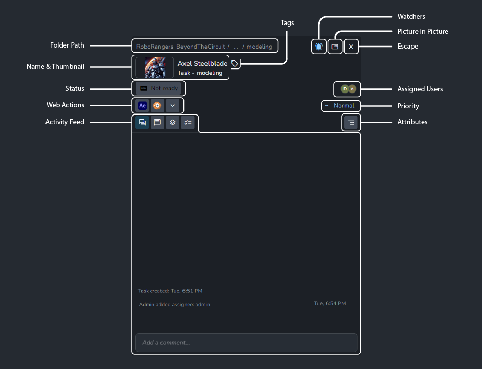

## Overview 
When using the AYON production tracker, you'll encounter the details panel frequently. It's essential for team interactions.
As the name suggests, the details panel is packed with information, serving as a communication tool and offering useful actions.

## Panel Content

- **Folder Path**: Displays the folder path to the entity.
- **Name & Thumbnail**: Shows the name and thumbnail of the entity.
:::tip Update Thumbnail
You can update the thumbnail by right-clicking the thumbnail and selecting Upload new thumbnail.
:::
- **Tags**: View and add tags.
- **Status**: View and update status.
- **Web Actions**: Access available web actions, e.g. applications, directly via the AYON web server.
- **[Activity Feed](artist_activity_feed.md)**: Leave comments and track activity.
- **[Watchers](artist_inbox.md#watchers)**: Update notification settings for the current folder or task and choose who receives updates.
- **Picture in Picture**: Open a panel that can stay open as you navigate to different pages.
- **Escape**: Close the current details panel.
- **Assigned Users**: Shows the assignees of the current task.
- **Priority**: View and update the priority of the current task.
- **Attributes**: Provides task details like `fps`, `Start frame`, `End frame`.
:::tip Attributes and Pipeline
These attributes are used within the pipeline and can be modified by the admin via the project editor.
:::