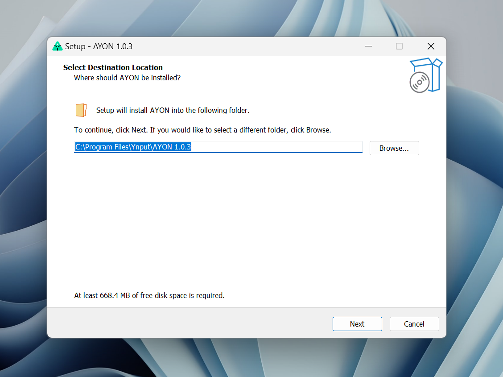
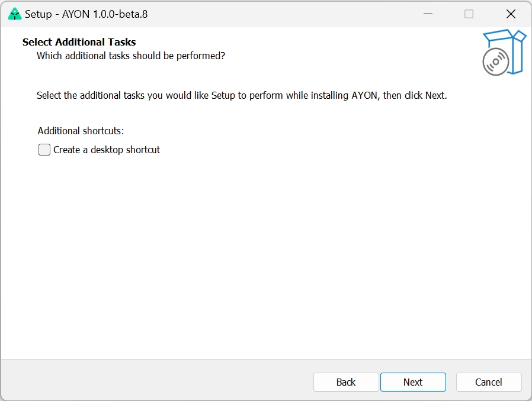
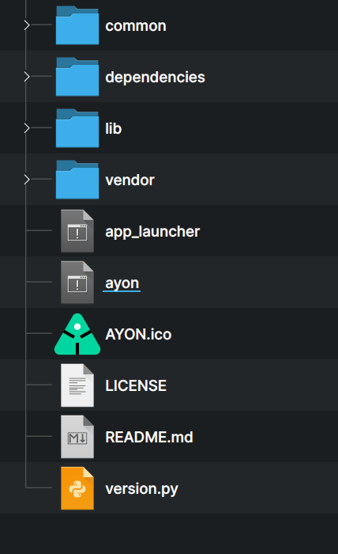
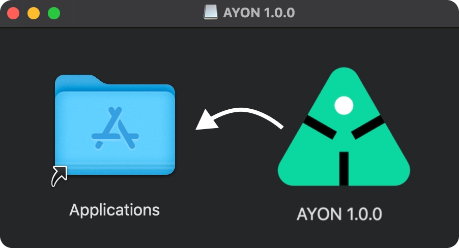
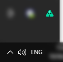

import Tabs from '@theme/Tabs';
import TabItem from '@theme/TabItem';

## Installation

**AYON** and its installation files are available for all major operating systems: **Windows** 10 (Server, WIN 11 and newer), **macOS** (Mojave or later), and **Linux** distributions (Rocky Linux, Ubuntu and formerly CentOS).

Besides getting AYON installation files from Github you also have option to get those via `AYON server` webUI in the `Studio Settings` section.

A `Download Launcher` button should be present, which provides a binary for the Operating System you are accessing the server website, alternatively you can download a specific binary from the dropdown in the main menu.

If you are testing or working by yourself, you can also grab installation files from the releases: https://github.com/ynput/ayon-launcher/releases

:::important User Permissions
To install **AYON** on your machine you will need **admin user account rights** to do so.
:::

:::note pick your platform
<Tabs
    defaultValue='win'
    values={[
        {label: 'Windows', value: 'win'},
        {label: 'Linux', value: 'linux'},
        {label: 'Mac OS X', value: 'mac'},
    ]}>

<TabItem value='win'>

For installation on Windows, download and run the installation file `AYON-#.#.#.exe`.
During the installation process, you can change the destination location path of the application,

and create an icon on the desktop.

</TabItem>

<TabItem value='linux'>

For installation on your Linux distribution, download and unzip `AYON-#.#.#.zip`. A new folder `AYON-#.#.#` will be created.
Inside this folder find and run `ayon_gui`,

</TabItem>

<TabItem value='mac'>

For installation on Mac OS X, download and run dmg image file `AYON-#.#.#.dmg`.

Drag the OpenPype icon into the Application folder.

After the installation, you can find AYON among the other Applications.

</TabItem>
</Tabs>
:::

## Working in the studio

Ensure AYON is installed and deployed in your studio environment for immediate use. Your admin likely placed the AYON icon on your desktop or configured your system to launch AYON upon startup.

If this is not the case, reach out to your administrator for guidance on deploying AYON in your studio.

## Working remotely

If you are working remotely e.g. from home, you'll need to install the AYON Launcher by yourself. You should, however, receive the AYON installer files from your studio administrator, because AYON versions and executables might not be compatible between sites.  

Installing AYON is possible by using the Installer or by unzipping downloaded ZIP archive to any drive location.

:::tip
See the [Installation section](#installation) for more information on how to use the **AYON Installer**
:::

You can run AYON by desktop "AYON" green triangle icon (if it exists after installing) or by directly executing **ayon_gui.exe** located in the AYON installation folder. This executable being suitable **for artists**, or alternatively by **ayon_console.exe** which is more suitable for **TDs/Admin** for debugging and error reporting. The later runs with a console window where all the necessary info will appear during user's work session.

:::tip Is AYON running?
AYON runs in the operating system's tray. If you see a green AYON icon in the tray you can easily tell AYON is currently running. Keep in mind that on Windows this icon might be hidden by default, in which case, the artist can simply drag the icon down to the tray.
:::

:::tip Linux / missing AYON icon
Some Linux distributions do not ship with tray icons by defaults, mostly GNOME based, to get the icon, install the following extension: [Appindicator Support for GNOME Shell](https://extensions.gnome.org/extension/615/appindicator-support/)
:::

## First Launch

Upon launching AYON, you'll be prompted to enter your credentials to login to the AYON server and its URL.

### AYON Login Details

Your Studio should provide you with the AYON `url`, `username` and `password` to fill in the dialog.

:::tip Example
URL: `https://mystudio.ayon.app/`
username: `johndoe`
password: `v3ry53cur3p455w0rd`
:::

## Updates

**AYON** updates automatically, based on your studio server every time you start AYON Launcher on your machine. Upon initial launch, the software may perform a fresh installation to ensure compatibility with the latest version of Studio, even if you recently installed it.

## Advanced Usage

For more advanced usage of **AYON Launcher** app, like running with console, staging, or develop mode, please visit [Admin section](admin_launcher_run#arguments).
