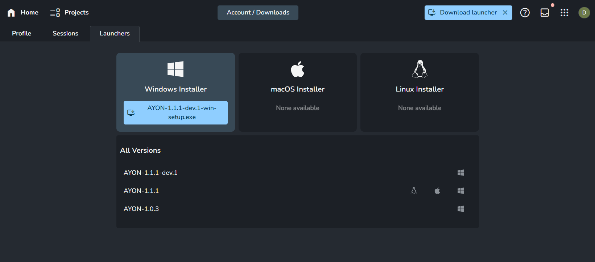
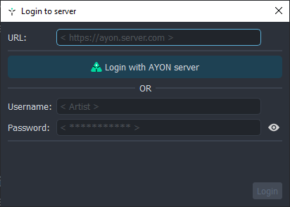

import Tabs from '@theme/Tabs';
import TabItem from '@theme/TabItem';

## Intro
AYON Launcher is the entry point to start working within the AYON studio platform.

## Working in the studio

Ensure AYON is installed and deployed in your studio environment for immediate use. Your admin likely placed the AYON icon on your desktop or configured your system to launch AYON upon startup.

If this is not the case, reach out to your administrator for guidance on deploying AYON in your studio.

## Working remotely

If you are working remotely e.g. from home, you'll need to install the AYON Launcher by yourself. AYON Launcher Installer should be available to download from AYON webUI.

:::tip
See the [Installation section](#installation) for more information on how to download and install AYON launcher by yourself.
:::

## Installation

**AYON Launcher** and its installation files are available for all major operating systems: **Windows** 10 (Server, WIN 11 and newer), **macOS** (Mojave or later), and **Linux** distributions (Rocky Linux, Ubuntu and formerly CentOS).

Once you log into `AYON Server`, A `Download Launcher` button should be present at the top right of the webUI, which provides a binary for the Operating System you are accessing the server website, alternatively you clicking `Download Launcher` in the user menu, redirects you to `Downloads Tab` which allows you to pick a specific binary version.

| Download Launcher Buttons|
|--|
|  |

| Downloads Tab |
|--|
|  |

:::info
AYON installation files can be obtained directly from Github [ayon-launcher releases](https://github.com/ynput/ayon-launcher/releases).
However, it's recommended to use the specified version by your administrator to avoid any compatibility issues.
:::

:::important User Permissions
To install **AYON** on your machine you will need **admin user account rights** to do so.
:::

:::note pick your platform
<Tabs
    defaultValue='win'
    values={[
        {label: 'Windows', value: 'win'},
        {label: 'Linux', value: 'linux'},
        {label: 'Mac OS X', value: 'mac'},
    ]}>

<TabItem value='win'>

For installation on Windows, download and run the installation file `AYON-#.#.#.exe`.
During the installation process, you can change the destination location path of the application,

and create an icon on the desktop.

</TabItem>

<TabItem value='linux'>

For installation on your Linux distribution, download and unzip `AYON-#.#.#.zip`. A new folder `AYON-#.#.#` will be created.
Inside this folder find and run `ayon`.

</TabItem>

<TabItem value='mac'>

For installation on Mac OS X, download and run dmg image file `AYON-#.#.#.dmg`.

Drag the `AYON` icon into the Application folder.

After the installation, you can find AYON among the other Applications.

</TabItem>
</Tabs>
:::

## Run AYON Launcher

On Windows, You can run AYON by desktop "AYON" green triangle icon (if it exists after installing) or by directly executing **ayon.exe** located in the AYON installation folder. This executable being suitable **for artists**, or alternatively by **ayon_console.exe** which is more suitable for **TDs/Admin** for debugging and error reporting. The later runs with a console window where all the necessary info will appear during user's work session.

For Linux and Mac OS, execute **ayon** located in the AYON installation folder.

:::tip Is AYON running?
AYON runs in the operating system's tray. If you see a green AYON icon in the tray you can easily tell AYON is currently running. Keep in mind that on Windows this icon might be hidden by default, in which case, the artist can simply drag the icon down to the tray.
:::

:::tip Linux / missing AYON icon
Some Linux distributions do not ship with tray icons by defaults, mostly GNOME based, to get the icon, install the following extension: [Appindicator Support for GNOME Shell](https://extensions.gnome.org/extension/615/appindicator-support/)
:::

## First Launch

Upon launching AYON, you'll be prompted to enter your credentials to login to the AYON server and its URL.

### AYON Login Details

Your Studio should provide you with the AYON `url`, `username` and `password` to fill in the dialog.

:::info
The server URL should start with `https://` or `http://`.
:::

:::tip Example
URL: `https://mystudio.ayon.app/`
username: `johndoe`
password: `v3ry53cur3p455w0rd`
:::

## Updates

**AYON** updates automatically, based on your studio server every time you start AYON Launcher on your machine. Upon initial launch, the software may perform a fresh installation to ensure compatibility with the latest version of Studio, even if you recently installed it.

## Launcher Usage

For more information about usage of **AYON Launcher** app, like learning about the tray menu actions and running with console, staging, or develop mode, please check the next sections launcher [Basic Usage](ayon_launcher_artist_basic.md) and [Advanced Usage](ayon_launcher_artist_advanced.md).
For further information, please visit [Admin section](ayon_launcher_admin.md).
