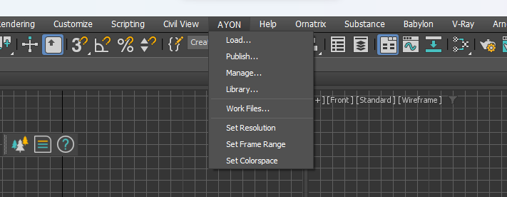
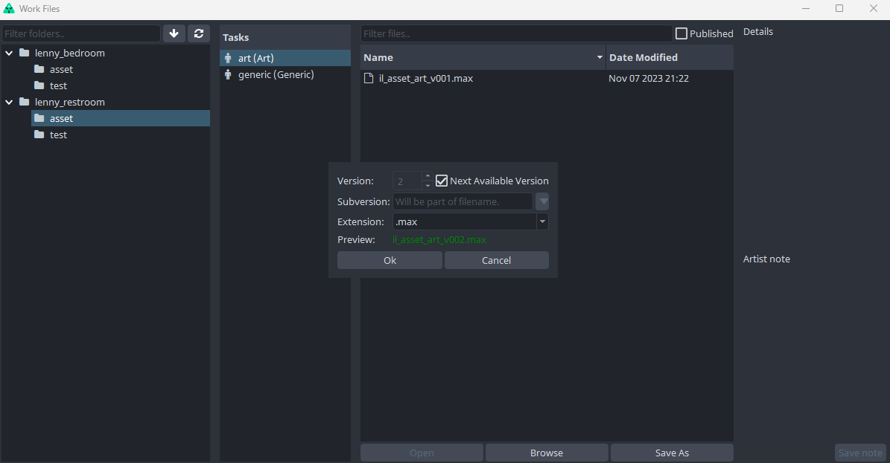
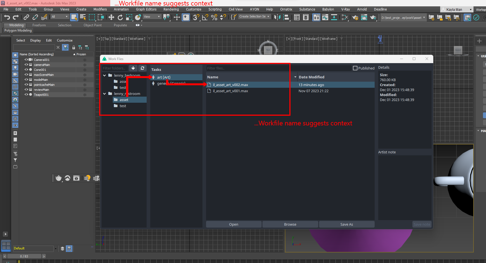
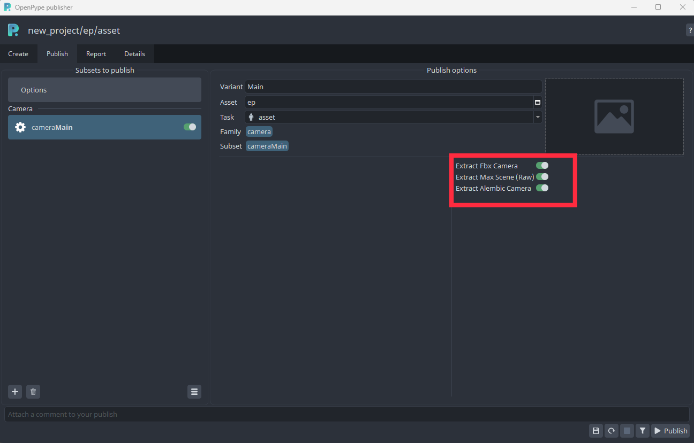
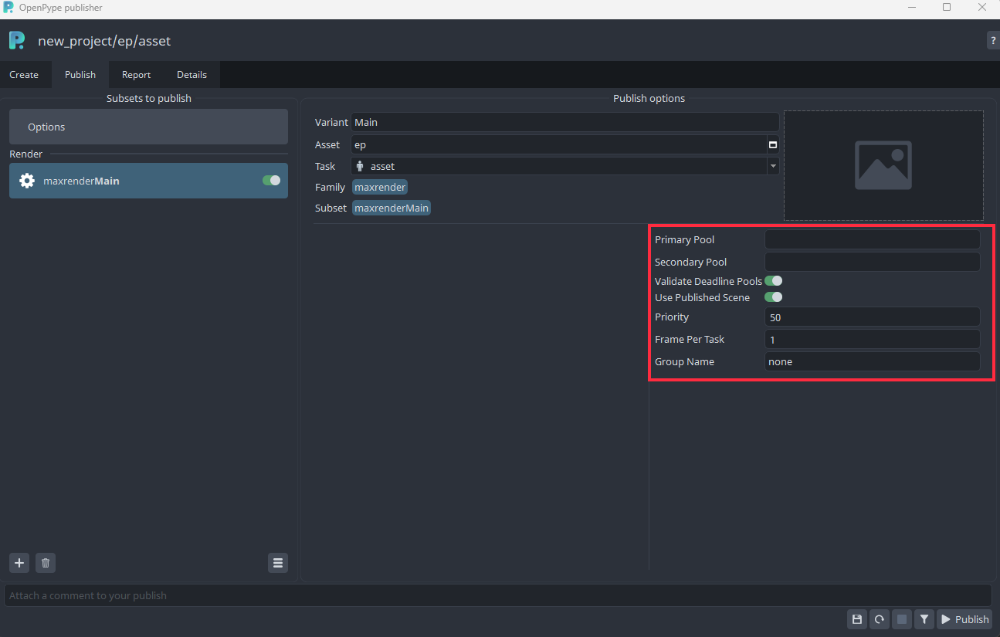

:::note Work in progress
This part of documentation is still work in progress.
:::

<!-- ## AYON Global Tools

-   [Set Context](artist_tools_context_manager)
-   [Work Files](artist_tools_workfiles)
-   [Create](artist_tools_creator)
-   [Load](artist_tools_loader)
-   [Manage (Inventory)](artist_tools_inventory)
-   [Publish](artist_tools_publisher)
-   [Library Loader](artist_tools_library_loader)
-->


## First Steps With AYON

Locate **AYON Icon** in the OS tray (if hidden dive in the tray toolbar).

> If you cannot locate the AYON icon ...it is not probably running so check [Getting Started](artist_getting_started.md) first.

By clicking the icon  ```AYON Menu``` rolls out.

Choose ```AYON Menu > Launcher``` to open the ```Launcher``` window.

When opened you can **choose** the **project** to work in from the list. Then choose the particular **asset** you want to work on then choose **task**
and finally **run 3dsmax by its icon** in the tools.


:::note Launcher Content
The list of available projects, assets, tasks and tools will differ according to your Studio and need to be set in advance by supervisor/admin.
:::

## Running in the 3dsmax

If 3dsmax has been launched via OP Launcher there should be **AYON Menu** visible in 3dsmax **top header** after start.
This is the core functional area for you as a user. Most of your actions will take place here.



:::note AYON Menu
User should use this menu exclusively for **Opening/Saving** when dealing with work files not standard ```File Menu``` even though user still being able perform file operations via this menu but preferably just performing quick saves during work session not saving actual workfile versions.
:::

## Working With Scene Files

In AYON menu first go to ```Work Files``` menu item so **Work Files  Window** shows up.

 Here you can perform Save / Load actions as you would normally do with ```File Save ``` and ```File Open``` in the standard 3dsmax ```File Menu``` and navigate to different project components like assets, tasks, workfiles etc.


You first choose particular asset and assigned task and corresponding workfile you would like to open.

If not any workfile present simply hit ```Save As``` and keep ```Subversion``` empty and hit ```Ok```.



AYON correctly names it and add version to the workfile. This basically happens whenever user trigger ```Save As``` action. Resulting into incremental version numbers like

```workfileName_v001```

```workfileName_v002```

 etc.

Basically meaning user is free of guessing what is the correct naming and other necessities to keep everything in order and managed.

> Note: user still has also other options for naming like ```Subversion```, ```Artist's Note``` but we won't dive into those now.

Here you can see resulting work file after ```Save As``` action.


## Understanding Context

As seen on our example AYON created pretty first workfile and named it ```220901_couch_modeling_v001.max``` meaning it sits in the Project ```220901``` being it ```couch``` asset and workfile being ```modeling``` task and obviously ```v001``` telling user its first existing version of this workfile.

It is good to be aware that whenever you as a user choose ```asset``` and ```task``` you happen to be in so called **context** meaning that all user actions are in relation with particular ```asset```. This could be quickly seen in host application header and ```AYON Menu``` and its accompanying tools.



> Whenever you choose different ```asset``` and its ```task``` in **Work Files window** you are basically changing context to the current asset/task you have chosen.


This concludes the basics of working with workfiles in 3dsmax using AYON and its tools. Following chapters will cover other aspects like creating multiple assets types and their publishing for later usage in the production.

---

## Creating and Publishing Instances

:::warning Important
Before proceeding further please check [Glossary](artist_concepts.md) and [What Is Publishing?](artist_publish.md) So you have clear idea about terminology.
:::


### Intro

Current AYON integration (ver 3.15.4) supports only ```PointCache```, ```Camera```, ```MaxScene```,  ```Render``` and  ```PointCloud``` families now.

**Pointcache** family being basically any geometry outputted as Alembic cache (.abc) format

**Camera** family being 3dsmax Camera object with/without animation outputted as native .max, FBX, Alembic format

**MaxScene** family being 3dsmax scene outputted as native .max format

**Render** family being 3dsmax scene submitted to AWS Thinkbox Deadline. Currently supports 3dsmax standard renderers (QuickSliver Hardware Renderer, ART Renderer, Scanline Renderer, VUE File Renderer), Vray and Redshift for multipass submissions. Only supports Arnold for beauty (RGBA) render submission.

**PointCloud** family being 3dsmax point cloud generated from tyFlow plugin and outputted as PRT format. As tyFlow is an external plugin from 3dsmax, make sure to get it install before using the **PointCloud** family.

---

:::note Work in progress
This part of documentation is still work in progress.
:::

### Publishing Point Cache (Alembic)

Simply select any animated geometry you want to export as alembic format and go **AYON -> Create** and select **Point Cache**. Make sure to keep your geometry selected before **Publish**.
### Publishing Camera

Select the camera you want to export and go **AYON -> Create** and select **Camera**.
User can go **Publish** and decide the export options by turning on/off the camera extractors.

### MaxScene

Select any type of objects in the scene you want to export and go **AYON -> Create** and select **Max Scene**.

### Render

After choosing your render setting, select the target camera for rendering in the scene and go **AYON -> Create** and select **Render**.
When you go to **Publish**, you can set up the preferences before the deadline submission.


### Point Cloud

:::note Reminder
Point Cloud Instance only works when tyFlow plugin installed in 3dsmax
:::
## ...to be added


