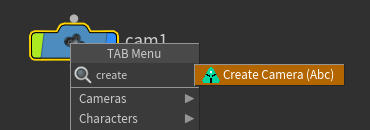
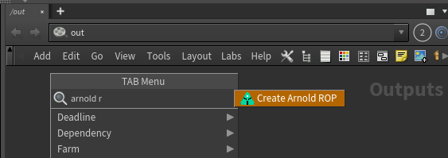
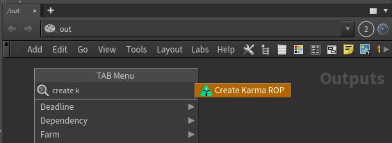

## AYON global tools

- [Work Files](artist_tools_workfiles)
- [Create](artist_tools_creator)
- [Load](artist_tools_loader)
- [Manage (Inventory)](artist_tools_inventory)
- [Publish](artist_tools_publisher)
- [Library Loader](artist_tools_library_loader)

## Ayon Menu

1. asset_name, task_name
2. Ayon create, publish, load and manage loaded assets
3. manage workfiles and artist notes
4. set global start and end frames for your Houdini session as well as FPS 
5. Update Houdini variables as in studio settings
6. Not implemented yet

## Ayon Publishing Process
:::note
Ayon tries to not be opinionated on your workflow, it only ensures that your work meets your studio's technical specifications using studio project settings customizations to customize it for particular studio or project's needs.
:::

The current publishing process is
1. Create a publish instance using `Create` menu or tab menu
2. Click publish! 
   
| Tab Menu | Create Menu |
|--|--|
|  |  |

| Publish |
|--|
|  |

## Create and publish products

### Alembic Camera 
Publish baked camera in Alembic format. 

Steps:
- Select your camera
- Go **AYON -> Create**, select **Camera (abc)**, toggle **Use selection**, set **Variant** name and click **`Create 》`**. 
  > *Alternatively, you can just select `Create Create Camera (abc)` from the tab menu.* 
  > 
- Ayon will create Alembic ROP in **/out** with path and frame range already set.
- After that, you can **AYON -> Publish** and after some validations your camera will be published to `.abc` file.

import alembic_camera from './assets/houdini/artist/alembic_camera.mp4'

<video controls style={{width: "75%" }}>
  <source src={alembic_camera}/>
</video>

### Arnold Scene Source 
Publish Arnold .ass Archive.

Steps:
- Go **AYON -> Create**, select **Arnold ASS**, set **Variant** name and click **`Create 》`**. 
  > *Alternatively, you can just select `Create Arnold ASS` from the tab menu.* 
  > 
- Ayon will create Arnold ROP in **/out** with path and frame range already set.
- After that, you can **AYON -> Publish** and after some validations your scene source will be published to `.ass` file.

### Arnold ROP 
Publish Arnold Render.

Steps:
- Go **AYON -> Create**, select **Arnold ROP**, set **Variant** name, set user attributes and click **`Create 》`**. 
  > *Alternatively, you can just select `Create Arnold ROP` from the tab menu.* 
  > 
- Ayon will create Arnold ROP in **/out** with path and frame range already set.
- After that, you can **AYON -> Publish** and after some validations your render will be published to the selected format.

### Composite (Image Sequence) 
Publish image sequence from Houdini `cop` networks.

Steps:
- Select your cop node
- Go **AYON -> Create**, select **Composite (Image Sequence)**, toggle **Use selection**, set **Variant** name and click **`Create 》`**. 
  > *Alternatively, you can just select `Create Composite (Image Sequence)` from the tab menu.* 
  > 
- Ayon will create Composite ROP in **/out** with path and frame range already set.
- After that, you can **AYON -> Publish** and after some validations your cop will be published to `exr` file.

import composite_seq from './assets/houdini/artist/composite.mp4'

<video controls style={{width: "75%" }}>
  <source src={composite_seq}/>
</video>

### Houdini Digital Asset
Publish Houdini Digital Asset for an easy interchange of data between Houdini instances or even other DCCs with Houdini Engine.
HDAs can be used to publish most of Houdini nodes.

:::caution Current limitations
1. Any HDA created by Ayon, you are not supposed to change its definition otherwise it will break.
2. It only works in Objects level
3. Having consistent data inside the HDA is your responsibility 
:::

Steps:
- Go **AYON -> Create**, select **Houdini digital asset (hda)**, set **Variant** name and click **`Create 》`**. 
- Ayon will create a HDA definition in **/obj** and move your selection inside it.
- After that, you can **AYON -> Publish** and after some validations your HDA will be published to `.hda` file.
  
import hda from './assets/houdini/artist/hda.mp4'

<video controls style={{width: "75%" }}>
  <source src={hda}/>
</video>

### Karma ROP
Publish Karma render from Houdini.

Steps:
- Select your candidate objects
- Go **AYON -> Create**, select **Karma ROP**, toggle **Use selection**, set **Variant** name and click **`Create 》`**. 
  > *Alternatively, you can just select `Create Karma ROP` from the tab menu.* 
  > 
- Ayon will create Karma ROP in **/out** with path and frame range already set.
- After that, you can **AYON -> Publish** and after some validations your render will be published to the selected format.

import karma_rop from './assets/houdini/artist/karma-rop.mp4'

<video controls style={{width: "75%" }}>
  <source src={karma_rop}/>
</video>

### Mantra ROP 
Publish Mantra render from Houdini.

Steps:
- Select your candidate objects
- Go **AYON -> Create**, select **Mantra ROP**, toggle **Use selection**, set **Variant** name and click **`Create 》`**. 
  > *Alternatively, you can just select `Create Mantra ROP` from the tab menu.* 
  > 
- Ayon will create Mantra ROP in **/out** with path and frame range already set.
- After that, you can **AYON -> Publish** and after some validations your render will be published to the selected format.

import mantra_rop from './assets/houdini/artist/mantra-rop.mp4'

<video controls style={{width: "75%" }}>
  <source src={mantra_rop}/>
</video>

### PointCache (Abc)
Publish Alembic point caches from Houdini.

Steps:
- Select your sop node or obj node
- Go **AYON -> Create**, select **PointCache (Abc)**, toggle **Use selection**, set **Variant** name and click **`Create 》`**. 
  > *Alternatively, you can just select `Create PointCache (Abc)` from the tab menu.* 
  > 
- Ayon will create Alembic ROP in **/out** with path and frame range already set.
- After that, you can **AYON -> Publish** and after some validations your render will be published to the `.abc` file.

:::note Node Selection
 When selecting an ObjNode, Ayon will try to get its sop output node with the minimum `Output Index` otherwise it will get the sop node with display flag.
:::

:::caution
 `path` attribute existence is a mandatory. 
 ayon doesn't enforce specific values, it only validates its presence and suggests a default value if `path` is missing.
:::

import alembic_pointcache from './assets/houdini/artist/alembic_pointcache.mp4'

<video controls style={{width: "75%" }}>
  <source src={alembic_pointcache}/>
</video>

### PointCache (Bgeo)
Publish Bgeo point caches from Houdini.

Steps:
- Select your sop node
- Go **AYON -> Create**, select **PointCache (Bgeo)**, toggle **Use selection**, set **Variant** name and click **`Create 》`**. 
  > *Alternatively, you can just select `Create PointCache (Bgeo)` from the tab menu.* 
  > 
- Ayon will create Geometry ROP in **/out** with path and frame range already set.
- After that, you can **AYON -> Publish** and after some validations your render will be published to the selected bgeo format.

### Redshift Proxy 
Publish Bgeo point caches from Houdini.

Steps:
- Select your sop node
- Go **AYON -> Create**, select **Redshift Proxy**, toggle **Use selection**, set **Variant** name and click **`Create 》`**. 
  > *Alternatively, you can just select `Create Redshift Proxy` from the tab menu.* 
  > 
- Ayon will create Redshift Proxy ROP in **/out** with path and frame range already set.
- After that, you can **AYON -> Publish** and after some validations your render will be published to the `.rs` file.

### Redshift ROP 
Publish Redshift render from Houdini.

Steps:
- Select your candidate objects
- Go **AYON -> Create**, select **Redshift ROP**, toggle **Use selection**, set **Variant** name and click **`Create 》`**. 
  > *Alternatively, you can just select `Create Redshift ROP` from the tab menu.* 
  > 
- Ayon will create Redshift ROP in **/out** with path and frame range already set.
- After that, you can **AYON -> Publish** and after some validations your render will be published to the selected format.
  
### Review 
Publish Reviews from Houdini.

Steps:
- Select your candidate objects
- Go **AYON -> Create**, select **Review**, toggle **Use selection**, set **Variant** name and click **`Create 》`**. 
  > *Alternatively, you can just select `Create Review` from the tab menu.* 
  > 
- Ayon will create OpenGl ROP in **/out** with path and frame range already set.
- After that, you can **AYON -> Publish** and after some validations your render will be published to the selected format.

:::note Notes
**ColorManagement:** Specifying a value for `OCIO Colorspace` parameter is a mandatory if OCIO is enabled.
Ayon doesn't enforce specific values, it only validates the value is an existent colorspace otherwise it suggests using default colorspace.

**Convert to video and add burnins:** Ayon will do them automatically on publishing if they are enabled in studio settings.
:::

import review from './assets/houdini/artist/review.mp4'

<video controls style={{width: "75%" }}>
  <source src={review}/>
</video>

### Static Mesh (FBX)
Publish Static Meshes from Houdini.

Steps:
- Select your sop node or obj node or obj subnetwork.
- Go **AYON -> Create**, select **Static Mesh**, toggle **Use selection**, set **Variant** name and click **`Create 》`**. 
  > *Alternatively, you can just select `Create Static Mesh (FBX)` from the tab menu.* 
  > 
- Ayon will create Flimbox FBX ROP in **/out** with path and frame range already set.
- After that, you can **AYON -> Publish** and after some validations your render will be published to the `.fbx` file.

:::note Node Name and subset name
By default, the name will be something like this `staticMeshMain`

If your admin used unreal static mesh namings, you'll find names be something like this `S_assetNameMain` 

:::

import filmbox_fbx from './assets/houdini/artist/filmbox-fbx.mp4'

<video controls style={{width: "75%" }}>
  <source src={filmbox_fbx}/>
</video>

### USD (experimental) 
### USD render (experimental) 
### VDB Cache
Publish VDB caches from Houdini.

Steps:
- Select your sop node or obj node
- Go **AYON -> Create**, select **VDB Cache**, toggle **Use selection**, set **Variant** name and click **`Create 》`**. 
  > *Alternatively, you can just select `Create VDB Cache` from the tab menu.* 
  > 
- Ayon will create Geometry ROP in **/out** with path and frame range already set.
- After that, you can **AYON -> Publish** and after some validations your render will be published to the `.vdb` file.

:::note Node Selection
 When selecting an ObjNode, Ayon will try to get its sop output node with the minimum `Output Index` otherwise it will get the sop node with display flag.
:::

import vdb from './assets/houdini/artist/vdb.mp4'

<video controls style={{width: "75%" }}>
  <source src={vdb}/>
</video>

### VRay ROP
Publish VRay render from Houdini.

Steps:
- Select your camera
- Go **AYON -> Create**, select **VRay ROP**, toggle **Use selection**, set **Variant** name and click **`Create 》`**. 
  > *Alternatively, you can just select `Create VRay ROP` from the tab menu.* 
  > 
- Ayon will create VRay ROP in **/out** with path and frame range already set.
- After that, you can **AYON -> Publish** and after some validations your render will be published to the selected format.

---

## Publishing Point Caches (alembic)
Publishing point caches in alembic format is pretty straightforward, but it is by default enforcing better compatibility
with other DCCs, so it needs data do be exported prepared in certain way. You need to add `path` attribute so objects
in alembic are better structured. When using alembic round trip in Houdini (loading alembics, modifying then and
then publishing modifications), `path` is automatically resolved by alembic nodes.

In this example, I've created this node graph on **sop** level, and I want to publish it as point cache.

*Note: `connectivity` will add index for each primitive and `primitivewrangle1` will add `path` attribute, so it will
be for each primitive (`sphere1` and `sphere2`) as Maya is expecting - `strange_GRP/strange0_GEO/strange0_GEOShape`. How
you handle `path` attribute is up to you, this is just an example.*

Now select the `output0` node and go **AYON -> Create** and select **Point Cache**. It will create
Alembic ROP `/out/pointcacheStrange`

## Redshift
:::note Work in progress
This part of documentation is still work in progress.
:::

## USD (experimental support)
### Publishing USD
You can publish your Solaris Stage as USD file.

This is very simple test stage. I've selected `output` **lop** node and went to **AYON -> Create** where I've
selected **USD**. This created `/out/usdDefault` USD ROP node.

### Publishing USD render

USD Render works in similar manner as USD file, except it will create **USD Render** ROP node in out and will publish
images produced by it. If you have selected node in Solaris Stage it will by added as **lop path** to ROP.

## Publishing VDB

Publishing VDB files works as with other data types. In this example I've created simple PyroFX explosion from
sphere. In `pyro_import` I've converted the volume to VDB:

I've selected `vdb1` and went **AYON -> Create** and selected **VDB Cache**. This will create
geometry ROP in `/out` and sets its paths to output vdb files. During the publishing process
whole dops are cooked.

## Publishing Houdini Digital Assets (HDA)

## Loading HDA

When you load hda, it will install its type in your hip file and add published version as its definition file. When
you switch version via Scene Manager, it will add its definition and set it as preferred.

## FAQ

### How does Ayon name ROP nodes ? 

The default naming consists of family name (product type) and variant name
For example if you are creating a `camera` publish and set the variant to name `Main`
Then Ayon will create a rop node with the name `cameraMain`.

:::note 
Admins are free to change the default naming.
:::

### Does Ayon work with vanilla Houdini ROPs and Deadline nodes ?
This feature is not implemented yet.

### How to publish existing files on disk ?
This feature is not implemented yet.

For more info, Follow this Github Issue [Enhancement: Houdini publish existing caches/frames](https://github.com/ynput/OpenPype/issues/5767)