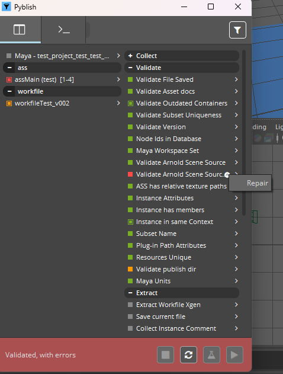
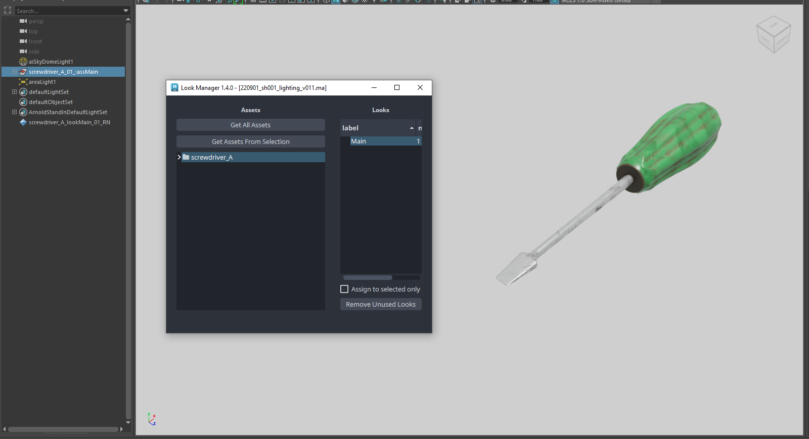

## Arnold Scene Source (.ass)
Arnold Scene Source can be published as a single file or a sequence of files, determined by the frame range.

When creating the instance, two objectsets are created; `content` and `proxy`. Meshes in the `proxy` objectset will be the viewport representation when loading as `standin`.

### Arnold Scene Source Proxy Workflow
`AssMain` set is  created with `assMain_content_SET` and `assMain_proxy_SET` as its children.
In order to utilize operators and proxies, the content and proxy nodes need to share the same names (including the shape names
and CBIDs). This is done by parenting the content and proxy nodes into separate groups. For example:


Once you put the nodes into contents and proxies set, you are ready to see if it passes validation and gets published.
Validators `ASS has relative texture paths` and `Validate Arnold Scene Source CBID` can allow you to set up
the context correctly by using repair function.



Once you pass the validator, you can publish your contents and proxies.
## Standin
Arnold Scene Source `ass` and Alembic `abc` are supported to load as standins.
When you load `ass` when the loaders, it will import two `ass` groups with standins as children.
Both standins load `_proxy` ass files by default, and you can choose to change the `content`
manually by clicking file icon in the standin and change the files with `_proxy` naming conventions.


## Look Development
Standin Nodes are now supported for look assignment.If you publish the look development object with the look family, while you publish the object with Arnold Scene Source. You can assign the look to the published Arnold Scene Source `ass` and Alembic `abc` through `AYON -> Look Assigner...` when you load it as standin.



:::note Limited support for shader assignments with standin nodes
Limited amount of attributes supported by using operator to assign shaders to the loaded standins.

```
primaryVisibility
castsShadows
receiveShadows
aiSelfShadows
aiOpaque
aiMatte
aiVisibleInDiffuseTransmission
aiVisibleInSpecularTransmission
aiVisibleInVolume
aiVisibleInDiffuseReflection
aiVisibleInSpecularReflection
aiSubdivUvSmoothing
aiDispHeight
aiDispPadding
aiDispZeroValue
aiStepSize
aiVolumePadding
aiSubdivType
aiSubdivIterations
```
:::

### Standin Proxy Workflow
If a subset has a proxy representation, this will be used as display in the viewport. At render time the standin path will be replaced using the recommended string replacement workflow;

https://help.autodesk.com/view/ARNOL/ENU/?guid=arnold_for_maya_operators_am_Updating_procedural_file_paths_with_string_replace_html

Since the content and proxy nodes share the same names and hierarchy, any manually shader assignments will be shared.


:::note for advanced users
You can stop the proxy swapping by disabling the string replacement operator found in the container.

:::
