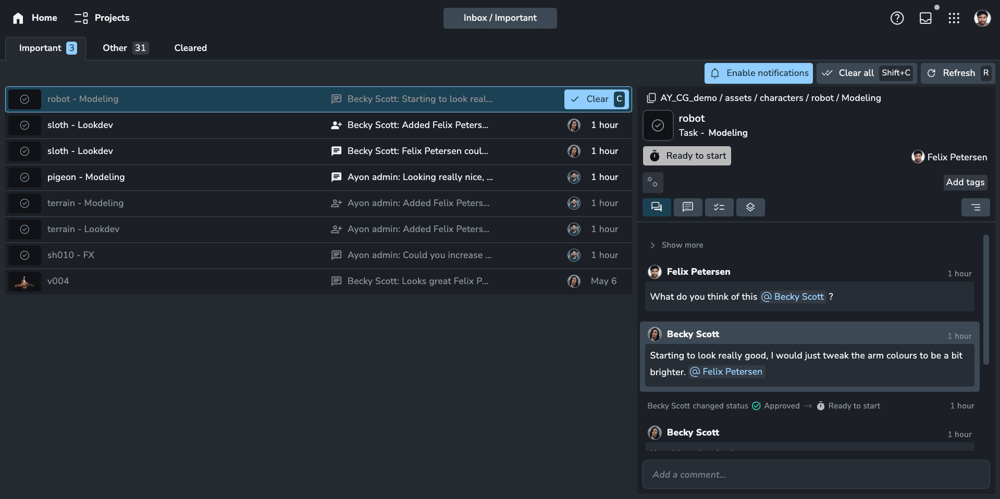
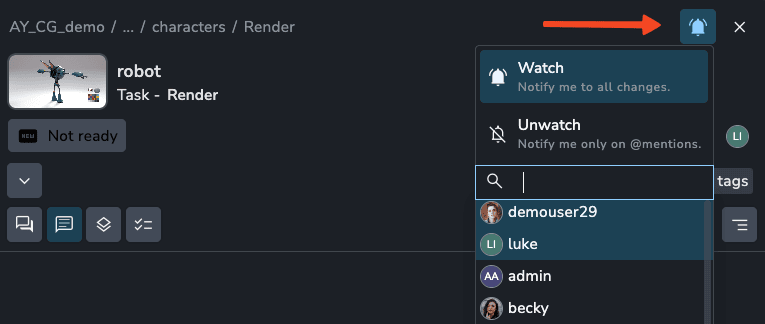
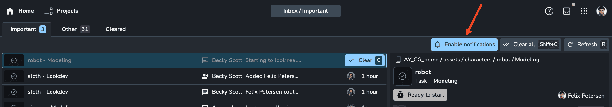
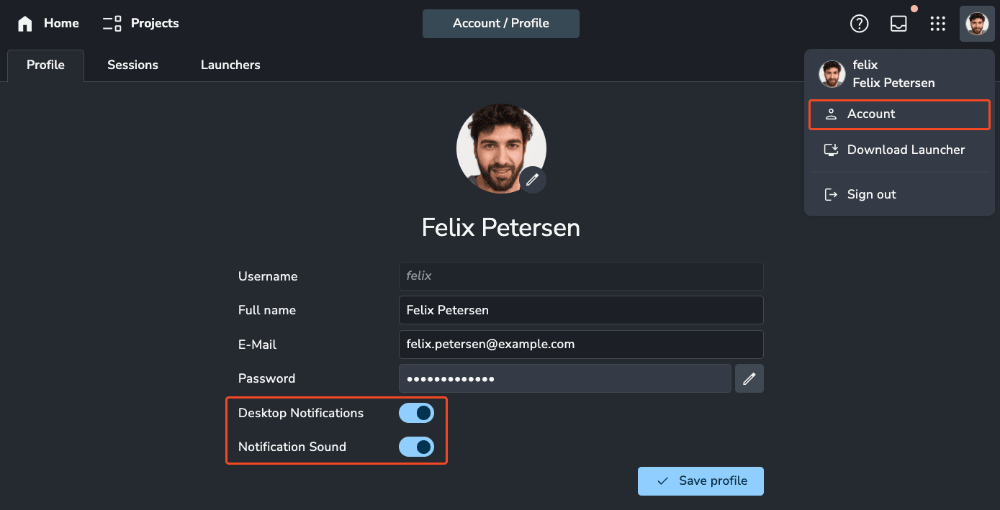

:::info
The inbox was introduced in `1.2.0`.
:::

## Overview

The inbox is an email-inspired feature that consolidates all your updates and notifications across AYON. Designed for more than just listing notifications, it serves as a hub of organization and prioritization. With two tabs, "Important" and "Other," it ensures that crucial messages don't get lost in the production noise. Related notifications, such as multiple messages about the same folder, are grouped together for better clarity.

Think of the inbox as a dynamic to-do list for tasks that require your attention. You can mark messages as read to revisit them later, or clear them once you're done to keep your workflow organized.

:::tip
The inbox has full keyboard support! Hover over any message and press `X` to mark it as read/unread or `C` to clear/unclear.
:::

**Important Messages Examples**

-   You are directly mentioned in the comment. For example: `Looks great @Felix Peterson`.
-   You are a watcher on a task.
-   You are assigned to or removed from a task and therefore become a watcher.
-   You make a comment and therefore become a watcher.

**Other Messages Examples**

-   You are removed from a task.
-   New activity on entities you are assigned to or have authored, including:
    -   Comments
    -   Status changes
    -   Assignee changes

[Read more about importance](artist_inbox.md#importance-table)

## Watchers

Watchers are users who receive important notifications about changes to an entity. This is useful in scenarios where you may not be directly working on an entity but still need to stay updated.

Watchers are often added automatically. For example, posting a comment on an entity will automatically add you as a watcher so you can receive updates such as replies to your comment. Similarly, being assigned to a task will add you as a watcher to that task.

You can manually update your watcher status using the bell icon in the toolbar at the top of the entity’s details panel. A blue bell indicates that you are watching the entity.

Watchers was introduced in `1.3.1`

## Importance Table

| When you...                  | Then you...                | Watchers receive... | Users with a relation receive... |
| ---------------------------- | -------------------------- | ------------------- | -------------------------------- |
| post a comment               | become a watcher           | Important           | Other                            |
| are mentioned in a comment   | get important notification | Important           | Other                            |
| post a reviewable            | become a watcher           | Important           | Other                            |
| publish a version            | become a watcher           | Important           | Other                            |
| get assigned to a task       | become a watcher           | Important           | Other                            |
| change a status of an entity | -                          | Important           | Other                            |
| assign someone to a task     | -                          | Other               | Other                            |
| remove someone from a task   | -                          | Other               | Other                            |

## Realtime Notifications

Enable browser push notifications to stay aware of new important inbox messages. You can activate these notifications from the inbox or your account profile page.

You can also enable notification sounds for added awareness.

:::tip
Desktop notifications and notification sounds work independently to one another.
:::

:::warning
Desktop notifications will not work over HTTP connections due to strict browser security measures.
:::
