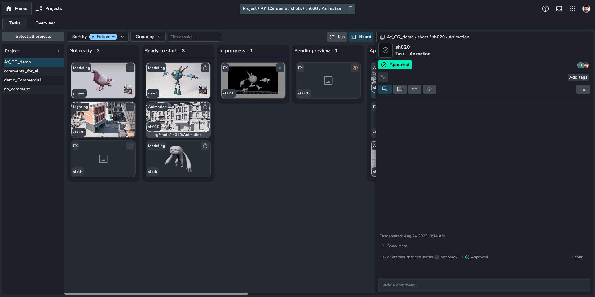
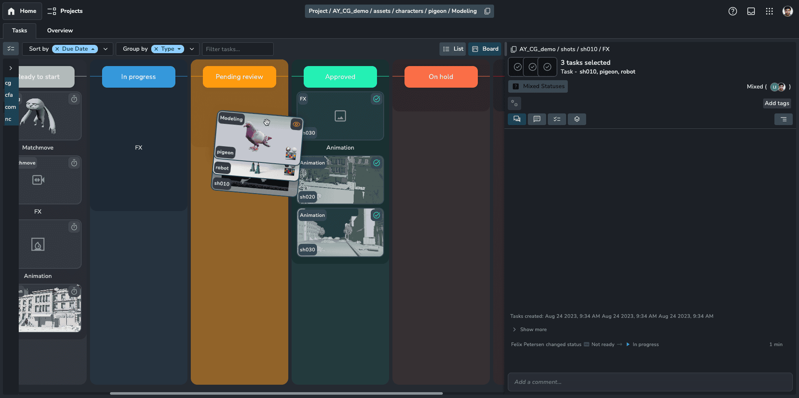
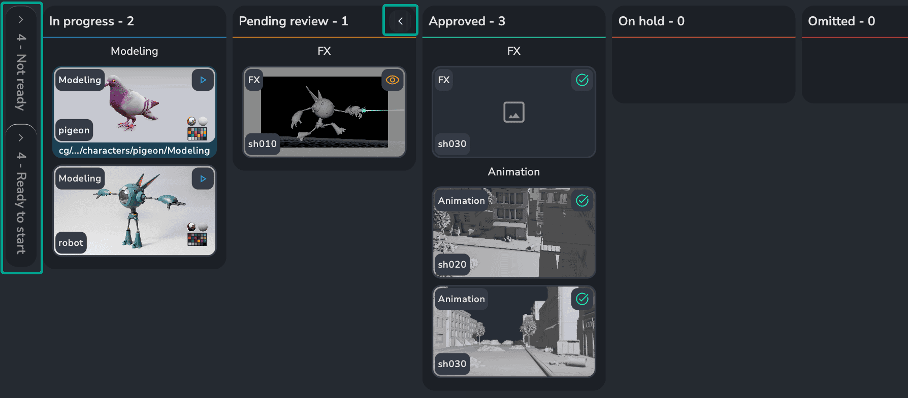
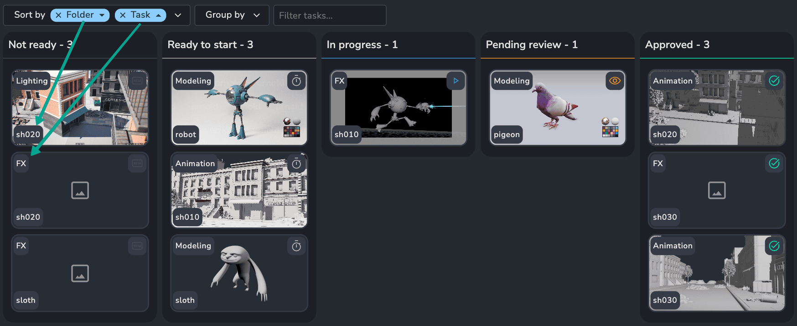
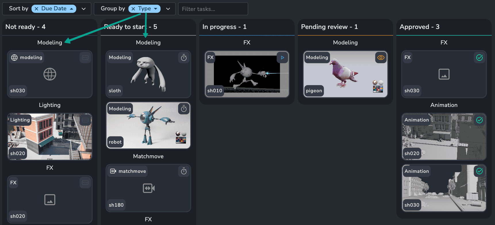
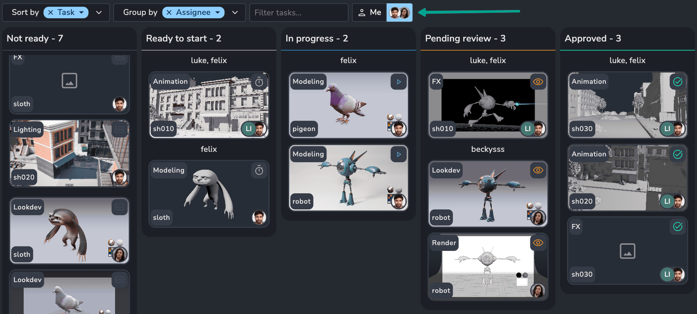
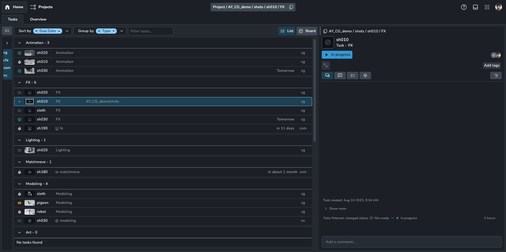
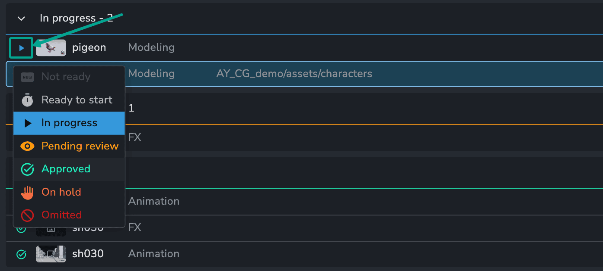

:::tip
Use the shortcut H+H (double press H) to navigate to the home page from anywhere.
:::

## Overview

Welcome to your Tasks home page! This is where you'll land when you first log in and is likely to be your central hub for managing your tasks. Designed specifically for artists, it provides a clear view of your assignments, their statuses, and allows you to collaborate by leaving comments and receiving feedback.

:::note
This page displays all your **assigned** tasks. To see the complete project context, open it in the browser or log in with an admin or manager account.
:::

## Board View

The task board, also known as Kanban, visually organizes your tasks by status. Click a task to open the details panel, revealing more information like its activity feed, versions, and attributes. Within the activity feed, you can discuss the task and leave comments. [Read more about the activity feed](artist_activity_feed).

### Status Management

You can change a task's status by either dragging it to a different column on the board or selecting a new status from the dropdown menu within its details panel.

:::tip
Boost your efficiency! Select multiple tasks simultaneously and either drag them together to update their status or manage them all at once through the details panel.

:::

### Board Organisation

You can minimize the Kanban board by collapsing individual status columns. Click the small button located in the top right corner of each column to collapse it.

### Thumbnails

While we recommend using thumbnails for published versions, you can easily update any task's thumbnail by dragging a file directly onto its details panel.

:::note
By default, task thumbnails display the latest version's thumbnail. However, if a custom thumbnail has been set for a specific task, that will take precedence.
:::

## Sorting and Filtering

The Tasks page has powerful sorting and filtering features and we intend to add more overtime based on user feedback.

### Sort By

Sort tasks by multiple types and in different directions.

For example, you might sort by folder name to group related tasks. However, if you have multiple tasks within a folder named similarly (like "sh020"), you can add a secondary sort by task name for a more granular view.

### Group By

Group tasks by any relevant field, like project or type. This is especially helpful for managing tasks across different projects or bringing similar tasks together for a clearer view. Grouping even works alongside sorting, so you can sort your grouped tasks for ultimate organization!

### Assignee View

Admins and managers can view other users' boards. This provides a quick way to see what tasks are assigned to specific artists and their current workload.

:::note
Stay tuned! We're developing a feature that will allow you to select all users simultaneously.
:::

## List View

Switch to the list view for a data-rich, minimalist layout that prioritizes efficiency. This view is perfect for users with heavy workloads, and it offers full keyboard support for lightning-fast task selection. Plus, grouping lets you organize your tasks and collapse them for a cleaner, focused workspace.

:::tip
To collapse or expand a group in the list view, simply hover over the group and press To collapse or expand a group in the list view, simply hover over the group and press **C** on your keyboard. on your keyboard.

:::

:::tip
In the list view, you can change a task's status directly. Just click the status icon next to the task to see the available options and choose the new one.

:::
