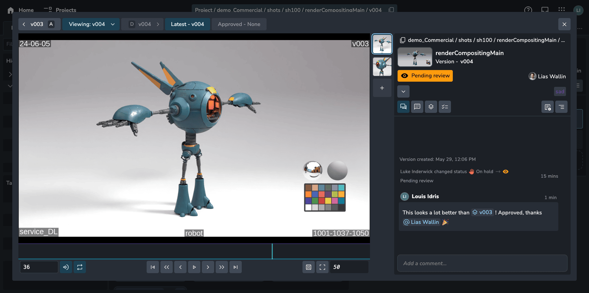
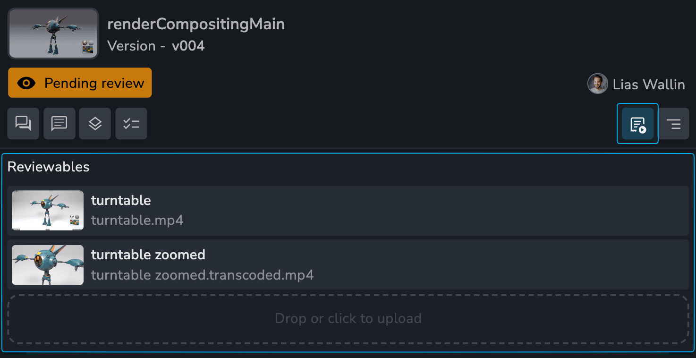
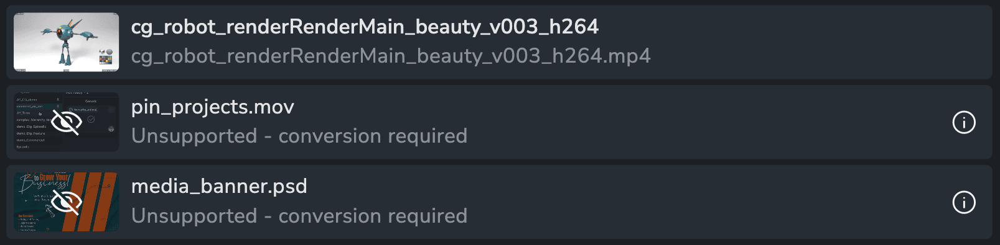
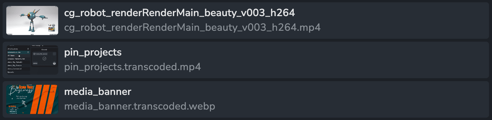
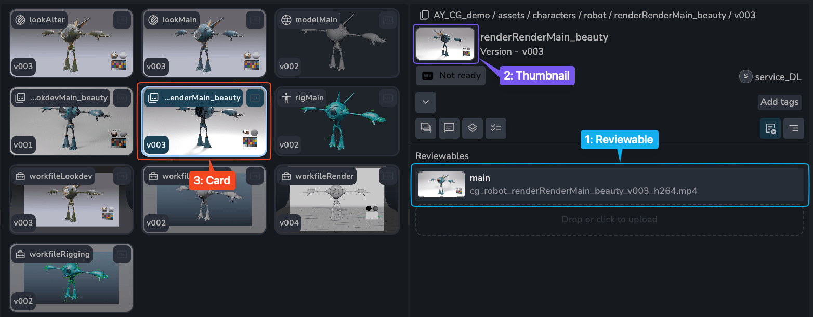
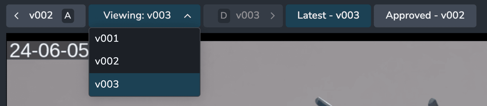

:::info
Reviewables were introduced in `1.3.0`.
:::

## Overview

The reviewables feature streamlines the version review process, making it both simple and powerful. Traditionally, each version could only have a single "representation" for reviewing. Reviewables revolutionize this by allowing you to create and manage as many focused review elements as needed for a single version. These reviewables can be conveniently uploaded and managed directly within the web interface.

:::tip
Here are some examples of how reviewables could be utilized:

-   A model needs to be reviewed with multiple different lighting setups.
-   A complex model needs to have be viewed close up.
-   An animation needs to be viewed from multiple angles.
-   An environment needs to show different areas in more detail.

:::

## Reviewables Tab

Every version has a "Files" tab that can be used to view, manage and upload new reviewables. To upload a reviewable drag and drop a media file over the reviewables area or click the dropzone to pick a file.

### Default File Support

By default the viewer supports web standard file types that don't need any conversion.

**Image**: `png` `jpg` `webp`

**Video**: `mp4`

:::info
You will see a message to let you know if a reviewable file is not viewable, however anyone with access can still download the file.

:::

### Transcoding File Support

File types that are not natively supported by the browser need to be converted using a transcoder. The transcoder is only available through a subscription on [Ynput Cloud](https://ynput.cloud/subscribe/ayon).

**Image**: Most images types including `psd` files

**Video**: `mp4` `mov: 264, 265, prores` `mpeg` `webm` `wmv` `avi`

:::tip
Transcoded media will have filenames with `.transcoded.` in them. You can always download the original uploaded file.

:::

## Web Viewer

You can quickly view a Reviewable by using the Web Viewer. To open the viewer:

1. Click on a reviewable
2. Click on any entity thumbnail
3. Press spacebar on any selection for folders, tasks and versions.

### Player Controls

The viewer comes with all the player controls you would expect and we plan to add more advanced controls in the future.

-   Play/Pause `Spacebar`
-   Next/Previous frame `Left and Right arrows`
-   Next/Previous 5 frames `Shift Left and Right arrows`
-   First frame `Shift A`
-   Last frame `Shift D`
-   Full screen `F`
-   Mute `M`
-   Looping
-   Grid overlay
-   Scrubbable timeline

### Comparing Versions

The viewer makes it incredibly easy to compare different versions of the same reviewable. Go to any frame and select the next or previous version. If there's a matching reviewable it will be displayed on the same frame.

import versionsSwitching from "./assets/review/viewer_versions_switching_v002.mov";

<video controls width="100%">
    <source src={versionsSwitching} />
</video>

:::tip
We recommend using the two main shortcuts `A - previous version` and `D - next version` to quickly flick back and forth between versions.
:::

### Comparing Reviewables

Reviewables with the same label across versions will be synced allowing for comparison of two reviewables from different versions.

import reviewablesSwitching from "./assets/review/reviewables_switching_v002.mov";

<video controls width="100%">
    <source src={reviewablesSwitching} />
</video>
