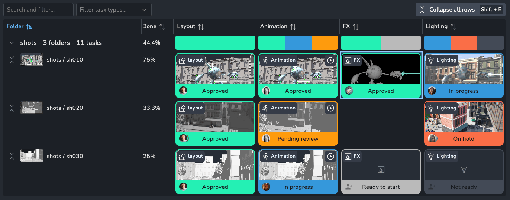
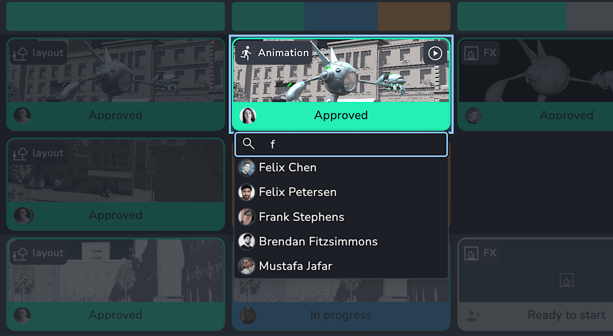
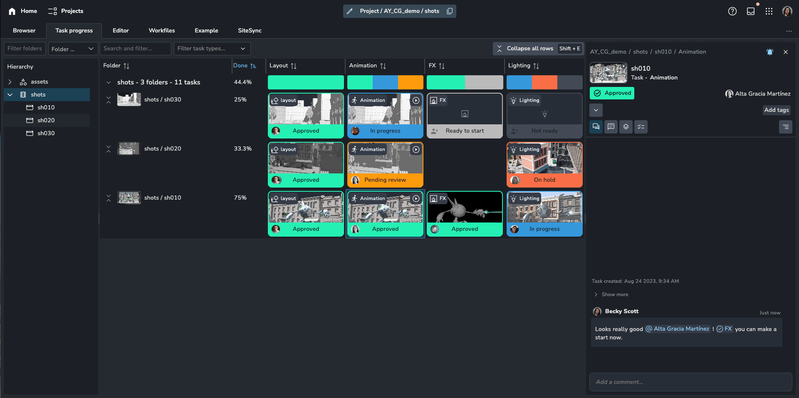

:::info
The Task Progress page was introduced in `1.4.0`.
:::

### Overview

The Task Progress page provides a clear overview of the status of all tasks within a project.

It’s an ideal tool for assessing the overall progress of the entire project or focusing on specific areas. The page also allows for full task editing, with emphasis on updating task statuses and reassigning team members.

### Focused On

-   Getting an overall feel of progression
-   Managing statuses of many tasks
-   Assigning users to tasks

import showcase from "./assets/task_progress/task_progress_showcase_v002_min.mp4";

<video controls width="100%">
    <source src={showcase} />
</video>

### Management

To update a task's status or assignees, first select the task cell, then click on the left or middle section.

:::tip
When selecting multiple tasks and adding or removing a user, the original assignees for each task will be updated to include or exclude that user. For example, adding "John" to tasks will keep the current assignees intact while adding "John" to each task.
:::

### Details

For more details or additional changes to a task, open the details panel by double-clicking on the task.

:::tip
To quickly view a task's reviewables, press the `Spacebar` on a selected task. Tasks with available reviewables will display a play button in the top-right corner.
:::
