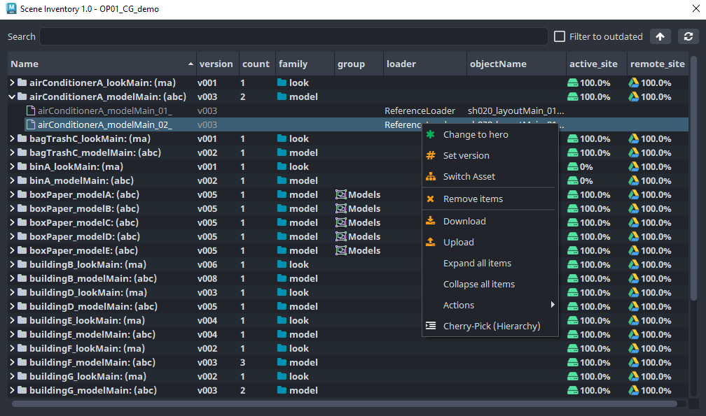
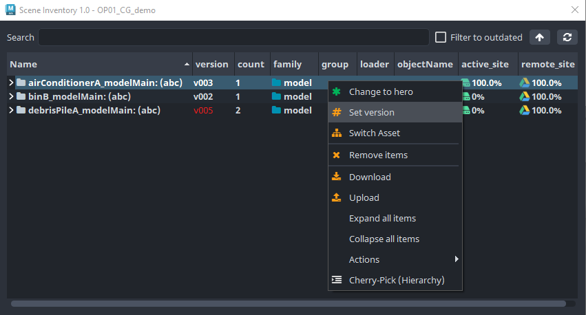
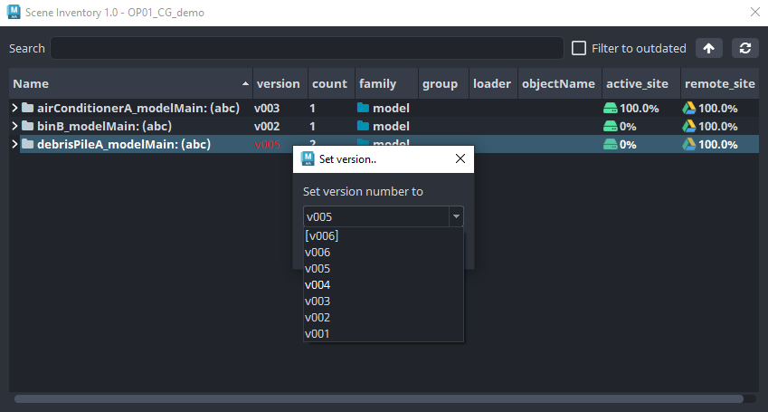
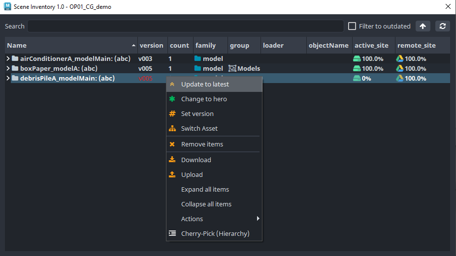
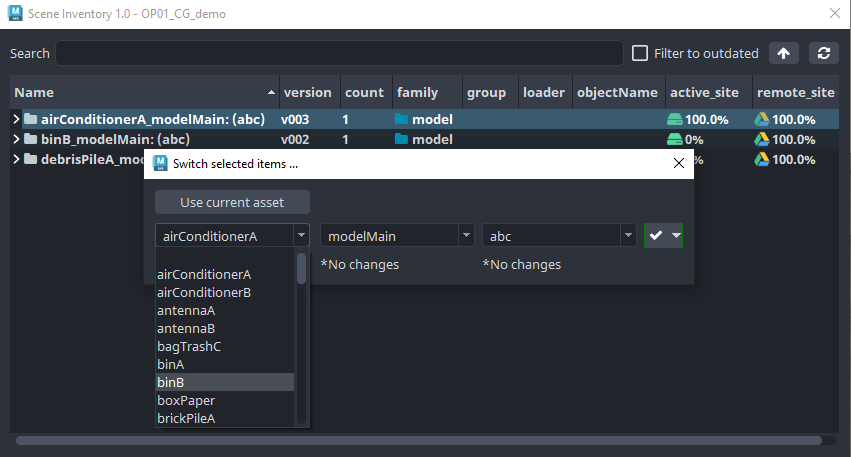
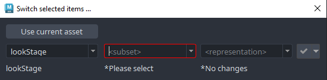

# Inventory

With Scene Inventory, you can browse, update and change assets already loaded via [Loader](artist_tools_loader) in your current workfile scene / script.
You can think of it as sort of a manager with list of assets in your scene with acompanying information and data.

To use it go to **AYON** Menu > **Manage**  which opens **Inventory** for use.

:::note
Understanding [Key concepts](artist_concepts) and being aware of AYON terminology is a neccessity to be able to use this tool fully.
:::

Here is a small demo of a usage in Maya DCC host and where to locate it and its basics:

import loaderVideo from './assets/video/tools_inventory_01.mp4'

<video controls style={{width: "75%" }}>
  <source src={loaderVideo}/>
</video>

:::note
You can also use widget (Maya UI bottom left turqoise colored icon) to open Inventory window too. This can differ and depends on DCC host and AYON integration.
:::

___

## Actions

The Inventory has a simple GUI focused on efficiency. All Assets present in the current workfile are listed, sorted or grouped by asset, subset and representation names making it easy for user to manage those one by one or simultaneously in one step making possible changes of multiple assets at once.

User can **select** Asset / Subset **by left cliking** on a particular item in the list.

By **right clicking** then opens **Action** menu to interact with previously selected item being able to update, remove, switch the asset etc.

<!-- To interact with any container, you need to right click it and you'll see a drop down with possible actions. The key actions for production are already implemented, but more will be added over time. -->

:::note
The items in the Inventory turns red when outdated and newer version (aka latest) version exists / is available.
:::

## Types of Action

___

### Change to hero

User can set asset to use hero / master file instead of versioned files

:::note
Hero version being unique master file asset which got overwritten each time publishing of an asset happens and is indicated by bracketed ``[version]``. When used in production such an asset being always up-to-date sourcing the latest data by its nature.
:::

### Set Version

User explicitly choose particular version even though newer / older can exist. This can be benefical when need to fallback to particular asset state from the past.

### Update to Latest

When some asset being outdated and newer version exists its marked in red color and new **Update to Latest** action appear in the menu.

___

### Switch Asset
This action gives ability to switch asset, subset, representation and its version of currently selected asset(s).

Asset consists of multiple components and it is possible to switch any of these *(asset, subset, representation and version)*. There are some limitations though.

:::warning
Limitation example: Asset consisting of `.ma` representation cannot be switched to `.abc` representation if not existing for target asset. This apply for any missing target data. 
:::

Switch tool won't let you cross the border of limitations and inform you when you have to specify more if impossible combination occurs *(It is also possible that there will be no possible combination for selected assets)*. Border is colored to red and confirm button is not enabled when specification is required.

Possible cases for switches:
- switch **representation** (`.ma` to `.abc` or `.exr` to `.dpx`, etc.)
- switch **subset** (`modelMain` to `modelHD`, etc.)
    - `AND` keep same **representation** *(with limitations)*
    - `AND` switch **representation** *(with limitations)*
- switch **asset** (`oakTree` to `elmTree`, etc.)
    - `AND` keep same **subset** and **representation** *(with limitations)*
    - `AND` keep same **subset** and switch **representation** *(with limitations)*
    - `AND` switch **subset** and keep same **representation** *(with limitations)*
    - `AND` switch **subset** and **representation** *(with limitations)*

:::tip
User can switch multiple assets in one step if they contain same data types, being it `representation`, `subset`, `LOD` etc.
:::

There is one more switch layer above subset for asset's LOD (Level Of Detail). That requires to have published subsets with suffix **"_LOD{number}"** where number represents level (e.g. modelMain_LOD1). Its possible to switch just `subset` but keep `LOD` and vice versa.
 

 <!-- picture needs to be changed -->

:::note
This option is hidden if you didn't select subset that have published subset with LODs.
:::

### Remove Items

As the name implies this action simply removes assets from current workfile scene / script.

### Download

Forcing AYON to download current selection from Remote Site via SiteSync tool.

### Upload

Forcing AYON to upload current selection to Remote Site via SiteSync tool.

:::note
Only available when SiteSync feature in the AYON settings activated.
:::

### Expand All Items

Just expands all folders in the list so everything become visible in the list.

### Collapse All Items

Just collapse all folders in the list so everything inside folders become hidden in the list.

### Actions Submenu

Contains various context sensitive tools for user. Content heavily depending on use case / DCC host and AYON integration.

<!-- ### Change version
You can change versions of loaded assets / subsets with Inventory tool.

#### Update to the latest version
Select containers or subsets you want to update, right-click selection and press `Update to latest`.

#### Change to specific version
Select containers or subsets you want to change, right-click selection, press `Set version`, select from dropdown version you want change to and press `OK` button to confirm.

 -->
  
___

## Filtering

User can easily full-text filter out items in lists by typing into `Search` bar at the top of the **Inventory** 

Here you can see several filters in the Inventory.

<video controls style={{width: "75%" }}>
  <source src={loaderVideo}/>
</video>

<!--

-->

### Filter with Cherry-pick selection

To keep only selected subsets right-click selection and press `Cherry-Pick (Hierarchy)` *(Border of subset list change to **orange** color when Cherry-pick filtering is set so you know filter is applied).*

To return to original state right-click anywhere in subsets list and press `Back to Full-View`.

:::tip
You can also Cherry-pick from Cherry-picked subsets.
:::

___

#### This concludes the basics of the Inventory tool.
