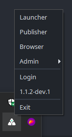
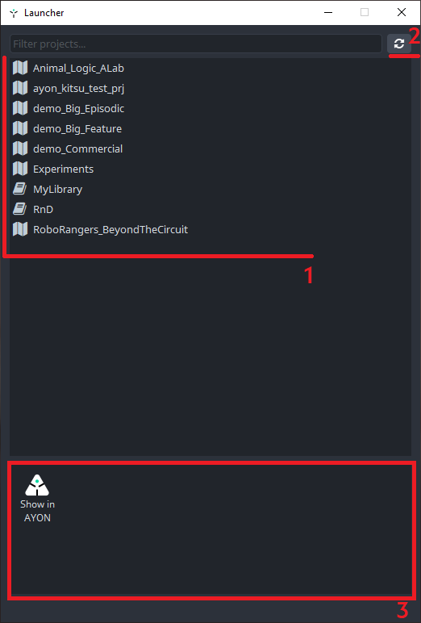
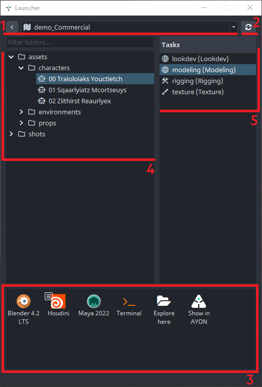
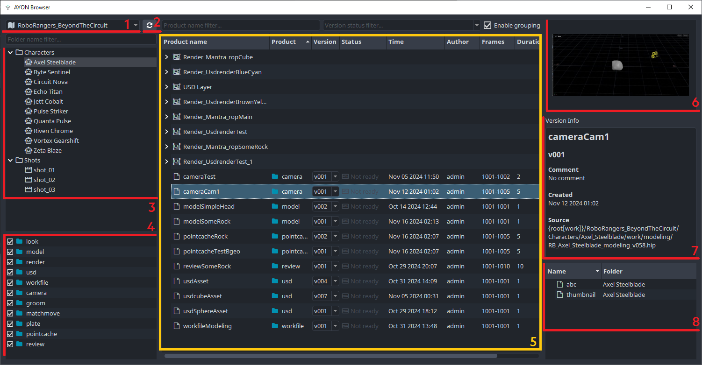
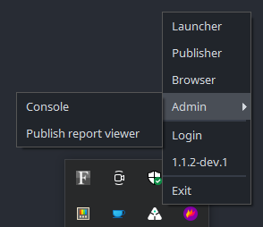
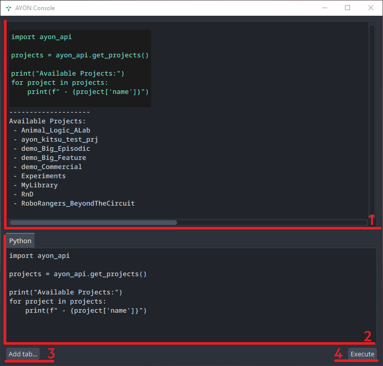
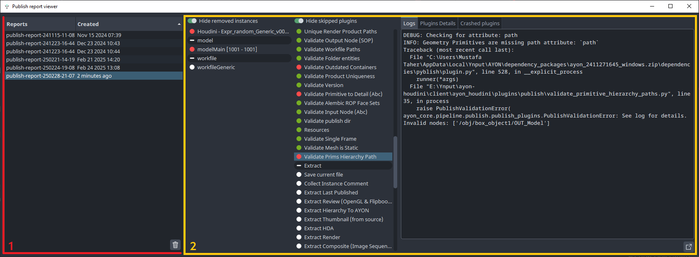
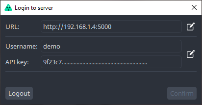
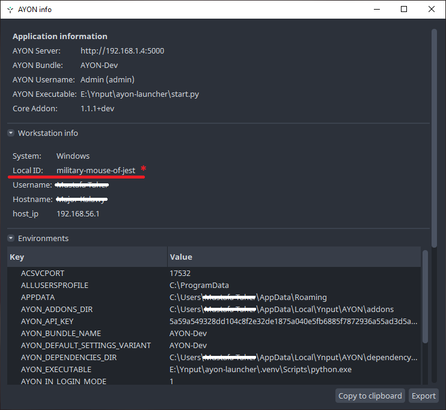

:::info
This page explains the basic usage of AYON Launcher.
Where it explains the Tray Menu and how to use different actions.
:::

## Intro

Once Launching AYON Launcher, AYON icon should appear in your tray.

:::tip launcher icon color code

AYON icon can appear in different colors indicating the [pipeline mode](admin_server_bundles_and_addons.md#pipeline-modes) AYON was launched in.
- ⬤ : AYON is launched in Production mode.
- ⬤ : AYON is launched in Staging mode.
- ⬤ : AYON is launched in Development mode.

The default executable created when installing AYON Launcher starts the launcher in  the Production mode, as it's the stable mode for your studio's daily work.

For more info about running the launcher in different modes, please refer to [Launch in different Pipeline Modes](ayon_launcher_artist_advanced.md#launch-in-different-pipeline-modes)

:::

## Tray Menu
When clicking AYON Icon in your tray, AYON Tray menu appears.
It provides a set of tools: 

- [Launcher](#launcher)
- [Publisher](#publisher)
- [Browser](#browser)
- [Admin (Utilities)](#admin-utilities)
- [Login](#login)
- [Launcher Info](#launcher-info) *The Button with Launcher version*
- [Exit](#exit)

### Launcher

AYON Launcher which is used to launch DCCs in the specified AYON context.

#### Launcher UI

| Select A project | Select a task and trigger an action |
|--|--|
|  |  |

Launcher UI:
1. Select a Project, if there's no selected project, you'll find a project filter at the top.
2. Refresh View
3. Actions Pane
4. Select Folder, You'll find a folder filter at the top.
5. Select Task

#### Action Pane

Available actions follow your studio's configuration for application and tools settings mentioned in [Applications and Tools](addon_applications_admin.md).

Action left click: Trigger the action and Opens a list of available application variants.
Action right click: Changes the mode of the action, this is mostly associated with running applications where you can specify if you want to launch the 

#### Common Actions

- **Launch Applications** : As explained in the previous section, they are denoted by the DCC app icon.
- **Explore here**: Opens the location for the selected folder or task in the file explorer.
- **Show in AYON**: Opens the location for the selected folder or task on AYON server.
- **Terminal**: This special one when clicked allows you to pick the shell context. This is most useful for admins and TDs. More info about it in [Launcher Advanced Usage](ayon_launcher_artist_advanced.md)

### Publisher 

*This is only available if your admin added tray publisher addon to the pipeline bundle.*

When clicked it launches the standalone publisher, for more info refer to [Tray Publisher Docs](addon_traypublisher_artist.md).
It's the same as our [Publisher](artist_tools_publisher.md) tool but it's standalone.

### Browser
Explore Published Products.
It's the same as [loader](artist_tools_loader.md) tool but it's used for browsing and checking published products.

1. Select a Project
2. Refresh UI
3. Select a folder
4. Available published product types
5. Available published products
6. Thumbnail of the selected product or folder
7. Version Info of the selected product
8. Available representation for the selected product version.

### Admin (Utilities)

Useful AYON utilities for Admins and TDs. 

#### Console
It's like any other script editor in DCCs where you can interact directly with AYON.

1. Script Output Pane
2. Script Input Pane
3. Add tab...
4. Execute

:::tip Some useful code snippets

- [AYON Python API First Steps | Ynput Forums](https://community.ynput.io/t/ayon-python-api-first-steps/1278)
- [BigRoy's Gist](https://gist.github.com/BigRoy)
- [AYON Recipes](https://github.com/MustafaJafar/ayon-recipes)

:::

#### Publish Report Viewer
This tool is used to examine exported publish report.

1. Publish reports pane: drag and drop publish report to add them. click the trash icon to remove them from the pane.
2. Report viewer: which is 1:1 to what the publisher looked like when the report was exported.

### Login
Login to AYON where you use the credentials provided by your studio.
You can login directly using the input fields on the login window or click `Login with AYON Server` to login using the browser.

Once logged in, the login window will show the current user.

### Launcher Info
This button is labeled with AYON launcher version.
When clicked it shows additional information about your installed AYON launcher, local site ID and environment variables.

:::info

See [Environment variables](dev_launcher.md#environment-variables) More information about environment variables set during start up.
:::

- *<strong>\*</strong> Local Site ID.*: A unique id that is assigned to your machine on installing AYON Launcher. More info See [Site ID](ayon_launcher_artist_advanced.md#site-id).

### Exit

Exit and close AYON launcher desktop app.
