:::info
This page is still under construction 👷🚧🛠️🔜🏗️.

Feel free to report any missing or wrong info.
:::

## Addon Purposes
Addons can be built to serve different purposes.
Below is a list of purposes that were developed over time.

- **Studio Addon:** Studio addon houses your studio code and workflow.
- **DCC Host Addon:** Host addon integrates AYON into your favorite DCC. It unlocks AYON pipeline powers straight with pyblish adoption.
- **Connector Addon:** Connector addons connects AYON to external services.
    e.g.
  - **Farm Manager Connector:** connects AYON to farm managers like [Deadline](https://ayon.ynput.io/features?addons=deadline).
  - **Production Tracker Connector:** connects AYON to external production tracker like [Flow(Shotgrid)](https://ayon.ynput.io/features?addons=shotgrid) or [ftrack](https://ayon.ynput.io/features?addons=ftrack).
- **Binaries Distribution Addon**: which downloads and distributes binaries to users like 3<sup>rd</sup> party addon which downloads ocio configs.

## Typical Addon Repo Structure

:::info
You can find the full addon structure explained in [ayon-example-addon](https://github.com/ynput/ayon-example-addon).
This guide is starting from the minimal addon example [ayon-addon-template](https://github.com/ynput/ayon-addon-template) and building up.
:::

Here's what a typical addon repo structure looks like this:
```
Addon Repo
  ├─ server
  │   ├─ __init__.py
  │   └─ settings.py
  ├─ client
  │   ├─ my_addon
  │   │   ├─ __init__.py
  │   │   ├─ addon.py
  │   │   └─ ...
  │   └─ pyproject.toml
  ├─ frontend
  │   └─ dist
  │       └─ index.html
  ├─ public
  │   └─ my_icon.png
  ├─ private
  │   └─ kittens.png
  ├─ services
  │
  ├─ create_package.py
  ├─ LICENSE
  ├─ package.py
  ├─ .gitignore
  └─ README.md
```

## Addon `package.py`
It tells AYON important info about your addon. 
- **Addon Meta Data**
  - `name` 
  - `title` 
  - `version` 
  - `client_dir` 
  - `services` 
- **Addon compatibility with other AYON products**
  - `ayon_server_version`
  - `ayon_launcher_version` 
  - `ayon_required_addons` 
  - `ayon_soft_required_addons` 
  - `ayon_compatible_addons` 

:::tip
Following along this page, please note that on my side 
I've cloned [ayon-addon-template](https://github.com/ynput/ayon-addon-template) and changed addon name and title in `pacakge.py` to

```python
name = "my_addon"
title = "My Addon"
```
:::

## Addon Server Code
Addon server-side part contains an implementation of [`BaseServerAddon`](https://github.com/ynput/ayon-backend/blob/develop/ayon_server/addons/addon.py#L49) class.
> Implementing `BaseServerAddon` is the minimum requirement for AYON Server to recognize an addon.

<details><summary>Minimalist addon definition</summary>
Minimum definition with empty settings. your addon will be recognized by AYON but nothing to show.

```python
from typing import Type
from ayon_server.addons import BaseServerAddon
from ayon_server.settings import BaseSettingsModel


# Settings
class MySettings(BaseSettingsModel):
    """My Settings. """
    pass


# Default settings values
DEFAULT_VALUES = {}


class MyAddon(BaseServerAddon):
    # Set settings
    settings_model: Type[MySettings] = MySettings

    # Set default settings values
    async def get_default_settings(self):
        settings_model_cls = self.get_settings_model()
        return settings_model_cls(**DEFAULT_VALUES)
```
</details>

In addon server part you can:
- Define Settings
- Implement End points
- Add Web actions

### Settings
Addon settings, we have 4 scopes for settings.
- **Studio settings `studio`:** Addon settings on studio level. 
- **Project settings `project`:** Addon settings on project level. They inherit studio settings and allowing overrides per project.
- **Project site settings `site`:** Addon local settings on project level.
- **Studio site settings:** Addon local settings on studio level.


:::tip Site Settings
- In general, they are local settings for each site id. i.e. for every connected machine as every machine gets a unique site id.
- They don't inherit (nor override) any other settings. i.e. project site settings are from studio site settings
- **studio site settings** won't show up until you add your addon to the production bundle.
:::


<details><summary>Settings and Site settings Example</summary>

Settings are data schemas based on `pydantic`

- studio and project settings and Project site settings: Currently achieved by adding settings to `settings_model` attribute  in the addon class and using `scope` argument.
- studio site settings: Currently achieved by adding settings to `site_settings_model` attribute  in the addon class.

Code snippet:

```python
from typing import Type
from ayon_server.addons import BaseServerAddon
from ayon_server.settings import (
    BaseSettingsModel,
    SettingsField
)


# Settings
class MySettings(BaseSettingsModel):
    """My Settings. """
    enabled: bool = SettingsField(True, title="Enabled")
    studio_name: str = SettingsField("", title="Studio Name", scope=["studio", "project"])
    username: str = SettingsField("", title="Username", scope=["site"])


# Default settings values
DEFAULT_VALUES = {
  "enabled": False,
  "studio_name": "Nothing",
  "username": "This doesn't override the username in studio site settings."
}

# Site Settings
class MyStudioSiteSettings(BaseSettingsModel):
    """My Studio Site Settings. """
    username: str = SettingsField("", title="Username")


class MyAddonSettings(BaseServerAddon):
    # Set settings
    settings_model: Type[MySettings] = MySettings
    site_settings_model: Type[MyStudioSiteSettings] = MyStudioSiteSettings

    # Set default settings values
    async def get_default_settings(self):
        settings_model_cls = self.get_settings_model()
        return settings_model_cls(**DEFAULT_VALUES)
```

<div class="container">
<div class="row">
<div class="col">

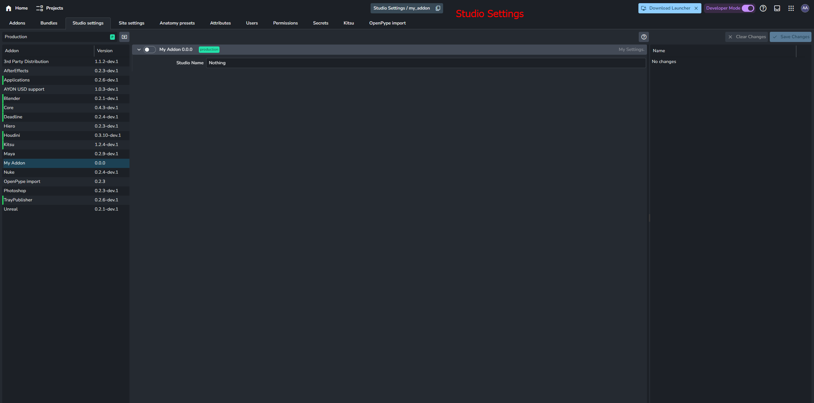
</div>
<div class="col">

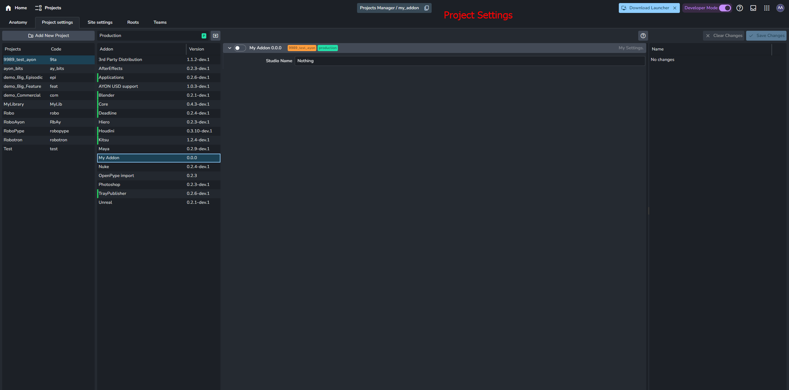
</div>
</div>
<div class="row">
<div class="col">

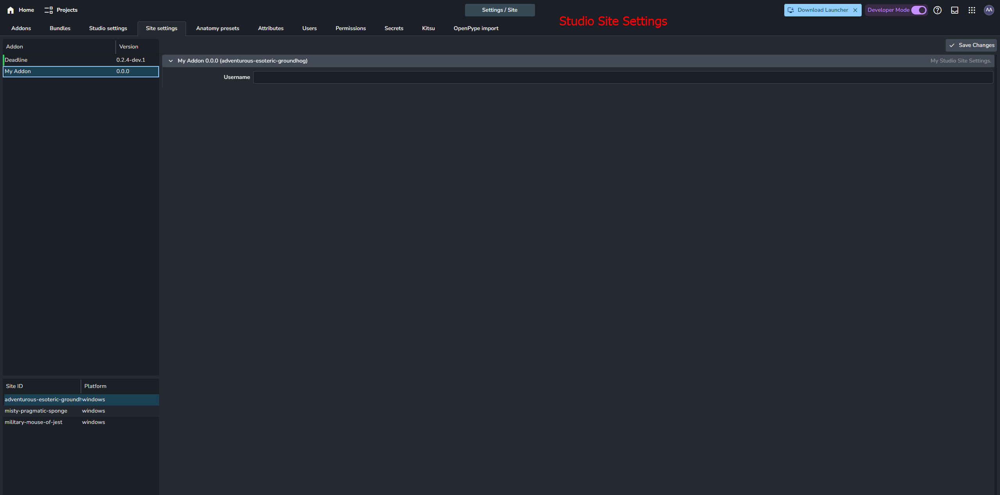
</div>
<div class="col">

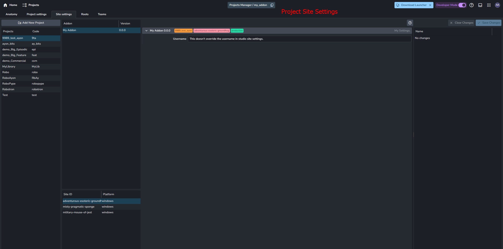
</div>
</div>
</div>

</details>

### End points
End points allow you to extends AYON API.
- `<ayon-server-url>:5000/api/addons/{addon_name}/{addon_version}/{endpoint_name}`

<details><summary>Add endpoint example</summary>

```python
from typing import Type
from ayon_server.api.dependencies import CurrentUser
from ayon_server.addons import BaseServerAddon
from ayon_server.settings import BaseSettingsModel


# Settings
class MySettings(BaseSettingsModel):
    """My Settings. """
    pass


# Default settings values
DEFAULT_VALUES = {}


class MyAddonSettings(BaseServerAddon):
    # Set settings
    settings_model: Type[MySettings] = MySettings

    # Set default settings values
    async def get_default_settings(self):
        settings_model_cls = self.get_settings_model()
        return settings_model_cls(**DEFAULT_VALUES)

    
    def initialize(self):
        self.add_endpoint(
            "studio-data",
            self.get_studio_data,
            method="GET",
        )

    # Example REST endpoint
    async def get_studio_data(
        self,
        user: CurrentUser
    ):
        """Return some value and user name."""
        return {
            "secret-of-the-studio": "There is no secret",
            "Current User": f"{user.name}"
        }
```

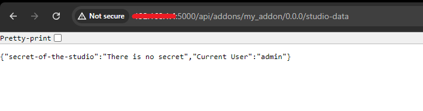

If you are curious, here's what happens when you access the api without logging in.

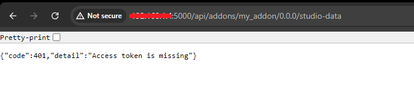

</details>


### Web Action
:::note TODO
Write about it and add an example.
:::

## Addon Client Code
Also, we can refer to this section as Unlock Pipeline Powers since client code is used to direct the pipeline! 

It's called client code, because the code is distributed to clients (i.e. machines that have AYON launcher installed and logged into AYON)

The far first step:
- you should update `package.py` to specify the `{client-code-dir}`
For the following examples, I added the following line to my `package.py`

```python
client_dir = "my_addon"
```

:::tip
You can use your addon in AYON dev mode by specifying client directory.
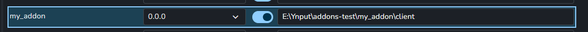
:::

<details><summary>Add some client code</summary>

I've created a file in `{my-addon}/client/my_addon/some_code`

```python
# some_code.py
def hello_ayon():
    print("Hello AYON!")
```

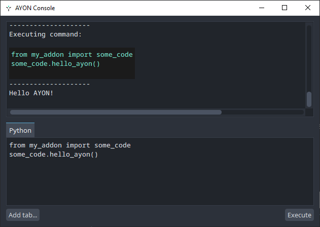

</details>

At this point, AYON will complain, *check ayon launcher log,* that addon has no content as the client code doesn't implement `ayon_core.addon.AYONAddon` class.
```
*** WRN: >>> { AddonsLoader }: [  Addon my_addon 0.0.0 has no content to import  ] 
```
<details><summary>Minimalist addon client definition</summary>

This code should exist in `{my-addon}/client/my_addon/__init__.py` 

```python
from ayon_core.addon import AYONAddon
# `version.py` should be created by `create_package.py` by default.
# if it's not created, please, create an empty file 
# next to __init__.py named `version.py`
# and `create_package.py` will update its content.
from .version import __version__


class MyAddonCode(AYONAddon):
    """My addon class."""

    label = "My Addon"
    name = "my_addon"
    version = __version__

    def initialize(self, settings):
        """Initialization of addon attributes.

        It is not recommended to override __init__ that's why specific method
        was implemented.
        Note:
            This method is optional.

        Args:
            settings (dict[str, Any]): Settings.
            These settings that were defined in `MyAddonSettings.settings_model` in the server dir.
        """
        pass
```

</details>

**AYON client Interfaces:**

In the previous example, we have implemented `ayon_core.addon.AYONAddon` which is the base abstract class for any ayon addons.
It lives in [ayon_core.addon](https://github.com/ynput/ayon-core/tree/develop/client/ayon_core/addon) among other helpful interfaces that adds extra features to your addon.

Interfaces: 
- `IPluginPaths`
- `ITrayAddon`
- `ITrayAction`
- `ITrayService`
- `IHostAddon`


### CLI Interface

It's done by implementing `AYONAddon.cli` which utilizes `ayon_core.addon.click_wrap` 
For more info please refer to the doc string of [ayon_core.addon.click_wrap](https://github.com/ynput/ayon-core/blob/develop/client/ayon_core/addon/click_wrap.py)

<details><summary>Minimalist addon client definition</summary>

This code should exist in `{my-addon}/client/my_addon/__init__.py` 

```python
from ayon_core.addon import AYONAddon, click_wrap
# `version.py` should be created by `create_package.py` by default.    
from .version import __version__


class MyAddonCode(AYONAddon):
    """My addon class."""

    label = "My Addon"
    name = "my_addon"
    version = __version__

    # Add CLI
    def cli(self, click_group):
        # Convert `cli_main` command to click object and add it to parent group
        click_group.add_command(cli_main.to_click_obj())


@click_wrap.group(
    MyAddonCode.name,
    help="My Addon cli commands.")
def cli_main():
    print("<<<< My Addon CLI >>>>")


@cli_main.command()  # Add child command
def some_command():
    print("Welcome to My Addon command line interface!")


@cli_main.command()  # Add child command
@click_wrap.option(
    "--arg1",
    help="Example argument 1",
    type=str,
    required=False
)
def command_with_arg(arg1):
    print(f"Received {arg1}.")
```

Then in terminal, you'll able to use it. (some examples in ayon dev mode)
Windows:
```shell
ayon-launcher/tools/ayon_console.bat --use-dev addon my_addon some_command
ayon-launcher/tools/ayon_console.bat --use-dev addon my_addon command-with-arg --arg1 some_argument
```

Linux & MacOs:
```shell
ayon-launcher/tools/make.sh --use-dev addon my_addon some_command
ayon-launcher/tools/make.sh --use-dev addon my_addon command-with-arg --arg1 some_argument
```

</details>

### Tray
It's used to add your widgets to ayon launcher's tray menu.
There are several interfaces for extending AYON Tray.

- `ITrayAddon`
- `ITrayService`: inherits `ITrayAddon` and implements `tray_menu` 
- `ITrayAction`: inherits `ITrayAddon` and implements `tray_menu` 

> For more info, please refer to [ayon_core.addon](https://github.com/ynput/ayon-core/tree/develop/client/ayon_core/addon)

The following example is done by implementing `ITrayAddon` interface. 

<details><summary>Custom tray widget example</summary>

This code should exist in `{my-addon}/client/my_addon/__init__.py` 

```python
from qtpy import QtWidgets
from ayon_core.addon import AYONAddon, ITrayAddon
# `version.py` should be created by `create_package.py` by default.    
from .version import __version__


class MyAddonCode(AYONAddon, ITrayAddon):
    """My addon class."""

    label = "My Addon"
    name = "my_addon"
    version = __version__

    # ITrayAddon
    def tray_init(self):
        """Tray init."""
        pass

    def tray_start(self):
        """Tray start."""
        pass

    def tray_exit(self):
        """Tray exit."""
        return

    def show_my_dialog(self):
        """Show dialog to My Dialog."""
        QtWidgets.QMessageBox.information(
            None,
            "My Dialog", 
            "Hello AYON!", 
        )

    # Definition of Tray menu
    def tray_menu(self, tray_menu):
        # Menu for Tray App
        menu = QtWidgets.QMenu(self.label, tray_menu)
        menu.setProperty("submenu", "on")

        # Actions
        action_show_my_dialog = QtWidgets.QAction("My Dialog", menu)
        menu.addAction(action_show_my_dialog)
        action_show_my_dialog.triggered.connect(self.show_my_dialog)

        tray_menu.addMenu(menu)
```
**Result:**
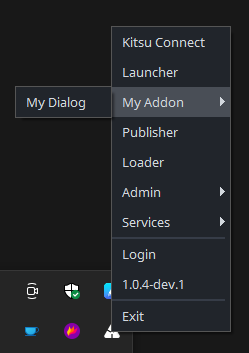

</details>

### Plugins

It's done by implementing `IPluginPaths` interface. 

The following keywords are used to specify the extra plugins location
- `actions`: AYON launcher actions (They appear next to apps in the launcher.)
- pyblish
  - `create`: Creator plugins
  - `load`: Loader plugins
  - `publish`: Publish plugins e.g. collector, validator, extractors
  - `inventory`: inventory (manage loaded assets) plugins

There are several examples already. 
e.g.
- Launcher Action: `Debug Shell` action in Applications addon
  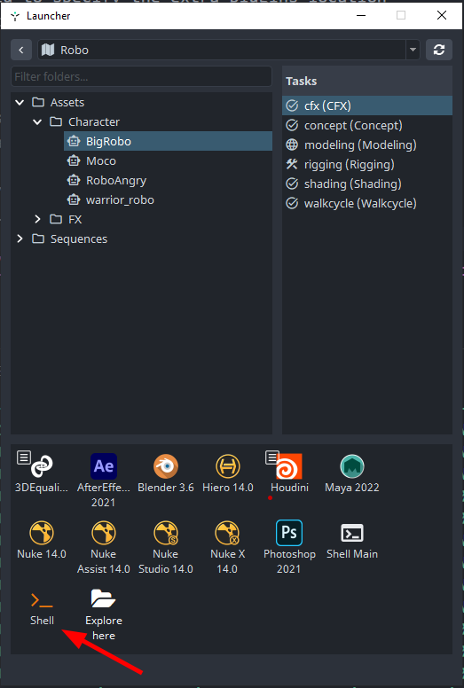
- Extra Pyblish plugins: [Deadline addon](https://github.com/ynput/ayon-deadline/blob/develop/client/ayon_deadline/addon.py) provides extra publish plugins paths for different Hosts.


### Host Implementation

It's done by implementing `IHostAddon` interface.
DCC Host implementation can vary in a very distinctive way due to the fact that each app has it own api. 

Currently, These methods are used to integrate different DCC hosts
- python api: Some DCCs support python and provide a python api. This is the easiest way to install AYON inside the DCC.
  e.g. Maya, Houdini, Nuke, Unreal, ...
- socket communication: Some DCCs support different languages, it can't load python scripts but they at least support socket communication. e.g. Adobe products, e.g. AfterEffects.
- cli interface: Most DCCs provide cli interface that allows you to perform actions inside the DCCs by running some commands in a terminal window.
- text editing programmatically: Some DCCs save their files in some common format e.g. JSON format, XML format. We can fake performing some actions in the DCC by editing the file before launch. and that's how Wrap addon update the placeholders inside the workfiles. Here's a [code snippet](https://github.com/ynput/ayon-wrap/blob/d47ba7ea7ae988c03b84acfcaafba76dfbb46972/client/ayon_wrap/hooks/pre_replace_placeholders.py#L48-L106)

Oversimplified, we have 3 categories of Host implementations: 
- We use main DCC process for our UIs (Maya, Nuke, Houdini, ...).
- We use socket based communication with DCC to show UIs in our process (PS, AE, Harmony, TVPaint, ...).
- We don't directly integrate the DCC, but we're able to achieve some degree of integration (Wrap, Celaction, ...).

For more info about how to implement a host integration please fgo to [Host implementation](docs/dev_host_implementation) 

## Private and Public Dirs
`private` and `public`, as description in the [Readme](https://github.com/ynput/ayon-example-addon?tab=readme-ov-file#private) says, They contains static content available for download.

**static content:** It's any file you can imagine, zip file with client code, image files (e.g. png icon) etc.  

- `private` can be accessed only if you're logged into the server.
- `public` can be access without being logged into the server.

:::tip
Utilizing the `private` folder is a key strategy we employ to seamlessly distribute addon client code to user machines.
Feel free to explore the contents of any addon zip file to witness our approach in action! 😉
:::

:::caution
Public is meant for data that should be accessed publicly by external services. e.g. AYON ftrack icons.

Please, Don't put any sensitive data in public directory.
Anyone can download that data if they can visit/reach your `AYON_SERVER_URL` without the need to login.
:::

### How to add static content
You only need to put your content in the folder named `private` or `public` based on your needs.

### How to access static content

Currently, We can access the static content via ayon's api, either from the browser directly or using tools like [postman](https://www.postman.com/) or programmatically using python for example.

:::tip
As a developer, you have the ability to create a frontend for your addon that utilizes Ayon's API. This will enable users to download static content, whether it's private or public.
:::

- To access `public` content: 
  since you don't need an auth token, you can use any web browser like if you are visiting any website.
  ```xml
  http://<AYON_SERVER_URL>/addons/<addon-name>/<addon-version>/public/<path-inside-public-folder> 
  ```
  <details><summary>Here's an example from <code>ftrack</code> addon.</summary>

  ```xml
  http://<AYON_SERVER_URL>/addons/ftrack/1.1.2/public/icons/BatchTasks.svg
  ```
  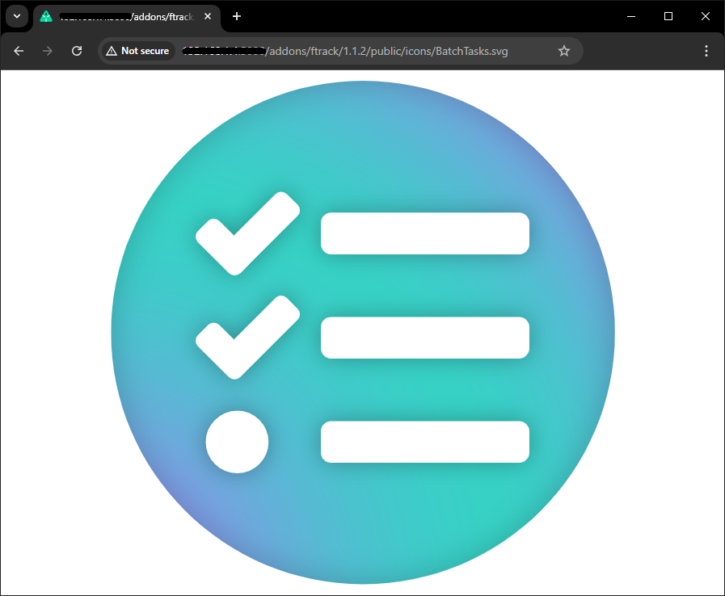

  </details>

- To access `private` content.
  - If you are logged into you ayon server, you can use the same web browser you've used to log into AYON Server.
    as the your browser stores the auth token.
    ```xml
    http://<AYON_SERVER_URL>/addons/houdini/0.3.1/private/client.zip
    ```
  - When using clients like [postman](https://www.postman.com/), you'd need to provide an `auth token`.
  - you can also use `ayon-python-api`.
    <details><summary>Download <code>private</code> content <code>via ayon-python-api</code></summary>
    
    ```python
    import os
    import ayon_api

    os.environ["AYON_SERVER_URL"] = "ayon-url"
    os.environ["AYON_API_KEY"] = "service-user-key"
    ayon_api.init_service()

    # Since client code is a private content, I can download it 
    #   using ayon_api.download_addon_private_file
    ayon_api.download_addon_private_file(
      addon_name="houdini",
      addon_version="0.3.1",
      filename="client.zip",
      destination_dir="E:/Ynput/temp"
    )
    ```

    </details>
  

## Addon Frontend

The only configuration needed to add a frontend is by adding `frontend_scopes` attribute in your addon server.

```python
from typing import Any

from ayon_server.addons import BaseServerAddon


class MyAddonSettings(BaseServerAddon):
    # Set settings
    frontend_scopes: dict[str, Any] = {"settings": {}}

```

### React App
This is the straight forward way for implementing frontend.
To get started you'd need to install [node js](https://nodejs.org/en) on your machine.

<details><summary>Ready to Run Example</summary>

[example-studio-addon/frontend](https://github.com/ynput/example-studio-addon/tree/main/frontend) is a ready to run example.
It was developed during [Ynput Hackathon 2024](https://ynput.io/blog/announcing-yn24-ynput-comunity-summit/) workshops.

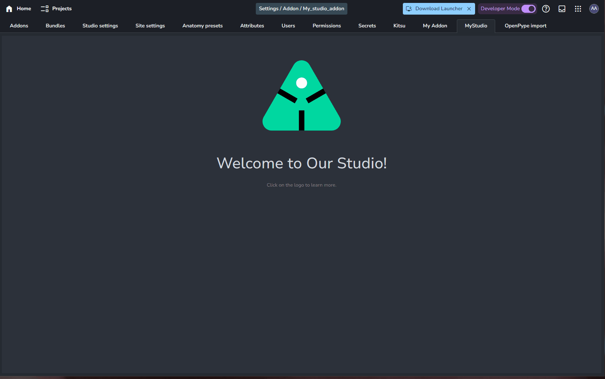

</details>


<details><summary>Start from Scratch</summary>

Let's start from scratch step by step:

In frontend directory:
1. Create vite project
  ```shell
  npm create vite@latest
  ```
    Then,
   - Set `Project name` (we usually use the addon name)
   - Select `React` framework.
   - Select `Javascript` (This example uses JS. Feel free to pick your favorite variant)
2. Install the necessary components
  ```shell
  npm i @ynput/ayon-react-addon-provider
  npm i @ynput/ayon-react-components
  npm i styled-components
  npm i axios
  ```
3. Implement necessary `useEffects` in `./src/main.jsx` and add AYON's addon provider to `ReactDOM.createRoot`.
  You may also need to save your `addonData` in a `common.js` file.
  Take reference from [example-studio-addon/frontend/src/index.jsx](https://github.com/ynput/example-studio-addon/blob/main/frontend/src/index.jsx)
4. Update your vite config to work with AYON. it allows adding your env file and test your frontend without creating and uploading your addon to AYON Server.
  Take reference from [example-studio-addon/frontend/vite.config.js](https://github.com/ynput/example-studio-addon/blob/main/frontend/vite.config.js)

And, this is how we built the frontend in `example-studio-addon`.


</details>

### Raw HTML
AYON Server just uses `iframe` for embedding Addon's frontend, and it expects `/dist/index.html` file so you can use any HTML there. 
You just need to register window.onmessage event to receive the context (such as authorization key, project name for project scoped addons and so on)  For reference from production: Shotgrid addon actually uses plain HTML, [ayon-shotgrid/frontend/dist](https://github.com/ynput/ayon-shotgrid/tree/develop/frontend/dist)


### Alternative Options
It was reported many times that it would be much better to be able to **Build UI with python**.

:::note TODO
Community mentioned these two solutions for **Building UI with python**.
But, I still need experiment them and update this section,

- [nicegui](https://github.com/zauberzeug/nicegui)
- [FastUI](https://github.com/pydantic/FastUI)
:::

Since, AYON servers expects `{my-addon}/frontend/dist/index.html` and it doesn't expect a webserver to run.
Then, what about running the webserver on our own (maybe as an ayon service) and embedding it in the `/dist/index.html` page ? 

This is what I've tested with a flask app (5 mins experiment)

<details><summary>Flask Experiment</summary>

What I've tried so far is using python flask app and embedding it in my addon's frontend.
I believe this can work with any webserver app python, node js, ... 

> Don't forgot to update the addon server part as mentioned earlier.
> You may also need to comment out `build_frontend` call in `create_package.py`

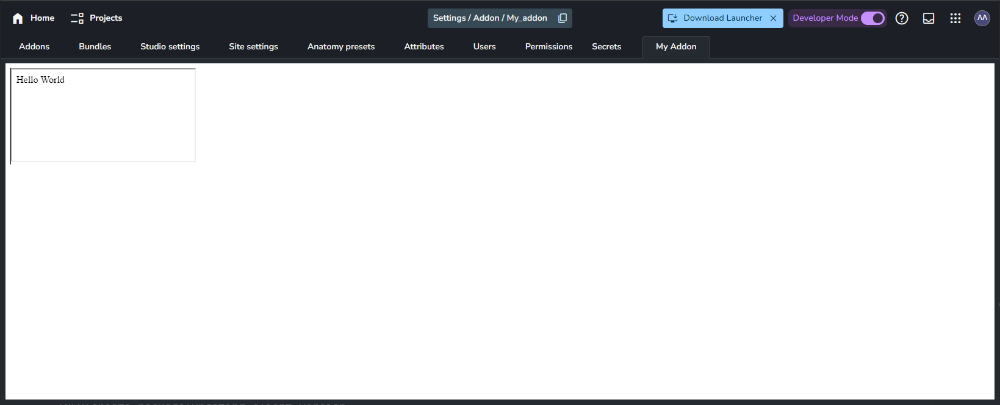

Here's my `{my-addon}/frontend/dist/index.html` page 
This the only file in the `dist` directory.

```html
<!doctype html>
<html lang="en">
  <head>
    <meta charset="UTF-8" />
    <meta name="viewport" content="width=device-width, initial-scale=1.0" />
    <title>AyonAddon</title>
  </head>
  <body>
    <div id="root">
      <iframe src="{my-webserver-address:port}/" title="flask app"></iframe> 
    </div>
  </body>
</html>
```

</details>

## Addon Services
Service is a script/application that uses some API and is able to connect different systems.
e.g. Connect AYON to ftrack.

Typically, these scripts are dockerized and spawn on AYON Service Host (ASH), *similar to [portainer](https://www.portainer.io/)*.

**Creating Services workflow:**
- Development (run and build)
- Distribution
  - Push to a docker registry (Dev machine: Build & Push, ASH machine: Pull & Run)
    - online (e.g. DockerHub or Github)
    - inhouse (local docker registry)
  - Manual installation. (Build on ASH Machine, ASH machine: Run)
  
:::tip
It won't pull the image if there's already a matching tag on the ASH machine.
:::

:::note TODO
Add examples for **Creating Services workflow**
:::