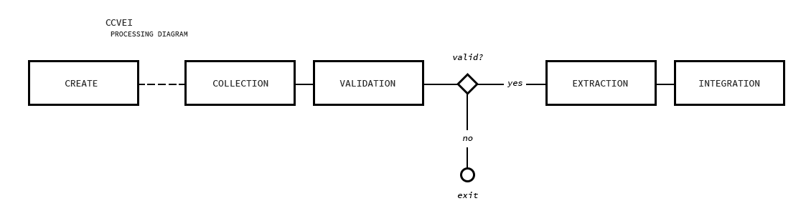
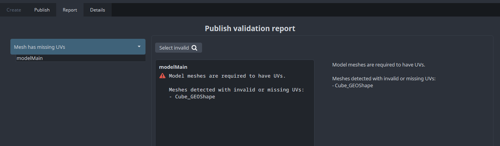

:::info
This page is still under construction 👷🚧🛠️🔜🏗️.

Feel free to report any missing or wrong info.
:::

## Preface

:::tip History Lesson

Understanding history can provide deeper insights into the system and the rationale behind decisions made over time. This knowledge is particularly valuable at the initial stages of developing `addons` documentation. As the documentation evolves to become self-sufficient, the reliance on historical context may diminish.

- It's started with [pyblish](https://github.com/pyblish/pyblish/wiki) which introduced the capability to register and trigger publish plugins. 
- Then, [avalon](https://getavalon.github.io/2.0/overview/) which was built on top of `pyblish` straight with adding UI tools (launcher, creator, loader, publisher, manager, workfiles), extended `pyblish` host integrations e.g. adding more publish plugins and it also used `mongoDB` to store publish data. 
- Then, [OpenPype](https://openpype.io/) which was built on top of `avalon` and `pyblish` straight with much easier configuration/settings, extended `avalon` host integrations and more pipeline tools e.g. look assigner.  
- Then, **[AYON](https://ayon.ynput.io/) which is like the Pokémon evolution of `OpenPype`.** The system has been upgraded by relocating settings to a dedicated web server, enhancing modularity by segmenting it into smaller `addons`, and introducing a toolkit to facilitate efficient production management.
:::

AYON addons enable us to effectively extend AYON's server and pipeline capabilities.
This guide is designed to clarify key concepts and outline the structure and features of addons, along with instructions for their implementation.

## AYON pipeline and pyblish adoption

AYON pipeline relies heavily on pyblish.
Every small addition is added as a pyblish plugin.
Even the code that's responsible for registering the products in AYON Server is a pyblish plugin.

### AYON Context, Publish Instances and Load containers

:::note
A standard data model is still in progress.
:::

On opening new files using AYON Launcher or workfile tool.
An AYON Context (which is a bunch of Environment variables) will be set.
- Project Name
- Folder Path
- Task Name

Any product in AYON have the following data:
- Project Name
- Folder Path
- Product Name
- Representation(s)
  - Representation Name
  - Version
  

<details><summary>Code Snippets: Print Context, Publish Instances and Load containers</summary>

Take a moment and explore the available data in context, publish instances and load containers.
Here you are some snippets to get started.

```python
## Print the Current Context
from ayon_core.pipeline.context_tools import get_current_context

print( 
  "Project: '{project_name}'\nFolder Path: '{folder_path}'\nTask Name: '{task_name}'"
  .format(
    **get_current_context()
  )
)
```

```python
## Access the existent publish instances via CreateContext 
from ayon_core.pipeline import registered_host
from ayon_core.pipeline.create import CreateContext

host = registered_host()
create_context = CreateContext(host)
for instance in create_context.instances:
    print("Instance: {}".format(instance.data["productName"]))
    # you can edit instances here
    # if some_condition:
    #   instance.data[key] = value
    pass

# To save change to context and instances
# context.save_changes()
```

```python
## Show Loaded Items
from ayon_core.pipeline import registered_host

host = registered_host()
containers = host.get_containers()
print("Loaded Items:")
for item in containers:
     print("  -", item["name"])
```
</details>


### Publish workflow

previously discussed in [What is publishing? | AYON Docs](docs/artist_publish#what-is-publishing) and [What is "publishing"? | Pyblish Wiki](https://github.com/pyblish/pyblish/wiki/What-is-publishing)



> Check the diagram on Miro [AYON Pipeline Publish Workflow](https://miro.com/app/board/uXjVMyPHrJg=/?share_link_id=550640792516)

In a nutshell it follows `CCVEI`: 
- Create: It searches your scene for AYON objects (Regular objects with Extra AYON attributes) and create publish instances of them.
- Collect: It Collects necessary data for publish instances.
- Validate: It validates the collected data.
- Extract: It exports the data to the export (output) path specified in your publish instances.Usually, it's a relative location to `workfile` (work directory).
- Integrate: It moves the exported files to the `publish` location and registers them in AYON's DB.

:::tip Maya Example
A `Model` product in Maya should have UVs to pass [Mesh Has UVs](https://github.com/ynput/ayon-maya/blob/develop/client/ayon_maya/plugins/publish/validate_mesh_has_uv.py) validation.

:::

:::tip Product-Types Vs Representations

It's super important to differentiate between **[product-types](docs/artist_concepts/#product)** and **[representations](docs/artist_concepts/#representation)** when dealing with AYON, and in short:

* **Product-Type**: A product containing a specific type of information, e.g.
  * **pointcache/animation**: a character animation output as cache of its geometry only (no controls, no bones; just geometry cached)
  * **camera**: a single camera
  * **model**: a static (clean) mesh adhering to studio rules like naming conventions, poly-flow, usually intended to be used as the clean geometry representing an asset.
* **Representation**: A file output for a product type.
  * e.g. the data of **pointcache** product-type could be stored in any format supporting geometrical caches, like Alembic, USD, bgeo, etc.
  * e.g. the data of **camera** product-type could be stored in any formatting supporting a single animated camera, e.g. Alembic, Maya scene, USD, etc.

Note how **representation** is just a different file format for the same product type - as such, a single product type could have multiple representations which should technically (for as far as the file formats allow) contain all the data of that product-type.
:::

### Load workflow
:::note TODO
Write about it and add an example.
:::