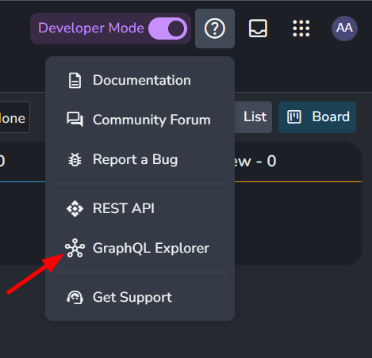
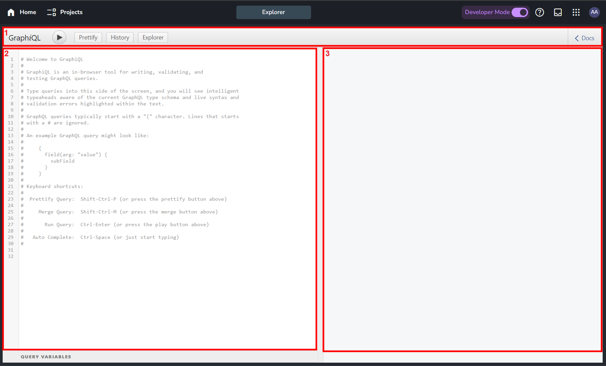
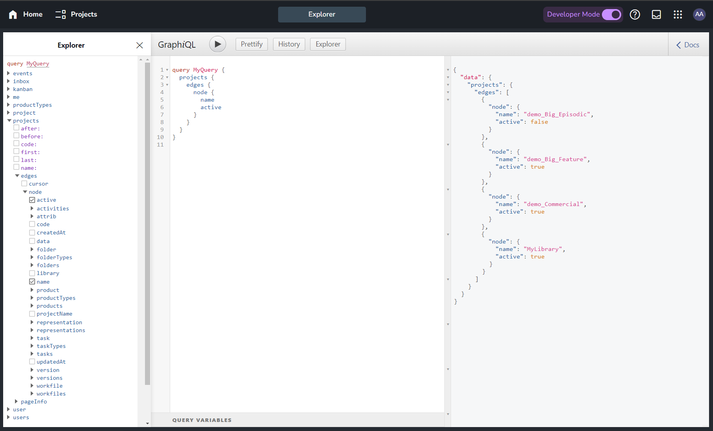

## What is GraphQL?

GraphQL is a query language between frontend and backend. it allows you to expose the data sent from server to client

GraphQL is a query language and server-side runtime for application programming interfaces (APIs) that gives API clients exactly the data they requested. As an alternative to REST, GraphQL allows developers to make requests to fetch data from multiple data sources with a single API call.

You can use GraphQL and REST APIs interchangeably. 

You have limited bandwidth, and you want to minimize the number of requests and responses
You have multiple data sources, and you want to combine them at one endpoint
You have client requests that vary significantly, and you expect very different responses

interrelated data

## About GraphQL and AYON

Each GraphQl call is constructed from a schema which describes the data to work with.

There are two main root types of schemas:
1. Query: Read
2. Mutation: Create, update or Delete

Currently, AYON supports only Query Root type where you can fetch data directly from AYON's Backend.

To perform any operations or mutation please consider using our [REST API](dev_api_rest.md) instead.

## AYON GraphQL Explorer

While you can access GraphQL from code, you can also access it via your AYON Web UI as we integrate `GraphiQL`, an in-browser tool for writing, validating, and testing GraphQL queries.

<div class="row markdown">
<div class="col col--6 markdown">

You access the GraphQL Explorer via `<your-ayon-server-url>/graphiql` or via help icon.

</div>
<div class="col col--6 markdown">



</div>
</div>


### AYON GraphQL Explorer UI


1. GraphiQL Bar:
   - ▶️ Button: Execute Query (ctrl+Enter)
   - Prettify: It formats your input.
   - History: Shows your queries history.
   - Explorer: Opens Explorer window, you can use it to construct queries. It's also can be an alternative to Docs as it shows supported queries.
   - Docs: It shows Documentation Explorer.
2. Input Box: Where you add your GraphQL queries.
3. Output Box: Shows the output.


## Your First AYON query
Here's a simple query to try out. 
When executed it returns a list of the current projects names and whether or not they are active.
```graphql
query MyQuery {
  projects {
    edges {
      node {
        name
        active
      }
    }
  }
}
```


