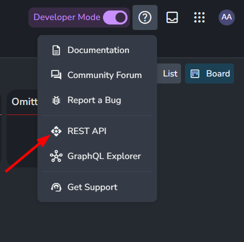
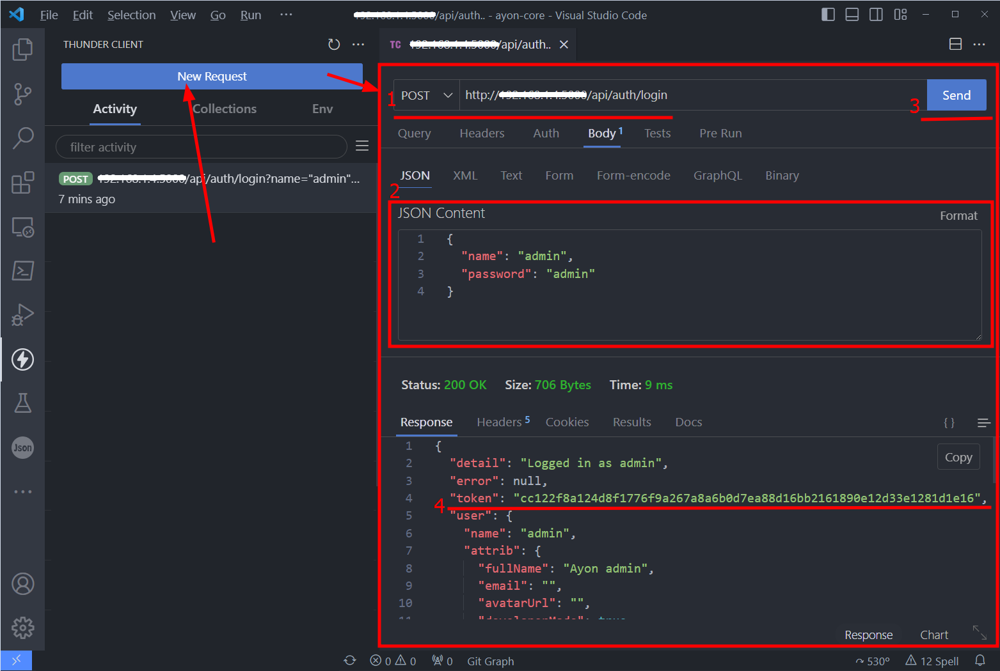
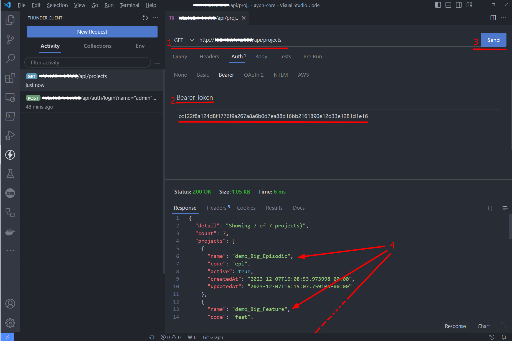

## What is a REST API?

REST is a short name for `RESTful` which is a programming interface that allows you to communicate with web servers via `HTTP` requests to access and use data.
HTTP requests include `POST` (create), GET (read), `PUT` (update) and DELETE data.

These 4 types of requests form the famous terminology `CRUD`: Create, Read, Update and Delete.

## AYON REST API

You can use `AYON REST API` to manipulate AYON Resources.
e.g. you can use it to get a list of projects or create new projects, get a list of current users or add users and manage resources e.g. download or upload AYON Launcher, addons and dependency packages.

Each AYON server generates docs for its REST API as they can be extended via [Addons Devolvement](dev_addon_creation.md#end-points)

You access the REST API Docs via `<your-ayon-server-url>/api` or via help icon.

For instance, you can check the REST API Docs for our Public AYON Server here at [AYON REST API Docs](/api)

## Your First AYON API Calls

:::tip
Examples in this section were brought from the following Community guide.
Feel free to check it and delve into discussions.

[AYON REST API Guide](https://community.ynput.io/t/ayon-rest-api-guide/1268)
:::

Let's do our first api calls where we will login into AYON and get a list available projects.
For this purpose consider using a REST client such as [postman](https://www.postman.com/) or [VsCode Thunder Client](https://marketplace.visualstudio.com/items?itemName=rangav.vscode-thunder-client).

For the following example, I'll stick to `VsCode Thunder Client`.

### Login into AYON
1. Write a login request: `<your-ayon-server-url>/api/auth/login`
2. Add name and password
3. Send
4. Find the token.
   

### Get list of projects
> You'll need the token from the last call.
 
1. write a login request: `<your-ayon-server-url>/api/projects`
2. Add your token
3. Send
4. Find the available projects.

### Conclusion
As you may have noticed, using the API, sending and processing the data is not meant to be read and processed by Humans. 
we should do that with the aid of scripts where we can deal with them from a higher perspective where we can use a command like `get_projects_names` and it should use the proper API call and process the output for us.
and, that's why REST API is called a programming interface.

:::tip
While AYON REST API solely doesn't process the data for us.
You would need to write the essential code to make the API call
and then process the data before displaying it for you.
For example check [AYON REST API Guide](https://community.ynput.io/t/ayon-rest-api-guide/1268) to
explore different ways to make REST API calls.
:::
